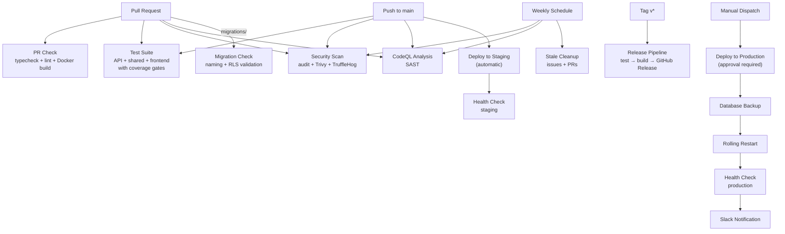

# Staffora Platform — DevOps Dashboard

> **Generated:** 2026-03-17 | **Status:** Enterprise Audit Complete

---

## Pipeline Architecture

## Pipeline Inventory

| # | Pipeline | File | Trigger | Jobs | Status |
|---|----------|------|---------|------|--------|
| 1 | PR Check | `pr-check.yml` | Pull request | Typecheck, lint, Docker build verify | ACTIVE |
| 2 | Test Suite | `test.yml` | Push/PR to main | API tests (coverage), shared tests, frontend tests (coverage) | ACTIVE |
| 3 | Security Scan | `security.yml` | Push/PR + weekly | Dependency audit, Trivy Docker scan, TruffleHog secrets | ACTIVE |
| 4 | CodeQL | `codeql.yml` | Push/PR + weekly | Static analysis (security-extended) | ACTIVE |
| 5 | Migration Check | `migration-check.yml` | PR (migrations/) | Naming validation, RLS compliance | ACTIVE |
| 6 | Deploy | `deploy.yml` | Push to main / manual | Test → Build → Deploy (staging/production) | ACTIVE |
| 7 | Release | `release.yml` | Tag push (v*) | Validate → Test → Build images → GitHub Release | ACTIVE |
| 8 | Stale Cleanup | `stale.yml` | Weekly | Close stale issues (30d) and PRs (7d) | ACTIVE |

## Quality Gates

| Gate | Pipeline | Threshold | Enforced |
|------|----------|-----------|----------|
| TypeScript typecheck | PR Check, Test | Zero errors | Yes (blocks merge) |
| ESLint | PR Check, Test | Zero errors | Yes (blocks merge) |
| Docker build | PR Check | Images build successfully | Yes |
| API test coverage | Test | 60% lines | Yes (fails pipeline) |
| Frontend test coverage | Test | 50% lines | Yes (fails pipeline) |
| Dependency audit | Security | No HIGH/CRITICAL vulns | Yes |
| Docker image scan | Security | No CRITICAL/HIGH (Trivy) | Yes |
| Secret detection | Security | No verified secrets | Yes |
| CodeQL | CodeQL | No HIGH severity findings | Yes |
| Migration naming | Migration Check | NNNN_description.sql | Yes |
| RLS compliance | Migration Check | tenant_id + policies | Warning |

## Infrastructure Overview

| Service | Image | Resources (limit) | Health Check | Port |
|---------|-------|-------------------|-------------|------|
| PostgreSQL | postgres:16 | 2 CPU, 2GB RAM | pg_isready | 5432 |
| Redis | redis:7 | 1 CPU, 1GB RAM | redis-cli ping | 6379 |
| API | staffora-api | 2 CPU, 1GB RAM | HTTP /health | 3000 |
| Worker | staffora-api | 1 CPU, 1GB RAM | HTTP :3001/health | 3001 |
| Web | staffora-web | 1 CPU, 512MB RAM | wget / | 5173 |
| Nginx | nginx:alpine | 0.5 CPU, 256MB RAM | — | 80/443 |

## DevOps Maturity Scorecard

| Area | Score | Notes |
|------|-------|-------|
| CI Pipeline | 4/5 | 8 pipelines, coverage gates, SAST. Missing: E2E tests |
| CD Pipeline | 4/5 | Full staging + production with approval. SSH-based deploy |
| Security Automation | 5/5 | Trivy, TruffleHog, CodeQL, bun audit, Dependabot |
| Infrastructure as Code | 4/5 | Docker Compose, nginx, configs. Missing: Terraform/Pulumi |
| Observability | 2/5 | Pino logging + audit trail. Missing: tracing, APM, alerting |
| Disaster Recovery | 3/5 | DB backup scripts, pre-deploy backup. Missing: automated restore testing |
| Release Management | 4/5 | Tag-based releases, semver images, changelog |

**Overall DevOps Maturity: 3.7/5**

## GitHub Project Status

| Metric | Count |
|--------|-------|
| Open Issues | 10 |
| Labels | 37 |
| Milestones | 2 |
| P1 Issues | 5 (v0.2.0 milestone) |
| P2 Issues | 5 (v0.3.0 milestone) |
| CI/CD Pipelines | 8 |
| Dependabot | Configured |
| CODEOWNERS | Configured |
| PR Template | Configured |
| Issue Templates | Bug + Feature |

## Top 5 DevOps Recommendations

1. **Add E2E test pipeline** — Playwright tests for critical user flows (login, employee CRUD, leave)
2. **Implement OpenTelemetry** — Distributed tracing across API + worker
3. **Add error aggregation** — Sentry or equivalent for production error tracking
4. **Raise coverage thresholds** — Increase to 80% as test quality improves (after TEST-001 resolved)
5. **Add performance regression** — k6 load testing in CI for critical API endpoints
