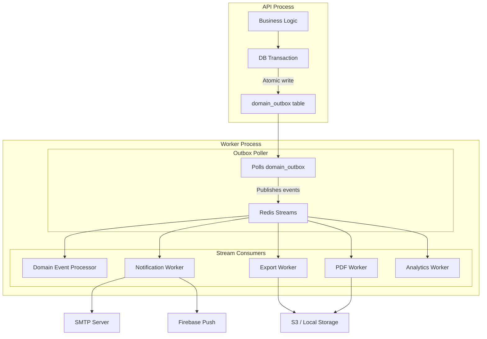

# Worker System

*Last updated: 2026-03-17*

The Staffora platform uses a background worker process for asynchronous job processing, built on Redis Streams with consumer groups.

## Architecture



## Entry Point

The worker is started via `packages/api/src/worker.ts`:

```bash
bun run dev:worker
# or
bun run src/worker.ts
```

## Configuration

| Variable | Default | Description |
|----------|---------|-------------|
| `NODE_ENV` | `development` | Environment |
| `WORKER_HEALTH_PORT` | `3001` | Health check server port |
| `ENABLE_OUTBOX_POLLING` | `true` | Enable/disable outbox polling |
| `OUTBOX_POLL_INTERVAL` | `1000` | Poll interval in ms |
| `OUTBOX_BATCH_SIZE` | `100` | Max events per poll batch |
| `DATABASE_URL` | - | PostgreSQL connection string |
| `REDIS_URL` | - | Redis connection string |

## Redis Streams

| Stream Key | Purpose |
|-----------|---------|
| `hris:events:domain` | Domain events from the outbox |
| `hris:events:notifications` | Email and push notification jobs |
| `hris:events:exports` | CSV/Excel report generation |
| `hris:events:pdf` | PDF document generation (certificates, letters) |
| `hris:events:analytics` | Analytics data aggregation |
| `hris:events:background` | General background tasks |

## Outbox Pattern

The outbox pattern ensures domain events are published reliably by writing them in the same database transaction as the business operation.

### Writing Events

```typescript
// In a service method
await db.transaction(async (tx) => {
  // 1. Business write
  const employee = await tx.insert(employees).values(data).returning();

  // 2. Outbox event (same transaction)
  await tx.insert(domainOutbox).values({
    id: crypto.randomUUID(),
    tenantId: ctx.tenantId,
    aggregateType: 'employee',
    aggregateId: employee.id,
    eventType: 'hr.employee.created',
    payload: { employee, actor: ctx.userId },
    createdAt: new Date(),
  });
});
```

### Processing Flow

1. **Outbox Poller** reads unprocessed rows from `domain_outbox`
2. Publishes events to appropriate Redis Streams
3. Marks outbox rows as processed
4. **Stream consumers** pick up events via consumer groups
5. Each consumer processes the event and acknowledges it

## Job Processors

### Domain Event Processor
Handles events from the `domain` stream:
- Triggers downstream workflows (e.g., employee created → start onboarding)
- Fires webhook notifications
- Updates denormalized data

### Notification Worker
Handles the `notifications` stream:
- **Email**: Sends via nodemailer/SMTP
- **Push**: Sends via Firebase Cloud Messaging
- Supports templates and localization

### Export Worker
Handles the `exports` stream:
- Generates Excel files (xlsx)
- Generates CSV files
- Uploads to S3 or local storage
- Returns download URLs

### PDF Worker
Handles the `pdf` stream:
- Generates certificates using `pdf-lib`
- Creates HR letters and documents
- Produces case bundles

### Analytics Worker
Handles the `analytics` stream:
- Aggregates headcount data
- Calculates turnover metrics
- Updates dashboard caches

## Scheduler

Cron-based scheduled jobs for recurring tasks:

| Job | Schedule | Description |
|-----|----------|-------------|
| Leave reminders | Daily | Notify approvers of pending requests |
| Document expiry | Daily | Alert on expiring documents |
| Timesheet reminders | Weekly | Remind employees to submit timesheets |
| Session cleanup | Hourly | Clear expired sessions |
| Outbox cleanup | Daily | Archive old outbox entries |

## Health Check

The worker exposes health endpoints on port 3001:

| Endpoint | Description |
|----------|-------------|
| `GET /health` | Full health status with metrics |
| `GET /ready` | Readiness probe |
| `GET /live` | Liveness probe |
| `GET /metrics` | Prometheus-format metrics |

### Health Response

```json
{
  "status": "healthy",
  "uptime": 86400,
  "activeJobs": 2,
  "processedJobs": 15423,
  "failedJobs": 3,
  "connections": {
    "redis": "up",
    "database": "up"
  },
  "lastPollAt": "2026-03-10T00:00:00.000Z"
}
```

### Prometheus Metrics

```
hris_worker_active_jobs 2
hris_worker_processed_jobs_total 15423
hris_worker_failed_jobs_total 3
hris_worker_uptime_seconds 86400
hris_worker_redis_up 1
hris_worker_database_up 1
```

## Scaling

Workers use Redis consumer groups for horizontal scaling:

- Multiple worker instances can share the same consumer group
- Each message is delivered to exactly one consumer in the group
- Configure via `CONSUMER_GROUP` and `CONSUMER_ID` environment variables
- Increase `CONCURRENCY` for more parallel processing per worker

## Error Handling

- **Retries**: Failed jobs are retried up to `MAX_RETRIES` times
- **Dead Letter Queue**: Permanently failed jobs are moved to DLQ
- **Graceful Shutdown**: On SIGTERM/SIGINT, the worker drains active jobs before exiting

---

## Related Documents

- [Architecture Overview](ARCHITECTURE.md) — System architecture and service topology
- [Database Guide](DATABASE.md) — Domain outbox table and migration conventions
- [Architecture Map](architecture-map.md) — Worker subsystem in the architecture diagram
- [Deployment Guide](../guides/DEPLOYMENT.md) — Docker Compose worker service configuration
- [Infrastructure Audit](../audit/infrastructure-audit.md) — Worker infrastructure findings
- [Performance Audit](../audit/PERFORMANCE_AUDIT.md) — Outbox processor performance analysis
