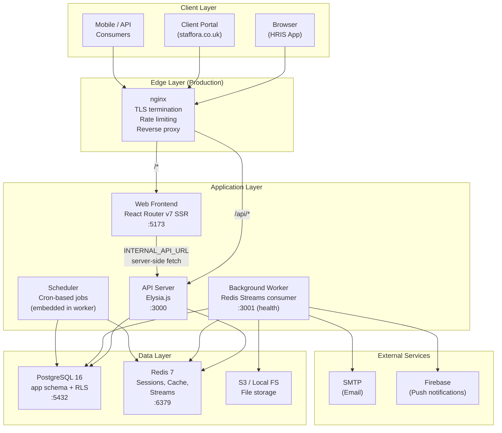
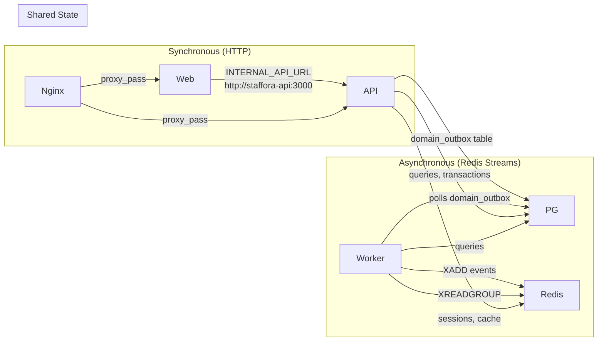
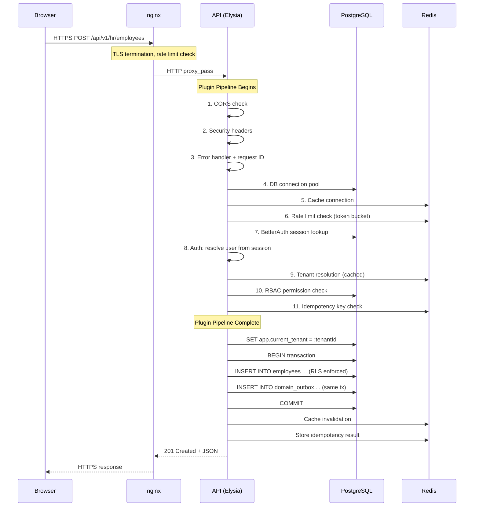
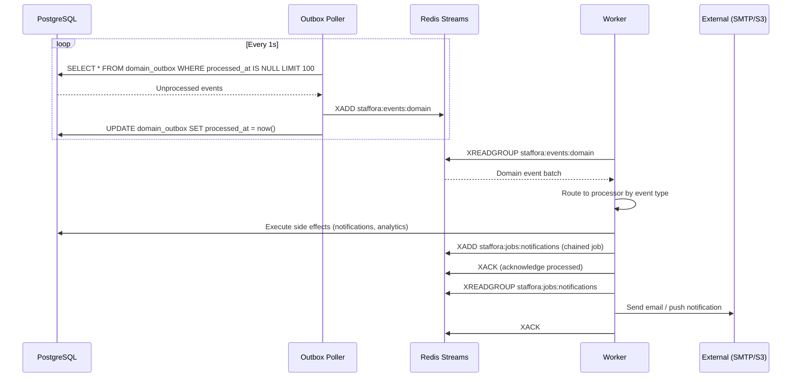
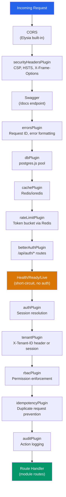
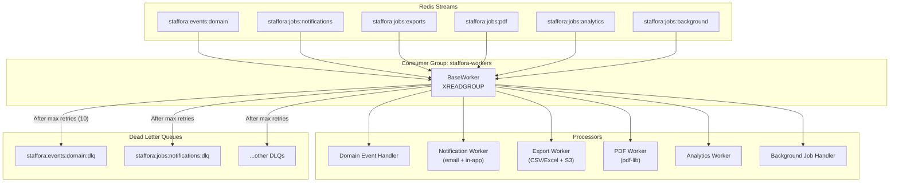
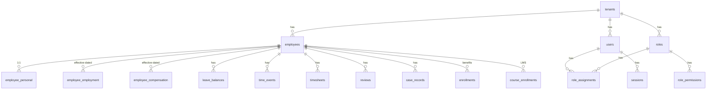
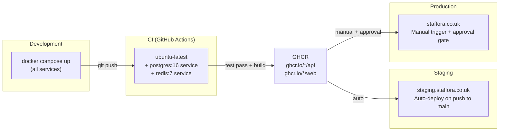
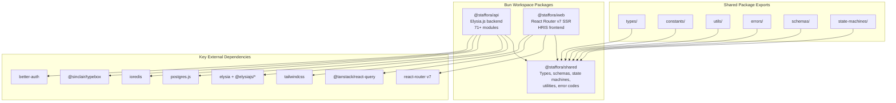
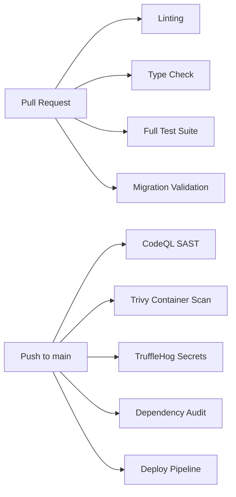

# Staffora Platform Architecture Map

> **Last updated:** 2026-03-17
> **Platform:** UK-only enterprise multi-tenant HRIS (staffora.co.uk)
> **Runtime:** Bun 1.1.38 | PostgreSQL 16 | Redis 7

---

## Table of Contents

1. [System Overview](#1-system-overview)
2. [Service Boundaries & Communication](#2-service-boundaries--communication)
3. [Request Data Flow](#3-request-data-flow)
4. [Plugin Pipeline](#4-plugin-pipeline)
5. [Worker Subsystem](#5-worker-subsystem)
6. [Database Architecture](#6-database-architecture)
7. [Deployment Architecture](#7-deployment-architecture)
8. [Package Dependency Graph](#8-package-dependency-graph)
9. [Network Topology](#9-network-topology)
10. [CI/CD Pipeline](#10-cicd-pipeline)
11. [Module Inventory](#11-module-inventory)
12. [Technical Risk Analysis](#12-technical-risk-analysis)

---

## 1. System Overview

Staffora is a UK-only enterprise HRIS platform built as a Bun monorepo. It serves multiple tenants with strict data isolation via PostgreSQL Row-Level Security, processes background jobs through Redis Streams, and enforces UK employment law compliance (WTR, SSP, statutory leave, pension auto-enrolment, GDPR).

### High-Level Architecture Diagram



---

## 2. Service Boundaries & Communication

### Service Inventory

| Service | Image / Runtime | Port | Role | Healthcheck |
|---------|----------------|------|------|-------------|
| **postgres** | `postgres:16` | 5432 | Primary datastore, RLS enforcement | `pg_isready` |
| **redis** | `redis:7` | 6379 | Sessions, cache, job streams, rate limit counters | `redis-cli ping` |
| **api** | `packages/api/Dockerfile` (Bun) | 3000 | REST API, auth, business logic | `GET /health` |
| **worker** | Same Dockerfile, `bun run src/worker.ts` | 3001 | Stream consumer, outbox poller, scheduler | `GET /health` |
| **web** | `packages/web/Dockerfile` (Bun) | 5173 | SSR frontend, proxies API calls server-side | `wget /` |
| **nginx** | `nginx:alpine` (production profile only) | 80, 443 | TLS, routing, rate limiting, gzip | -- |

### Inter-Service Communication



**Key protocols:**
- **Browser to API:** HTTPS (via nginx) with session cookies, CSRF tokens, `X-Tenant-ID` header
- **Web SSR to API:** HTTP over Docker bridge network (`http://staffora-api:3000`)
- **API to Worker:** Indirect via `domain_outbox` table (outbox pattern) and Redis Streams
- **Worker internal:** Redis Streams consumer groups (`XREADGROUP`) with dead letter queues

---

## 3. Request Data Flow

### Authenticated API Request



### Domain Event Flow (Outbox Pattern)



---

## 4. Plugin Pipeline

Plugins are registered in strict dependency order. Every request passes through this pipeline before reaching route handlers.



### Plugin Dependency Matrix

| Plugin | Depends On | Provides |
|--------|-----------|----------|
| `errorsPlugin` | -- | `requestId`, error formatting |
| `dbPlugin` | -- | `db` (DatabaseClient) |
| `cachePlugin` | -- | `cache` (CacheClient) |
| `rateLimitPlugin` | cache | Rate limit enforcement |
| `betterAuthPlugin` | db, cache | `/api/auth/*` route handling |
| `authPlugin` | db, cache | `user`, `session`, `authState` |
| `tenantPlugin` | db, cache, auth | `tenantId`, `tenantContext` |
| `rbacPlugin` | db, cache, auth, tenant | Permission checks |
| `idempotencyPlugin` | db, cache, auth, tenant | Idempotency enforcement |
| `auditPlugin` | db, auth, tenant | Audit trail recording |

---

## 5. Worker Subsystem

The background worker runs as a separate process (same Docker image, different entrypoint) and combines three subsystems:

### 5.1 Redis Streams Consumer



**Worker configuration (env vars):**
- `WORKER_CONCURRENCY=5` -- max parallel jobs
- `WORKER_POLL_INTERVAL=1000ms` -- stream polling frequency
- `WORKER_BLOCK_TIMEOUT=5000ms` -- XREADGROUP block duration
- `WORKER_MAX_RETRIES=10` -- retries before DLQ
- `WORKER_HEALTH_PORT=3001` -- Prometheus-compatible `/metrics` endpoint

### 5.2 Outbox Poller

Runs as a loop within the worker process. Polls `app.domain_outbox` every 1 second, publishes unprocessed events to Redis Streams, then marks them as processed.

### 5.3 Scheduler (Cron Jobs)

| Job | Schedule | Description |
|-----|----------|-------------|
| `leave-balance-accrual` | Daily 01:00 | Batch-update leave balances for all active employees |
| `session-cleanup` | Daily 02:00 | Delete sessions expired >7 days |
| `outbox-cleanup` | Daily 03:00 | Delete processed outbox events >30 days old |
| `wtr-compliance-check` | Monday 06:00 | Check 48-hour Working Time Regulations across 17-week reference |
| `review-cycle-check` | Monday 08:00 | Notify employees of upcoming performance review deadlines |
| `birthday-notifications` | 1st of month 08:00 | Notify HR admins of employee birthdays this month |
| `timesheet-reminder` | Friday 09:00 | Remind employees with missing timesheets |
| `dlq-monitoring` | Hourly :00 | Check DLQ lengths, warn if >1000 messages |
| `user-table-drift-detection` | Hourly :30 | Repair drift between BetterAuth `user` table and `app.users` |
| `workflow-auto-escalation` | Every 15 min | Escalate overdue workflow steps past SLA threshold |
| `scheduled-report-runner` | Every 15 min | Execute due report schedules, email results to recipients |

---

## 6. Database Architecture

### Schema Layout

All application tables live in the `app` schema (not `public`). The search path is set to `app,public` so queries use bare table names.



### Two Database Roles

| Role | Privileges | Used By |
|------|-----------|---------|
| `hris` | Superuser / owner | Migrations, schema changes |
| `hris_app` | `NOBYPASSRLS`, granted DML on `app.*` | API server, worker, tests |

### RLS Enforcement Pattern

Every tenant-owned table has:
```sql
ALTER TABLE app.table_name ENABLE ROW LEVEL SECURITY;
CREATE POLICY tenant_isolation ON app.table_name
    USING (tenant_id = current_setting('app.current_tenant')::uuid);
CREATE POLICY tenant_isolation_insert ON app.table_name
    FOR INSERT WITH CHECK (tenant_id = current_setting('app.current_tenant')::uuid);
```

System context bypass (for cross-tenant admin operations):
```sql
SELECT app.enable_system_context();   -- sets app.system_context = 'true'
-- ... privileged query ...
SELECT app.disable_system_context();
```

### Key Patterns

- **Effective dating:** `effective_from`/`effective_to` (NULL = current) on employment, compensation, position assignment records. Overlap validation under transaction lock.
- **Transactional outbox:** `domain_outbox` table written in the same transaction as the business write. Guarantees at-least-once event delivery.
- **Idempotency keys:** Stored per `(tenant_id, user_id, route_key)` with 24-72 hour TTL.
- **Column transform:** `snake_case` in DB, `camelCase` in TypeScript via postgres.js `toCamel`/`fromCamel`.

### Migration Stats

- **Location:** `migrations/` directory
- **Numbering:** 4-digit padded (`0001` to `0187+`)
- **Total files:** ~233 (some duplicate numbers from parallel feature branches at 0076-0079)
- **Runner:** `packages/api/src/db/migrate.ts`

---

## 7. Deployment Architecture

### Environments



### Deploy Pipeline (deploy.yml)

```
Push to main
    |
    v
[1. Test Suite] -----> typecheck, lint, build, migrate, API tests, shared tests, web tests
    |
    v
[2. Build Images] ---> Build API + Web Docker images in parallel, push to GHCR
    |                   Tags: sha-XXXXXXX, branch, latest, YYYYMMDD-HHmmss
    v
[3a. Deploy Staging] -> SSH, docker compose pull, rolling restart, run migrations
    |
    v (manual trigger only)
[3b. Deploy Production] -> Pre-deploy checks, DB backup, rolling restart
    |                       (api first, wait 10s, migrate, then worker, then web)
    v
[Health Check] -------> If fails: automatic rollback + Slack notification
```

### Production Rolling Deploy Sequence

```
1. docker compose pull api web         # pull new images
2. docker compose up -d --no-deps api  # restart API (zero-downtime: nginx retries)
3. sleep 10                            # wait for API to stabilize
4. bun run src/db/migrate.ts up        # run pending migrations
5. docker compose up -d --no-deps worker  # restart worker
6. docker compose up -d --no-deps web     # restart frontend
```

### Resource Limits (Docker)

| Service | CPU Limit | Memory Limit | CPU Reserved | Memory Reserved |
|---------|-----------|-------------|-------------|----------------|
| postgres | 2 | 2 GB | 0.5 | 512 MB |
| redis | 1 | 1 GB | 0.25 | 256 MB |
| api | 2 | 1 GB | 0.5 | 256 MB |
| worker | 1 | 1 GB | 0.25 | 256 MB |
| web | 1 | 512 MB | 0.25 | 128 MB |
| nginx | 0.5 | 256 MB | -- | -- |

---

## 8. Package Dependency Graph



### TypeBox Version Split (Known Gotcha)

| Package | TypeBox Version |
|---------|----------------|
| `@staffora/api` | `@sinclair/typebox@^0.34` |
| `@staffora/shared` | `@sinclair/typebox@^0.32` |

Schemas crossing package boundaries must account for API differences.

### Test Runners

| Package | Runner | Command |
|---------|--------|---------|
| `@staffora/api` | `bun test` | `bun run test:api` |
| `@staffora/web` | `vitest` | `bun run test:web` |
| `@staffora/shared` | `bun test` | `bun test packages/shared` |

---

## 9. Network Topology

### Docker Network

All services communicate over a single Docker bridge network (`staffora-network`, subnet `172.28.0.0/16`).

```
                                 Internet
                                    |
                              [Port 80/443]
                                    |
                        +-----------+-----------+
                        |         nginx         |
                        | (production profile)  |
                        +--+--------+--------+--+
                           |        |        |
                    /api/* |   /*   |  /docs |
                           |        |        |
              +------------+   +----+----+   |
              |                |         |   |
         +----+----+     +----+----+     |   |
         |   api   |     |   web   |     +---+
         | :3000   |     | :5173   |
         +----+----+     +----+----+
              |                |
              |    (server-side fetch)
              +<---------------+
              |
    +---------+---------+
    |                   |
+---+----+         +----+----+
|postgres|         |  redis  |
| :5432  |         |  :6379  |
+--------+         +----+----+
                        |
              +---------+---------+
              |                   |
         +----+----+         +---+----+
         | worker  |         |scheduler|
         | :3001   |         |(embed)  |
         +---------+         +--------+
```

### Port Mapping (Default)

| Service | Container Port | Host Port | Configurable Via |
|---------|---------------|-----------|-----------------|
| API | 3000 | `$API_PORT` (default 3000) | `docker/.env` |
| Web | 5173 | `$WEB_PORT` (default 5173) | `docker/.env` |
| PostgreSQL | 5432 | `$POSTGRES_PORT` (default 5432) | `docker/.env` |
| Redis | 6379 | `$REDIS_PORT` (default 6379) | `docker/.env` |
| Worker Health | 3001 | -- (internal only) | `WORKER_HEALTH_PORT` |
| nginx (HTTP) | 80 | 80 | production profile |
| nginx (HTTPS) | 443 | 443 | production profile |

### nginx Routing Rules

| Path Pattern | Upstream | Rate Limit | Notes |
|-------------|----------|-----------|-------|
| `/api/*` | `api:3000` | 100 req/s burst 50 | API proxy, no buffering |
| `/api/v1/auth/*` | `api:3000` | 10 req/s burst 5 | Stricter auth rate limit |
| `/health`, `/ready`, `/live` | `api:3000` | None | Health probes |
| `/docs` | `api:3000` | None | Swagger UI |
| `/ws` | `web:5173` | None | WebSocket (dev hot reload) |
| `/*` | `web:5173` | None | Frontend SSR |
| `*.js,*.css,*.png,...` | `web:5173` | None | Static assets, 1d cache |

### TLS Configuration

- Protocols: TLSv1.2, TLSv1.3
- HSTS: `max-age=63072000; includeSubDomains; preload`
- Ciphers: ECDHE-ECDSA/RSA-AES128/256-GCM-SHA256/384, CHACHA20-POLY1305
- Certificate: `/etc/nginx/ssl/cert.pem` (mounted volume)

---

## 10. CI/CD Pipeline

### GitHub Actions Workflows

| Workflow | Trigger | Purpose |
|----------|---------|---------|
| `deploy.yml` | Push to main / manual | Full deploy pipeline: test, build images, deploy |
| `test.yml` | (defined separately) | Test suite |
| `pr-check.yml` | Pull requests | PR validation |
| `security.yml` | Scheduled / manual | Trivy container scan, TruffleHog secrets scan |
| `codeql.yml` | Scheduled / push | GitHub CodeQL SAST analysis |
| `release.yml` | Tags / manual | Release management |
| `stale.yml` | Scheduled | Close stale issues/PRs |
| `migration-check.yml` | PRs touching `migrations/` | Validate migration files |

### Security Scanning



### Dependabot Coverage

- npm dependencies
- Docker base images
- GitHub Actions versions

---

## 11. Module Inventory

### Core HRIS Modules (15)

| Module | Route Prefix | Description |
|--------|-------------|-------------|
| `hr` | `/api/v1/hr` | Employees, departments, positions, org chart, contracts |
| `time` | `/api/v1/time` | Clock events, schedules, timesheets |
| `absence` | `/api/v1/absence` | Leave types, requests, balances, accruals |
| `talent` | `/api/v1/talent` | Performance reviews, goals, calibration |
| `lms` | `/api/v1/lms` | Courses, enrollments, learning paths, certificates |
| `cases` | `/api/v1/cases` | Case management, SLA tracking, escalation |
| `onboarding` | `/api/v1/onboarding` | Templates, checklists, document collection |
| `benefits` | `/api/v1/benefits` | Plans, enrollments, life events |
| `documents` | `/api/v1/documents` | Templates, contracts, letters |
| `succession` | `/api/v1/succession` | Succession planning, talent pools |
| `analytics` | `/api/v1/analytics` | Dashboards, widgets, data aggregation |
| `competencies` | `/api/v1/competencies` | Competency frameworks, assessments |
| `recruitment` | `/api/v1/recruitment` | Job postings, candidates, pipelines |
| `workflows` | `/api/v1/workflows` | Approval chains, multi-step workflows |
| `reports` | `/api/v1/reports` | Report definitions, schedules, executions |

### UK Compliance Modules (15)

| Module | Description |
|--------|-------------|
| `right-to-work` | Immigration status, visa tracking, RTW checks |
| `ssp` | Statutory Sick Pay calculations |
| `statutory-leave` | SMP, SPP, SAP, ShPP calculations |
| `family-leave` | Maternity, paternity, shared parental |
| `parental-leave` | Unpaid parental leave entitlement |
| `bereavement` | Bereavement leave (Jack's Law) |
| `carers-leave` | Carer's Leave Act 2023 |
| `flexible-working` | Flexible working requests (Employment Relations Act) |
| `pension` | Auto-enrolment, contributions, opt-out |
| `warnings` | Disciplinary warnings, ACAS codes |
| `probation` | Probation period management |
| `nmw` | National Minimum/Living Wage compliance |
| `wtr` | Working Time Regulations (48-hour rule, rest breaks) |
| `bank-holidays` | Regional bank holiday calendars |
| `health-safety` | Risk assessments, incident reporting |

### GDPR / Data Privacy Modules (6)

| Module | Description |
|--------|-------------|
| `dsar` | Data Subject Access Requests |
| `data-erasure` | Right to erasure / right to be forgotten |
| `data-breach` | Breach notification (72-hour ICO reporting) |
| `data-retention` | Retention policies, automated purging |
| `consent` | Consent management, withdrawal tracking |
| `privacy-notices` | Privacy notice versioning, acknowledgements |

### Infrastructure & Support Modules (20+)

Payroll (`payroll`, `payroll-config`, `payslips`, `tax-codes`, `deductions`), employee data (`bank-details`, `emergency-contacts`, `employee-photos`, `diversity`, `reasonable-adjustments`), operations (`equipment`, `geofence`, `headcount-planning`, `jobs`, `letter-templates`, `notifications`, `delegations`), talent extensions (`training-budgets`, `cpd`, `course-ratings`, `assessments`), compliance (`dbs-checks`, `reference-checks`, `agencies`, `contract-statements`, `contract-amendments`, `gender-pay-gap`, `secondments`, `return-to-work`), and system (`auth`, `portal`, `client-portal`, `dashboard`, `system`, `security`, `tenant`).

---

## 12. Technical Risk Analysis

### High Risk

| Risk | Impact | Mitigation |
|------|--------|-----------|
| **Single PostgreSQL instance** | Total data loss if disk fails; no read replicas for scaling | Implement streaming replication; daily backups exist in deploy pipeline but no tested restore procedure |
| **Single Redis instance** | Loss of all sessions, cache, and in-flight jobs on crash | Redis AOF persistence configured; consider Redis Sentinel for HA |
| **No horizontal API scaling** | Single API container is a SPOF and throughput ceiling | nginx upstream supports multiple backends; Docker Compose needs replica config or orchestrator |
| **TypeBox version split** | Schema validation bugs at package boundaries | Document explicitly; consider aligning versions |
| **Migration numbering collisions** | Parallel branches created duplicate 0076-0079 | Documented as known quirk; CI migration-check workflow helps |

### Medium Risk

| Risk | Impact | Mitigation |
|------|--------|-----------|
| **Outbox poller in worker process** | If worker crashes, events stop flowing | Worker auto-restarts via Docker `unless-stopped`; health check on `:3001` |
| **No message ordering guarantee** | Consumer group may process events out of order | Acceptable for most event types; critical operations use DB constraints |
| **BetterAuth user table drift** | Auth state diverges from `app.users` | Hourly drift detection job repairs discrepancies automatically |
| **Large migration set (~233 files)** | Slow CI; migration ordering complexity | Squash/baseline migration recommended for production |
| **No CDN** | Static assets served through nginx/web SSR | Consider CloudFront/Cloudflare for static asset caching |

### Low Risk

| Risk | Impact | Mitigation |
|------|--------|-----------|
| **Bun runtime maturity** | Potential edge-case bugs vs Node.js | Pin to 1.1.38; test suite provides regression coverage |
| **DLQ accumulation** | Failed jobs pile up unnoticed | Hourly DLQ monitoring job logs warnings at 1000+ threshold |
| **Session cookie scope** | Cross-subdomain auth complexity | BetterAuth handles session management centrally |

### Scalability Bottlenecks (Ordered by Likely Impact)

1. **PostgreSQL write throughput** -- Single primary, all tenants share one instance. Mitigation: Connection pooling, efficient RLS policies, effective-dated records reduce update frequency.
2. **Redis memory** -- Sessions + cache + stream history grow with tenant count. Mitigation: TTL on sessions (7 days), outbox cleanup (30 days), stream trimming.
3. **Worker throughput** -- Single worker with concurrency=5. Mitigation: Consumer group architecture supports adding more worker instances by changing `WORKER_ID`.
4. **Frontend SSR** -- Single web container handles all SSR. Mitigation: React Query client-side caching reduces server load; nginx can load-balance multiple web instances.

---

## Appendix: Environment Variables

### Required Secrets

| Variable | Used By | Description |
|----------|---------|-------------|
| `POSTGRES_PASSWORD` | postgres, api, worker | Database password |
| `SESSION_SECRET` | api | Session signing key (32+ chars) |
| `CSRF_SECRET` | api | CSRF token signing key (32+ chars) |
| `BETTER_AUTH_SECRET` | api | BetterAuth signing key (32+ chars) |
| `REDIS_PASSWORD` | redis, api, worker | Redis authentication |

### Optional Configuration

| Variable | Default | Description |
|----------|---------|-------------|
| `NODE_ENV` | `development` | Environment mode |
| `PORT` | `3000` | API listen port |
| `CORS_ORIGIN` | `http://localhost:5173` | Allowed CORS origins (comma-separated) |
| `RATE_LIMIT_MAX` | `100` | Max requests per window |
| `RATE_LIMIT_WINDOW` | `60000` | Rate limit window (ms) |
| `SMTP_HOST/PORT/USER/PASSWORD` | -- | Email delivery |
| `SMTP_FROM` | `noreply@staffora.co.uk` | Email sender address |
| `STORAGE_TYPE` | `local` | `local` or `s3` |
| `S3_BUCKET/REGION/ACCESS_KEY/SECRET_KEY` | -- | S3 storage config |
| `WORKER_CONCURRENCY` | `5` | Max parallel background jobs |
| `LOG_LEVEL` | `info` | Logging verbosity |

---

## Related Documents

- [Architecture Overview](ARCHITECTURE.md) — Detailed architecture with Mermaid diagrams
- [Repository Map](repository-map.md) — File-level monorepo structure
- [Database Guide](DATABASE.md) — Schema, migrations, and RLS conventions
- [Worker System](WORKER_SYSTEM.md) — Background processing architecture
- [Permissions System](PERMISSIONS_SYSTEM.md) — 7-layer access control model
- [DevOps Dashboard](../devops/devops-dashboard.md) — CI/CD pipeline architecture
- [Deployment Guide](../guides/DEPLOYMENT.md) — Docker Compose deployment topology
