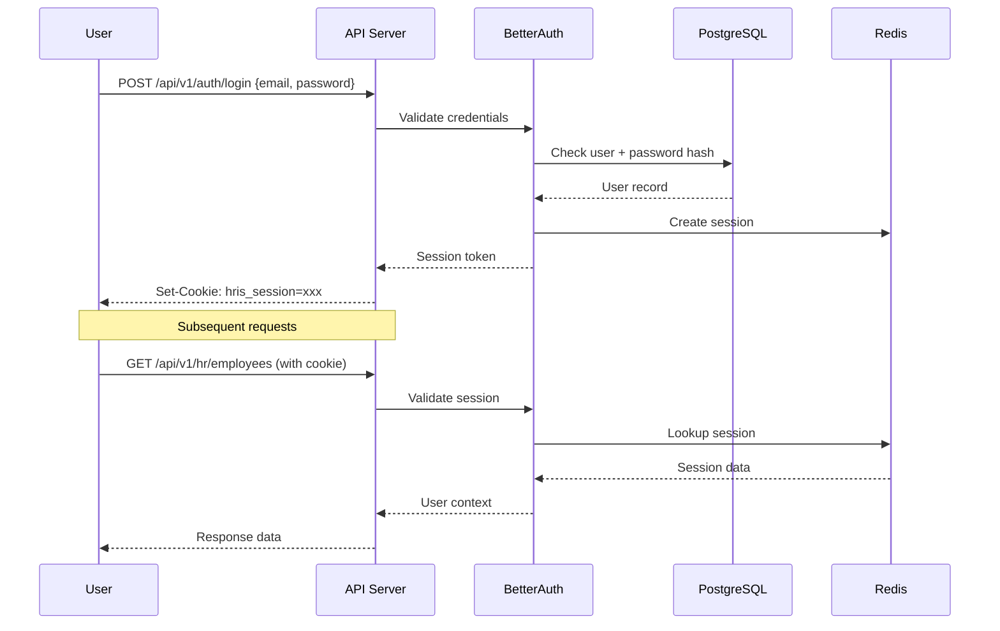
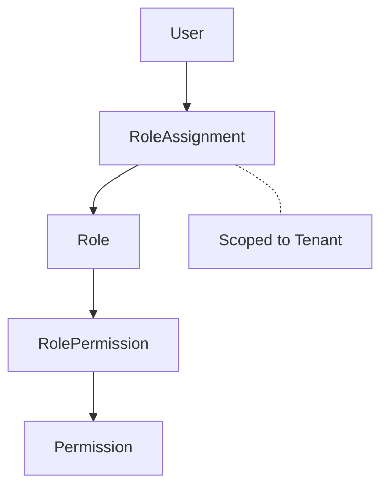

# Security

*Last updated: 2026-03-17*

## Multi-Tenant Row-Level Security (RLS)

Every tenant-owned table enforces data isolation at the database level using PostgreSQL Row-Level Security.

### How It Works

1. On each request, the tenant plugin sets the PostgreSQL session variable:
   ```sql
   SET app.current_tenant = '<tenant-uuid>';
   ```

2. RLS policies on every tenant table filter rows automatically:
   ```sql
   CREATE POLICY tenant_isolation ON app.employees
       USING (tenant_id = current_setting('app.current_tenant')::uuid);

   CREATE POLICY tenant_isolation_insert ON app.employees
       FOR INSERT WITH CHECK (tenant_id = current_setting('app.current_tenant')::uuid);
   ```

3. The application connects as `hris_app` role with `NOBYPASSRLS`, so RLS is **always enforced** - even in tests.

### System Context

For administrative operations that need cross-tenant access:

```sql
SELECT app.enable_system_context();
-- ... privileged operations ...
SELECT app.disable_system_context();
```

In TypeScript:
```typescript
import { withSystemContext } from './test/setup';

await withSystemContext(db, async (tx) => {
  // RLS bypassed here
});
```

### Migration Template

Every new tenant-scoped table must include:

```sql
CREATE TABLE app.new_table (
    id uuid PRIMARY KEY DEFAULT gen_random_uuid(),
    tenant_id uuid NOT NULL REFERENCES app.tenants(id),
    -- columns...
    created_at timestamptz NOT NULL DEFAULT now(),
    updated_at timestamptz NOT NULL DEFAULT now()
);

ALTER TABLE app.new_table ENABLE ROW LEVEL SECURITY;

CREATE POLICY tenant_isolation ON app.new_table
    USING (tenant_id = current_setting('app.current_tenant')::uuid);

CREATE POLICY tenant_isolation_insert ON app.new_table
    FOR INSERT WITH CHECK (tenant_id = current_setting('app.current_tenant')::uuid);

CREATE INDEX idx_new_table_tenant_id ON app.new_table(tenant_id);
```

## Authentication

### BetterAuth Integration

Authentication is handled by [BetterAuth](https://www.better-auth.com/):

- **Session cookies**: `hris_session` HTTP-only cookie
- **CSRF protection**: Token-based CSRF with `X-CSRF-Token` header
- **MFA support**: TOTP-based multi-factor authentication
- **Account locking**: After repeated failed login attempts

### Auth Flow



### Auth Endpoints

| Endpoint | Method | Description |
|----------|--------|-------------|
| `/api/v1/auth/login` | POST | Login with email/password |
| `/api/v1/auth/logout` | POST | Logout, clear session |
| `/api/v1/auth/me` | GET | Get current user info |
| `/api/v1/auth/tenants` | GET | List user's tenants |
| `/api/v1/auth/switch-tenant` | POST | Switch active tenant |

### Required Headers

| Header | Purpose | Required |
|--------|---------|:---:|
| `Cookie: hris_session=...` | Session authentication | Yes |
| `X-CSRF-Token` | CSRF protection (mutating requests) | Yes (POST/PUT/PATCH/DELETE) |
| `X-Tenant-ID` | Explicit tenant selection | Optional |
| `Idempotency-Key` | Request deduplication | Yes (mutating requests) |

## Role-Based Access Control (RBAC)

### Permission Model



| Entity | Description |
|--------|-------------|
| `permissions` | Individual actions (e.g., `hr.employees.read`, `hr.employees.write`) |
| `roles` | Named groups of permissions (e.g., `HR Manager`, `Payroll Admin`) |
| `role_permissions` | Maps permissions to roles |
| `role_assignments` | Assigns roles to users within a specific tenant |

### Permission Checking

```typescript
import { requirePermission, requireAnyPermission } from './plugins';

// Single permission
app.get('/employees', requirePermission('hr.employees.read'), handler);

// Any of these permissions
app.post('/employees', requireAnyPermission(['hr.employees.write', 'hr.admin']), handler);
```

### Security Endpoints

| Endpoint | Method | Description |
|----------|--------|-------------|
| `/api/v1/security/my-permissions` | GET | Get current user's effective permissions |
| `/api/v1/security/roles` | GET | List all roles |
| `/api/v1/security/roles` | POST | Create a new role |
| `/api/v1/security/roles/:id/permissions` | POST | Grant permission to role |
| `/api/v1/security/users/:id/roles` | POST | Assign role to user |
| `/api/v1/security/audit-log` | GET | Query audit log |

## Audit Logging

All significant operations are logged to the `audit_log` table:

- Partitioned by month for query performance
- Append-only (no UPDATE or DELETE allowed)
- Records: who, what, when, from where, what changed

### Audit Entry Structure

| Field | Description |
|-------|-------------|
| `tenant_id` | Tenant context |
| `user_id` | Acting user |
| `action` | Action type (e.g., `employee.created`, `case.escalated`) |
| `resource_type` | Entity type |
| `resource_id` | Entity ID |
| `old_values` | Previous state (for updates) |
| `new_values` | New state |
| `ip_address` | Client IP |
| `user_agent` | Client user agent |
| `timestamp` | When it happened |

## Security Headers

The `securityHeadersPlugin` applies standard security headers:

| Header | Value |
|--------|-------|
| `Strict-Transport-Security` | `max-age=31536000; includeSubDomains` (production only) |
| `X-Frame-Options` | `DENY` |
| `X-Content-Type-Options` | `nosniff` |
| `Referrer-Policy` | `strict-origin-when-cross-origin` |
| `Content-Security-Policy` | Restricts sources for scripts, styles, images |
| `X-XSS-Protection` | `0` (CSP handles this) |

## Idempotency

All mutating endpoints require an `Idempotency-Key` header to prevent duplicate operations:

- **Scope**: `(tenant_id, user_id, route_key)`
- **TTL**: 24-72 hours
- **Behavior**: If the same key is reused, the cached response is returned without re-executing

```
POST /api/v1/hr/employees
Idempotency-Key: create-employee-abc123
Content-Type: application/json

{ "firstName": "John", ... }
```

## Rate Limiting

Configurable per-IP rate limiting:

| Setting | Default |
|---------|---------|
| `RATE_LIMIT_MAX` | 100 requests |
| `RATE_LIMIT_WINDOW` | 60,000ms (1 minute) |

Response headers:
- `X-RateLimit-Limit` - Max requests per window
- `X-RateLimit-Remaining` - Remaining requests
- `X-RateLimit-Window` - Window duration
- `Retry-After` - Seconds until limit resets (when exceeded)

## CORS

Configured in `app.ts`:
- **Development**: Any `localhost` origin allowed
- **Production**: Strict allowlist via `CORS_ORIGIN` environment variable
- **Methods**: GET, POST, PUT, PATCH, DELETE, OPTIONS
- **Credentials**: Enabled (cookies)

## Related Documentation

- [Permissions System](../02-architecture/PERMISSIONS_SYSTEM.md) — 7-layer permission architecture
- [State Machines](STATE_MACHINES.md) — Status workflow enforcement
- [Production Checklist](../11-operations/production-checklist.md) — Security verification items
- [Security Issues](../14-troubleshooting/issues/) — Known security issues and remediation

---

## Related Documents

- [State Machines](STATE_MACHINES.md) — Lifecycle state transitions with audit trails
- [Permissions System](../02-architecture/PERMISSIONS_SYSTEM.md) — Full 7-layer permission architecture
- [Permissions V2 Migration Guide](../02-architecture/permissions-v2-migration-guide.md) — Adopting enhanced permission guards
- [Database Guide](../02-architecture/DATABASE.md) — RLS policies and tenant isolation at the schema level
- [Security Audit](../15-archive/audit/security-audit.md) — Comprehensive security findings and remediations
- [API Reference](../04-api/API_REFERENCE.md) — CSRF, idempotency, and auth header requirements
- [Testing Audit](../15-archive/audit/testing-audit.md) — Security test coverage assessment
