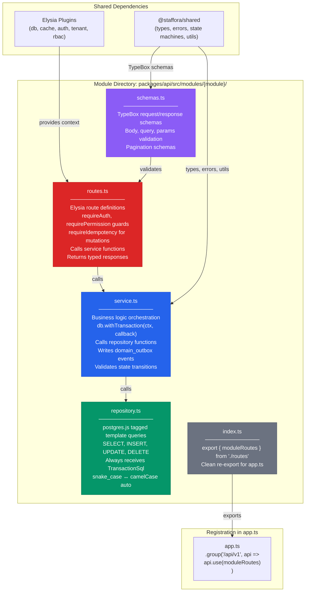
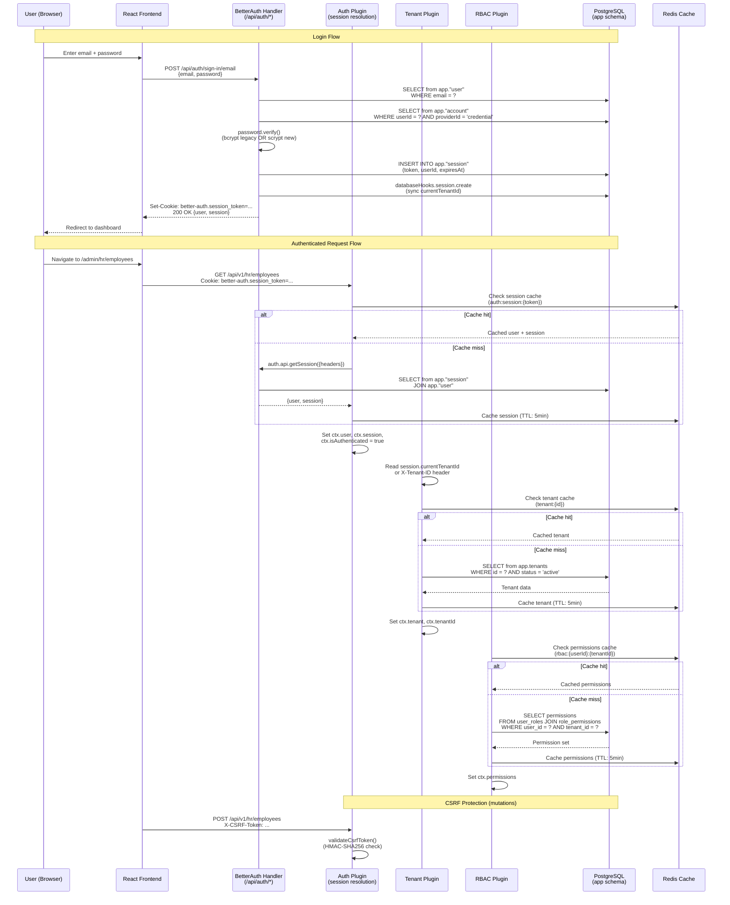
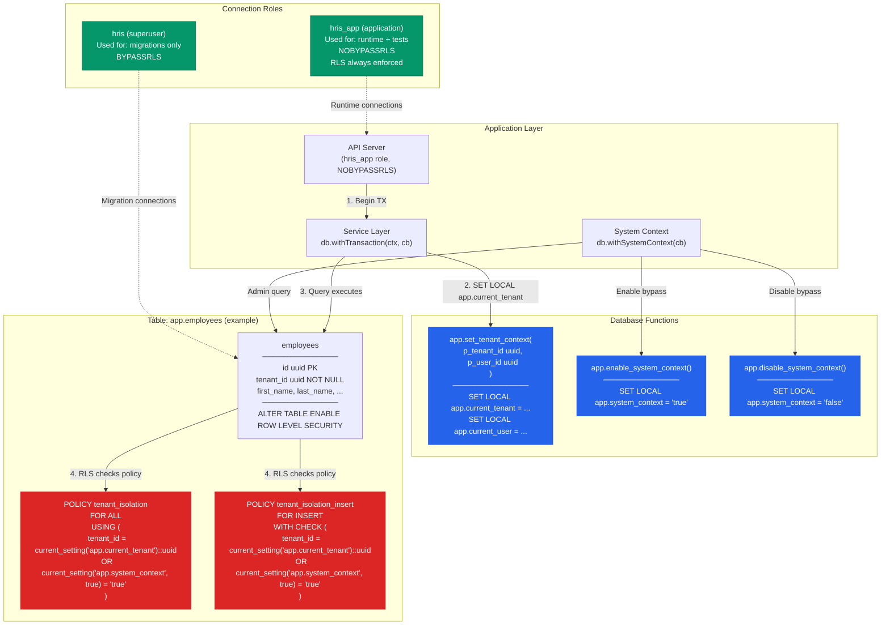
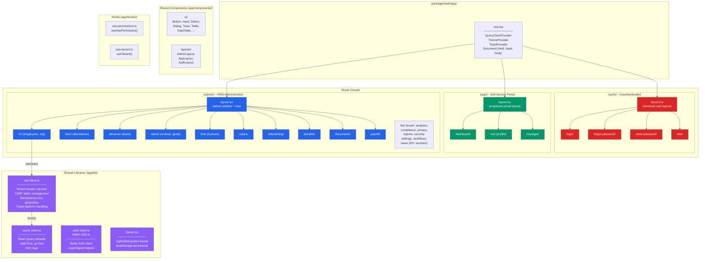
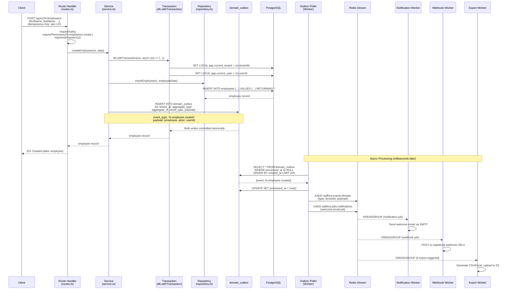
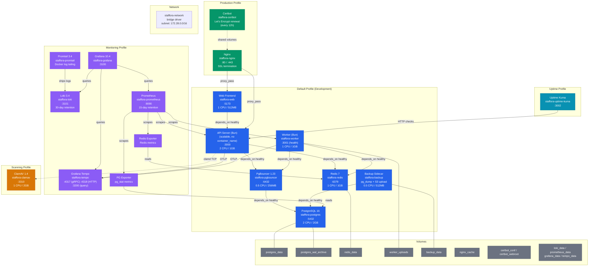

# Staffora HRIS Platform -- System Architecture Diagrams

*Last updated: 2026-03-28*

Comprehensive Mermaid architecture diagrams for the Staffora enterprise multi-tenant HRIS platform. Every diagram is derived from the actual codebase: `packages/api/src/app.ts`, `packages/api/src/worker.ts`, `packages/api/src/plugins/`, `packages/api/src/jobs/`, `packages/web/app/`, and `docker/docker-compose.yml`.

*Generated from source: 2026-03-28*

---

## Table of Contents

1. [High-Level System Architecture](#1-high-level-system-architecture)
2. [Request Flow (Elysia Plugin Chain)](#2-request-flow-elysia-plugin-chain)
3. [Backend Module Architecture](#3-backend-module-architecture)
4. [Worker System](#4-worker-system)
5. [Authentication Flow](#5-authentication-flow)
6. [Multi-Tenant RLS](#6-multi-tenant-rls)
7. [Database Schema Overview](#7-database-schema-overview)
8. [Frontend Architecture](#8-frontend-architecture)
9. [Data Flow (Write Path)](#9-data-flow-write-path)
10. [Docker Infrastructure](#10-docker-infrastructure)

---

## Diagram Legend

The diagrams below use several Mermaid diagram types. This legend explains the visual conventions used throughout the file.

### Flowchart Diagrams (graph TB / graph LR)

| Element | Mermaid Syntax | Meaning |
|---------|----------------|---------|
| Rectangle | `["Label"]` | Service, component, or infrastructure resource |
| Subgraph box | `subgraph "Name"` | Logical grouping of related components |
| Solid arrow | `-->` | Direct dependency or synchronous call |
| Solid arrow (bidirectional) | `<-->` | Bidirectional communication (e.g., cache read/write) |
| Dashed arrow | `-.->` | Indirect, asynchronous, or monitoring connection |
| Plain link | `---` | Non-directional association (e.g., volume mounts) |
| Arrow label | `\|"text"\|` | Description of the interaction or protocol |

### Color Coding (classDef)

Each flowchart diagram defines color classes to distinguish component roles at a glance:

| Color | Role | Examples |
|-------|------|----------|
| Indigo (`#4f46e5`) | Application services | API Server, Web Frontend, Worker |
| Green (`#059669`) | Data layer / database | PostgreSQL, Redis, PgBouncer, DB roles |
| Amber (`#d97706`) | External services | S3, SMTP, Firebase, ClamAV |
| Purple/Violet (`#6366f1` / `#8b5cf6`) | Observability or schema | Grafana, Prometheus, Loki, Tempo; TypeBox schemas |
| Red (`#dc2626`) | Security policies or streams | RLS policies, Redis Streams, route definitions |
| Blue (`#2563eb`) | Business logic or processors | Service layer, job processors, default Docker services |
| Gray (`#6b7280`) | Utility / passive | Index files, Docker volumes |
| Cyan (`#0891b2`) | Uptime monitoring | Uptime Kuma |

### Sequence Diagrams (sequenceDiagram)

| Element | Meaning |
|---------|---------|
| Participant box | A named service or component in the request flow |
| Solid arrow (`->>`) | Synchronous request |
| Dashed arrow (`-->>`) | Response (return path) |
| `Note over` block | Inline explanation of what a step does |
| `alt` / `else` block | Conditional branching (e.g., cache hit vs. miss) |

### Entity-Relationship Diagrams (erDiagram)

| Notation | Meaning |
|----------|---------|
| `\|\|--o{` | One-to-many relationship (one parent, many children) |
| `\|\|--o\|` | One-to-zero-or-one relationship |
| Entity block | Database table with column definitions |

---

## 1. High-Level System Architecture

Shows the major components of the Staffora platform and how they connect. The frontend React application communicates with the Elysia.js API server over HTTP. The API connects to PostgreSQL (via PgBouncer for connection pooling) and Redis for caching, sessions, and job queues. The Background Worker reads domain events from the `domain_outbox` table and processes jobs from Redis Streams, dispatching to notification (SMTP/Firebase), export (S3), PDF generation, analytics aggregation, and webhook delivery subsystems. In production, Nginx sits in front as a reverse proxy with TLS termination.

```mermaid
graph TB
    subgraph Clients
        Browser["Browser<br/>(React SPA)"]
        MobileApp["Mobile App<br/>(Future)"]
        ExtAPI["External<br/>Integrations"]
    end

    subgraph "Reverse Proxy (Production Only)"
        Nginx["Nginx<br/>:80 / :443<br/>SSL termination<br/>+ Certbot renewal"]
    end

    subgraph "Application Layer"
        Web["Web Frontend<br/>React Router v7<br/>Tailwind CSS<br/>:5173"]
        API["API Server<br/>Elysia.js on Bun<br/>:3000<br/>(stateless, horizontally scalable)"]
        Worker["Background Worker<br/>Bun runtime<br/>:3001 (health)"]
    end

    subgraph "Connection Pooling"
        PgBouncer["PgBouncer<br/>Transaction-mode pooling<br/>:6432<br/>max_client_conn=200"]
    end

    subgraph "Data Layer"
        Postgres["PostgreSQL 16<br/>RLS enabled<br/>app schema<br/>:5432"]
        Redis["Redis 7<br/>Cache + Sessions<br/>Streams (job queues)<br/>:6379"]
    end

    subgraph "External Services"
        S3["S3-Compatible<br/>Storage<br/>(exports, documents)"]
        SMTP["SMTP Server<br/>(email notifications)"]
        Firebase["Firebase<br/>(push notifications)"]
    end

    subgraph "Observability (monitoring profile)"
        Grafana["Grafana :3100"]
        Prometheus["Prometheus :9090"]
        Loki["Loki :3101"]
        Tempo["Tempo :3200"]
        Promtail["Promtail"]
    end

    Browser -->|HTTPS| Nginx
    MobileApp -->|HTTPS| Nginx
    ExtAPI -->|HTTPS| Nginx
    Nginx -->|HTTP| Web
    Nginx -->|HTTP| API

    Browser -->|HTTP (dev)| Web
    Browser -->|HTTP (dev)| API
    Web -->|SSR fetch| API

    API -->|SQL via pool| PgBouncer
    Worker -->|SQL via pool| PgBouncer
    PgBouncer -->|max 25 backend conns| Postgres

    API -->|Direct SQL (migrations)| Postgres

    API <-->|Cache, Rate Limit,<br/>Sessions, Idempotency| Redis
    Worker <-->|Streams XREADGROUP,<br/>Job dispatch| Redis

    Worker -->|SMTP| SMTP
    Worker -->|Push| Firebase
    Worker -->|Upload| S3

    Promtail -->|Log shipping| Loki
    API -->|OTLP traces| Tempo
    Worker -->|OTLP traces| Tempo
    Prometheus -->|Scrape /metrics| API
    Prometheus -->|Scrape /metrics| Worker
    Grafana -->|Query| Prometheus
    Grafana -->|Query| Loki
    Grafana -->|Query| Tempo

    classDef primary fill:#4f46e5,stroke:#3730a3,color:#fff
    classDef data fill:#059669,stroke:#047857,color:#fff
    classDef external fill:#d97706,stroke:#b45309,color:#fff
    classDef obs fill:#6366f1,stroke:#4f46e5,color:#fff

    class API,Web,Worker primary
    class Postgres,Redis,PgBouncer data
    class S3,SMTP,Firebase external
    class Grafana,Prometheus,Loki,Tempo,Promtail obs
```

---

## 2. Request Flow (Elysia Plugin Chain)

Every HTTP request to the API passes through a strictly ordered chain of Elysia plugins before reaching a module route handler. The order is critical because each plugin depends on context set by the plugins before it. CORS is handled first by `@elysiajs/cors`. Security headers are added next. Errors and request IDs are established early so every subsequent plugin can reference them. Metrics and tracing wrap the full request lifecycle. Database and cache connections are made available. Rate limiting uses Redis. BetterAuth handles `/api/auth/*` routes directly. The auth plugin resolves the session. Tenant plugin resolves the tenant from the session or `X-Tenant-ID` header. RBAC loads the user's permissions. Feature flags evaluate against tenant context. Idempotency checks for duplicate mutation requests. Audit logging captures the final result.

```mermaid
sequenceDiagram
    participant C as Client
    participant CORS as 1. CORS<br/>(@elysiajs/cors)
    participant SH as 2. Security Headers
    participant SW as 3. Swagger (/docs)
    participant ERR as 4. Errors Plugin<br/>(requestId, error shape)
    participant MET as 5. Metrics Plugin<br/>(Prometheus /metrics)
    participant TR as 6. Tracing Plugin<br/>(OpenTelemetry spans)
    participant BODY as 7. Body Size Check<br/>(10MB default)
    participant DB as 8. DB Plugin<br/>(postgres.js pool)
    participant CACHE as 9. Cache Plugin<br/>(Redis client)
    participant RL as 10. Rate Limit<br/>(Redis sliding window)
    participant IP as 11. IP Allowlist<br/>(admin endpoints)
    participant BA as 12. BetterAuth<br/>(/api/auth/*)
    participant AUTH as 13. Auth Plugin<br/>(session resolution)
    participant TEN as 14. Tenant Plugin<br/>(tenant resolution)
    participant RBAC as 15. RBAC Plugin<br/>(permission loading)
    participant FF as 16. Feature Flags<br/>(flag evaluation)
    participant IDEMP as 17. Idempotency<br/>(dedup mutations)
    participant AUDIT as 18. Audit Plugin<br/>(audit logging)
    participant ROUTE as Module Route<br/>Handler

    C->>CORS: HTTP Request
    CORS->>SH: Set CORS headers
    SH->>SW: Add security headers (HSTS, CSP, etc.)
    SW->>ERR: Swagger passthrough
    ERR->>MET: Assign X-Request-ID, register error handler
    MET->>TR: Record request metrics
    TR->>BODY: Start OpenTelemetry span
    BODY->>DB: Check Content-Length <= maxBodySize
    DB->>CACHE: Provide db.withTransaction()
    CACHE->>RL: Provide cache.get/set/del()
    RL->>IP: Check rate limit (429 if exceeded)
    IP->>BA: Check IP allowlist for admin routes
    BA->>AUTH: Handle /api/auth/* or passthrough
    AUTH->>TEN: Resolve session -> user context
    TEN->>RBAC: Resolve tenant from header/session
    RBAC->>FF: Load user permissions for tenant
    FF->>IDEMP: Evaluate feature flags
    IDEMP->>AUDIT: Check Idempotency-Key (return cached if duplicate)
    AUDIT->>ROUTE: Begin audit context
    ROUTE-->>C: JSON Response (audit logged)
```



---

## 3. Backend Module Architecture

Each backend feature module follows a consistent 5-file pattern inside `packages/api/src/modules/{module}/`. The `schemas.ts` file defines TypeBox request and response schemas for validation. The `repository.ts` file contains all database queries using postgres.js tagged templates, always operating within a transaction that has RLS context set. The `service.ts` file implements business logic, calling the repository and writing domain events to the outbox within the same transaction. The `routes.ts` file defines Elysia route handlers that wire up authentication guards, permission checks, and call the service layer. The `index.ts` file re-exports the routes for clean imports in `app.ts`. Larger modules like HR split into sub-files (e.g., `employee.repository.ts`, `org-unit.service.ts`) while maintaining the same layered pattern.



---

## 4. Worker System

The background worker (`packages/api/src/worker.ts`) runs as a separate Bun process. It has two main subsystems: the **Outbox Poller** and the **Stream Consumer**. The Outbox Poller periodically queries the `app.domain_outbox` table for unprocessed events, marks them as processed, and publishes them to the appropriate Redis Stream. The Stream Consumer uses Redis `XREADGROUP` with consumer groups to read jobs from six streams (`staffora:events:domain`, `staffora:jobs:notifications`, `staffora:jobs:exports`, `staffora:jobs:pdf`, `staffora:jobs:analytics`, `staffora:jobs:background`). Each stream has registered processors that handle specific job types. Failed jobs are retried up to `maxRetries` times before being moved to a dead letter queue. The Scheduler runs cron-based periodic tasks (leave accrual, timesheet reminders, session cleanup).

```mermaid
graph TB
    subgraph "Worker Process (worker.ts)"
        MAIN["Main Entry<br/>createWorker()<br/>startOutboxPoller()<br/>worker.start(streams)"]
        HEALTH["Health Server<br/>:3001<br/>/health, /ready,<br/>/live, /metrics"]
    end

    subgraph "Outbox Poller"
        POLL["OutboxProcessor<br/>pollIntervalMs: 1000<br/>batchSize: 100"]
        OUTBOX["app.domain_outbox<br/>──────────────<br/>id, tenant_id,<br/>aggregate_type,<br/>aggregate_id,<br/>event_type,<br/>payload,<br/>processed_at,<br/>retry_count"]
    end

    subgraph "Redis Streams"
        S_DOMAIN["staffora:events:domain"]
        S_NOTIF["staffora:jobs:notifications"]
        S_EXPORT["staffora:jobs:exports"]
        S_PDF["staffora:jobs:pdf"]
        S_ANALYTICS["staffora:jobs:analytics"]
        S_BG["staffora:jobs:background"]
    end

    subgraph "BaseWorker (Consumer Group)"
        CG["Consumer Group: staffora-workers<br/>XREADGROUP with block timeout<br/>Concurrency: 5 (configurable)"]
    end

    subgraph "Job Processors"
        P_OUTBOX["outboxProcessor<br/>(domain event handlers)"]
        P_EMAIL["emailProcessor<br/>(SMTP via nodemailer)"]
        P_INAPP["inAppProcessor<br/>(in-app notifications)"]
        P_PUSH["pushProcessor<br/>(Firebase push)"]
        P_CSV["csvExportProcessor<br/>(CSV file generation)"]
        P_EXCEL["excelExportProcessor<br/>(Excel file generation)"]
        P_CERT["certificateProcessor<br/>(PDF certificates)"]
        P_LETTER["employmentLetterProcessor<br/>(PDF employment letters)"]
        P_BUNDLE["caseBundleProcessor<br/>(PDF case bundles)"]
        P_AGG["analyticsAggregateProcessor"]
        P_METRIC["analyticsMetricsProcessor"]
        P_WEBHOOK["webhookDeliveryProcessor"]
    end

    subgraph "Scheduler (Cron)"
        SCHED["Scheduler<br/>──────────────<br/>leave-balance-accrual (daily 1AM)<br/>timesheet-reminder (Fri 9AM)<br/>session-cleanup (daily 2AM)"]
    end

    subgraph "Dead Letter Queue"
        DLQ["DLQ (after maxRetries=10)<br/>Failed jobs stored for<br/>manual review"]
    end

    POLL -->|"SELECT ... WHERE processed_at IS NULL<br/>UPDATE processed_at"| OUTBOX
    POLL -->|"XADD to appropriate stream"| S_DOMAIN
    POLL -->|"XADD"| S_NOTIF

    CG -->|"XREADGROUP"| S_DOMAIN
    CG -->|"XREADGROUP"| S_NOTIF
    CG -->|"XREADGROUP"| S_EXPORT
    CG -->|"XREADGROUP"| S_PDF
    CG -->|"XREADGROUP"| S_ANALYTICS
    CG -->|"XREADGROUP"| S_BG

    CG --> P_OUTBOX
    CG --> P_EMAIL
    CG --> P_INAPP
    CG --> P_PUSH
    CG --> P_CSV
    CG --> P_EXCEL
    CG --> P_CERT
    CG --> P_LETTER
    CG --> P_BUNDLE
    CG --> P_AGG
    CG --> P_METRIC
    CG --> P_WEBHOOK

    P_EMAIL -->|"Retry exhausted"| DLQ
    P_WEBHOOK -->|"Retry exhausted"| DLQ

    SCHED -->|"Enqueue jobs"| S_NOTIF
    SCHED -->|"Direct SQL"| OUTBOX

    classDef stream fill:#dc2626,stroke:#b91c1c,color:#fff
    classDef processor fill:#2563eb,stroke:#1d4ed8,color:#fff
    classDef db fill:#059669,stroke:#047857,color:#fff

    class S_DOMAIN,S_NOTIF,S_EXPORT,S_PDF,S_ANALYTICS,S_BG stream
    class P_OUTBOX,P_EMAIL,P_INAPP,P_PUSH,P_CSV,P_EXCEL,P_CERT,P_LETTER,P_BUNDLE,P_AGG,P_METRIC,P_WEBHOOK processor
    class OUTBOX db
```



---

## 5. Authentication Flow

All authentication uses **Better Auth** (`src/lib/better-auth.ts`). The login flow starts at the React frontend, which calls `POST /api/auth/sign-in/email` (handled directly by Better Auth). Better Auth validates credentials (supporting both legacy bcrypt and new scrypt password hashes via a custom `password.verify` function), creates a session in `app."session"`, and returns a session cookie. The `databaseHooks` in the Better Auth configuration keep the legacy `app.users` table in sync when users are created or updated through Better Auth's API. On subsequent requests, the `authPlugin` (step 13 in the plugin chain) reads the session cookie, calls Better Auth's `api.getSession()`, and populates `ctx.user` and `ctx.session`. The `tenantPlugin` then resolves the tenant from the session's `currentTenantId` or the `X-Tenant-ID` header, loading tenant data from cache or database. The `rbacPlugin` loads the user's roles and permissions for the resolved tenant.



---

## 6. Multi-Tenant RLS

Every tenant-owned table in the `app` schema has Row-Level Security (RLS) enabled with two policies: one for reads (`tenant_isolation`) using `USING (tenant_id = current_setting('app.current_tenant')::uuid)` and one for inserts (`tenant_isolation_insert`) using `WITH CHECK`. At runtime, the `DatabaseClient.withTransaction()` method calls `app.set_tenant_context(tenant_id, user_id)` at the start of every transaction, which sets the `app.current_tenant` and `app.current_user` session variables. The application connects as the `hris_app` role which has `NOBYPASSRLS`, so RLS is always enforced. For administrative operations that need cross-tenant access, `app.enable_system_context()` / `app.disable_system_context()` functions temporarily bypass RLS within the same transaction.



---

## 7. Database Schema Overview

The database schema lives entirely in the `app` schema (not `public`). There are approximately 228 migration files creating the full schema. The diagram below shows the major entity groups and their relationships. All tenant-owned tables have a `tenant_id` column and RLS policies. The Better Auth tables (`"user"`, `"session"`, `"account"`, `"verification"`, `"twoFactor"`) use camelCase text IDs and coexist alongside the legacy `users` table with UUID IDs.

```mermaid
erDiagram
    tenants ||--o{ users : "has"
    tenants ||--o{ employees : "has"
    tenants ||--o{ org_units : "has"
    tenants ||--o{ positions : "has"
    tenants ||--o{ roles : "has"

    users ||--o| "BA_user" : "synced with"
    "BA_user" ||--o{ "BA_session" : "has"
    "BA_user" ||--o{ "BA_account" : "has"

    employees ||--o{ employee_positions : "holds"
    employees ||--o{ employee_contracts : "has"
    employees ||--o{ employee_addresses : "lives at"
    employees ||--o{ emergency_contacts : "has"
    employees ||--o{ bank_details : "paid to"

    positions ||--o{ employee_positions : "filled by"
    org_units ||--o{ positions : "contains"
    org_units ||--o| org_units : "parent"

    employees ||--o{ time_events : "records"
    employees ||--o{ timesheets : "submits"
    employees ||--o{ schedules : "assigned"

    employees ||--o{ leave_requests : "requests"
    employees ||--o{ leave_balances : "has"
    leave_types ||--o{ leave_requests : "categorized by"
    leave_types ||--o{ leave_balances : "tracked by"

    employees ||--o{ performance_reviews : "reviewed in"
    employees ||--o{ goals : "has"
    employees ||--o{ competency_assessments : "assessed in"
    competency_frameworks ||--o{ competency_assessments : "uses"

    employees ||--o{ course_enrollments : "enrolled in"
    courses ||--o{ course_enrollments : "has"
    courses ||--o{ learning_path_courses : "part of"
    learning_paths ||--o{ learning_path_courses : "contains"

    employees ||--o{ cases : "has"
    cases ||--o{ case_notes : "contains"
    cases ||--o{ case_documents : "has"

    employees ||--o{ onboarding_assignments : "goes through"
    onboarding_templates ||--o{ onboarding_assignments : "uses"
    onboarding_templates ||--o{ onboarding_checklist_items : "contains"

    employees ||--o{ benefit_enrollments : "enrolled in"
    benefit_plans ||--o{ benefit_enrollments : "provides"

    employees ||--o{ documents : "has"

    employees ||--o{ succession_plans : "nominated in"

    employees ||--o{ payroll_records : "paid in"
    employees ||--o{ payslips : "receives"
    employees ||--o{ pension_enrollments : "enrolled in"
    employees ||--o{ tax_codes : "has"

    tenants ||--o{ domain_outbox : "publishes events"
    tenants ||--o{ audit_logs : "has"
    tenants ||--o{ feature_flags : "configures"
    tenants ||--o{ idempotency_keys : "tracks"

    tenants {
        uuid id PK
        string name
        string slug
        string status
        jsonb settings
    }

    employees {
        uuid id PK
        uuid tenant_id FK
        string employee_number
        string first_name
        string last_name
        string email
        string status
        date start_date
        date effective_from
        date effective_to
    }

    users {
        uuid id PK
        uuid tenant_id FK
        string email
        string password_hash
        string status
    }

    domain_outbox {
        uuid id PK
        uuid tenant_id FK
        string aggregate_type
        uuid aggregate_id
        string event_type
        jsonb payload
        timestamp processed_at
        int retry_count
    }
```



---

## 8. Frontend Architecture

The frontend (`packages/web`) uses React Router v7 in framework mode with file-based routing. Routes are organized into three layout groups: `(auth)` for unauthenticated pages (login, forgot-password, MFA), `(app)` for the self-service portal (dashboard, personal profile), and `(admin)` for the full HRIS administration interface with 20+ module sections. Each group has its own `layout.tsx` that provides the appropriate shell (auth layout with no sidebar, app layout with employee sidebar, admin layout with full navigation). React Query (`@tanstack/react-query`) manages server state with automatic caching, background refetching, and optimistic updates. The API client (`lib/api-client.ts`) handles tenant header injection, CSRF tokens, idempotency keys, and typed error handling.



---

## 9. Data Flow (Write Path)

The write path demonstrates how a mutation flows from the API through the service layer, into the database with transactional outbox, and eventually to the background worker for async processing. When a client creates a new employee, the request passes through the full plugin chain, the route handler calls the service, which opens a database transaction with RLS context set. Inside that single transaction, the employee record is inserted AND a domain event is written to the `domain_outbox` table. This guarantees atomicity -- either both succeed or both roll back. The Outbox Poller in the Worker process picks up unprocessed outbox events, publishes them to the appropriate Redis Stream, and the stream consumer routes them to the correct processor (e.g., notification, webhook delivery).



---

## 10. Docker Infrastructure

The Docker Compose configuration (`docker/docker-compose.yml`) defines the complete container topology. The **default profile** includes seven services: PostgreSQL 16 (persistent data), PgBouncer (connection pooling in transaction mode), Redis 7 (cache/queue), the API server (stateless, scalable with `--scale api=N`), the Background Worker, the Web Frontend, and a Backup sidecar (pg_dump on schedule with optional S3 upload). The **production profile** adds Nginx (reverse proxy with TLS/Certbot) and Certbot for Let's Encrypt certificate automation. The **monitoring profile** adds the full observability stack: Grafana Tempo (distributed tracing), Loki + Promtail (log aggregation), Prometheus + exporters (metrics), and Grafana (dashboards). The **scanning profile** adds ClamAV for virus scanning uploaded documents. The **uptime profile** adds Uptime Kuma for health monitoring.



---

## Appendix: Key Source File References

| Diagram | Primary Source Files |
|---------|---------------------|
| 1. System Architecture | `docker/docker-compose.yml`, `packages/api/src/app.ts`, `packages/api/src/worker.ts` |
| 2. Request Flow | `packages/api/src/app.ts` (plugin chain order, lines 181-538) |
| 3. Module Architecture | `packages/api/src/modules/hr/` (representative module) |
| 4. Worker System | `packages/api/src/worker.ts`, `packages/api/src/jobs/index.ts`, `packages/api/src/jobs/base.ts` |
| 5. Authentication Flow | `packages/api/src/plugins/auth-better.ts`, `packages/api/src/lib/better-auth.ts` |
| 6. Multi-Tenant RLS | `packages/api/src/plugins/db.ts`, `packages/api/src/plugins/tenant.ts`, `migrations/` |
| 7. Database Schema | `migrations/0001_*.sql` through `migrations/0189_*.sql` |
| 8. Frontend Architecture | `packages/web/app/root.tsx`, `packages/web/app/routes/`, `packages/web/app/lib/` |
| 9. Data Flow | `packages/api/src/modules/*/service.ts`, `packages/api/src/jobs/outbox-processor.ts` |
| 10. Docker Infrastructure | `docker/docker-compose.yml` |
