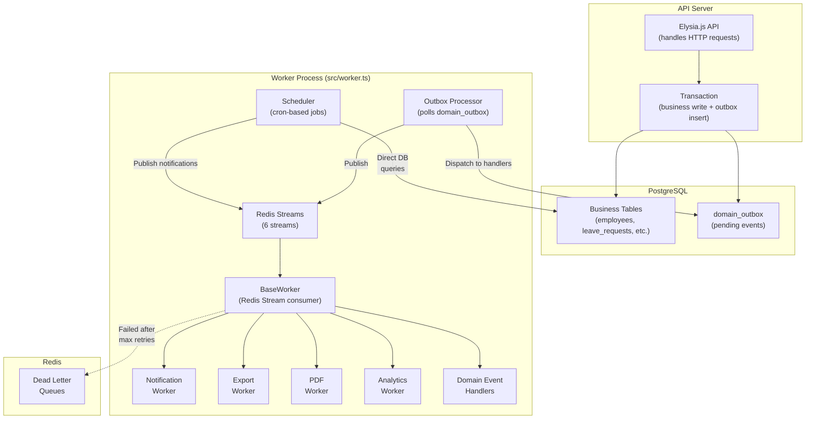
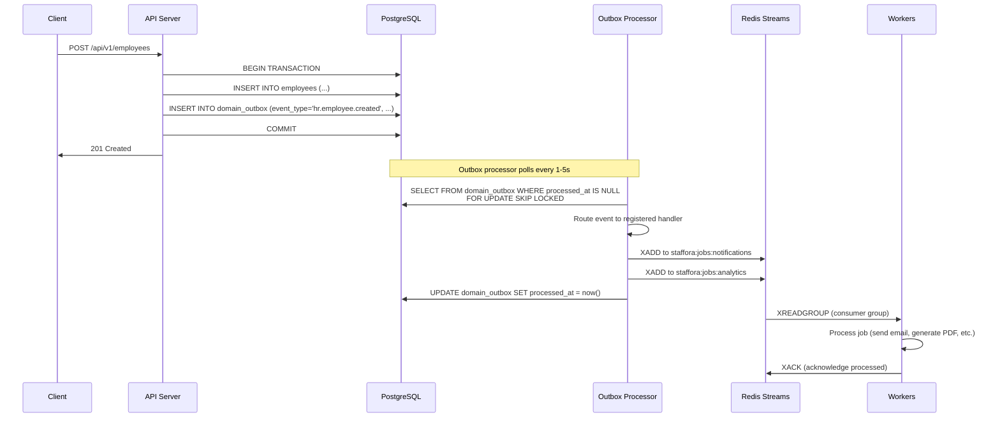
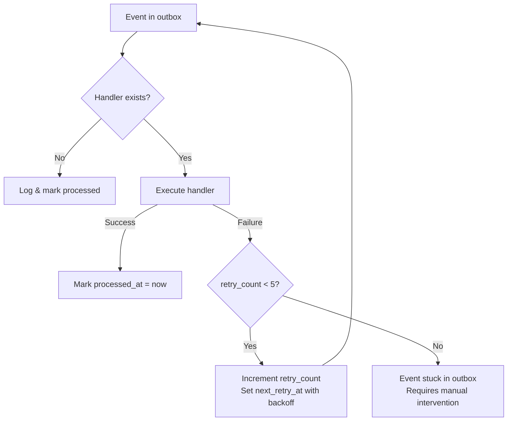
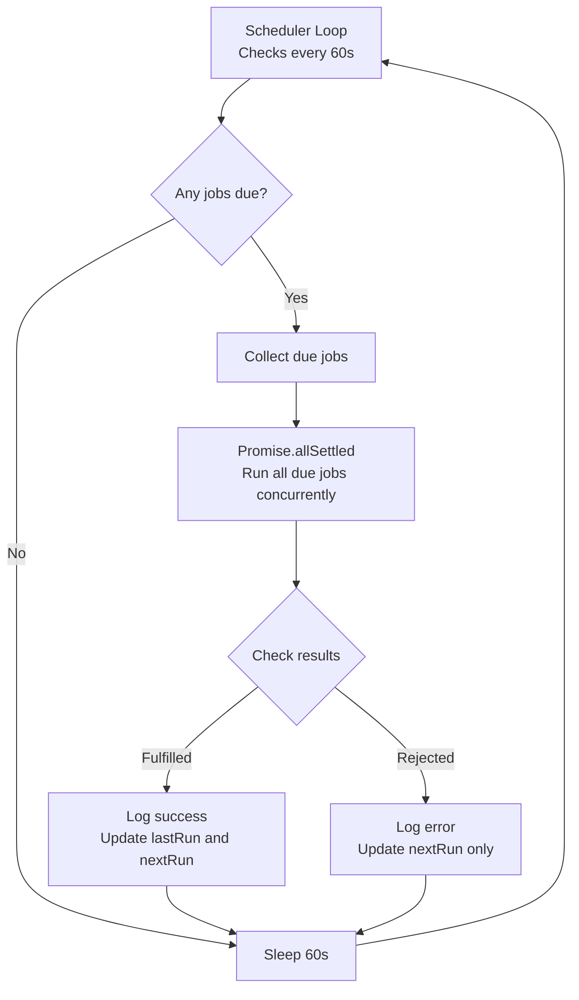
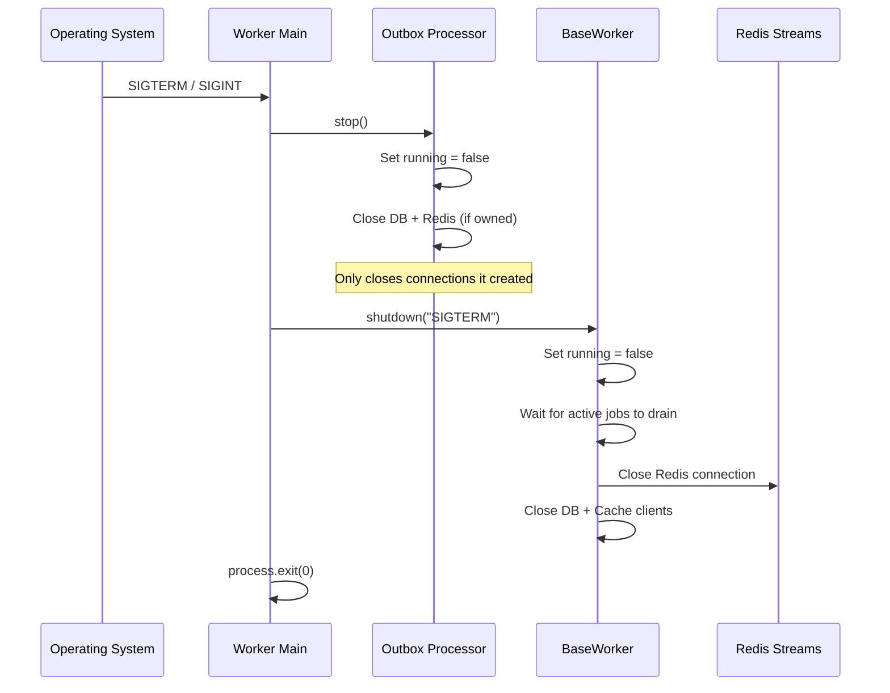

# Worker System Deep Dive

> Complete guide to the Staffora HRIS platform's background job processing system, including the outbox processor, scheduler, and all worker types.
> **Last updated:** 2026-03-17

**Related documentation:**

- [Architecture Overview](./ARCHITECTURE.md) -- System-level architecture
- [Database Guide](./database-guide.md) -- Outbox table schema and RLS context
- [State Machines](../patterns/STATE_MACHINES.md) -- Workflow state transitions triggered by workers
- [Testing Guide](../testing/test-matrix.md) -- Background job test coverage

---

## Architecture Overview

The worker system processes background jobs using Redis Streams as the message transport and PostgreSQL as the source of truth. It follows the transactional outbox pattern to guarantee at-least-once delivery of domain events.



### Entry Point

The worker process starts from `packages/api/src/worker.ts` and orchestrates three subsystems:

1. **BaseWorker** -- Consumes jobs from Redis Streams, routes them to registered processors
2. **Outbox Processor** -- Polls the `domain_outbox` table and dispatches domain events
3. **Scheduler** -- Runs periodic cron-based maintenance and notification jobs

All three subsystems run in the same process, sharing database and Redis connections. The health check server runs on a separate port (default: 3001).

### Startup Sequence

```
main()
  |-- createWorker()          # Instantiate BaseWorker, register all processors
  |-- createHealthServer()    # Start Elysia health endpoints on port 3001
  |-- startOutboxPoller()     # Connect to DB + Redis, start polling loop
  |-- worker.start(streams)   # Begin consuming from 6 Redis Streams
```

---

## Domain Event Flow

The outbox pattern ensures domain events are published reliably by writing them to the database in the same transaction as the business operation.



### Writing to the Outbox

Domain events must always be written in the same transaction as the business operation. There are two approaches:

**Direct outbox insert (in repository/service code):**

```typescript
await db.withTransaction(ctx, async (tx) => {
  // Business write
  const [employee] = await tx`
    INSERT INTO employees (tenant_id, employee_number, status, hire_date)
    VALUES (${ctx.tenantId}, ${data.employeeNumber}, 'active', ${data.hireDate})
    RETURNING *
  `;

  // Outbox write (same transaction, guaranteed atomic)
  await tx`
    SELECT app.write_outbox_event(
      ${ctx.tenantId}::uuid,
      'employee',
      ${employee.id}::uuid,
      'hr.employee.created',
      ${JSON.stringify({ employee, actor: ctx.userId })}::jsonb,
      '{}'::jsonb
    )
  `;

  return employee;
});
```

**TransactionManager with event emitter (preferred):**

```typescript
import { createTransactionManager } from "../lib/transaction";

const txManager = createTransactionManager(db, ctx.tenantId, ctx.userId);
const { result, events } = await txManager.execute(async (tx, emitEvent) => {
  const [employee] = await tx`
    INSERT INTO employees (...) VALUES (...) RETURNING *
  `;

  emitEvent({
    aggregateType: "employee",
    aggregateId: employee.id,
    eventType: "hr.employee.created",
    payload: { employee, actor: ctx.userId },
  });

  return employee;
});
// events: [{ id: "uuid", eventType: "hr.employee.created" }]
```

### Outbox Table Schema

```sql
CREATE TABLE app.domain_outbox (
    id             uuid PRIMARY KEY DEFAULT gen_random_uuid(),
    tenant_id      uuid NOT NULL REFERENCES app.tenants(id),
    aggregate_type varchar(100) NOT NULL,     -- e.g., 'employee', 'leave_request'
    aggregate_id   uuid NOT NULL,             -- ID of the aggregate root
    event_type     varchar(255) NOT NULL,     -- e.g., 'hr.employee.created'
    payload        jsonb NOT NULL DEFAULT '{}',
    metadata       jsonb NOT NULL DEFAULT '{}',
    created_at     timestamptz NOT NULL DEFAULT now(),
    processed_at   timestamptz,               -- NULL = pending
    retry_count    integer NOT NULL DEFAULT 0,
    error_message  text,                       -- Error from last failed attempt
    next_retry_at  timestamptz                 -- When to retry (exponential backoff)
);
```

Key database functions for outbox management:

| Function | Purpose |
|----------|---------|
| `app.write_outbox_event(...)` | Write an event to the outbox (call in same transaction) |
| `app.claim_outbox_events(batch_size, worker_id)` | Claim a batch with `SKIP LOCKED` |
| `app.mark_outbox_event_processed(event_id)` | Mark as successfully processed |
| `app.mark_outbox_event_failed(event_id, error, max_retries)` | Mark as failed with backoff |
| `app.cleanup_processed_outbox_events(older_than)` | Delete old processed events |
| `app.get_outbox_stats()` | Return pending/failed/processed counts |

---

## Outbox Processor

**Source:** `packages/api/src/worker/outbox-processor.ts`

The `OutboxProcessor` class polls the `domain_outbox` table for pending events and dispatches them to registered handlers.

### Polling Behavior

| Parameter | Default | Env Override | Description |
|-----------|---------|-------------|-------------|
| `BATCH_SIZE` | 100 | `OUTBOX_BATCH_SIZE` | Events per poll cycle |
| `BASE_POLL_INTERVAL_MS` | 5,000 ms | `OUTBOX_POLL_INTERVAL` | Polling interval under load |
| `MAX_POLL_INTERVAL_MS` | 30,000 ms | -- | Maximum backoff interval (idle) |
| `EMPTY_POLLS_BEFORE_BACKOFF` | 3 | -- | Empty polls before slowing down |
| `MAX_RETRIES` | 5 | -- | Retries before skipping an event |
| `MAX_RETRY_BACKOFF_MS` | 300,000 ms | -- | Maximum retry delay (5 min cap) |

**Adaptive polling:** When events are found, the processor polls at the base interval. After 3 consecutive empty polls, it backs off incrementally up to 30 seconds. When events appear again, the interval resets immediately to the base.

### Row Locking

The processor uses `FOR UPDATE SKIP LOCKED` to safely support multiple concurrent outbox processors without double-processing:

```sql
SELECT id, tenant_id, aggregate_type, aggregate_id, event_type, payload, retry_count, created_at
FROM app.domain_outbox
WHERE processed_at IS NULL
  AND retry_count < 5
  AND (next_retry_at IS NULL OR next_retry_at <= now())
ORDER BY created_at ASC
LIMIT 100
FOR UPDATE SKIP LOCKED
```

### Connection Management

The `OutboxProcessor` supports two modes:

- **Injected connections:** Reuses existing `postgres.Sql` and `Redis` instances (used by the main worker process via `startOutboxPolling()`). Does not close connections on stop.
- **Owned connections:** Creates its own database and Redis connections (standalone mode). Closes them on stop.

### Registered Event Handlers

The outbox processor routes domain events by `event_type` prefix:

| Event Type | Handler | Action |
|------------|---------|--------|
| `hr.employee.created` | `handleEmployeeCreated` | Send welcome notification, trigger onboarding workflow |
| `hr.employee.updated` | `handleEmployeeUpdated` | Sync changes to dependent systems |
| `hr.employee.terminated` | `handleEmployeeTerminated` | Revoke access, notify HR, trigger offboarding |
| `time.event.recorded` | `handleTimeEvent` | Update timesheet, check WTR compliance |
| `time.timesheet.submitted` | `handleTimesheetSubmitted` | Notify approver |
| `time.timesheet.approved` | `handleTimesheetApproved` | Notify employee, update payroll |
| `absence.request.submitted` | `handleLeaveRequestSubmitted` | Notify manager for approval |
| `absence.request.approved` | `handleLeaveRequestApproved` | Deduct balance, notify employee |
| `absence.request.rejected` | `handleLeaveRequestRejected` | Notify employee with reason |
| `workflows.instance.started` | `handleWorkflowStarted` | Assign first workflow step |
| `workflows.instance.completed` | `handleWorkflowCompleted` | Notify stakeholders |
| `workflows.step.processed` | `handleWorkflowStepProcessed` | Advance to next step or complete |

Events with no registered handler are logged and marked as processed (skipped, not retried).

### Error Handling

When an event handler fails:

1. `retry_count` is incremented
2. `error_message` is set (truncated to 500 chars, secrets redacted)
3. `next_retry_at` is set with exponential backoff: `min(1000 * 2^retryCount, 300000)` ms
4. After `MAX_RETRIES` (5) failures, the event stays in the outbox but is no longer picked up by the poll query



---

## Redis Streams Topology

The worker system uses six Redis Streams for job distribution:

| Stream Key | Constant | Purpose | Producers |
|------------|----------|---------|-----------|
| `staffora:events:domain` | `StreamKeys.DOMAIN_EVENTS` | Domain events from outbox | Outbox processor |
| `staffora:jobs:notifications` | `StreamKeys.NOTIFICATIONS` | Email, in-app, push | Outbox handlers, scheduler |
| `staffora:jobs:exports` | `StreamKeys.EXPORTS` | CSV/Excel report generation | API routes |
| `staffora:jobs:pdf` | `StreamKeys.PDF_GENERATION` | PDF document creation | API routes, workflows |
| `staffora:jobs:analytics` | `StreamKeys.ANALYTICS` | Analytics aggregation | Outbox handlers |
| `staffora:jobs:background` | `StreamKeys.BACKGROUND` | General background tasks | Various |

### Consumer Groups

Workers use Redis consumer groups for reliable message delivery:

- **Group name:** `staffora-workers` (configurable via `WORKER_GROUP` env var)
- **Consumer ID:** `worker-<PID>` (configurable via `WORKER_ID` env var)
- Multiple worker instances can share the same group for horizontal scaling
- Each message in a stream is delivered to exactly one consumer in the group

### Dead Letter Queues

Each stream has a corresponding DLQ at `<stream>:dlq`. Messages are moved to the DLQ after exceeding the maximum retry count:

- **BaseWorker:** 10 retries (configurable via `WORKER_MAX_RETRIES`)
- **Outbox Processor:** 5 retries (hardcoded `MAX_RETRIES`)

---

## BaseWorker

**Source:** `packages/api/src/jobs/base.ts`

The `BaseWorker` class manages the Redis Streams consumer lifecycle. It handles consumer group creation, message reading, job routing, retry logic, and graceful shutdown.

### Configuration

| Environment Variable | Default | Description |
|---------------------|---------|-------------|
| `REDIS_URL` | `redis://localhost:6379` | Redis connection string |
| `WORKER_GROUP` | `staffora-workers` | Consumer group name |
| `WORKER_ID` | `worker-<PID>` | Unique consumer identifier |
| `WORKER_CONCURRENCY` | 5 | Maximum concurrent jobs |
| `WORKER_POLL_INTERVAL` | 1,000 ms | Polling interval |
| `WORKER_BLOCK_TIMEOUT` | 5,000 ms | XREADGROUP block timeout |
| `WORKER_MAX_RETRIES` | 10 | Retries before moving to DLQ |
| `WORKER_PROCESS_PENDING` | `true` | Process pending messages on startup |
| `WORKER_CLAIM_TIMEOUT` | 60,000 ms | Claim timeout for pending messages |

### Job Routing

Jobs are routed by the `type` field in their payload to registered processors:

```typescript
export const JobTypes = {
  // Domain Events
  PROCESS_OUTBOX: "outbox.process",

  // Notifications
  SEND_EMAIL: "notification.email",
  SEND_IN_APP: "notification.in_app",
  SEND_PUSH: "notification.push",

  // Exports
  EXPORT_CSV: "export.csv",
  EXPORT_EXCEL: "export.excel",

  // PDF Generation
  PDF_CERTIFICATE: "pdf.certificate",
  PDF_EMPLOYMENT_LETTER: "pdf.employment_letter",
  PDF_CASE_BUNDLE: "pdf.case_bundle",

  // Analytics
  ANALYTICS_AGGREGATE: "analytics.aggregate",
  ANALYTICS_METRICS: "analytics.metrics",

  // Scheduled Tasks
  CLEANUP_SESSIONS: "scheduled.cleanup_sessions",
  CLEANUP_OUTBOX: "scheduled.cleanup_outbox",
  SYNC_PERMISSIONS: "scheduled.sync_permissions",
};
```

### Job Payload Structure

```typescript
interface JobPayload<T = unknown> {
  id: string;           // Unique job ID (UUID)
  type: string;         // Job type for routing (matches JobTypes)
  tenantId?: string;    // Tenant context for RLS
  userId?: string;      // User who triggered the job
  data: T;              // Job-specific data
  metadata: {
    createdAt: string;       // ISO timestamp
    correlationId?: string;  // For distributed tracing
    requestId?: string;      // Originating HTTP request ID
    priority?: number;       // 0 = highest
    scheduledAt?: string;    // Deferred execution time
  };
}
```

### Job Context

Each processor receives a `JobContext` providing access to infrastructure:

| Property | Type | Description |
|----------|------|-------------|
| `db` | `DatabaseClient` | Database client for queries and transactions |
| `cache` | `CacheClient` | Redis cache client |
| `redis` | `Redis` | Raw ioredis client for publishing |
| `log` | `JobLogger` | Scoped logger with `[Job:type:id]` prefix |
| `jobId` | `string` | Unique job identifier |
| `messageId` | `string` | Redis Stream message ID |
| `attempt` | `number` | Current attempt number (1-based) |

---

## Job Workers

### Notification Worker

**Source:** `packages/api/src/jobs/notification-worker.ts`

Handles multi-channel notification delivery:

| Channel | Job Type | Implementation | Priority |
|---------|----------|---------------|----------|
| **Email** | `notification.email` | SMTP via nodemailer | Supports `low`, `normal`, `high`, `urgent` |
| **In-App** | `notification.in_app` | Stored in database | Supports `low`, `normal`, `high`, `urgent` |
| **Push** | `notification.push` | Firebase Cloud Messaging | Supports `low`, `normal`, `high`, `urgent` |

**Features:**

- Template-based message rendering (`template` + `templateData`)
- CC/BCC support for email
- Delivery tracking per notification
- Rate limiting awareness
- Bulk notification support
- Attachment support for email (filename + content)

**Email payload example:**

```typescript
{
  type: "notification.email",
  data: {
    to: "employee@company.com",
    cc: ["hr@company.com"],
    subject: "Leave Request Approved",
    template: "leave-approved",
    templateData: { employeeName: "John", startDate: "2026-04-01" },
    attachments: [{ filename: "approval.pdf", content: "base64..." }]
  }
}
```

### Export Worker

**Source:** `packages/api/src/jobs/export-worker.ts`

Generates report exports in various formats:

| Format | Job Type | Description |
|--------|----------|-------------|
| CSV | `export.csv` | Streaming CSV generation |
| Excel (XLSX) | `export.excel` | Structured XLSX with column formatting |
| JSON | -- | Native JSON export |

**Features:**

- Streaming for memory-efficient large dataset handling
- Progress tracking for long-running exports
- Upload to configurable storage (local filesystem or S3)
- Automatic cleanup of old exports
- Download link generation with expiry
- Column formatting (date, currency, percentage, boolean)

**Export column definition:**

```typescript
interface ExportColumn {
  field: string;        // Database column or computed field name
  header: string;       // Display header in output file
  width?: number;       // Column width (for Excel)
  formatter?: "date" | "datetime" | "currency" | "percentage" | "boolean";
  format?: string;      // Custom format string
}
```

### PDF Worker

**Source:** `packages/api/src/jobs/pdf-worker.ts`

Generates PDF documents using `pdf-lib`:

| Document Type | Job Type | Use Case |
|---------------|----------|----------|
| Certificate | `pdf.certificate` | LMS course completion certificates |
| Employment Letter | `pdf.employment_letter` | Employment confirmation letters |
| Case Bundle | `pdf.case_bundle` | Case documentation packages |
| Offer Letter | `pdf.offer_letter` | Job offer letters |
| Termination Letter | `pdf.termination_letter` | Termination notices |
| Salary Slip | `pdf.salary_slip` | Monthly payslips |
| Tax Form | `pdf.tax_form` | Tax documentation (P60, P45) |
| Custom | `pdf.custom` | Freeform PDF generation |

**Features:**

- Template-based generation with dynamic content
- Document storage and retrieval
- Notification on completion (publishes to notifications stream)
- Support for images, tables, and multi-page layouts

### Analytics Worker

**Source:** `packages/api/src/jobs/analytics-worker.ts`

Aggregates analytics data for dashboards and reports:

| Metric Type | Description |
|-------------|-------------|
| `headcount` | Total employee counts by department, status |
| `turnover` | Employee turnover rates |
| `time_attendance` | Attendance and overtime aggregation |
| `leave_utilization` | Leave balance usage percentages |
| `overtime` | Overtime hours by period |
| `absence_rate` | Absence frequency and duration |
| `tenure` | Average and distribution of employee tenure |

**Features:**

- Scheduled and on-demand processing
- Incremental and full recalculation modes
- Multi-dimensional aggregation (by department, role, location)
- Historical trend tracking

### Domain Event Handlers

**Source:** `packages/api/src/jobs/domain-event-handlers.ts`

Processes domain events from Redis Streams and triggers downstream actions. Uses a handler registry pattern with support for exact match and wildcard subscriptions:

```typescript
// Register handler for a specific event type
registerHandler("hr.employee.created", async (event, context) => {
  // Trigger onboarding workflow
  // Send welcome email
});

// Get handlers supports wildcards (e.g., "hr.*" matches "hr.employee.created")
```

**Handler context provides:**

| Property | Type | Description |
|----------|------|-------------|
| `db` | `DatabaseClient` | Database access |
| `redis` | `Redis` | Redis client for publishing follow-up jobs |
| `cache` | `CacheClient` | Cache client (optional) |
| `log` | Logger | Structured logger with info/warn/error/debug |

---

## Scheduler

**Source:** `packages/api/src/worker/scheduler.ts`

The scheduler runs periodic maintenance and notification jobs using a simple cron-based loop. It checks every 60 seconds for due jobs and runs them concurrently via `Promise.allSettled`.

### Scheduled Jobs

#### Every 15 Minutes

| Job | Cron | Purpose |
|-----|------|---------|
| `workflow-auto-escalation` | `*/15 * * * *` | Reassign overdue workflow steps to escalation targets based on SLA thresholds |
| `scheduled-report-runner` | `*/15 * * * *` | Execute report schedules that are due and notify recipients |

#### Hourly

| Job | Cron | Purpose |
|-----|------|---------|
| `dlq-monitoring` | `0 * * * *` | Check all dead letter queue sizes, warn if any exceed 1,000 messages |
| `user-table-drift-detection` | `30 * * * *` | Detect and repair drift between BetterAuth `user` table and `app.users` |

#### Daily

| Job | Time | Purpose |
|-----|------|---------|
| `leave-balance-accrual` | 1:00 AM | Batch-update leave balances using policy accrual rates |
| `session-cleanup` | 2:00 AM | Delete sessions expired for more than 7 days |
| `outbox-cleanup` | 3:00 AM | Delete processed outbox events older than 30 days |

#### Weekly

| Job | Day/Time | Purpose |
|-----|----------|---------|
| `wtr-compliance-check` | Monday 6:00 AM | Check Working Time Regulations (48h weekly limit over 17-week reference period) |
| `review-cycle-check` | Monday 8:00 AM | Notify employees of performance review deadlines within 3 days |
| `timesheet-reminder` | Friday 9:00 AM | Remind employees who haven't submitted their weekly timesheet |

#### Monthly

| Job | Day/Time | Purpose |
|-----|----------|---------|
| `birthday-notifications` | 1st, 8:00 AM | Notify HR admins of employee birthdays in the current month |

### Cron Execution Model



### System Context

Scheduler jobs that query across tenants use the system context to bypass RLS:

```typescript
await this.sql`SELECT app.enable_system_context()`;
try {
  // Cross-tenant queries here
  const tenants = await this.sql`SELECT id FROM tenants WHERE status = 'active'`;
  for (const tenant of tenants) {
    // Process each tenant
  }
} finally {
  await this.sql`SELECT app.disable_system_context()`;
}
```

All scheduler jobs wrap system context in `try-finally` to guarantee cleanup even on error.

### Batch Processing

Scheduler jobs that produce Redis messages use pipelined batch writes (200 messages per pipeline) to avoid hammering Redis with individual `XADD` calls.

---

## Health Check and Monitoring

### Health Endpoints

The worker process exposes health endpoints via a minimal Elysia server on `WORKER_HEALTH_PORT` (default: 3001):

| Endpoint | Purpose | Response |
|----------|---------|----------|
| `GET /health` | Full health status | `{ status, uptime, activeJobs, processedJobs, failedJobs, connections }` |
| `GET /ready` | Readiness probe (K8s) | `{ ready: true }` or HTTP 500 |
| `GET /live` | Liveness probe (K8s) | `{ alive: true }` |
| `GET /metrics` | Prometheus metrics | Plain text metrics |

### Health Response Shape

```json
{
  "status": "healthy",
  "uptime": 86400000,
  "activeJobs": 2,
  "processedJobs": 1542,
  "failedJobs": 7,
  "connections": {
    "redis": "up",
    "database": "up"
  },
  "lastPollAt": "2026-03-17T12:00:00.000Z"
}
```

### Prometheus Metrics

```
# HELP staffora_worker_active_jobs Number of currently processing jobs
# TYPE staffora_worker_active_jobs gauge
staffora_worker_active_jobs 2

# HELP staffora_worker_processed_jobs_total Total number of processed jobs
# TYPE staffora_worker_processed_jobs_total counter
staffora_worker_processed_jobs_total 1542

# HELP staffora_worker_failed_jobs_total Total number of failed jobs
# TYPE staffora_worker_failed_jobs_total counter
staffora_worker_failed_jobs_total 7

# HELP staffora_worker_uptime_seconds Worker uptime in seconds
# TYPE staffora_worker_uptime_seconds gauge
staffora_worker_uptime_seconds 86400

# HELP staffora_worker_redis_up Redis connection status
# TYPE staffora_worker_redis_up gauge
staffora_worker_redis_up 1

# HELP staffora_worker_database_up Database connection status
# TYPE staffora_worker_database_up gauge
staffora_worker_database_up 1
```

### DLQ Monitoring

The `dlq-monitoring` scheduled job runs hourly and checks the length of each stream's dead letter queue. It logs warnings when any DLQ exceeds 1,000 messages, indicating processing failures that need attention.

To manually inspect DLQ contents:

```bash
# Check DLQ length for a specific stream
docker compose exec redis redis-cli XLEN staffora:jobs:notifications:dlq

# Read DLQ messages (oldest 10)
docker compose exec redis redis-cli XRANGE staffora:jobs:notifications:dlq - + COUNT 10

# Read pending messages (not yet acknowledged)
docker compose exec redis redis-cli XPENDING staffora:jobs:notifications staffora-workers - + 10

# Check consumer group info
docker compose exec redis redis-cli XINFO GROUPS staffora:jobs:notifications
```

---

## Graceful Shutdown

The worker handles `SIGTERM` and `SIGINT` signals for graceful shutdown:



**Shutdown sequence:**

1. Stop the outbox poller (prevents new event polling)
2. Stop the BaseWorker (drains active jobs before closing)
3. Exit the process

Uncaught exceptions also trigger the shutdown sequence to prevent zombie processes. Unhandled promise rejections are logged but do not trigger shutdown (to avoid cascading failures).

---

## Scaling Workers

### Horizontal Scaling

Multiple worker instances can run concurrently using Redis consumer groups:

```bash
# Run multiple workers with unique IDs
WORKER_ID=worker-1 bun run src/worker.ts
WORKER_ID=worker-2 bun run src/worker.ts
WORKER_ID=worker-3 bun run src/worker.ts
```

Each worker in the same consumer group receives different messages (no duplicates). If a worker crashes, its pending messages are claimed by another worker after the `WORKER_CLAIM_TIMEOUT` (default: 60 seconds).

### Vertical Scaling

Increase concurrency within a single worker:

```bash
# Process up to 10 jobs concurrently (default: 5)
WORKER_CONCURRENCY=10 bun run src/worker.ts
```

### Outbox Processor Scaling

Multiple outbox processors can run concurrently thanks to `FOR UPDATE SKIP LOCKED`. Each processor claims a non-overlapping batch of events. The `enableOutboxPolling` flag can be set to `false` on workers that should only consume from Redis Streams:

```bash
# Disable outbox polling on this worker (only process Redis Stream jobs)
ENABLE_OUTBOX_POLLING=false bun run src/worker.ts
```

---

## Debugging Workers

### Useful Redis CLI Commands

```bash
# Check stream lengths
docker compose exec redis redis-cli XLEN staffora:events:domain
docker compose exec redis redis-cli XLEN staffora:jobs:notifications

# List consumer groups
docker compose exec redis redis-cli XINFO GROUPS staffora:jobs:notifications

# List consumers in a group
docker compose exec redis redis-cli XINFO CONSUMERS staffora:jobs:notifications staffora-workers

# Check pending entries (unacknowledged)
docker compose exec redis redis-cli XPENDING staffora:jobs:notifications staffora-workers

# Read recent messages
docker compose exec redis redis-cli XREVRANGE staffora:jobs:notifications + - COUNT 5
```

### Useful SQL Queries

```sql
-- Check outbox health
SELECT * FROM app.get_outbox_stats();

-- Find stuck events (failed but not past max retries)
SELECT id, event_type, retry_count, error_message, next_retry_at
FROM app.domain_outbox
WHERE processed_at IS NULL AND error_message IS NOT NULL
ORDER BY created_at;

-- Find events that exceeded max retries
SELECT id, event_type, retry_count, error_message
FROM app.domain_outbox
WHERE processed_at IS NULL AND retry_count >= 5;

-- Manually reprocess a stuck event
UPDATE app.domain_outbox
SET retry_count = 0, error_message = NULL, next_retry_at = NULL
WHERE id = 'event-uuid';
```

---

## Error Handling Summary

| Component | Failure Mode | Behavior |
|-----------|-------------|----------|
| Outbox Processor | Handler throws | Increment `retry_count`, set `next_retry_at` with exponential backoff (capped at 5 min) |
| Outbox Processor | Max retries (5) exceeded | Event stays in outbox with error, no longer polled |
| BaseWorker | Processor throws | Retry up to `WORKER_MAX_RETRIES` (10), then move to DLQ |
| Scheduler | Job throws | Log error via `Promise.allSettled`, recalculate next run time, continue with other jobs |
| Worker process | Uncaught exception | Log sanitized error, trigger graceful shutdown, exit process |
| Worker process | Unhandled rejection | Log sanitized error, continue running (no shutdown) |
| Worker process | Redis disconnect | Health status changes to "degraded", `redis: "down"` |
| Worker process | Database disconnect | Health status changes to "unhealthy", `database: "down"` |
