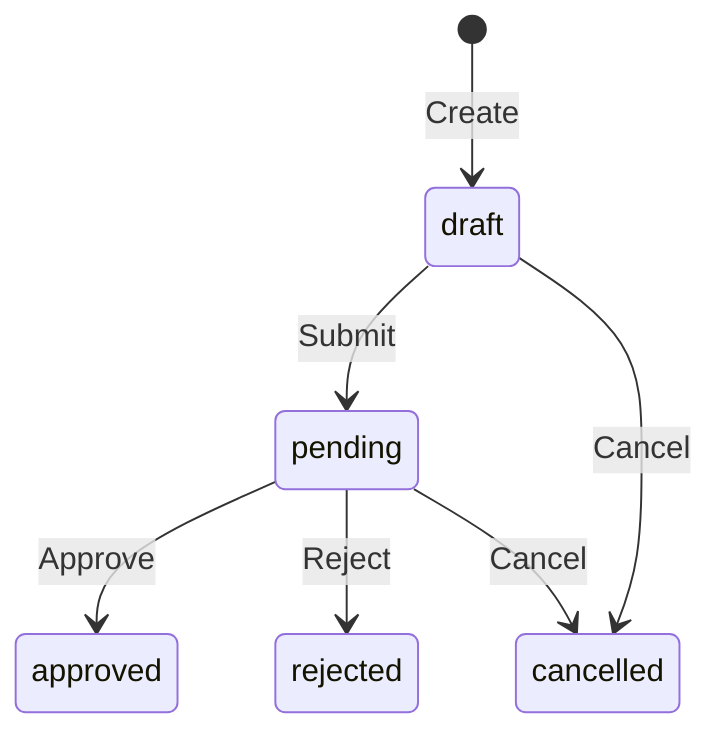
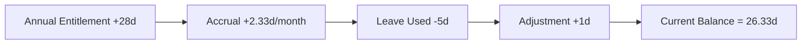
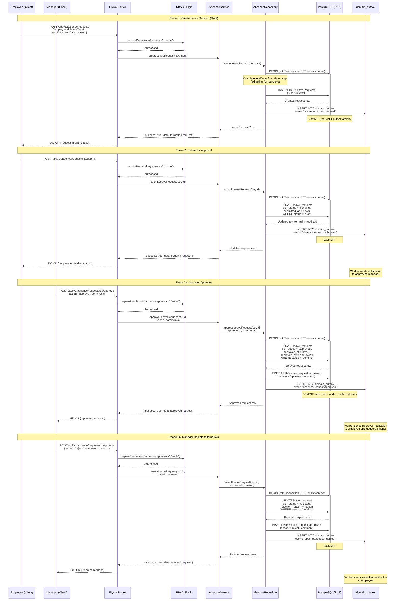

# Absence Management

## Overview

The Absence Management feature handles all aspects of employee leave within Staffora. It covers leave type configuration, leave policies with statutory minimums, leave balance tracking using an immutable ledger pattern, the full leave request lifecycle from draft through approval, accrual processing, carryover rules, and the Bradford Factor calculation for absence monitoring. The module is designed for UK statutory compliance, ensuring that leave entitlements meet or exceed the statutory minimum of 5.6 weeks (28 days for full-time employees) under the Working Time Regulations 1998.

## Key Workflows

### Leave Request Lifecycle

Leave requests follow a state machine that ensures proper approval before leave is recorded against an employee's balance.

**Draft** -- The employee creates a leave request specifying the leave type, date range, and any notes. The request is saved but not yet submitted for approval.

**Submit** -- The employee submits the request, moving it to `pending` status. This triggers a notification to the approving manager.

**Approve / Reject** -- The manager reviews the request and either approves or rejects it with optional comments. Approved requests deduct from the employee's leave balance.

**Cancel** -- The employee can cancel a request while it is in `draft` or `pending` status. Cancelling an approved request may require manager approval (configurable by policy).

### Leave Balance Ledger

Balances are tracked using an immutable ledger pattern. Each transaction (entitlement, accrual, usage, adjustment, carryover) is recorded as a separate ledger entry. The current balance is always derived by summing all ledger entries for the employee and leave type within the leave year.

This approach provides a complete audit trail and makes balance disputes easy to investigate.

### Leave Policy Configuration

Leave policies define the rules for each leave type per employee group:

- **Entitlement**: Annual allowance (must be >= statutory minimum for annual leave)
- **Accrual method**: Annual grant, monthly accrual, or hourly accrual
- **Carryover**: Maximum days that can be carried into the next leave year
- **Waiting period**: Days of service before entitlement begins
- **Pro-rata**: Automatic calculation for part-time employees or mid-year starters

### Bradford Factor

The system calculates the Bradford Factor score for each employee, which measures the impact of short, frequent absences. The formula is S x S x D, where S is the number of absence spells and D is the total days absent in the rolling period. This helps HR teams identify patterns that may require intervention.

## User Stories

- As an HR administrator, I want to configure leave types (annual leave, sick leave, compassionate leave, etc.) so that employees can request the correct type of absence.
- As an HR administrator, I want to set leave policies with statutory minimums so that the organisation is compliant with UK employment law.
- As an employee, I want to submit a leave request so that my manager can approve my time off.
- As a manager, I want to approve or reject leave requests so that team capacity is managed.
- As an employee, I want to view my leave balances so that I know how much leave I have remaining.
- As an HR administrator, I want to view Bradford Factor scores so that I can identify problematic absence patterns.
- As an HR administrator, I want to configure carryover rules so that unused leave is handled according to company policy.

## Related Modules

| Module | Description |
|--------|-------------|
| `absence` | Core leave types, policies, requests, balances, and Bradford Factor |
| `toil` | Time Off In Lieu balance and usage (linked to overtime) |
| `statutory-leave` | UK statutory leave entitlements and calculations |
| `family-leave` | Maternity, paternity, adoption, and shared parental leave |
| `parental-leave` | Unpaid parental leave (18 weeks per child under ERA 1996) |
| `bereavement` | Bereavement leave including Jack's Law (parental bereavement) |
| `carers-leave` | Carer's Leave Act 2023 compliance |
| `ssp` | Statutory Sick Pay calculation and management |
| `sickness-analytics` | Absence pattern analysis and reporting |
| `return-to-work` | Return-to-work interview management |
| `bank-holidays` | UK bank holiday calendar management |

## Related API Endpoints

All endpoints are prefixed with `/api/v1/absence`.

| Method | Path | Description |
|--------|------|-------------|
| GET | `/absence/leave-types` | List leave types |
| POST | `/absence/leave-types` | Create leave type |
| GET | `/absence/leave-types/:id` | Get leave type by ID |
| PUT | `/absence/leave-types/:id` | Update leave type |
| DELETE | `/absence/leave-types/:id` | Deactivate leave type |
| GET | `/absence/policies` | List leave policies |
| POST | `/absence/policies` | Create leave policy |
| PUT | `/absence/policies/:id` | Update leave policy |
| DELETE | `/absence/policies/:id` | Deactivate leave policy |
| GET | `/absence/requests` | List leave requests (filterable, paginated) |
| POST | `/absence/requests` | Create leave request |
| GET | `/absence/requests/:id` | Get leave request by ID |
| POST | `/absence/requests/:id/submit` | Submit leave request |
| POST | `/absence/requests/:id/approve` | Approve or reject leave request |
| DELETE | `/absence/requests/:id` | Cancel leave request |
| GET | `/absence/balances/:employeeId` | Get employee leave balances |
| GET | `/absence/bradford-factor/:employeeId` | Get Bradford Factor score |

See the [API Reference](../04-api/README.md) for full request/response schemas.

---

## Sequence Diagrams

### Leave Request Submission and Approval Flow

This diagram traces the full leave request lifecycle from creation through submission, approval (or rejection), and the domain events emitted at each stage. Based on `packages/api/src/modules/absence/service.ts`, `routes.ts`, and `repository.ts`.

---

## Related Documents

- [Architecture Overview](../02-architecture/ARCHITECTURE.md) — System architecture, plugin chain, and request flow
- [API Reference](../04-api/api-reference.md) — Full endpoint specifications for all modules
- [State Machine Patterns](../02-architecture/state-machines.md) — Leave request lifecycle state machine
- [UK Compliance](./uk-compliance.md) — Statutory leave entitlements and Working Time Regulations
- [Worker System](../02-architecture/WORKER_SYSTEM.md) — Background jobs for accrual processing and reminders
- [Testing Guide](../08-testing/testing-guide.md) — Integration test patterns for state machines and RLS

---

Last updated: 2026-03-28
