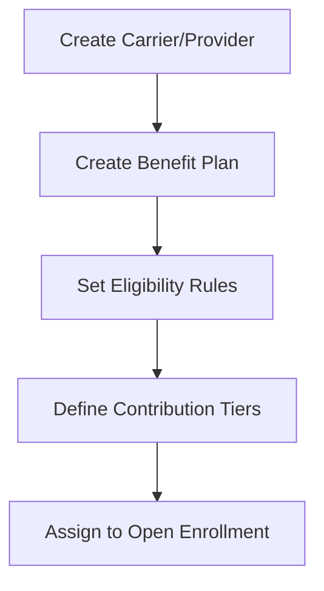
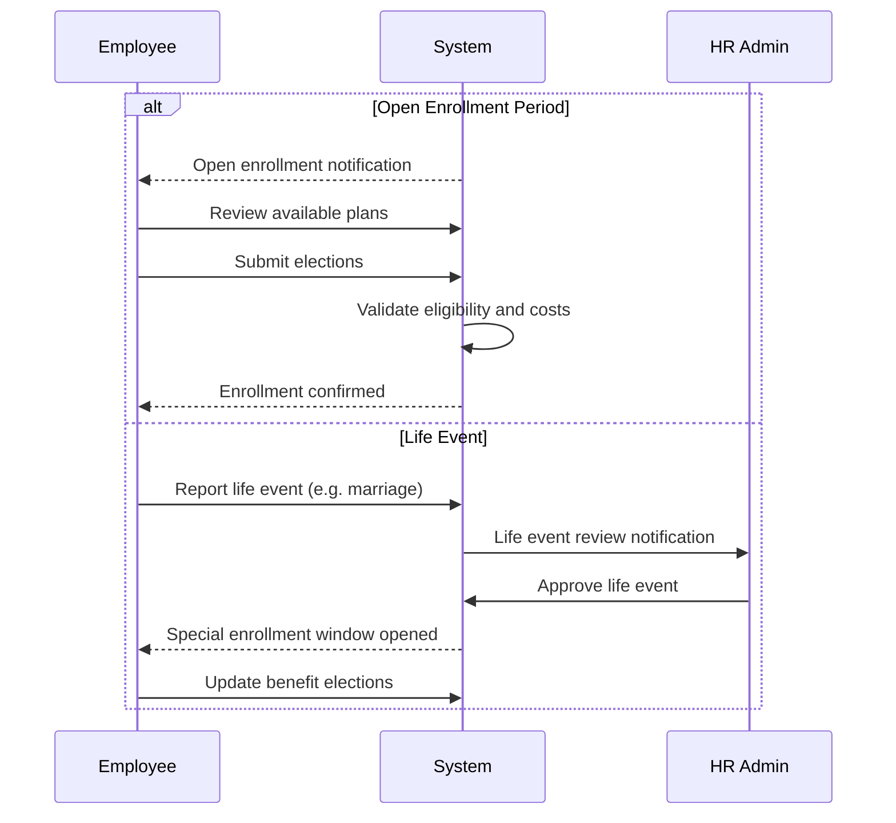

# Benefits Administration

## Overview

The Benefits Administration feature group manages the full lifecycle of employee benefit programmes within Staffora. It covers benefit plan definition, carrier/provider management, enrolment processing, dependent tracking, open enrolment windows, life event triggers (marriage, birth, etc.), flexible benefit fund allocation, company car schemes, and benefits exchange. The module is designed to support both fixed and flexible benefit programmes where employees can choose from a menu of options within their allocated budget.

## Key Workflows

### Benefit Plan Configuration

HR administrators configure benefit plans with carriers, eligibility rules, contribution rates, and coverage tiers. Plans can be grouped for open enrolment and have effective date ranges.

### Employee Enrolment

Employees can be enrolled in benefit plans through several mechanisms:

1. **Direct enrolment** -- HR enrols an employee in a specific plan
2. **Open enrolment** -- During an enrolment window, employees select from available plans
3. **Life event trigger** -- Qualifying life events (marriage, birth, etc.) open a special enrolment window

### Dependent Management

Employees can add dependents (spouse, children, domestic partners) to their benefit enrolments. Each dependent requires verification of the qualifying relationship. Dependents can be enrolled in or removed from specific plans.

### Open Enrolment Windows

Open enrolment periods are defined with start and end dates. During this window, employees can:
- Review their current enrolments
- Compare available plans
- Submit new elections
- Add or remove dependents
- Waive coverage

The system enforces the enrolment window dates and prevents changes outside the permitted period unless a qualifying life event occurs.

### Flexible Benefit Funds

Flex funds provide employees with an annual benefit budget that can be allocated across different benefit options. The system tracks:
- Annual fund allocation per employee
- Spend against available fund
- Remaining balance
- Fund expiry rules

### Enrolment Statistics

The benefits module provides aggregate statistics including:
- Total enrolments by plan and carrier
- Cost breakdown (employer vs employee contributions)
- Utilisation rates
- Dependent coverage statistics

## User Stories

- As an HR administrator, I want to configure benefit plans with carriers so that employees have access to the company's benefit offerings.
- As an HR administrator, I want to create an open enrolment period so that employees can select their benefits for the coming year.
- As an employee, I want to view and select benefit plans during open enrolment so that I choose the coverage that best suits my needs.
- As an employee, I want to add my dependents to my benefit enrolment so that my family members are covered.
- As an employee, I want to report a life event so that I can update my benefit elections outside the normal enrolment window.
- As an HR administrator, I want to review and approve life events so that special enrolment changes are properly validated.
- As an HR administrator, I want to allocate flexible benefit funds so that employees can choose how to spend their benefit budget.
- As an employee, I want to view my current enrolments and costs so that I understand my total benefits package.

## Related Modules

| Module | Description |
|--------|-------------|
| `benefits` | Carrier management, plan configuration, enrolment, dependents, open enrolment, life events, flex funds, costs, statistics |
| `benefits-exchange` | Benefit exchange marketplace (buy/sell leave, trade benefits) |
| `total-reward` | Total reward statement generation (combines pay + benefits + pension) |
| `pension` | Auto-enrolment pension management (UK compliance) |
| `salary-sacrifice` | Salary sacrifice arrangements linked to benefit plans |
| `income-protection` | Income protection and group life policies |
| `beneficiary-nominations` | Death-in-service and pension beneficiary nominations |

## Related API Endpoints

### Carriers (`/api/v1/benefits`)

| Method | Path | Description |
|--------|------|-------------|
| GET | `/benefits/carriers` | List carriers |
| POST | `/benefits/carriers` | Create carrier |
| GET | `/benefits/carriers/:id` | Get carrier |
| PUT | `/benefits/carriers/:id` | Update carrier |
| DELETE | `/benefits/carriers/:id` | Deactivate carrier |

### Plans (`/api/v1/benefits`)

| Method | Path | Description |
|--------|------|-------------|
| GET | `/benefits/plans` | List plans |
| POST | `/benefits/plans` | Create plan |
| GET | `/benefits/plans/:id` | Get plan |
| PUT | `/benefits/plans/:id` | Update plan |
| DELETE | `/benefits/plans/:id` | Deactivate plan |

### Enrolments (`/api/v1/benefits`)

| Method | Path | Description |
|--------|------|-------------|
| GET | `/benefits/enrollments` | List enrolments |
| POST | `/benefits/enrollments` | Enrol employee |
| PUT | `/benefits/enrollments/:id` | Update enrolment |
| POST | `/benefits/enrollments/:id/terminate` | Terminate enrolment |
| POST | `/benefits/enrollments/waive` | Waive coverage |
| GET | `/benefits/employees/:id/enrollments` | Employee enrolments |
| GET | `/benefits/employees/:id/costs` | Employee benefit costs |
| GET | `/benefits/employees/:id/dependents` | List dependents |
| POST | `/benefits/employees/:id/dependents` | Add dependent |
| GET | `/benefits/my-enrollments` | Self-service: my enrolments |
| GET | `/benefits/stats` | Enrolment statistics |

### Open Enrolment (`/api/v1/benefits`)

| Method | Path | Description |
|--------|------|-------------|
| GET | `/benefits/open-enrollment` | List periods |
| GET | `/benefits/open-enrollment/current` | Get current period |
| POST | `/benefits/open-enrollment` | Create period |
| POST | `/benefits/open-enrollment/:id/elections` | Submit elections |

### Life Events (`/api/v1/benefits`)

| Method | Path | Description |
|--------|------|-------------|
| GET | `/benefits/life-events` | List life events |
| POST | `/benefits/life-events` | Report life event |
| POST | `/benefits/life-events/:id/approve` | Approve/reject life event |
| GET | `/benefits/my-life-events` | Self-service: my life events |

### Flex Funds (`/api/v1/benefits`)

| Method | Path | Description |
|--------|------|-------------|
| GET | `/benefits/flex-funds` | List fund allocations |
| POST | `/benefits/flex-funds` | Create fund allocation |
| GET | `/benefits/flex-funds/:id` | Get fund details |

See the [API Reference](../04-api/README.md) for full request/response schemas.

---

## Related Documents

- [Architecture Overview](../02-architecture/ARCHITECTURE.md) — System architecture, plugin chain, and request flow
- [API Reference](../04-api/api-reference.md) — Full endpoint specifications for all modules
- [Database Schema and Migrations](../02-architecture/DATABASE.md) — Table catalog and RLS policies
- [Payroll and Finance](./payroll-finance.md) — Salary sacrifice and deduction integration
- [UK Compliance](./uk-compliance.md) — Auto-enrolment pension and statutory benefit requirements
- [Worker System](../02-architecture/WORKER_SYSTEM.md) — Background jobs for enrolment reminders and benefit calculations
- [Testing Guide](../08-testing/testing-guide.md) — Integration test patterns for RLS and effective dating

---

Last updated: 2026-03-28
