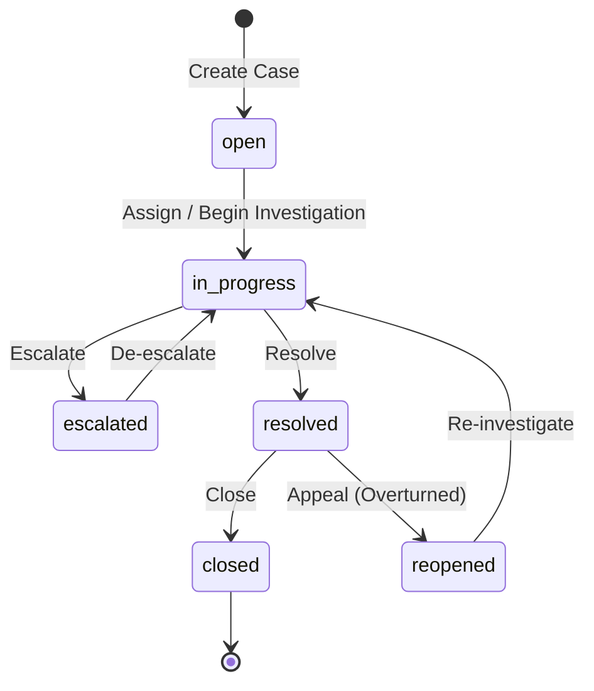
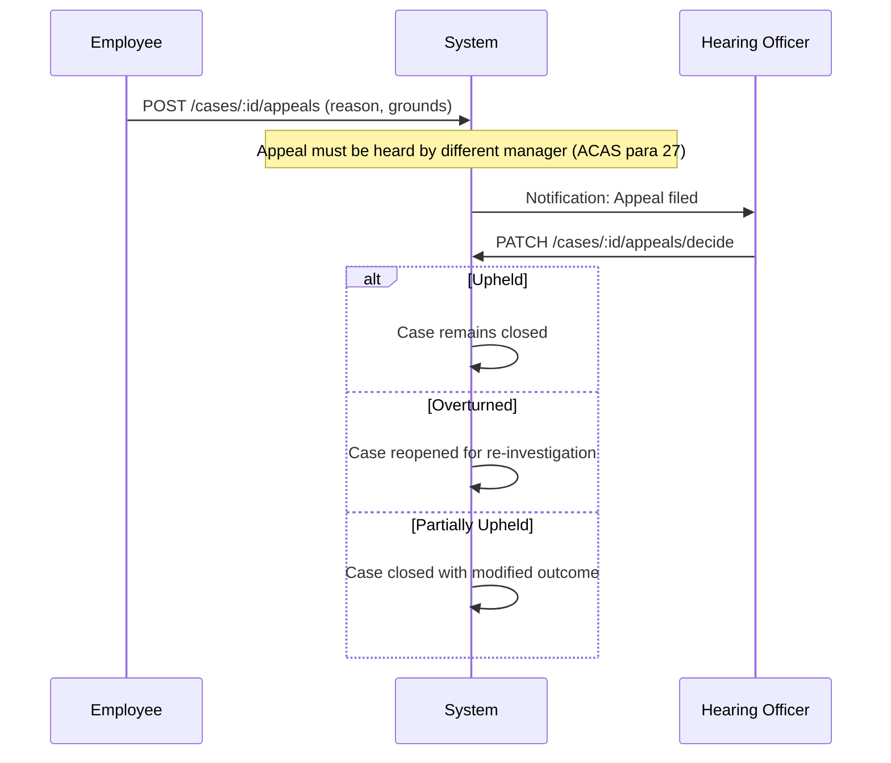
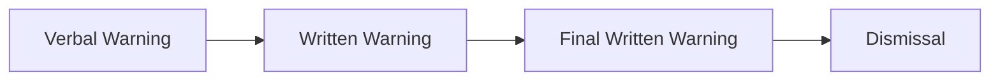
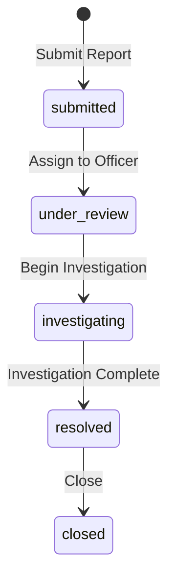

# Case Management

## Overview

The Case Management feature group in Staffora handles HR cases, disciplinary proceedings, formal hearings, employee warnings, tribunal management, whistleblowing reports, and suspensions. The system is designed for full compliance with the ACAS Code of Practice on disciplinary and grievance procedures, including the right to appeal with an independent hearing officer, and the Public Interest Disclosure Act 1998 (PIDA) for whistleblowing protections.

## Key Workflows

### Case Lifecycle

HR cases track issues from initial reporting through investigation to resolution. The case state machine enforces valid transitions and prevents bypassing required steps.

Cases include:
- **Category**: Grievance, disciplinary, harassment, performance, health and safety, etc.
- **Priority**: Low, medium, high, urgent
- **Assignee**: The HR case worker responsible
- **SLA tracking**: Target resolution times based on category and priority
- **Comments**: Internal and external case notes with timestamps

### Appeal Process (ACAS Code Compliant)

Appeals follow the ACAS Code of Practice requirements:

Key compliance requirements:
- The hearing officer MUST be a different person from the original decision maker (ACAS Code para 26-27)
- The employee has the right to be accompanied at the hearing
- Appeal decisions must include written outcome notes

### Warning Management

Employee warnings follow a progressive discipline model with escalating severity levels.

Warnings have:
- **Level**: Verbal, first written, final written
- **Expiry**: Configurable duration (e.g. 6 months for verbal, 12 months for written)
- **Appeal**: Employees can appeal warnings through the appeal process
- **Rescind**: Managers can rescind warnings with documented reasons
- **Batch expiry**: System job automatically expires warnings past their duration

### Disciplinary Hearings

Formal hearings are managed within the case management system with:
- Hearing date and location scheduling
- Panel member assignment
- Evidence and document attachment
- Outcome recording (no action, warning, dismissal, etc.)
- Minutes and notes capture

### Tribunal Management

If a case escalates to an employment tribunal, the system tracks:
- Tribunal reference numbers
- Claim type (unfair dismissal, discrimination, etc.)
- Key dates (ET1 filing, ET3 response deadline, hearing dates)
- Legal representation details
- Document bundles
- Outcomes and costs

### Whistleblowing (PIDA Compliant)

Whistleblowing reports are handled through a dedicated module with enhanced confidentiality protections.

Key features:
- **Anonymous reporting**: Reports can be submitted anonymously
- **Designated officers**: Only users with the `whistleblowing` permission can view cases
- **Audit trail**: Complete audit trail of all actions taken on each report
- **PIDA protection**: The system records that the whistleblower has protection from detriment

### Suspensions

Employee suspensions are tracked with:
- Suspension start and end dates
- Reason and authorising manager
- Pay status (with or without pay)
- Review dates
- Reinstatement recording

## User Stories

- As an HR administrator, I want to create a case so that an employee issue is formally tracked and investigated.
- As an HR administrator, I want to assign a case to a case worker so that responsibility is clear.
- As a case worker, I want to add comments to a case so that the investigation progress is documented.
- As an employee, I want to file an appeal against a disciplinary outcome so that I can exercise my right to challenge the decision.
- As an HR administrator, I want to issue a warning to an employee so that the disciplinary action is formally recorded.
- As an employee, I want to submit a whistleblowing report (optionally anonymously) so that I can raise a concern safely.
- As an HR administrator, I want to manage tribunal cases so that legal proceedings are tracked centrally.
- As a manager, I want to view my team's cases so that I am aware of any ongoing issues.

## Related Modules

| Module | Description |
|--------|-------------|
| `cases` | Core case management with lifecycle, comments, appeals (ACAS compliant) |
| `warnings` | Employee warning issuance, appeal, rescind, batch expiry |
| `tribunal` | Employment tribunal case tracking |
| `whistleblowing` | PIDA-compliant whistleblowing reports with anonymity |
| `suspensions` | Employee suspension management |
| `health-safety` | Health and safety incident reporting (may generate cases) |

## Related API Endpoints

### Cases Core (`/api/v1/cases`)

| Method | Path | Description |
|--------|------|-------------|
| GET | `/cases` | List cases (filterable by category, status, priority, assignee) |
| POST | `/cases` | Create case |
| GET | `/cases/:id` | Get case by ID |
| PATCH | `/cases/:id` | Update case (status, priority, assignee, resolution) |
| GET | `/cases/:id/comments` | List case comments |
| POST | `/cases/:id/comments` | Add comment (internal or external) |
| POST | `/cases/:id/appeals` | File appeal |
| GET | `/cases/:id/appeals` | List appeals |
| GET | `/cases/:id/appeals/latest` | Get latest appeal |
| PATCH | `/cases/:id/appeals/decide` | Decide appeal outcome |
| GET | `/cases/my-cases` | Get cases for current user |

### Warnings (`/api/v1/warnings`)

| Method | Path | Description |
|--------|------|-------------|
| GET | `/warnings/employee/:employeeId` | List employee warnings |
| GET | `/warnings/:id` | Get warning |
| GET | `/warnings/employee/:employeeId/active` | Get active warnings |
| POST | `/warnings` | Issue warning |
| POST | `/warnings/:id/appeal` | Submit appeal |
| PATCH | `/warnings/:id/appeal/resolve` | Resolve appeal |
| PATCH | `/warnings/:id/rescind` | Rescind warning |
| POST | `/warnings/batch-expire` | Batch expire warnings |

### Whistleblowing (`/api/v1/whistleblowing`)

| Method | Path | Description |
|--------|------|-------------|
| POST | `/whistleblowing/reports` | Submit report (supports anonymous) |
| GET | `/whistleblowing/reports` | List cases (officers only) |
| GET | `/whistleblowing/reports/:id` | Get case detail |
| PATCH | `/whistleblowing/reports/:id` | Update case |
| GET | `/whistleblowing/reports/:id/audit` | Get audit trail |

See the [API Reference](../04-api/README.md) for full request/response schemas.

---

## Related Documents

- [Architecture Overview](../02-architecture/ARCHITECTURE.md) — System architecture, plugin chain, and request flow
- [API Reference](../04-api/api-reference.md) — Full endpoint specifications for all modules
- [State Machine Patterns](../02-architecture/state-machines.md) — Case lifecycle state machine definition
- [Database Schema and Migrations](../02-architecture/DATABASE.md) — Table catalog and RLS policies
- [UK Compliance](./uk-compliance.md) — ACAS Code of Practice, whistleblowing protections, and tribunal procedures
- [Worker System](../02-architecture/WORKER_SYSTEM.md) — Background jobs for SLA reminders and escalation triggers
- [Testing Guide](../08-testing/testing-guide.md) — Integration test patterns for state machines and RLS

---

Last updated: 2026-03-28
