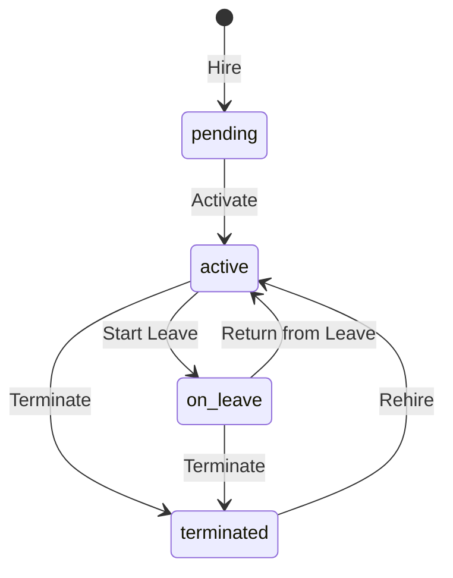
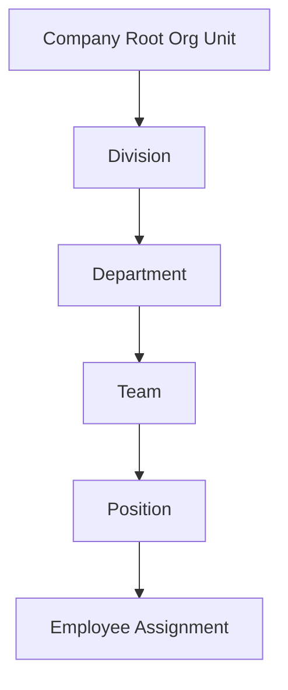
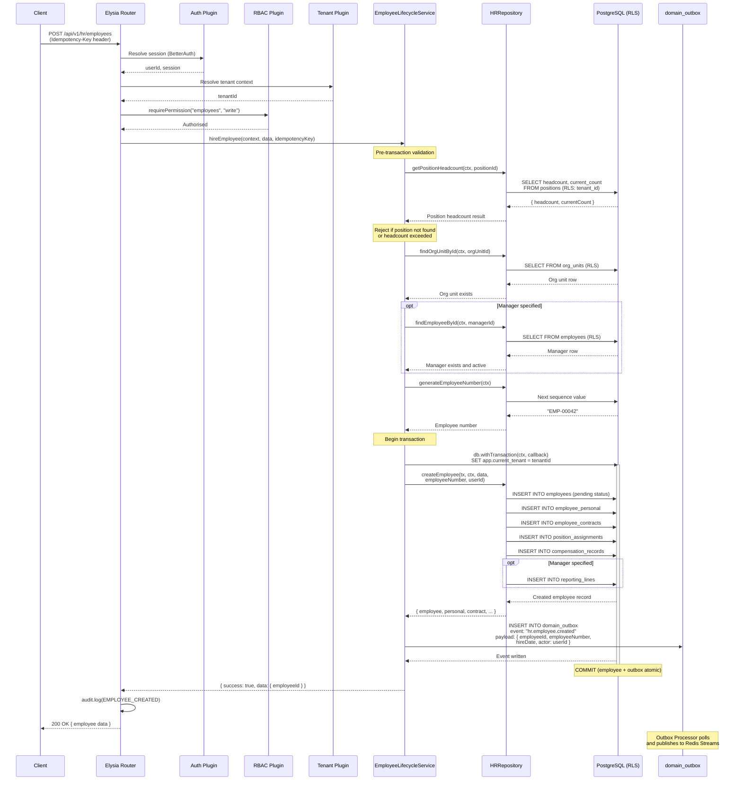

# Core HR

## Overview

Core HR is the foundational module of the Staffora HRIS platform. It manages the full employee lifecycle from hire to termination, organisational structure (org units, positions, and reporting hierarchies), compensation history, address management, and the interactive org chart. All employee data changes are effective-dated, meaning historical records are preserved immutably with `effective_from` / `effective_to` date ranges, enabling point-in-time queries and a complete audit trail.

## Key Workflows

### Employee Lifecycle

Every employee record follows a state machine that governs permitted status transitions. The platform enforces these transitions at the service layer and records each change to the domain outbox for downstream processing.

**Hire** -- An HR administrator creates a new employee record with personal details, contract information, position assignment, and compensation. The employee starts in `pending` status until all onboarding prerequisites are satisfied.

**Activate** -- Once onboarding is complete, the employee transitions to `active`. This is the normal working state.

**Leave / Return** -- Employees can move between `active` and `on_leave` as needed (e.g. maternity leave, long-term sickness). The transition is bidirectional.

**Terminate** -- When an employee leaves the organisation, they are moved to `terminated` status. Termination captures the reason, termination date, and triggers statutory notice period calculation under UK employment law.

**Rehire** -- A terminated employee can be rehired, creating a new employment record while preserving the historical record chain.

### Organisational Structure Management

Org units form a hierarchical tree. Each org unit can have a parent, creating divisions, departments, and teams. Positions are defined within org units and have attributes such as title, grade, headcount, and salary range. Employees are assigned to positions with effective dating to track transfers and promotions over time.

### Compensation Change

Compensation changes are effective-dated records that capture salary, currency, pay frequency, and reason for change. The system validates that no overlapping compensation records exist for the same employee and dimension.

### Concurrent Employment (Multi-Position)

Staffora supports employees holding multiple position assignments simultaneously, each with its own FTE allocation. The system enforces a maximum total FTE limit across all active assignments.

## User Stories

- As an HR administrator, I want to hire a new employee so that their record is created in the system with all required personal and contract details.
- As an HR administrator, I want to transfer an employee to a different department so that their position assignment reflects the organisational change with proper effective dating.
- As an HR administrator, I want to terminate an employee so that their status is updated, access is revoked, and the statutory notice period is calculated.
- As an HR administrator, I want to view the org chart so that I can understand the reporting hierarchy across the organisation.
- As an HR administrator, I want to change an employee's compensation so that the salary adjustment is recorded with an effective date and audit trail.
- As an HR administrator, I want to view an employee's full history across all dimensions (position, compensation, manager, contract) for compliance and audit purposes.
- As a manager, I want to see my direct reports and their reporting chain.
- As an HR administrator, I want to rehire a former employee while preserving their historical employment records.

## Related Modules

| Module | Description |
|--------|-------------|
| `hr` | Core employee, org unit, and position management (includes address sub-module) |
| `contract-amendments` | Formal contract change tracking |
| `contract-statements` | Written statement of employment particulars (UK s.1 ERA 1996) |
| `personal-detail-changes` | Self-service personal detail update requests |
| `emergency-contacts` | Emergency contact management per employee |
| `employee-photos` | Employee photo upload and management |
| `bank-details` | Employee bank account details for payroll |
| `probation` | Probation period management and reviews |
| `succession` | Succession planning linked to positions |

## Related API Endpoints

All endpoints are prefixed with `/api/v1/hr`.

| Method | Path | Description |
|--------|------|-------------|
| GET | `/hr/stats` | Dashboard statistics |
| GET | `/hr/org-units` | List org units |
| GET | `/hr/org-units/hierarchy` | Get org unit hierarchy tree |
| POST | `/hr/org-units` | Create org unit |
| PUT | `/hr/org-units/:id` | Update org unit |
| DELETE | `/hr/org-units/:id` | Delete org unit |
| GET | `/hr/positions` | List positions |
| POST | `/hr/positions` | Create position |
| PUT | `/hr/positions/:id` | Update position |
| DELETE | `/hr/positions/:id` | Delete position |
| GET | `/hr/employees` | List employees (filterable, paginated) |
| GET | `/hr/employees/:id` | Get employee by ID |
| GET | `/hr/employees/number/:number` | Get employee by employee number |
| POST | `/hr/employees` | Hire new employee |
| PUT | `/hr/employees/:id/personal` | Update personal details |
| PUT | `/hr/employees/:id/contract` | Update contract details |
| POST | `/hr/employees/:id/transfer` | Transfer employee |
| POST | `/hr/employees/:id/promote` | Promote employee |
| POST | `/hr/employees/:id/compensation` | Change compensation |
| POST | `/hr/employees/:id/manager` | Change manager |
| POST | `/hr/employees/:id/status` | Transition employee status |
| POST | `/hr/employees/:id/terminate` | Terminate employee |
| POST | `/hr/employees/:id/rehire` | Rehire terminated employee |
| PUT | `/hr/employees/:id/ni-category` | Update NI category |
| GET | `/hr/employees/:id/statutory-notice` | Get statutory notice period |
| GET | `/hr/employees/:id/history/:dimension` | Get employee history by dimension |
| GET | `/hr/employees/:id/positions` | List concurrent position assignments |
| POST | `/hr/employees/:id/positions` | Assign additional position |
| DELETE | `/hr/employees/:id/positions/:assignmentId` | End position assignment |
| GET | `/hr/org-chart` | Get org chart |
| GET | `/hr/employees/:id/direct-reports` | Get direct reports |
| GET | `/hr/employees/:id/reporting-chain` | Get reporting chain |
| GET/POST/PUT | `/hr/employees/:id/addresses` | Address management (effective-dated) |

See the [API Reference](../04-api/README.md) for full request/response schemas.

---

## Sequence Diagrams

### Employee Hire Flow

This diagram traces the full employee hire flow through the system, from the client request through authentication, authorization, validation, database writes, and domain event emission. Based on `packages/api/src/modules/hr/employee-lifecycle.service.ts` and `routes.ts`.

---

## Related Documents

- [Architecture Overview](../02-architecture/ARCHITECTURE.md) — System architecture, plugin chain, and request flow
- [Database Schema and Migrations](../02-architecture/DATABASE.md) — Table catalog, RLS policies, and migration conventions
- [API Reference](../04-api/api-reference.md) — Full endpoint specifications for all modules
- [Effective Dating Patterns](../05-development/coding-patterns.md) — How time-versioned employee records work
- [State Machine Patterns](../02-architecture/state-machines.md) — Employee lifecycle state machine definition
- [Testing Guide](../08-testing/testing-guide.md) — Integration test patterns including RLS and effective dating

---

Last updated: 2026-03-28
