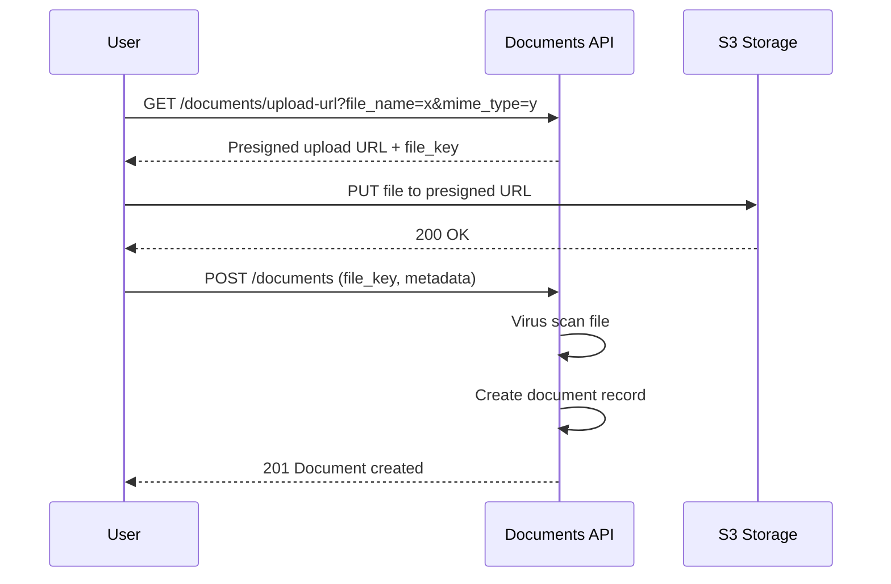
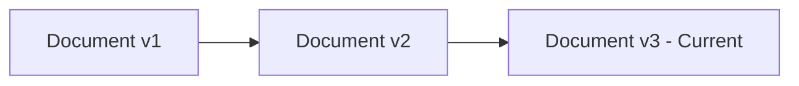
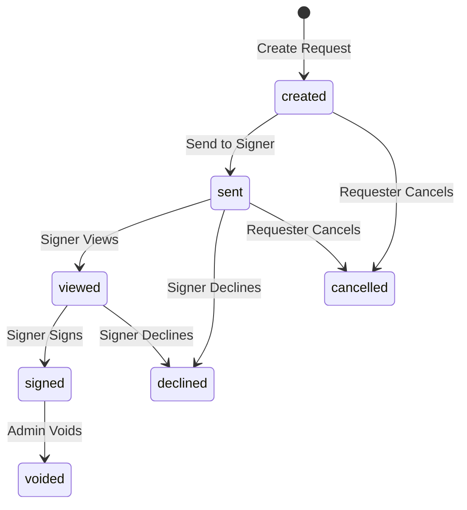
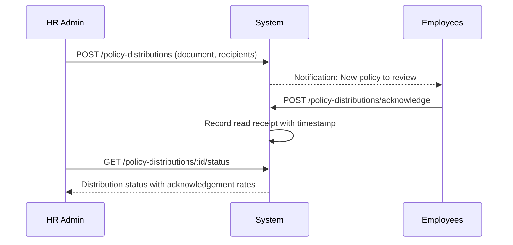

# Document Management

## Overview

The Document Management feature group in Staffora provides secure document storage, versioning, template management, bulk document generation, electronic signatures, and policy distribution with acknowledgement tracking. Documents are stored in S3-compatible object storage with presigned URLs for secure upload and download. The system supports virus scanning on upload, document expiry tracking, and a full version history for every document.

## Key Workflows

### Document Upload and Storage

Documents follow a two-step upload process using presigned URLs to keep file content out of the API layer.

### Document Versioning

Documents support multiple versions. When a new version is uploaded, the previous version is preserved. Users can list all versions and download any historical version.

### Template Management

Document templates define reusable formats for common HR documents (contracts, offer letters, warning letters, etc.). Templates can be categorised by document type, searched by name, and marked as active or default.

### Bulk Document Generation

The bulk document generation module allows HR administrators to generate documents for multiple employees simultaneously using a template. This is useful for mass letter distribution (e.g. annual pay review letters, policy updates).

### E-Signatures

The e-signature module provides a complete digital signing workflow.

Internal signing captures the signer's IP address and timestamp as proof of agreement. The system maintains a full audit trail of all signature events (created, sent, viewed, signed, declined, cancelled, voided, reminded).

### Policy Distribution and Acknowledgement

HR can distribute policy documents to groups of employees and track read receipts.

### Self-Service Document Portal

Employees can view their own documents through the self-service portal, which provides:
- Total document count by category
- Recently added documents
- Documents approaching expiry
- Download access via presigned URLs

## User Stories

- As an HR administrator, I want to upload employee documents so that they are securely stored and accessible.
- As an HR administrator, I want to upload a new version of a document so that the latest version is available while history is preserved.
- As an HR administrator, I want to create document templates so that common documents can be generated consistently.
- As an HR administrator, I want to generate documents in bulk so that I can efficiently distribute letters to multiple employees.
- As an HR administrator, I want to send a document for e-signature so that employees can sign digitally without printing.
- As an employee, I want to sign a document electronically so that I can acknowledge receipt without physical paperwork.
- As an HR administrator, I want to distribute a policy and track acknowledgements so that I have evidence of employee awareness.
- As an employee, I want to view my documents in the self-service portal so that I can access my contracts and letters.
- As an HR administrator, I want to be alerted about expiring documents so that renewals are processed on time.

## Related Modules

| Module | Description |
|--------|-------------|
| `documents` | Core document CRUD, versioning, upload/download URLs, expiry tracking, templates, self-service portal |
| `letter-templates` | Letter template management and letter generation from templates |
| `bulk-document-generation` | Bulk document generation for multiple employees |
| `e-signatures` | E-signature request creation, signing, declining, voiding, reminders, audit trail |
| `policy-distribution` | Policy document distribution and read receipt/acknowledgement tracking |

## Related API Endpoints

### Documents Core (`/api/v1/documents`)

| Method | Path | Description |
|--------|------|-------------|
| GET | `/documents` | List documents (filterable, paginated) |
| GET | `/documents/expiring` | Get expiring documents |
| GET | `/documents/upload-url` | Get presigned upload URL |
| GET | `/documents/templates` | List document templates |
| POST | `/documents/templates` | Create template |
| PUT | `/documents/templates/:id` | Update template |
| GET | `/documents/:id` | Get document by ID |
| GET | `/documents/:id/download-url` | Get presigned download URL |
| POST | `/documents` | Create document record |
| PUT | `/documents/:id` | Update document metadata |
| DELETE | `/documents/:id` | Archive document |
| GET | `/documents/:id/versions` | List document versions |
| POST | `/documents/:id/versions` | Upload new version |
| GET | `/documents/my-summary` | Self-service document summary |

### Letter Templates (`/api/v1/letter-templates`)

| Method | Path | Description |
|--------|------|-------------|
| GET | `/letter-templates` | List letter templates |
| POST | `/letter-templates` | Create letter template |
| GET | `/letter-templates/:id` | Get template |
| PUT | `/letter-templates/:id` | Update template |
| POST | `/letter-templates/:id/generate` | Generate letter from template |
| GET | `/letter-templates/generated` | List generated letters |

### E-Signatures (`/api/v1/e-signatures`)

| Method | Path | Description |
|--------|------|-------------|
| GET | `/e-signatures` | List signature requests |
| POST | `/e-signatures` | Create signature request |
| GET | `/e-signatures/:id` | Get signature request |
| GET | `/e-signatures/:id/events` | Get audit trail |
| POST | `/e-signatures/:id/send` | Send to signer |
| POST | `/e-signatures/:id/view` | Mark as viewed |
| POST | `/e-signatures/:id/sign` | Sign document |
| POST | `/e-signatures/:id/decline` | Decline signing |
| POST | `/e-signatures/:id/cancel` | Cancel request |
| POST | `/e-signatures/:id/void` | Void signed document |
| POST | `/e-signatures/:id/remind` | Send reminder |

### Policy Distribution (`/api/v1/policy-distributions`)

| Method | Path | Description |
|--------|------|-------------|
| POST | `/policy-distributions` | Distribute policy |
| GET | `/policy-distributions` | List distributions |
| GET | `/policy-distributions/:id/status` | Get status with acknowledgements |
| POST | `/policy-distributions/acknowledge` | Acknowledge distribution |

See the [API Reference](../04-api/README.md) for full request/response schemas.

---

## Related Documents

- [Architecture Overview](../02-architecture/ARCHITECTURE.md) — System architecture, plugin chain, and request flow
- [API Reference](../04-api/api-reference.md) — Full endpoint specifications for all modules
- [Database Schema and Migrations](../02-architecture/DATABASE.md) — Table catalog and RLS policies
- [Integrations](../09-integrations/README.md) — S3 object storage integration for document files
- [Worker System](../02-architecture/WORKER_SYSTEM.md) — Background jobs for PDF generation and bulk document processing
- [Data Protection](../07-security/data-protection.md) — GDPR data retention and document handling obligations
- [Testing Guide](../08-testing/testing-guide.md) — Integration test patterns for RLS and idempotency

---

Last updated: 2026-03-28
