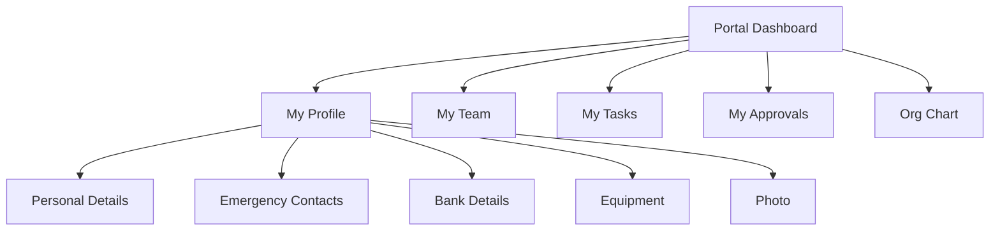
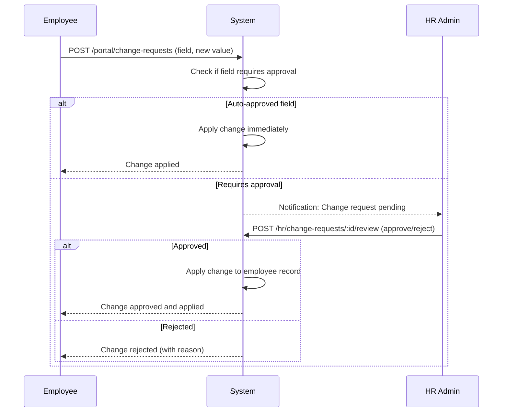

# Employee Self-Service

## Overview

The Employee Self-Service feature group in Staffora provides employees with a self-service portal for managing their personal information, submitting change requests, viewing their team, accessing pending tasks and approvals, managing emergency contacts, updating bank details, tracking assigned equipment, uploading photos, and navigating the org chart. Managers also use the portal to review and approve change requests from their direct reports. The portal is the primary interface for day-to-day employee interactions with the HRIS.

## Key Workflows

### Self-Service Portal Dashboard

The portal aggregates information from across the platform into a unified employee experience.

**My Profile** (`/portal/me`) -- Returns the employee's full profile including personal details, current position, department, manager, and employment status.

**My Team** (`/portal/my-team`) -- Lists the employee's direct reports (if a manager) with basic profile information.

**My Tasks** (`/portal/tasks`) -- Aggregates pending tasks across all modules (onboarding tasks, document acknowledgements, training completions, etc.).

**My Approvals** (`/portal/approvals`) -- Lists items awaiting the employee's approval (leave requests, timesheet approvals, change requests, etc.).

**Org Chart** (`/portal/org-chart`) -- Interactive organisational chart showing reporting hierarchies.

### Personal Detail Change Requests

Employees can request changes to their personal details through a self-service workflow. Changes to sensitive fields (e.g. bank details, name) require HR approval before being applied.

The system supports bulk change requests for efficiency (e.g. updating multiple personal fields at once). Each request captures:
- **Field category**: Personal, address, contact, financial, etc.
- **Field name**: The specific field being changed
- **Old value**: Current value for audit purposes
- **New value**: Requested new value
- **Requires approval**: Determined by field sensitivity configuration

### Emergency Contact Management

Employees can add, update, and remove emergency contacts with:
- Contact name and relationship
- Phone numbers (primary and secondary)
- Email address
- Priority ordering

### Bank Detail Management

Employees can update their bank details through the self-service portal. Bank detail changes always require HR approval due to their financial sensitivity. The system stores:
- Account holder name
- Sort code
- Account number
- Building society reference (if applicable)

### Equipment Tracking

IT and facilities equipment assigned to employees is tracked in the system:
- Asset type (laptop, mobile phone, access card, etc.)
- Serial number and asset tag
- Issue date and return date
- Condition status

### Employee Photo Management

Employees can upload and manage their profile photo. Photos are stored in S3 with presigned URLs and are used in the org chart, directory, and profile views.

## User Stories

- As an employee, I want to view my profile so that I can see my current employment details.
- As an employee, I want to request a change to my personal details so that my records are kept up to date.
- As an HR administrator, I want to review and approve change requests so that sensitive field changes are properly authorised.
- As an employee, I want to manage my emergency contacts so that the company can reach someone in an emergency.
- As an employee, I want to update my bank details so that my salary is paid to the correct account.
- As a manager, I want to view my team members so that I can see their details and current status.
- As an employee, I want to see my pending tasks and approvals in one place so that I do not miss anything.
- As an employee, I want to navigate the org chart so that I can understand the organisational structure.
- As an employee, I want to upload my photo so that colleagues can identify me.

## Related Modules

| Module | Description |
|--------|-------------|
| `portal` | Self-service portal aggregation (profile, team, tasks, approvals, org chart) |
| `employee-change-requests` | Personal detail change request workflow with approval routing |
| `personal-detail-changes` | Direct personal detail change tracking |
| `emergency-contacts` | Emergency contact CRUD for employees |
| `bank-details` | Employee bank account management |
| `equipment` | IT and facilities equipment tracking per employee |
| `employee-photos` | Employee photo upload and management |
| `delegations` | Approval delegation when manager is absent |

## Related API Endpoints

### Portal (`/api/v1/portal`)

| Method | Path | Description |
|--------|------|-------------|
| GET | `/portal/me` | Get my profile and dashboard |
| GET | `/portal/my-team` | Get my direct reports |
| GET | `/portal/tasks` | Get my pending tasks |
| GET | `/portal/approvals` | Get items awaiting my approval |
| GET | `/portal/org-chart` | Get org chart data |
| GET | `/portal/org-chart/team/:id` | Get team view for a specific manager |

### Change Requests -- Employee View (`/api/v1/portal`)

| Method | Path | Description |
|--------|------|-------------|
| POST | `/portal/change-requests` | Submit change request |
| POST | `/portal/change-requests/bulk` | Submit bulk change requests |
| GET | `/portal/change-requests` | List my change requests |
| DELETE | `/portal/change-requests/:id` | Cancel pending change request |

### Change Requests -- HR View (`/api/v1/hr`)

| Method | Path | Description |
|--------|------|-------------|
| GET | `/hr/change-requests` | List pending change requests |
| POST | `/hr/change-requests/:id/review` | Approve or reject |

### Emergency Contacts (`/api/v1/emergency-contacts`)

| Method | Path | Description |
|--------|------|-------------|
| GET | `/emergency-contacts/employee/:employeeId` | List contacts |
| POST | `/emergency-contacts` | Add contact |
| PUT | `/emergency-contacts/:id` | Update contact |
| DELETE | `/emergency-contacts/:id` | Remove contact |

### Bank Details (`/api/v1/bank-details`)

| Method | Path | Description |
|--------|------|-------------|
| GET | `/bank-details/employee/:employeeId` | Get bank details |
| POST | `/bank-details` | Create/update bank details |

### Equipment (`/api/v1/equipment`)

| Method | Path | Description |
|--------|------|-------------|
| GET | `/equipment/employee/:employeeId` | List assigned equipment |
| POST | `/equipment` | Assign equipment |
| PATCH | `/equipment/:id` | Update equipment record |
| DELETE | `/equipment/:id` | Return/remove equipment |

### Employee Photos (`/api/v1/employee-photos`)

| Method | Path | Description |
|--------|------|-------------|
| GET | `/employee-photos/:employeeId` | Get photo |
| POST | `/employee-photos/:employeeId` | Upload photo |
| DELETE | `/employee-photos/:employeeId` | Remove photo |

See the [API Reference](../04-api/README.md) for full request/response schemas.

---

## Related Documents

- [Architecture Overview](../02-architecture/ARCHITECTURE.md) — System architecture, plugin chain, and request flow
- [API Reference](../04-api/api-reference.md) — Full endpoint specifications for all modules
- [Frontend Development](../05-development/frontend-development.md) — React Router routes, components, and permission guards
- [Authorization](../07-security/authorization.md) — RBAC, portal access control, and manager hierarchy
- [Authentication](../07-security/authentication.md) — Session management and MFA for self-service access
- [Core HR](./core-hr.md) — Employee data model and org chart that the portal exposes
- [Testing Guide](../08-testing/testing-guide.md) — Integration test patterns for RLS and permission checks

---

Last updated: 2026-03-28
