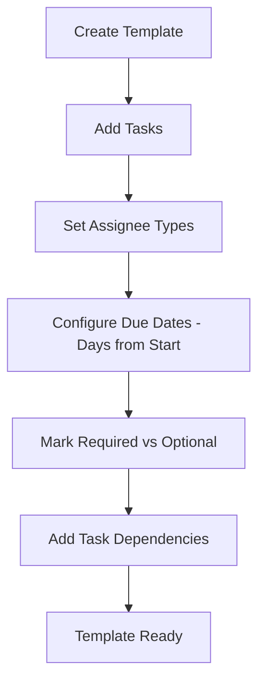
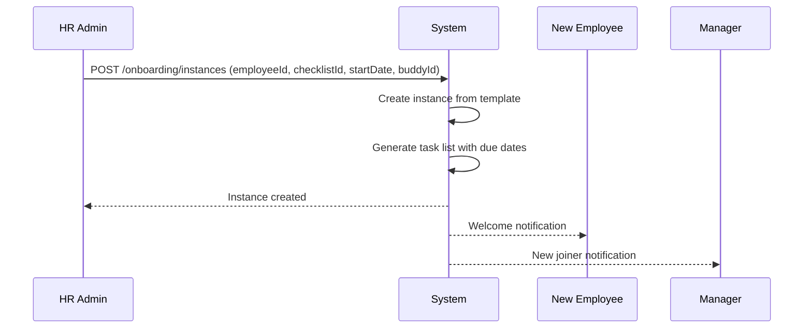
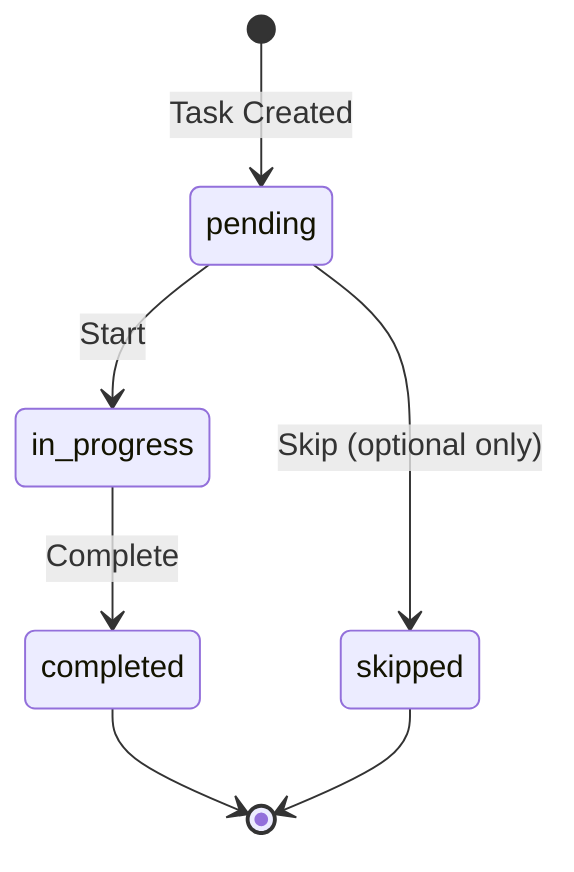

# Onboarding

## Overview

The Onboarding feature in Staffora manages the structured process of integrating new employees into the organisation. It provides configurable onboarding templates (checklists) with tasks, task assignment by role (HR, manager, IT, employee), progress tracking, compliance check management (right to work, DBS, references, medical, qualifications), task dependencies to enforce completion order, and a self-service view for new joiners to track their own onboarding progress. The module supports buddy assignment and department/position-specific template selection.

## Key Workflows

### Onboarding Template Setup

HR administrators create onboarding templates that define the standard set of tasks for new employees. Templates can be tailored by department and position.

Each task in a template includes:
- **Name and description**: What needs to be done
- **Assignee type**: Who is responsible (HR, manager, IT, employee, buddy)
- **Days from start**: When the task should be completed relative to the start date
- **Required flag**: Whether the task must be completed before onboarding can be finalised
- **Dependencies**: Tasks that must be completed first

### Starting Employee Onboarding

When a new employee joins, HR initiates their onboarding by selecting a template and setting the start date. The system creates an onboarding instance with all tasks from the template.

### Task Completion

Tasks are completed individually. The system enforces:
- **Dependencies**: A task cannot be marked complete if its prerequisite tasks are still pending
- **Required tasks**: All required tasks must be completed before the onboarding instance can be closed
- **Compliance checks**: Outstanding compliance checks block onboarding completion

### Compliance Checks

Onboarding instances can have compliance checks attached that must be cleared before the employee can start work. These include:

| Check Type | Description |
|------------|-------------|
| `right_to_work` | UK right to work verification (Immigration, Asylum and Nationality Act 2006) |
| `dbs` | Disclosure and Barring Service criminal record check |
| `references` | Employment reference verification |
| `medical` | Pre-employment medical assessment |
| `qualifications` | Professional qualification verification |

Each compliance check progresses through statuses: `pending` -> `in_progress` -> `passed` / `failed` / `waived`. Waiving a check requires a documented reason.

### Self-Service Onboarding View

New employees can view their onboarding progress through the self-service portal, seeing:
- Their assigned tasks and due dates
- Completed vs pending tasks
- Outstanding compliance checks
- Their assigned buddy

## User Stories

- As an HR administrator, I want to create onboarding templates so that the new joiner process is standardised.
- As an HR administrator, I want to start onboarding for a new employee so that they have a clear set of tasks to complete.
- As a manager, I want to track my new team member's onboarding progress so that I know what tasks are outstanding.
- As a new employee, I want to view my onboarding checklist so that I know what I need to complete.
- As an HR administrator, I want to set task dependencies so that tasks are completed in the correct order.
- As an HR administrator, I want to manage compliance checks so that pre-employment requirements are met before the employee starts work.
- As an HR administrator, I want to assign an onboarding buddy so that the new employee has a peer contact.

## Related Modules

| Module | Description |
|--------|-------------|
| `onboarding` | Templates, instances, task management, compliance checks, dependencies, self-service view |
| `right-to-work` | UK right to work verification (linked as compliance check) |
| `dbs-checks` | DBS check requests and results (linked as compliance check) |
| `reference-checks` | Employment reference verification (linked as compliance check) |
| `equipment` | IT equipment provisioning for new starters |

## Related API Endpoints

All endpoints are prefixed with `/api/v1/onboarding`.

### Templates (Checklists)

| Method | Path | Description |
|--------|------|-------------|
| GET | `/onboarding/checklists` | List onboarding templates |
| POST | `/onboarding/checklists` | Create template with tasks |
| PATCH | `/onboarding/checklists/:id` | Update template |

### Instances

| Method | Path | Description |
|--------|------|-------------|
| GET | `/onboarding/instances` | List onboarding instances (filterable) |
| POST | `/onboarding/instances` | Start onboarding for employee |
| GET | `/onboarding/instances/:id` | Get instance with tasks |
| POST | `/onboarding/instances/:id/tasks/:taskId/complete` | Complete a task |
| GET | `/onboarding/my-onboarding` | Self-service: my onboarding |

### Compliance Checks

| Method | Path | Description |
|--------|------|-------------|
| GET | `/onboarding/instances/:id/compliance-checks` | List compliance checks |
| POST | `/onboarding/instances/:id/compliance-checks` | Create compliance check |
| PATCH | `/onboarding/instances/:id/compliance-checks/:checkId` | Update check status |

### Task Dependencies

| Method | Path | Description |
|--------|------|-------------|
| GET | `/onboarding/templates/:templateId/dependencies` | List all dependencies |
| GET | `/onboarding/tasks/:taskId/dependencies` | List task dependencies |
| POST | `/onboarding/tasks/dependencies` | Add dependency |
| DELETE | `/onboarding/tasks/:taskId/dependencies/:dependsOnTaskId` | Remove dependency |

See the [API Reference](../04-api/README.md) for full request/response schemas.

---

## Related Documents

- [Architecture Overview](../02-architecture/ARCHITECTURE.md) — System architecture, plugin chain, and request flow
- [API Reference](../04-api/api-reference.md) — Full endpoint specifications for all modules
- [Database Schema and Migrations](../02-architecture/DATABASE.md) — Table catalog and RLS policies
- [Recruitment](./recruitment.md) — Hiring workflow that feeds into onboarding
- [UK Compliance](./uk-compliance.md) — Right-to-work checks, DBS verification, and pension enrolment during onboarding
- [Worker System](../02-architecture/WORKER_SYSTEM.md) — Background jobs for task reminders and compliance check notifications
- [Testing Guide](../08-testing/testing-guide.md) — Integration test patterns for RLS and workflow testing

---

Last updated: 2026-03-28
