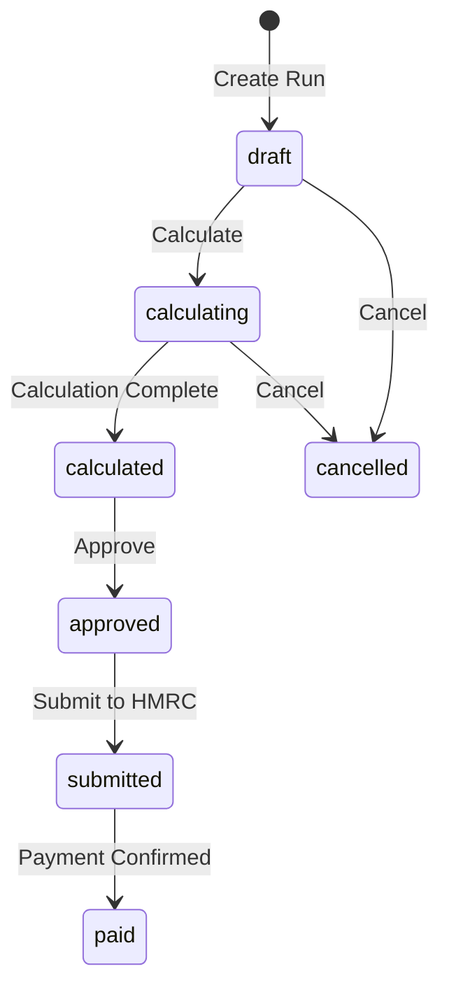
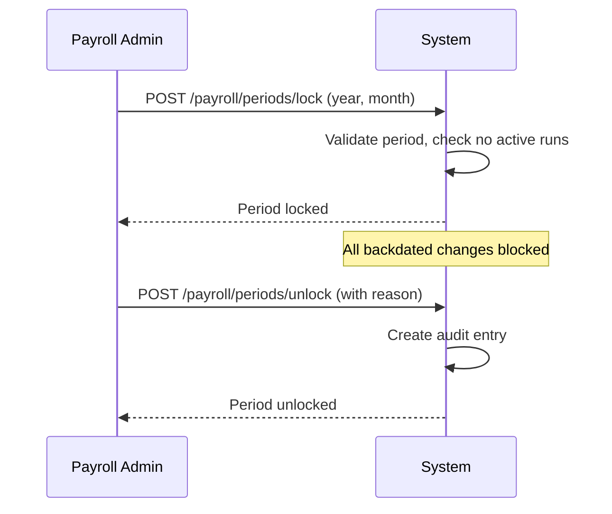

# Payroll and Finance

## Overview

The Payroll and Finance feature group in Staffora provides comprehensive payroll processing capabilities tailored for UK employers. It covers payroll run creation and management, period locking to prevent retrospective changes, employee tax detail management (PAYE, NI), payslip generation, deduction configuration, salary sacrifice schemes, tax code management, income protection, beneficiary nominations, total reward statements, cost centre assignments, journal entry generation for accounting integration, final pay calculations (including Harpur Trust holiday pay), and pay schedule management.

## Key Workflows

### Payroll Run Lifecycle

A payroll run processes all employee pay for a given period. The system validates period dates, checks for duplicates, and supports different run types (regular, supplementary, correction).

Each payroll run generates individual payroll lines for every employee, capturing gross pay, tax deductions, NI contributions, pension contributions, salary sacrifice deductions, and net pay.

### Period Locking

Period locking prevents changes to payroll data within a finalised period. Once a period is locked, no new time entries, absence records, or compensation changes can be backdated into it. Unlocking requires elevated permissions and creates an audit trail.

### HMRC Submissions

The payroll module supports HMRC Real Time Information (RTI) submissions:
- **FPS (Full Payment Submission)**: Submitted each pay period with employee payment details
- **EPS (Employer Payment Summary)**: Monthly summary of statutory payments, NIC reclaims
- **P45**: Generated when an employee leaves
- **P60**: Annual certificate of pay and tax

### Final Pay Calculation

When an employee is terminated, the system calculates their final pay including:
- Outstanding salary through the termination date
- Accrued but untaken holiday pay (including Harpur Trust calculation for irregular-hours workers)
- Notice pay (statutory or contractual, whichever is greater)
- Any outstanding expenses or deductions
- Redundancy pay (if applicable, calculated per UK statutory formula)

### Salary Sacrifice

Salary sacrifice arrangements allow employees to give up a portion of their salary in exchange for non-cash benefits (e.g. pension contributions, cycle-to-work, childcare vouchers). The system:
- Validates that the sacrifice does not reduce pay below National Minimum Wage
- Calculates the NI savings for both employer and employee
- Tracks the sacrifice period with effective dating
- Adjusts gross pay in payroll calculations

### Journal Entry Generation

For accounting integration, the payroll module can generate journal entries that map payroll costs to the organisation's chart of accounts. Entries are broken down by cost centre, department, and expense type.

## User Stories

- As a payroll administrator, I want to create a payroll run for the current month so that employees are paid on time.
- As a payroll administrator, I want to lock the payroll period after processing so that no backdated changes affect finalised pay.
- As a payroll administrator, I want to generate and submit FPS to HMRC so that we comply with RTI requirements.
- As a payroll administrator, I want to calculate an employee's final pay so that their termination is processed correctly.
- As an employee, I want to view my payslips so that I can see my pay breakdown.
- As an HR administrator, I want to configure salary sacrifice schemes so that employees can participate in tax-efficient benefits.
- As a finance manager, I want to generate journal entries from payroll so that costs are properly allocated in the accounting system.
- As a payroll administrator, I want to manage employee tax codes so that PAYE deductions are correct.

## Related Modules

| Module | Description |
|--------|-------------|
| `payroll` | Payroll runs, calculation, period locking, HMRC submissions, final pay, journal entries, pay schedule assignments, Harpur Trust holiday pay, salary sacrifice sub-routes |
| `payroll-config` | Payroll configuration settings (tax years, NI thresholds, etc.) |
| `payslips` | Payslip generation, storage, and retrieval |
| `deductions` | Configurable payroll deduction types (loan repayments, union fees, etc.) |
| `tax-codes` | Employee PAYE tax code management |
| `salary-sacrifice` | Salary sacrifice arrangement management (also exposed via payroll sub-routes) |
| `income-protection` | Income protection policy management |
| `beneficiary-nominations` | Death-in-service and pension beneficiary nominations |
| `total-reward` | Total reward statement generation (pay + benefits + pension) |
| `cost-centre-assignments` | Employee-to-cost-centre mapping for payroll allocation |
| `pension` | Auto-enrolment pension management (UK compliance) |
| `nmw` | National Minimum Wage compliance checking |

## Related API Endpoints

### Payroll Core (`/api/v1/payroll`)

| Method | Path | Description |
|--------|------|-------------|
| POST | `/payroll/runs` | Create payroll run |
| GET | `/payroll/runs` | List payroll runs |
| GET | `/payroll/runs/:id` | Get payroll run detail (with lines) |
| POST | `/payroll/runs/:id/calculate` | Calculate payroll |
| POST | `/payroll/runs/:id/approve` | Approve payroll run |
| POST | `/payroll/runs/:id/cancel` | Cancel payroll run |
| GET | `/payroll/runs/:id/lines` | Get payroll lines |
| GET | `/payroll/runs/:id/lines/:employeeId` | Get employee payroll line |
| POST | `/payroll/periods/lock` | Lock payroll period |
| POST | `/payroll/periods/unlock` | Unlock payroll period |
| GET | `/payroll/periods/lock-status` | Get period lock status |
| POST | `/payroll/journal-entries` | Generate journal entries |
| GET | `/payroll/journal-entries` | List journal entries |
| POST | `/payroll/final-pay/:employeeId` | Calculate final pay |
| POST | `/payroll/final-pay/:employeeId/confirm` | Confirm final pay |
| GET | `/payroll/harpur-trust` | Harpur Trust holiday pay calculation |
| GET | `/payroll/employees/:employeeId/tax-details` | Get employee tax details |
| PUT | `/payroll/employees/:employeeId/tax-details` | Update employee tax details |
| GET | `/payroll/export` | Export payroll data |
| POST | `/payroll/pay-schedule-assignments` | Create pay schedule assignment |
| GET | `/payroll/pay-schedule-assignments` | List assignments |
| PATCH | `/payroll/pay-schedule-assignments/:id` | Update assignment |

### HMRC Submissions (`/api/v1/payroll/submissions`)

| Method | Path | Description |
|--------|------|-------------|
| POST | `/payroll/submissions/fps` | Submit FPS |
| POST | `/payroll/submissions/eps` | Submit EPS |
| GET | `/payroll/submissions` | List submissions |

### Payslips (`/api/v1/payslips`)

| Method | Path | Description |
|--------|------|-------------|
| GET | `/payslips` | List payslips |
| GET | `/payslips/:id` | Get payslip |
| GET | `/payslips/employee/:employeeId` | Get employee payslips |

### Tax Codes (`/api/v1/tax-codes`)

| Method | Path | Description |
|--------|------|-------------|
| GET | `/tax-codes` | List tax codes |
| POST | `/tax-codes` | Create/update tax code |

See the [API Reference](../04-api/README.md) for full request/response schemas.

---

## Sequence Diagrams

### Payroll Run Flow (Create, Calculate, Approve, Export)

This diagram traces a payroll run through its full lifecycle: creation, calculation with UK tax/NI computation, approval, and export. Based on `packages/api/src/modules/payroll/service.ts` and `routes.ts`. The payroll run status machine is: `draft -> calculating -> review -> approved -> submitted -> paid`.

```mermaid
sequenceDiagram
    participant Admin as Payroll Admin (Client)
    participant R as Elysia Router
    participant RBAC as RBAC Plugin
    participant Audit as Audit Plugin
    participant Svc as PayrollService
    participant Repo as PayrollRepository
    participant DB as PostgreSQL (RLS)
    participant Outbox as domain_outbox

    Note over Admin,Outbox: Phase 1: Create Payroll Run

    Admin->>R: POST /api/v1/payroll/runs<br/>{ pay_period_start, pay_period_end,<br/>pay_date, run_type, notes }
    R->>RBAC: requirePermission("payroll:runs", "write")
    RBAC-->>R: Authorised

    R->>Svc: createPayrollRun(ctx, data, idempotencyKey)
    Note over Svc: Validate: end >= start,<br/>pay_date >= start

    Svc->>DB: db.withTransaction(ctx, callback)<br/>SET app.current_tenant = tenantId
    activate DB
    Svc->>Repo: hasExistingRunForPeriod(ctx,<br/>start, end, runType, tx)
    Repo->>DB: SELECT EXISTS FROM payroll_runs<br/>WHERE period matches AND status != 'draft'
    DB-->>Repo: false (no duplicate)

    Svc->>Repo: createPayrollRun(ctx, data, tx)
    Repo->>DB: INSERT INTO payroll_runs<br/>(status = 'draft')
    DB-->>Repo: New payroll run row

    Svc->>Outbox: INSERT INTO domain_outbox<br/>event: "payroll.run.created"
    Note over DB: COMMIT (run + outbox atomic)
    deactivate DB

    Svc-->>R: { success: true, data: run }
    R->>Audit: audit.log("payroll.run.created")
    R-->>Admin: 201 Created { payroll run }

    Note over Admin,Outbox: Phase 2: Calculate Payroll

    Admin->>R: POST /api/v1/payroll/runs/:id/calculate<br/>(Idempotency-Key header)
    R->>RBAC: requirePermission("payroll:runs", "write")
    RBAC-->>R: Authorised

    R->>Svc: calculatePayroll(ctx, runId)
    Svc->>Repo: findPayrollRunById(ctx, runId)
    Repo->>DB: SELECT FROM payroll_runs (RLS)
    DB-->>Repo: Run in 'draft' status
    Note over Svc: Validate state machine:<br/>draft -> calculating (allowed)

    Svc->>DB: db.withTransaction(ctx, callback)
    activate DB

    Svc->>Repo: updatePayrollRunStatus(ctx, id,<br/>"calculating", tx)
    Repo->>DB: UPDATE payroll_runs SET status

    Svc->>Repo: deletePayrollLinesByRunId(id, tx)
    Repo->>DB: DELETE FROM payroll_lines<br/>(clear for recalculation)

    Svc->>Repo: getActiveEmployeesForPeriod(ctx, periodEnd, tx)
    Repo->>DB: SELECT employees with compensation<br/>WHERE status = 'active'
    DB-->>Repo: Employee list with salaries

    Svc->>Repo: getOvertimeHoursForPeriod(ctx, start, end, tx)
    Repo->>DB: SELECT SUM(overtime_hours)<br/>FROM timesheets
    DB-->>Repo: Overtime map per employee

    loop For each active employee
        Note over Svc: Calculate monthly basic pay<br/>(annual_salary / 12)
        Note over Svc: Calculate overtime pay<br/>(hourly_rate x 1.5 x hours)
        Svc->>Repo: findTaxDetailsAsOfDate(ctx, empId, periodEnd, tx)
        Repo->>DB: SELECT tax_code, ni_category,<br/>student_loan_plan<br/>FROM tax_details (effective-dated)
        DB-->>Repo: Tax details
        Note over Svc: UK PAYE income tax calculation<br/>(tax bands: 20%, 40%, 45%)
        Note over Svc: UK employee NI (8% + 2%)<br/>UK employer NI (13.8%)
        Note over Svc: Student loan repayment<br/>(Plan 1/2/4/5/postgrad)
        Note over Svc: Pension (5% employee, 3% employer)
        Note over Svc: Salary sacrifice deductions
        Note over Svc: net_pay = gross - all_deductions

        Svc->>Repo: insertPayrollLine(ctx, lineData, tx)
        Repo->>DB: INSERT INTO payroll_lines
    end

    Svc->>Repo: updatePayrollRunStatus(ctx, id,<br/>"review", tx, { totals })
    Repo->>DB: UPDATE payroll_runs SET status = 'review',<br/>employee_count, total_gross,<br/>total_deductions, total_net

    Svc->>Outbox: INSERT INTO domain_outbox<br/>event: "payroll.run.calculated"<br/>payload: { employeeCount, totalGross, totalNet }
    Note over DB: COMMIT (lines + status + outbox atomic)
    deactivate DB

    Svc-->>R: { success: true, data: run + lines }
    R->>Audit: audit.log("payroll.run.calculated")
    R-->>Admin: 200 OK { run detail with lines }

    Note over Admin,Outbox: Phase 3: Approve Payroll Run

    Admin->>R: PATCH /api/v1/payroll/runs/:id/approve
    R->>RBAC: requirePermission("payroll:runs", "write")
    RBAC-->>R: Authorised

    R->>Svc: approvePayrollRun(ctx, runId)
    Svc->>Repo: findPayrollRunById(ctx, runId)
    Repo->>DB: SELECT FROM payroll_runs (RLS)
    DB-->>Repo: Run in 'review' status
    Note over Svc: Validate state machine:<br/>review -> approved (allowed)

    Svc->>DB: db.withTransaction(ctx, callback)
    activate DB
    Svc->>Repo: updatePayrollRunStatus(ctx, id,<br/>"approved", tx,<br/>{ approvedBy, approvedAt })
    Repo->>DB: UPDATE payroll_runs SET status = 'approved',<br/>approved_by = userId, approved_at = now()
    DB-->>Repo: Updated run

    Svc->>Outbox: INSERT INTO domain_outbox<br/>event: "payroll.run.approved"<br/>payload: { run, approvedBy }
    Note over DB: COMMIT
    deactivate DB

    Svc-->>R: { success: true, data: approved run }
    R->>Audit: audit.log("payroll.run.approved")
    R-->>Admin: 200 OK { approved payroll run }

    Note over Admin,Outbox: Phase 4: Export Payroll Data

    Admin->>R: POST /api/v1/payroll/runs/:id/export<br/>{ format: "csv" | "json" }
    R->>RBAC: requirePermission("payroll:export", "read")
    RBAC-->>R: Authorised

    R->>Svc: exportPayrollData(ctx, runId, format)
    Svc->>Repo: findPayrollRunById(ctx, runId)
    Svc->>Repo: findPayrollLinesByRunId(ctx, runId)
    Repo->>DB: SELECT FROM payroll_lines (RLS)
    DB-->>Repo: All payroll lines
    Note over Svc: Generate CSV/JSON with<br/>employee pay breakdown

    Svc->>Outbox: event: "payroll.run.exported"
    Svc-->>R: { content, contentType, filename }
    R-->>Admin: 200 OK { exported payroll data }
```

---

## Related Documents

- [Architecture Overview](../02-architecture/ARCHITECTURE.md) — System architecture, plugin chain, and request flow
- [API Reference](../04-api/api-reference.md) — Full endpoint specifications for all modules
- [Database Schema and Migrations](../02-architecture/DATABASE.md) — Table catalog and RLS policies
- [Benefits Administration](./benefits-administration.md) — Salary sacrifice and benefit deduction integration
- [UK Compliance](./uk-compliance.md) — PAYE, NI, NMW/NLW, and pension auto-enrolment regulations
- [Worker System](../02-architecture/WORKER_SYSTEM.md) — Background jobs for payroll calculations and payslip generation
- [Testing Guide](../08-testing/testing-guide.md) — Integration test patterns for RLS, idempotency, and effective dating

---

Last updated: 2026-03-28
