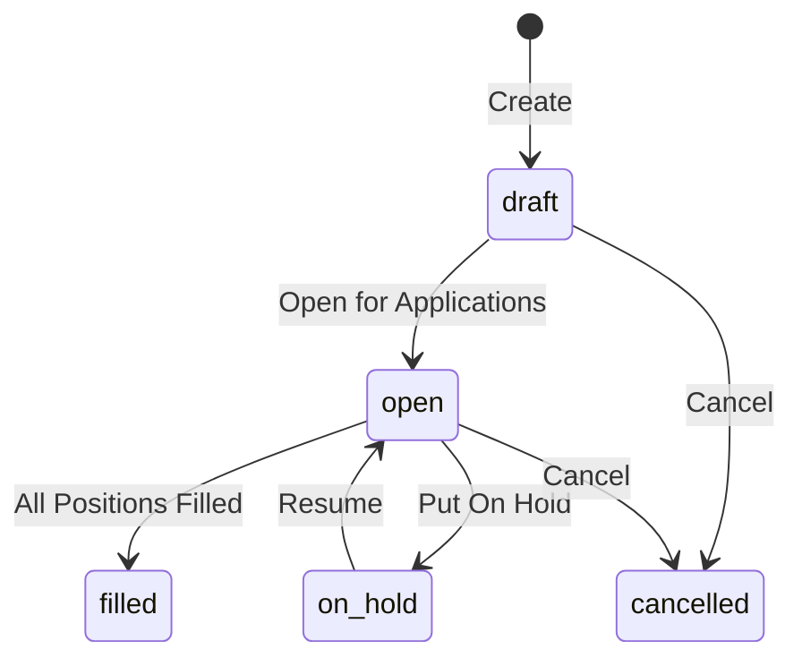
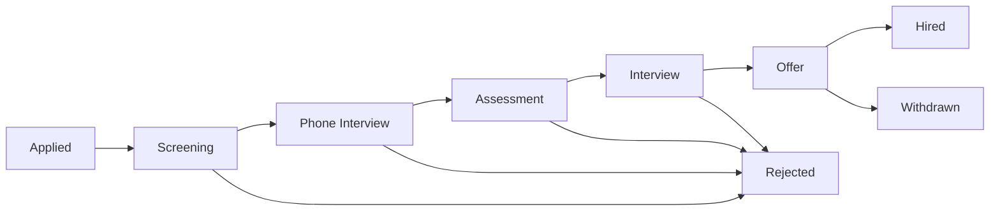
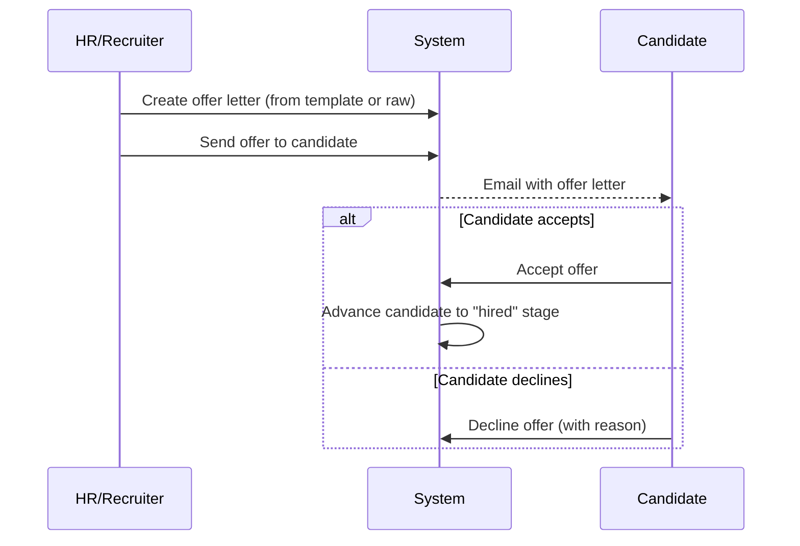

# Recruitment

## Overview

The Recruitment feature group in Staffora manages the full hiring lifecycle from job requisition creation through to candidate offer acceptance. It covers requisition management with approval workflows, job board integration for publishing vacancies to UK job boards, candidate pipeline tracking through configurable stages, offer letter generation and digital acceptance, reference checks, DBS and background checks, recruitment agency management, and comprehensive recruitment analytics including time-to-fill and cost-per-hire metrics.

## Key Workflows

### Requisition Lifecycle

Job requisitions represent approved headcount requests. They follow a state machine that tracks approval and fulfilment.

Each requisition includes the job title, position reference, hiring manager, department, number of openings, priority, requirements, target start date, and application deadline.

### Candidate Pipeline

Candidates progress through defined stages in the recruitment pipeline. The system enforces valid stage transitions and records the reason for each advancement.

Candidates can be sourced from direct applications, job boards, agencies, employee referrals, or LinkedIn. Each candidate record includes contact details, CV/resume URL, LinkedIn profile, rating, and interview notes.

### Offer Letter Workflow

Once a candidate reaches the offer stage, an offer letter can be generated from a template or created manually.

### Reference and Background Checks

Reference checks are created against candidates and sent to referees for completion. The system tracks the status of each reference (pending, sent, received, verified) and stores the referee's responses.

Background checks integrate with external providers (e.g. DBS for criminal record checks). The system submits check requests and receives results via webhook callbacks, updating the candidate's clearance status.

### Recruitment Analytics

The analytics endpoint provides comprehensive metrics over configurable date ranges:

- **Time-to-fill**: Average days from requisition opening to position filled
- **Cost-per-hire**: Total recruitment costs divided by hires
- **Source effectiveness**: Hire rate by candidate source (job board, referral, agency, etc.)
- **Pipeline conversion rates**: Percentage of candidates advancing through each stage
- **Requisition statistics**: Counts by status, department, and priority

## User Stories

- As an HR administrator, I want to create a job requisition so that I can begin the hiring process for an approved position.
- As a recruiter, I want to publish a vacancy to multiple job boards simultaneously so that the role gets maximum visibility.
- As a recruiter, I want to track candidates through pipeline stages so that I have visibility of the hiring funnel.
- As a recruiter, I want to generate an offer letter from a template so that offers are consistent and professional.
- As a hiring manager, I want to see candidate statistics and pipeline data for my open requisitions.
- As an HR administrator, I want to request DBS checks for candidates so that we comply with pre-employment screening requirements.
- As an HR administrator, I want to track recruitment costs against requisitions so that we can monitor cost-per-hire.
- As an HR director, I want to view recruitment analytics so that I can identify bottlenecks and improve our hiring process.

## Related Modules

| Module | Description |
|--------|-------------|
| `recruitment` | Requisitions, candidates, pipeline management, analytics, costs |
| `job-boards` | UK job board integrations and multi-board posting |
| `offer-letters` | Offer letter templates, generation, send, accept/decline |
| `reference-checks` | Reference request creation, tracking, and verification |
| `background-checks` | DBS and background check provider integration with webhooks |
| `dbs-checks` | UK Disclosure and Barring Service check management |
| `agencies` | Recruitment agency configuration and preferred supplier lists |
| `agency-workers` | Agency worker assignment tracking (AWR 2010 compliance) |

## Related API Endpoints

### Recruitment Core (`/api/v1/recruitment`)

| Method | Path | Description |
|--------|------|-------------|
| GET | `/recruitment/requisitions` | List requisitions |
| GET | `/recruitment/requisitions/stats` | Requisition statistics |
| GET | `/recruitment/requisitions/:id` | Get requisition |
| GET | `/recruitment/requisitions/:id/pipeline` | Get candidate pipeline |
| POST | `/recruitment/requisitions` | Create requisition |
| PATCH | `/recruitment/requisitions/:id` | Update requisition |
| POST | `/recruitment/requisitions/:id/open` | Open requisition |
| POST | `/recruitment/requisitions/:id/close` | Close (fill) requisition |
| POST | `/recruitment/requisitions/:id/cancel` | Cancel requisition |
| GET | `/recruitment/candidates` | List candidates |
| GET | `/recruitment/candidates/stats` | Candidate statistics |
| GET | `/recruitment/candidates/:id` | Get candidate |
| POST | `/recruitment/candidates` | Create candidate |
| PATCH | `/recruitment/candidates/:id` | Update candidate |
| POST | `/recruitment/candidates/:id/advance` | Advance pipeline stage |
| GET | `/recruitment/analytics` | Recruitment analytics |
| GET | `/recruitment/costs` | List recruitment costs |
| POST | `/recruitment/costs` | Create recruitment cost |
| PATCH | `/recruitment/costs/:id` | Update cost |
| DELETE | `/recruitment/costs/:id` | Delete cost |

### Offer Letters (`/api/v1/recruitment/offers`)

| Method | Path | Description |
|--------|------|-------------|
| POST | `/recruitment/offers` | Create offer letter |
| GET | `/recruitment/offers` | List offer letters |
| GET | `/recruitment/offers/:id` | Get offer letter |
| PUT | `/recruitment/offers/:id` | Update draft offer |
| POST | `/recruitment/offers/:id/send` | Send offer to candidate |
| POST | `/recruitment/offers/:id/accept` | Candidate accepts |
| POST | `/recruitment/offers/:id/decline` | Candidate declines |

### Job Boards (`/api/v1/job-boards`)

| Method | Path | Description |
|--------|------|-------------|
| GET | `/job-boards/integrations` | List integrations |
| POST | `/job-boards/integrations` | Add integration |
| POST | `/job-boards/postings` | Publish vacancy |
| GET | `/job-boards/postings` | List postings |
| DELETE | `/job-boards/postings/:id` | Withdraw posting |
| POST | `/job-boards/post/:jobId` | Post to multiple boards |
| GET | `/job-boards/boards` | List supported boards |

### Reference Checks (`/api/v1/reference-checks`)

| Method | Path | Description |
|--------|------|-------------|
| POST | `/reference-checks` | Create reference check |
| GET | `/reference-checks` | List reference checks |
| PATCH | `/reference-checks/:id` | Update reference check |
| POST | `/reference-checks/:id/verify` | Verify reference |

### Background Checks (`/api/v1/background-checks`)

| Method | Path | Description |
|--------|------|-------------|
| POST | `/background-checks` | Request background check |
| GET | `/background-checks` | List checks |
| GET | `/background-checks/:id` | Get check details |
| POST | `/background-checks/webhooks/:provider` | Provider callback |

See the [API Reference](../04-api/README.md) for full request/response schemas.

---

## Related Documents

- [Architecture Overview](../02-architecture/ARCHITECTURE.md) — System architecture, plugin chain, and request flow
- [API Reference](../04-api/api-reference.md) — Full endpoint specifications for all modules
- [Database Schema and Migrations](../02-architecture/DATABASE.md) — Table catalog and RLS policies
- [Onboarding](./onboarding.md) — Post-hire onboarding workflow that follows recruitment
- [UK Compliance](./uk-compliance.md) — Right-to-work checks and DBS verification requirements
- [Worker System](../02-architecture/WORKER_SYSTEM.md) — Background jobs for interview reminders and offer letter generation
- [Testing Guide](../08-testing/testing-guide.md) — Integration test patterns for RLS and state machines

---

Last updated: 2026-03-28
