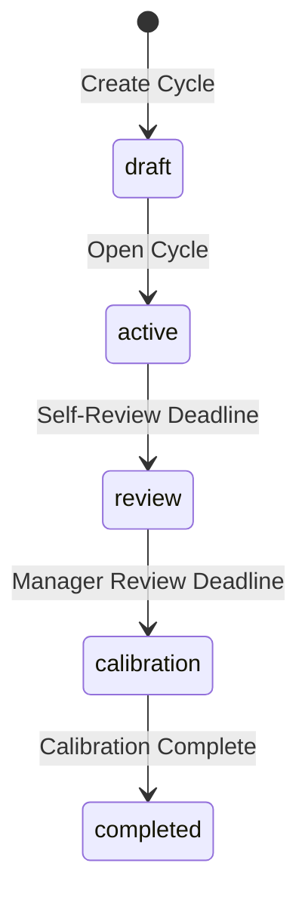
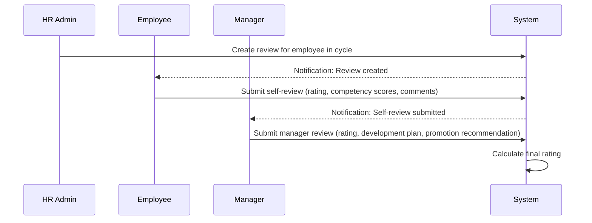
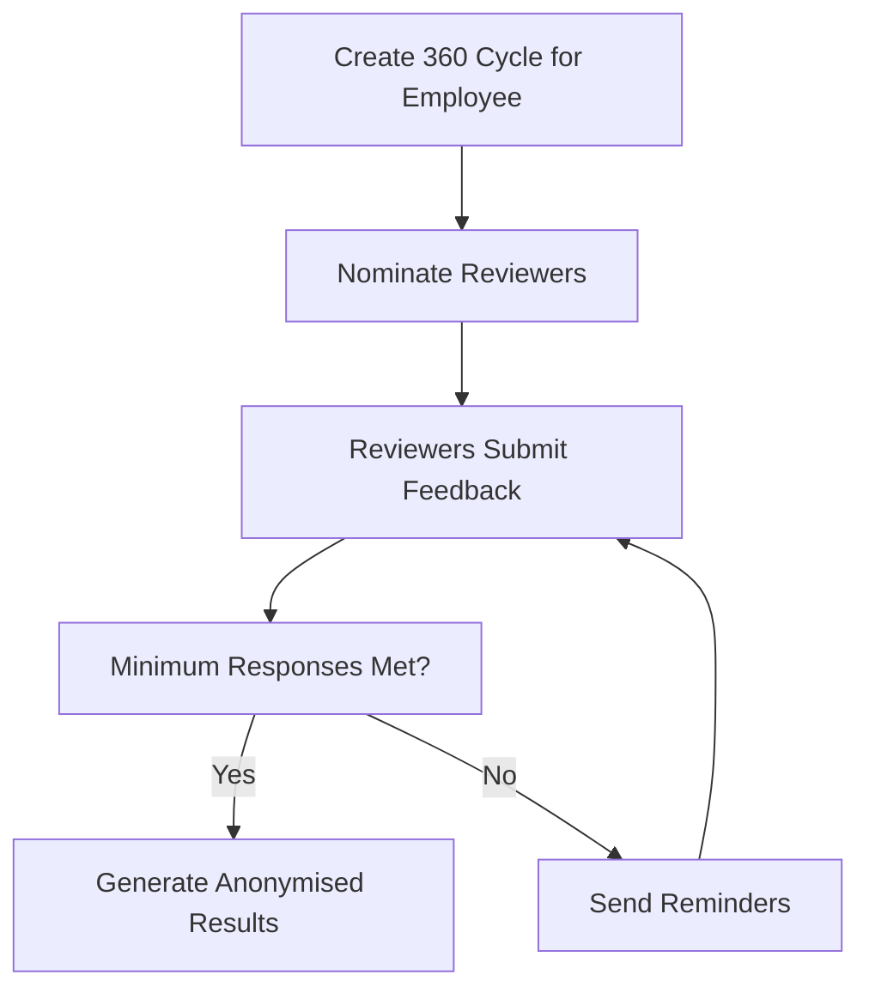

# Talent Management

## Overview

The Talent Management feature group in Staffora covers performance management, goal tracking, review cycles, 360-degree feedback, one-on-one meetings, peer recognition, competency frameworks, assessments, continuing professional development (CPD), course ratings, and training budgets. Together these modules help organisations develop their workforce, identify high performers, and build talent pipelines.

## Key Workflows

### Performance Review Cycle

Performance reviews follow a structured cycle with defined deadlines for self-assessment, manager review, and calibration.

**Draft** -- HR creates a review cycle with period dates, self-review deadline, manager review deadline, and optional calibration deadline.

**Active** -- The cycle is opened. Employees are enrolled and can begin setting goals.

**Review** -- After the self-review deadline, employees submit their self-assessments. The system tracks completion status.

**Calibration** -- After manager reviews are submitted, HR can run a calibration process to normalise ratings across teams.

**Completed** -- Final ratings are locked and available for reporting.

### Individual Review Flow

Each employee's review within a cycle progresses through its own stages.

### 360-Degree Feedback

360 feedback cycles collect multi-rater input from peers, direct reports, and managers, providing a rounded view of employee performance.

Responses are anonymised in the aggregated results to encourage honest feedback. A minimum number of responses is required before results can be viewed.

### Goal Management

Goals support hierarchical structures (parent/child goals), progress tracking with percentage completion, weighted scoring, and category tagging. Goal statuses include: `not_started`, `in_progress`, `completed`, `cancelled`.

### One-on-One Meetings

Managers schedule regular 1:1 meetings with their direct reports. Each meeting has a date, status (scheduled/completed/cancelled), free-text notes, and structured action items. The system validates that managers cannot create meetings with themselves.

### Peer Recognition

The recognition module enables employees to give and receive public recognition with categories (e.g. teamwork, innovation, customer focus) and optional points. Recognitions can be listed and filtered by recipient, giver, or category.

### Competency Frameworks

Competencies are defined with categories and multi-level proficiency scales. They can be linked to positions and used in performance reviews to assess employee capabilities against role requirements.

### Training Budgets and CPD

Training budgets are allocated per employee, department, or organisation level. CPD records track professional development activities, certifications, and learning hours. Course ratings allow employees to rate and review completed training.

## User Stories

- As an HR administrator, I want to create a performance review cycle so that all employees are reviewed on a consistent schedule.
- As an employee, I want to submit my self-review so that my perspective is captured in the performance assessment.
- As a manager, I want to submit manager reviews for my direct reports so that I can provide formal performance feedback.
- As an HR administrator, I want to launch a 360 feedback cycle so that an employee receives multi-rater input.
- As a manager, I want to schedule one-on-one meetings so that I maintain regular touchpoints with my team.
- As an employee, I want to recognise a colleague so that their contribution is publicly acknowledged.
- As an HR administrator, I want to define competency frameworks so that employee capabilities can be assessed against role requirements.
- As an employee, I want to track my goals with progress updates so that my objectives are visible to my manager.
- As an HR administrator, I want to allocate training budgets so that professional development spending is tracked.

## Related Modules

| Module | Description |
|--------|-------------|
| `talent` | Goals, review cycles, reviews, competency definitions |
| `talent-pools` | High-potential and succession talent pool management |
| `feedback-360` | 360-degree feedback cycles, nominations, responses, anonymised results |
| `one-on-ones` | 1:1 meeting scheduling, notes, and action items |
| `recognition` | Peer recognition with categories and optional points |
| `competencies` | Competency framework definitions (also exposed via talent routes) |
| `assessments` | Competency and skills assessments |
| `cpd` | Continuing professional development record tracking |
| `course-ratings` | Employee ratings and reviews of training courses |
| `training-budgets` | Training budget allocation and spend tracking |
| `lms` | Learning Management System (courses, enrollments -- see separate doc) |

## Related API Endpoints

### Talent Core (`/api/v1/talent`)

| Method | Path | Description |
|--------|------|-------------|
| GET | `/talent/goals` | List goals |
| GET | `/talent/goals/:id` | Get goal by ID |
| POST | `/talent/goals` | Create goal |
| PATCH | `/talent/goals/:id` | Update goal |
| DELETE | `/talent/goals/:id` | Delete (cancel) goal |
| GET | `/talent/review-cycles` | List review cycles |
| GET | `/talent/review-cycles/:id` | Get review cycle |
| POST | `/talent/review-cycles` | Create review cycle |
| GET | `/talent/reviews` | List reviews |
| GET | `/talent/reviews/:id` | Get review |
| POST | `/talent/reviews` | Create review |
| POST | `/talent/reviews/:id/self-review` | Submit self-review |
| POST | `/talent/reviews/:id/manager-review` | Submit manager review |
| GET | `/talent/competencies` | List competencies |
| POST | `/talent/competencies` | Create competency |

### 360 Feedback (`/api/v1/feedback-360`)

| Method | Path | Description |
|--------|------|-------------|
| GET | `/feedback-360/cycles` | List 360 cycles |
| POST | `/feedback-360/cycles` | Create 360 cycle |
| POST | `/feedback-360/cycles/:id/nominate` | Nominate reviewers |
| GET | `/feedback-360/cycles/:id/responses` | List responses |
| POST | `/feedback-360/responses/:id/submit` | Submit feedback |
| POST | `/feedback-360/responses/:id/decline` | Decline feedback request |
| GET | `/feedback-360/cycles/:id/results` | Get anonymised results |

### Recognition (`/api/v1/recognition`)

| Method | Path | Description |
|--------|------|-------------|
| GET | `/recognition` | List recognitions |
| POST | `/recognition` | Give recognition |
| GET | `/recognition/:id` | Get recognition |

See the [API Reference](../04-api/README.md) for full request/response schemas.

---

## Related Documents

- [Architecture Overview](../02-architecture/ARCHITECTURE.md) — System architecture, plugin chain, and request flow
- [API Reference](../04-api/api-reference.md) — Full endpoint specifications for all modules
- [State Machine Patterns](../02-architecture/state-machines.md) — Performance review cycle state machine
- [Database Schema and Migrations](../02-architecture/DATABASE.md) — Table catalog and RLS policies
- [Worker System](../02-architecture/WORKER_SYSTEM.md) — Background jobs for review reminders and analytics aggregation
- [Testing Guide](../08-testing/testing-guide.md) — Integration test patterns for state machines and RLS

---

Last updated: 2026-03-28
