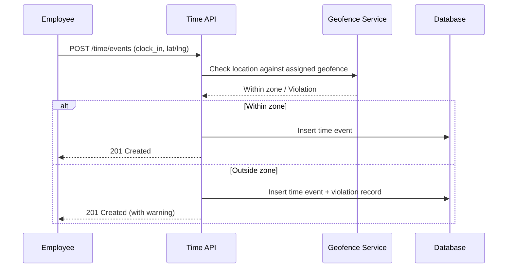
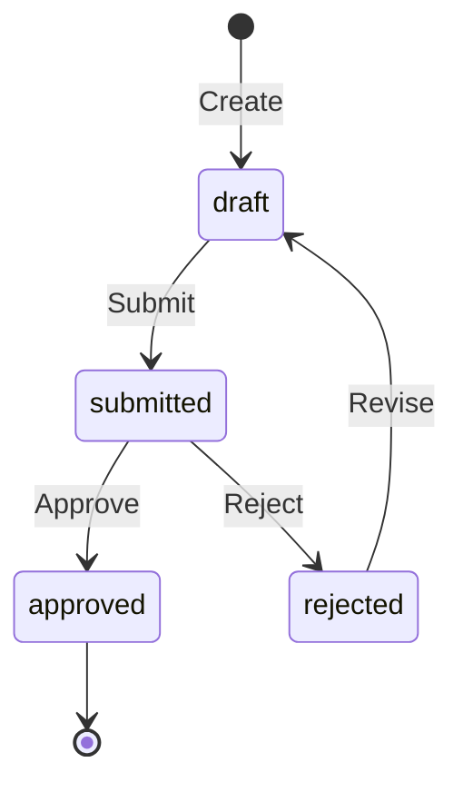
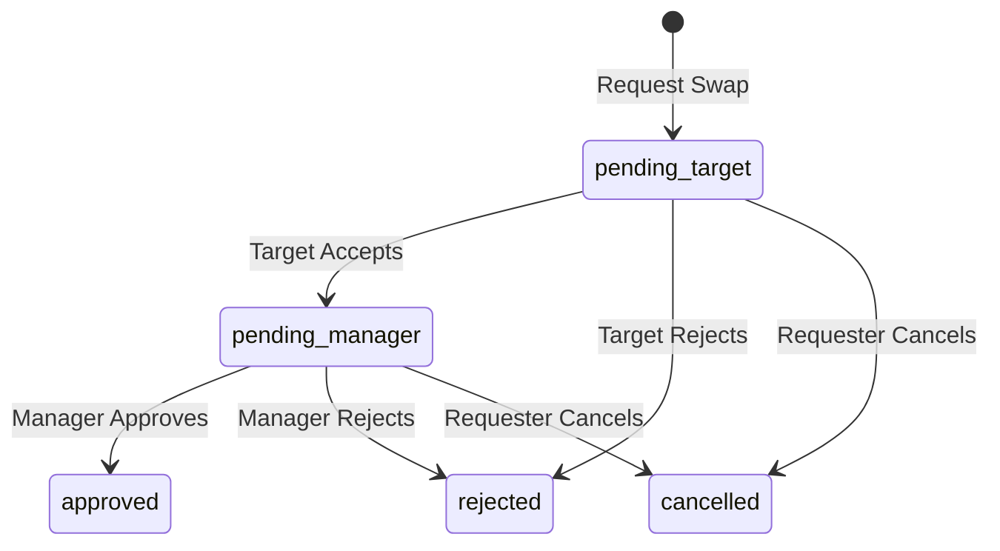

# Time and Attendance

## Overview

The Time and Attendance feature group handles all aspects of workforce time tracking within Staffora. This includes clock-in/clock-out events, work schedules and shift definitions, timesheet creation and multi-level approval workflows, overtime management, time off in lieu (TOIL), geofence-based location validation, shift swap workflows, and calendar synchronisation. The module is designed for UK employment law compliance, including Working Time Regulations (WTR) rest period enforcement.

## Key Workflows

### Clock Event Recording

Employees record time events (clock_in, clock_out, break_start, break_end) through the API. The system validates the sequence of events -- for example, a clock_out cannot precede a clock_in. Events can optionally include GPS coordinates for geofence validation.

### Timesheet Lifecycle

Timesheets aggregate time events into a reviewable weekly or pay-period summary. They follow a defined approval workflow.

The system supports multi-level approval chains where a timesheet passes through sequential approvers (e.g. line manager, then department head). Each approver can approve or reject at their level.

### Shift Swap Workflow

Shift swaps follow a two-phase approval process to ensure both the target employee and the manager agree.

### TOIL (Time Off In Lieu)

TOIL allows employees to accrue compensatory time off when they work overtime. The TOIL module tracks balance periods, accrual transactions (when overtime is worked), and usage transactions (when TOIL is taken). Balances are managed per employee with configurable expiry rules.

### Geofence Validation

Geofence locations define circular zones (latitude, longitude, radius) where employees are expected to clock in. When a time event includes coordinates, the system checks proximity and records violations for events outside the permitted zone. Violations can be resolved by managers with explanatory notes.

### Calendar Sync

Employees can enable an iCal feed that exposes their work schedule, approved leave, and shift assignments to external calendar applications (Outlook, Google Calendar). The feed uses a unique token for authentication -- no session is required.

## User Stories

- As an employee, I want to clock in and out so that my working hours are accurately recorded.
- As a manager, I want to review and approve timesheets so that payroll can be processed accurately.
- As an employee, I want to request a shift swap with a colleague so that I can adjust my schedule.
- As a manager, I want to see geofence violations so that I can address attendance issues.
- As an employee, I want to accrue and use TOIL so that I am compensated for overtime worked.
- As an employee, I want to sync my work schedule to my personal calendar.
- As an HR administrator, I want to define time policies and schedules so that different employee groups have appropriate working patterns.

## Related Modules

| Module | Description |
|--------|-------------|
| `time` | Core time events, policies, schedules, shifts, timesheets, approval chains |
| `shift-swaps` | Two-phase shift swap request and approval workflow |
| `overtime` | Overtime policy definitions (replaced by `overtime-rules`) |
| `overtime-requests` | Employee overtime request submission and approval |
| `overtime-rules` | Configurable overtime calculation rules and thresholds |
| `toil` | Time Off In Lieu balance, accrual, and usage tracking |
| `geofence` | Geofence location management, proximity checks, violation tracking |
| `calendar-sync` | iCal feed generation and calendar connection management |
| `wtr` | Working Time Regulations compliance (rest periods, max hours) |

## Related API Endpoints

### Time Core (`/api/v1/time`)

| Method | Path | Description |
|--------|------|-------------|
| POST | `/time/policies` | Create time policy |
| GET | `/time/policies` | List time policies |
| GET | `/time/policies/:id` | Get time policy |
| PUT | `/time/policies/:id` | Update time policy |
| DELETE | `/time/policies/:id` | Deactivate time policy |
| POST | `/time/events` | Record time event |
| GET | `/time/events` | List time events |
| GET | `/time/events/:id` | Get time event |
| POST | `/time/schedules` | Create schedule |
| GET | `/time/schedules` | List schedules |
| PUT | `/time/schedules/:id` | Update schedule |
| POST | `/time/shifts` | Create shift |
| PUT | `/time/shifts/:id` | Update shift |
| POST | `/time/timesheets` | Create timesheet |
| GET | `/time/timesheets` | List timesheets |
| PUT | `/time/timesheets/:id` | Update timesheet lines |
| POST | `/time/timesheets/:id/submit` | Submit timesheet |
| POST | `/time/timesheets/:id/approve` | Approve/reject timesheet |
| POST | `/time/timesheets/:id/submit-with-chain` | Submit with approval chain |
| POST | `/time/timesheets/:id/approval-chain/decide` | Decide at chain level |
| GET | `/time/approval-chain/pending` | List pending approvals |
| GET | `/time/stats` | Time statistics |

### Shift Swaps (`/api/v1/shift-swaps`)

| Method | Path | Description |
|--------|------|-------------|
| POST | `/shift-swaps` | Request a swap |
| GET | `/shift-swaps` | List swap requests |
| POST | `/shift-swaps/:id/accept` | Target accepts |
| POST | `/shift-swaps/:id/reject` | Target rejects |
| POST | `/shift-swaps/:id/approve` | Manager approves |
| POST | `/shift-swaps/:id/cancel` | Requester cancels |

### TOIL (`/api/v1/toil`)

| Method | Path | Description |
|--------|------|-------------|
| GET | `/toil/balances` | List TOIL balances |
| POST | `/toil/balances` | Create balance period |
| GET | `/toil/balances/employee/:employeeId` | Get employee balance |
| POST | `/toil/accruals` | Accrue TOIL hours |
| POST | `/toil/usage` | Use TOIL hours |
| GET | `/toil/transactions` | List transactions |

### Geofence (`/api/v1/geofences`)

| Method | Path | Description |
|--------|------|-------------|
| GET | `/geofences/locations` | List geofence locations |
| POST | `/geofences/locations` | Create geofence location |
| GET | `/geofences/nearby` | Find nearby geofences |
| POST | `/geofences/check-location` | Check if in zone |
| GET | `/geofences/violations` | List violations |
| POST | `/geofences/violations/:id/resolve` | Resolve violation |

### Calendar Sync (`/api/v1/calendar`)

| Method | Path | Description |
|--------|------|-------------|
| GET | `/calendar/connections` | List connections |
| POST | `/calendar/ical/enable` | Enable iCal feed |
| POST | `/calendar/ical/regenerate` | Regenerate token |
| GET | `/calendar/ical/:token` | Serve iCal feed (public) |

See the [API Reference](../04-api/README.md) for full request/response schemas.

---

## Related Documents

- [Architecture Overview](../02-architecture/ARCHITECTURE.md) — System architecture, plugin chain, and request flow
- [API Reference](../04-api/api-reference.md) — Full endpoint specifications for all modules
- [Database Schema and Migrations](../02-architecture/DATABASE.md) — Table catalog and RLS policies
- [UK Compliance](./uk-compliance.md) — Working Time Regulations rest period enforcement
- [Worker System](../02-architecture/WORKER_SYSTEM.md) — Background jobs for timesheet reminders and overtime calculations
- [Testing Guide](../08-testing/testing-guide.md) — Integration test patterns for RLS and idempotency

---

Last updated: 2026-03-28
