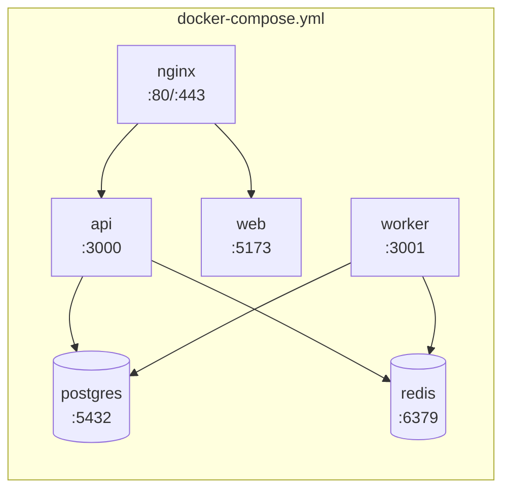

# Deployment

*Last updated: 2026-03-17*

## Docker Compose

The application is deployed using Docker Compose with five services.

### Services



| Service | Container | Image | Port | Description |
|---------|-----------|-------|------|-------------|
| `postgres` | hris-postgres | postgres:16 | 5432 | PostgreSQL database |
| `redis` | hris-redis | redis:7 | 6379 | Cache and queue |
| `api` | hris-api | Custom Dockerfile | 3000 | Elysia.js API |
| `worker` | hris-worker | Custom Dockerfile | 3001 | Background worker |
| `web` | hris-web | Custom Dockerfile | 5173 | React frontend |
| `nginx` | hris-nginx | nginx:alpine | 80/443 | Reverse proxy (production profile) |

### Quick Start

```bash
# Development (all services)
docker compose -f docker/docker-compose.yml up -d

# Production (includes nginx reverse proxy)
docker compose -f docker/docker-compose.yml --profile production up -d

# Infrastructure only (postgres + redis)
bun run docker:up
```

### Resource Limits

| Service | CPU Limit | Memory Limit | CPU Reserved | Memory Reserved |
|---------|-----------|-------------|-------------|-----------------|
| postgres | 2 | 2 GB | 0.5 | 512 MB |
| redis | 1 | 1 GB | 0.25 | 256 MB |
| api | 2 | 1 GB | 0.5 | 256 MB |
| worker | 1 | 1 GB | 0.25 | 256 MB |
| web | 1 | 512 MB | 0.25 | 128 MB |
| nginx | 0.5 | 256 MB | - | - |

## Environment Variables

### Required (Must Change in Production)

| Variable | Description | Example |
|----------|-------------|---------|
| `POSTGRES_PASSWORD` | Database password | `$(openssl rand -base64 32)` |
| `SESSION_SECRET` | Session encryption key (32+ chars) | `$(openssl rand -base64 32)` |
| `CSRF_SECRET` | CSRF protection key (32+ chars) | `$(openssl rand -base64 32)` |
| `BETTER_AUTH_SECRET` | BetterAuth encryption key (32+ chars) | `$(openssl rand -base64 32)` |

### Database

| Variable | Default | Description |
|----------|---------|-------------|
| `POSTGRES_USER` | `hris` | PostgreSQL username |
| `POSTGRES_PASSWORD` | `hris_dev_password` | PostgreSQL password |
| `POSTGRES_DB` | `hris` | Database name |
| `POSTGRES_PORT` | `5432` | PostgreSQL port |
| `DATABASE_URL` | (constructed) | Full connection string |

### Redis

| Variable | Default | Description |
|----------|---------|-------------|
| `REDIS_PORT` | `6379` | Redis port |
| `REDIS_URL` | `redis://localhost:6379` | Redis connection string |

### API

| Variable | Default | Description |
|----------|---------|-------------|
| `NODE_ENV` | `development` | Environment mode |
| `API_PORT` | `3000` | API server port |
| `CORS_ORIGIN` | `http://localhost:5173` | Allowed CORS origins (comma-separated) |
| `LOG_LEVEL` | `info` | Log level (debug, info, warn, error) |
| `RATE_LIMIT_MAX` | `100` | Max requests per window |
| `RATE_LIMIT_WINDOW` | `60000` | Rate limit window (ms) |

### Frontend

| Variable | Default | Description |
|----------|---------|-------------|
| `WEB_PORT` | `5173` | Frontend dev server port |
| `VITE_API_URL` | `http://localhost:3000` | API URL for frontend |

### Authentication

| Variable | Default | Description |
|----------|---------|-------------|
| `BETTER_AUTH_URL` | `http://localhost:3000` | Auth callback URL |
| `FEATURE_MFA_REQUIRED` | `false` | Require MFA for all users |

### Worker

| Variable | Default | Description |
|----------|---------|-------------|
| `WORKER_HEALTH_PORT` | `3001` | Worker health endpoint port |
| `ENABLE_OUTBOX_POLLING` | `true` | Enable outbox polling |
| `OUTBOX_POLL_INTERVAL` | `1000` | Poll interval (ms) |
| `OUTBOX_BATCH_SIZE` | `100` | Events per poll batch |

### Email (SMTP)

| Variable | Default | Description |
|----------|---------|-------------|
| `SMTP_HOST` | - | SMTP server host |
| `SMTP_PORT` | `587` | SMTP server port |
| `SMTP_USER` | - | SMTP username |
| `SMTP_PASSWORD` | - | SMTP password |
| `SMTP_FROM` | `noreply@staffora.co.uk` | Sender email address |

### File Storage

| Variable | Default | Description |
|----------|---------|-------------|
| `STORAGE_TYPE` | `local` | Storage backend (local, s3) |
| `STORAGE_PATH` | `/app/uploads` | Local storage path |
| `S3_BUCKET` | - | S3 bucket name |
| `S3_REGION` | - | AWS region |
| `S3_ACCESS_KEY` | - | AWS access key |
| `S3_SECRET_KEY` | - | AWS secret key |

### Feature Flags

| Variable | Default | Description |
|----------|---------|-------------|
| `FEATURE_MFA_REQUIRED` | `false` | Force MFA for all users |
| `FEATURE_AUDIT_ENABLED` | `true` | Enable audit logging |
| `FEATURE_RATE_LIMIT_ENABLED` | `true` | Enable rate limiting |

## Health Checks

### API Health

| Endpoint | Purpose | Response |
|----------|---------|----------|
| `GET /health` | Full health check | `{ status, checks: { database, redis }, uptime }` |
| `GET /ready` | Readiness probe | `{ status: "ready" }` |
| `GET /live` | Liveness probe | `{ status: "alive" }` |

### Worker Health

| Endpoint | Purpose | Port |
|----------|---------|------|
| `GET /health` | Worker status + metrics | 3001 |
| `GET /ready` | Worker readiness | 3001 |
| `GET /live` | Worker liveness | 3001 |
| `GET /metrics` | Prometheus metrics | 3001 |

## Volumes

| Volume | Service | Path | Description |
|--------|---------|------|-------------|
| `postgres_data` | postgres | `/var/lib/postgresql/data` | Database files |
| `redis_data` | redis | `/data` | Redis persistence |
| `worker_uploads` | worker | `/app/uploads` | Generated files |

## Network

All services communicate on the `hris-network` bridge network (subnet `172.28.0.0/16`).

## Production Checklist

- [ ] Change all default passwords and secrets
- [ ] Set `NODE_ENV=production`
- [ ] Configure `CORS_ORIGIN` to actual frontend domain
- [ ] Set up SSL certificates for nginx
- [ ] Enable `--profile production` for nginx reverse proxy
- [ ] Configure SMTP for email notifications
- [ ] Set up S3 for file storage (or persistent volume for local)
- [ ] Enable MFA requirement (`FEATURE_MFA_REQUIRED=true`)
- [ ] Set appropriate rate limits
- [ ] Configure log aggregation
- [ ] Set up monitoring/alerting on health endpoints
- [ ] Back up PostgreSQL data volume
- [ ] Review and restrict CORS origins

## Related Documentation

- [Production Checklist](../11-operations/production-checklist.md) — Pre-launch verification
- [DevOps Status](../06-devops/devops-status-report.md) — Infrastructure overview
- [Security Patterns](../02-architecture/security-patterns.md) — Security architecture

---

## Related Documents

- [Getting Started](GETTING_STARTED.md) — Initial setup and development environment
- [Architecture Overview](../02-architecture/ARCHITECTURE.md) — System architecture and service topology
- [DevOps Dashboard](../06-devops/devops-dashboard.md) — CI/CD pipeline architecture and status
- [DevOps Tasks](../06-devops/devops-tasks.md) — Infrastructure task list and progress
- [Production Checklist](../11-operations/production-checklist.md) — Pre-launch readiness checklist
- [Production Readiness Report](../11-operations/production-readiness-report.md) — Platform maturity assessment
- [Infrastructure Audit](../15-archive/audit/infrastructure-audit.md) — Docker, CI/CD, and infrastructure findings
- [Worker System](../02-architecture/WORKER_SYSTEM.md) — Background job processing architecture
