# Complete Route Map

*Last updated: 2026-03-17*

This document lists every route in the Staffora HRIS web application, organized by route group. Each entry includes the URL path, the component file, and a brief description.

**Related documentation:**

- [Frontend Architecture Overview](./README.md)
- [Component Library](./components.md)
- [Data Fetching Patterns](./data-fetching.md)
- [Permissions System](../architecture/PERMISSIONS_SYSTEM.md)

---

## Route Hierarchy Diagram

```mermaid
graph TD
    ROOT["root.tsx<br/>(QueryClientProvider, ThemeProvider, ToastProvider)"]

    ROOT --> HOME["/ (home.tsx)<br/>Redirect to /dashboard or /login"]
    ROOT --> AUTH["(auth)/layout.tsx<br/>AuthLayout"]
    ROOT --> APP["(app)/layout.tsx<br/>AppLayout"]
    ROOT --> ADMIN["(admin)/layout.tsx<br/>AdminLayout"]
    ROOT --> NOTFOUND["* (not-found.tsx)<br/>404 page"]

    AUTH --> LOGIN["/login"]
    AUTH --> MFA["/mfa"]
    AUTH --> FORGOT["/forgot-password"]
    AUTH --> RESET["/reset-password"]

    APP --> DASH["/dashboard"]
    APP --> ME["/me/*<br/>Employee Self-Service"]
    APP --> MGR["/manager/*<br/>Manager Portal"]

    ME --> ME_INDEX["/me"]
    ME --> ME_PROFILE["/me/profile"]
    ME --> ME_TIME["/me/time"]
    ME --> ME_LEAVE["/me/leave"]
    ME --> ME_BENEFITS["/me/benefits"]
    ME --> ME_DOCS["/me/documents"]
    ME --> ME_LEARN["/me/learning"]
    ME --> ME_CASES["/me/cases"]
    ME --> ME_COMP["/me/competencies"]
    ME --> ME_ONBOARD["/me/onboarding"]

    MGR --> MGR_INDEX["/manager"]
    MGR --> MGR_TEAM["/manager/team"]
    MGR --> MGR_APPROVALS["/manager/approvals"]
    MGR --> MGR_SCHEDULES["/manager/schedules"]
    MGR --> MGR_PERF["/manager/performance"]

    ADMIN --> ADMIN_DASH["/admin/dashboard"]
    ADMIN --> ADMIN_HR["/admin/hr/*"]
    ADMIN --> ADMIN_TIME["/admin/time/*"]
    ADMIN --> ADMIN_LEAVE["/admin/leave/*"]
    ADMIN --> ADMIN_TALENT["/admin/talent/*"]
    ADMIN --> ADMIN_BENEFITS["/admin/benefits/*"]
    ADMIN --> ADMIN_CASES["/admin/cases/*"]
    ADMIN --> ADMIN_DOCS["/admin/documents/*"]
    ADMIN --> ADMIN_ONBOARD["/admin/onboarding/*"]
    ADMIN --> ADMIN_LMS["/admin/lms/*"]
    ADMIN --> ADMIN_ANALYTICS["/admin/analytics"]
    ADMIN --> ADMIN_WORKFLOWS["/admin/workflows/*"]
    ADMIN --> ADMIN_SECURITY["/admin/security/*"]
    ADMIN --> ADMIN_REPORTS["/admin/reports/*"]
    ADMIN --> ADMIN_SETTINGS["/admin/settings/*"]
```

---

## Root Routes

| Path | Component File | Description |
|---|---|---|
| `/` | `routes/home.tsx` | Root index. Redirects authenticated users to `/dashboard`, unauthenticated users to `/login`. |
| `*` | `routes/not-found.tsx` | Catch-all 404 page for unmatched routes. |

---

## Auth Routes

**Layout:** `routes/(auth)/layout.tsx` (centered card, no authentication required)

| Path | Component File | Description |
|---|---|---|
| `/login` | `routes/(auth)/login/route.tsx` | Email/password login form. Supports redirect parameter. |
| `/mfa` | `routes/(auth)/mfa/route.tsx` | Multi-factor authentication verification (TOTP code entry). |
| `/forgot-password` | `routes/(auth)/forgot-password/route.tsx` | Password reset request form (sends email). |
| `/reset-password` | `routes/(auth)/reset-password/route.tsx` | Password reset confirmation (with token from email). |

---

## Employee Self-Service Routes

**Layout:** `routes/(app)/layout.tsx` (sidebar navigation, authentication required)

These routes are available to all authenticated users. They provide personal HR data access and self-service actions.

| Path | Component File | Description |
|---|---|---|
| `/dashboard` | `routes/(app)/dashboard/route.tsx` | Personal dashboard with announcements, pending tasks, and quick actions. |
| `/me` | `routes/(app)/me/index.tsx` | Employee self-service index (overview of all self-service features). |
| `/me/profile` | `routes/(app)/me/profile/route.tsx` | View and edit personal profile, contact details, emergency contacts. |
| `/me/time` | `routes/(app)/me/time/route.tsx` | Clock in/out, view time entries, submit timesheets. |
| `/me/leave` | `routes/(app)/me/leave/route.tsx` | View leave balances, submit leave requests, view request history. |
| `/me/benefits` | `routes/(app)/me/benefits/route.tsx` | View enrolled benefits, browse available plans, manage selections. |
| `/me/documents` | `routes/(app)/me/documents/route.tsx` | View personal documents (payslips, contracts, certificates). |
| `/me/learning` | `routes/(app)/me/learning/route.tsx` | View assigned courses, learning paths, certificates, and progress. |
| `/me/cases` | `routes/(app)/me/cases/route.tsx` | Submit and track HR cases (queries, requests, complaints). |
| `/me/competencies` | `routes/(app)/me/competencies/route.tsx` | View personal competency assessments and development plans. |
| `/me/onboarding` | `routes/(app)/me/onboarding/route.tsx` | View and complete onboarding checklist tasks. |

---

## Manager Portal Routes

**Layout:** `routes/(app)/layout.tsx` (shared with self-service, uses `ManagerLayout` sub-layout)

These routes are available to users with manager roles (manager, line_manager, team_leader, department_head, hr_admin, hr_officer).

| Path | Component File | Required Permission | Description |
|---|---|---|---|
| `/manager` | `routes/(app)/manager/index.tsx` | `team:read` | Manager portal index with team overview dashboard. |
| `/manager/team` | `routes/(app)/manager/team/route.tsx` | `team:read` | Direct reports list with employee details. |
| `/manager/approvals` | `routes/(app)/manager/approvals/route.tsx` | `time_entries:approve` or `leave_requests:approve` | Pending approval queue (leave, timesheets, expenses). |
| `/manager/schedules` | `routes/(app)/manager/schedules/route.tsx` | `schedules:read` | Team schedule management and absence calendar. |
| `/manager/performance` | `routes/(app)/manager/performance/route.tsx` | `performance_reviews:read` or `goals:read` | Team performance reviews and goal tracking. |

---

## Admin Routes

**Layout:** `routes/(admin)/layout.tsx` (admin sidebar, admin permission required)

All admin routes are prefixed with `/admin`. Access requires appropriate module permissions or an admin role.

### Admin Dashboard

| Path | Component File | Required Permission | Description |
|---|---|---|---|
| `/admin/dashboard` | `routes/(admin)/dashboard/route.tsx` | `dashboards:read` | Admin overview with headcount, turnover, and system health metrics. |

### HR Administration (`/admin/hr`)

| Path | Component File | Required Permission | Description |
|---|---|---|---|
| `/admin/hr` | `routes/(admin)/hr/index.tsx` | `employees:read` | HR module index page. |
| `/admin/hr/employees` | `routes/(admin)/hr/employees/route.tsx` | `employees:read` | Employee directory with search, filters, and bulk actions. |
| `/admin/hr/employees/:employeeId` | `routes/(admin)/hr/employees/[employeeId]/route.tsx` | `employees:read` | Individual employee detail view (profile, employment, compensation). |
| `/admin/hr/positions` | `routes/(admin)/hr/positions/route.tsx` | `positions:read` | Position catalog management. |
| `/admin/hr/contracts` | `routes/(admin)/hr/contracts/route.tsx` | `contracts:read` | Employment contract management. |
| `/admin/hr/departments` | `routes/(admin)/hr/departments/route.tsx` | `departments:read` | Department structure management. |
| `/admin/hr/organization` | `routes/(admin)/hr/organization/route.tsx` | `org_structure:view` | Organization structure and hierarchy. |
| `/admin/hr/org-chart` | `routes/(admin)/hr/org-chart/route.tsx` | `org_structure:view` | Interactive organization chart visualization. |

### Time and Attendance (`/admin/time`)

| Path | Component File | Required Permission | Description |
|---|---|---|---|
| `/admin/time` | `routes/(admin)/time/index.tsx` | `time_entries:read` | Time module index page. |
| `/admin/time/timesheets` | `routes/(admin)/time/timesheets/route.tsx` | `timesheets:view_all` | Organization-wide timesheet review and approval. |
| `/admin/time/schedules` | `routes/(admin)/time/schedules/route.tsx` | `schedules:read` | Work schedule template management. |
| `/admin/time/policies` | `routes/(admin)/time/policies/route.tsx` | `time_entries:read` | Time tracking policy configuration. |
| `/admin/time/reports` | `routes/(admin)/time/reports/route.tsx` | `time_entries:read` | Time and attendance reports. |

### Leave Management (`/admin/leave`)

| Path | Component File | Required Permission | Description |
|---|---|---|---|
| `/admin/leave` | `routes/(admin)/leave/index.tsx` | `leave_requests:view_all` | Leave module index page. |
| `/admin/leave/types` | `routes/(admin)/leave/types/route.tsx` | `leave_types:read` | Leave type configuration (annual, sick, etc.). |
| `/admin/leave/policies` | `routes/(admin)/leave/policies/route.tsx` | `leave_policies:read` | Leave policy management (accrual rules, carry-over). |
| `/admin/leave/requests` | `routes/(admin)/leave/requests/route.tsx` | `leave_requests:view_all` | Organization-wide leave request management. |

### Absence Management (Legacy)

| Path | Component File | Required Permission | Description |
|---|---|---|---|
| `/admin/absence` | `routes/(admin)/absence/index.tsx` | `leave_requests:view_all` | Legacy absence management page. |

### Talent Management (`/admin/talent`)

| Path | Component File | Required Permission | Description |
|---|---|---|---|
| `/admin/talent` | `routes/(admin)/talent/index.tsx` | `performance_reviews:read` | Talent module index page. |
| `/admin/talent/performance` | `routes/(admin)/talent/performance/route.tsx` | `performance_reviews:read` | Performance review cycle management. |
| `/admin/talent/goals` | `routes/(admin)/talent/goals/route.tsx` | `goals:read` | Organization-wide goal tracking and alignment. |
| `/admin/talent/competencies` | `routes/(admin)/talent/competencies/route.tsx` | `competencies:view_matrix` | Competency framework and matrix management. |
| `/admin/talent/succession` | `routes/(admin)/talent/succession/route.tsx` | `succession:view_plans` | Succession planning for key positions. |
| `/admin/talent/recruitment` | `routes/(admin)/talent/recruitment/route.tsx` | `job_postings:read` | Recruitment pipeline and job postings. |
| `/admin/talent/recruitment/candidates` | `routes/(admin)/talent/recruitment/candidates/route.tsx` | `candidates:read` | Candidate management and tracking. |

### Benefits Administration (`/admin/benefits`)

| Path | Component File | Required Permission | Description |
|---|---|---|---|
| `/admin/benefits` | `routes/(admin)/benefits/route.tsx` | `benefit_plans:read` | Benefits plan configuration and management. |
| `/admin/benefits/enrollments` | `routes/(admin)/benefits/enrollments/route.tsx` | `enrollments:view_all` | Organization-wide enrollment tracking. |

### Cases Administration (`/admin/cases`)

| Path | Component File | Required Permission | Description |
|---|---|---|---|
| `/admin/cases` | `routes/(admin)/cases/route.tsx` | `cases:read` | Case management dashboard with SLA tracking. |
| `/admin/cases/:caseId` | `routes/(admin)/cases/[caseId]/route.tsx` | `cases:read` | Individual case detail view with timeline and actions. |

### Documents Administration (`/admin/documents`)

| Path | Component File | Required Permission | Description |
|---|---|---|---|
| `/admin/documents/templates` | `routes/(admin)/documents/templates/route.tsx` | `document_templates:read` | Document template management (offer letters, contracts, etc.). |

### Onboarding Administration (`/admin/onboarding`)

| Path | Component File | Required Permission | Description |
|---|---|---|---|
| `/admin/onboarding` | `routes/(admin)/onboarding/index.tsx` | `onboarding_templates:read` | Onboarding module index page. |
| `/admin/onboarding/templates` | `routes/(admin)/onboarding/templates/route.tsx` | `onboarding_templates:read` | Onboarding checklist template management. |
| `/admin/onboarding/active` | `routes/(admin)/onboarding/active/route.tsx` | `onboarding_instances:view` | Active onboarding instances tracking. |

### LMS Administration (`/admin/lms`)

| Path | Component File | Required Permission | Description |
|---|---|---|---|
| `/admin/lms` | `routes/(admin)/lms/index.tsx` | `courses:read` | Learning management module index. |
| `/admin/lms/courses` | `routes/(admin)/lms/courses/route.tsx` | `courses:read` | Course catalog management. |
| `/admin/lms/paths` | `routes/(admin)/lms/paths/route.tsx` | `learning_paths:read` | Learning path configuration. |
| `/admin/lms/assignments` | `routes/(admin)/lms/assignments/route.tsx` | `courses:read` | Training assignment and compliance tracking. |

### Analytics

| Path | Component File | Required Permission | Description |
|---|---|---|---|
| `/admin/analytics` | `routes/(admin)/analytics/route.tsx` | `analytics:view_workforce` | Workforce analytics dashboards (headcount, turnover, diversity). |

### Workflow Administration (`/admin/workflows`)

| Path | Component File | Required Permission | Description |
|---|---|---|---|
| `/admin/workflows` | `routes/(admin)/workflows/index.tsx` | `workflows:read` | Workflow module index page. |
| `/admin/workflows/builder` | `routes/(admin)/workflows/builder/route.tsx` | `workflows:write` | Visual workflow builder (drag-and-drop). |
| `/admin/workflows/templates` | `routes/(admin)/workflows/templates/route.tsx` | `workflows:read` | Workflow template library. |

### Security Administration (`/admin/security`)

| Path | Component File | Required Permission | Description |
|---|---|---|---|
| `/admin/security` | `routes/(admin)/security/index.tsx` | `users:read` | Security module index page. |
| `/admin/security/users` | `routes/(admin)/security/users/route.tsx` | `users:read` | User account management (activate, deactivate, reset). |
| `/admin/security/roles` | `routes/(admin)/security/roles/route.tsx` | `roles:read` | Role definition and assignment. |
| `/admin/security/permissions` | `routes/(admin)/security/permissions/route.tsx` | `roles:read` | Permission matrix configuration. |
| `/admin/security/audit-log` | `routes/(admin)/security/audit-log/route.tsx` | `audit_log:view` | System audit log viewer with filtering. |

### Reports (`/admin/reports`)

| Path | Component File | Required Permission | Description |
|---|---|---|---|
| `/admin/reports` | `routes/(admin)/reports/route.tsx` | `reports:view_standard` | Report index with saved and template reports. |
| `/admin/reports/new` | `routes/(admin)/reports/new/route.tsx` | `reports:view_standard` | Create new custom report. |
| `/admin/reports/templates` | `routes/(admin)/reports/templates/route.tsx` | `reports:view_standard` | Report template library. |
| `/admin/reports/favourites` | `routes/(admin)/reports/favourites/route.tsx` | `reports:view_standard` | Favourite/saved reports. |
| `/admin/reports/:reportId` | `routes/(admin)/reports/[reportId]/route.tsx` | `reports:view_standard` | View and execute a specific report. |
| `/admin/reports/:reportId/edit` | `routes/(admin)/reports/[reportId]/edit/route.tsx` | `reports:view_standard` | Edit an existing report definition. |

### System Settings (`/admin/settings`)

| Path | Component File | Required Permission | Description |
|---|---|---|---|
| `/admin/settings` | `routes/(admin)/settings/index.tsx` | `settings:read` | Settings module index page. |
| `/admin/settings/tenant` | `routes/(admin)/settings/tenant/route.tsx` | `settings:view` | Tenant configuration (branding, localization, features). |
| `/admin/settings/notifications` | `routes/(admin)/settings/notifications/route.tsx` | `settings:read` | Notification template and channel configuration. |
| `/admin/settings/integrations` | `routes/(admin)/settings/integrations/route.tsx` | `settings:manage_integrations` | Third-party integration management. |

---

## Route Permission Reference

The permission system uses the format `resource:action`. Routes check permissions using the `useCanAccessRoute()` hook, which consults the `ROUTE_PERMISSIONS` map in `hooks/use-permissions.tsx`.

Key principles:

- **Employee self-service routes** (`/dashboard`, `/me/*`) require authentication only -- no specific permissions
- **Manager routes** (`/manager/*`) require manager-level roles or specific permissions like `team:read`
- **Admin routes** (`/admin/*`) require module-specific permissions
- **Admin users** (roles: `super_admin`, `tenant_admin`, `hr_admin`) bypass permission checks and can access all routes

See the [Permissions System documentation](../architecture/PERMISSIONS_SYSTEM.md) for complete permission model details.

---

## Route Configuration

Routes are defined centrally in `packages/web/app/routes.ts` using React Router v7's programmatic route configuration. This file uses the `layout()`, `route()`, `prefix()`, and `index()` helpers to define the full route tree.

The configuration produces React Router v7 route types via `react-router typegen`, enabling type-safe access to route params (`useParams()`), loader data, and action data throughout the application.
