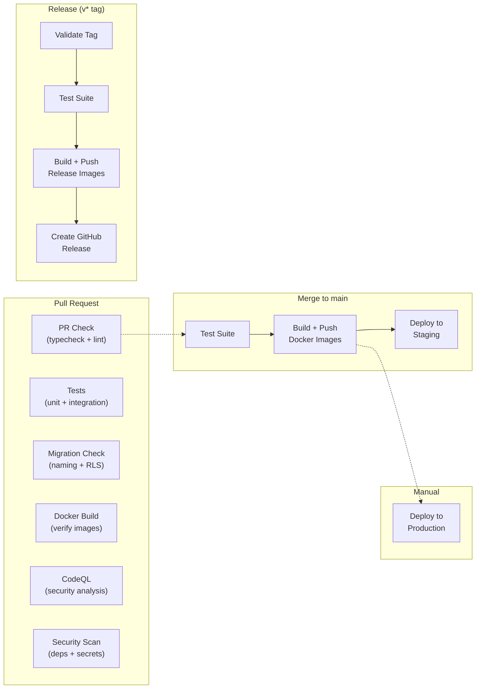
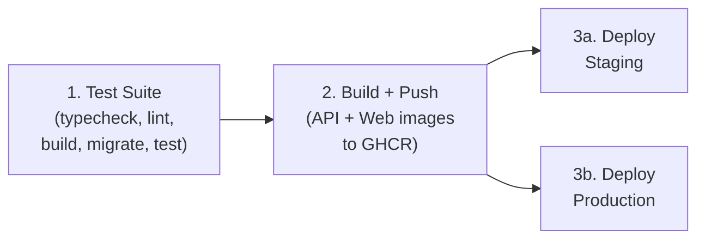
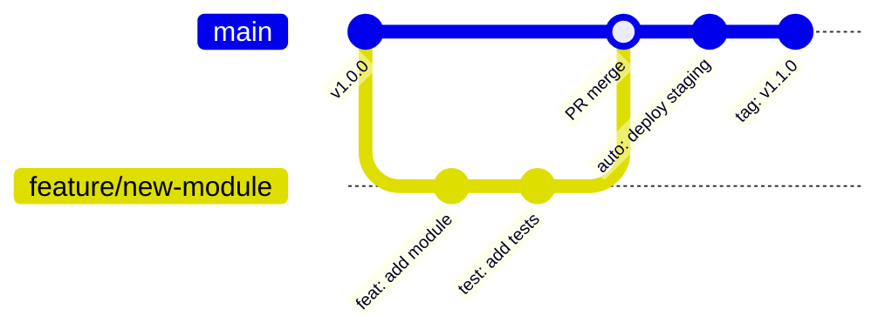

# CI/CD Pipeline Documentation

> Complete guide to the Staffora HRIS platform's continuous integration and deployment pipelines powered by GitHub Actions.
> **Last updated:** 2026-03-17

**Related documentation:**
- [Docker Guide](./docker-guide.md) -- Container configuration and multi-stage builds
- [Database Guide](../02-architecture/database-guide.md) -- Migration system and RLS validation
- [DevOps Status Report](./devops-status-report.md) -- Current infrastructure state

---

## Pipeline Overview



---

## GitHub Actions Workflows

The platform has eight workflow files in `.github/workflows/`:

| Workflow | File | Trigger | Purpose |
|----------|------|---------|---------|
| [PR Check](#pr-check) | `pr-check.yml` | Pull request to `main` | Fast feedback: typecheck, lint, Docker build verify |
| [Tests](#tests) | `test.yml` | Push to `main`, PR to `main` | Full test suite with database and coverage |
| [Migration Check](#migration-check) | `migration-check.yml` | PR to `main` (migrations/ changed) | Validate migration naming and RLS compliance |
| [Deploy](#deployment-pipeline) | `deploy.yml` | Push to `main`, manual dispatch | Build images, deploy to staging/production |
| [Release](#release-process) | `release.yml` | Tag push (`v*`) | Build release images, create GitHub Release |
| [CodeQL](#codeql-analysis) | `codeql.yml` | Push/PR to `main`, weekly schedule | Semantic code analysis for vulnerabilities |
| [Security Scan](#security-scanning) | `security.yml` | Push/PR to `main`, weekly schedule | Dependency audit, Docker scan, secret detection |
| [Stale Cleanup](#stale-cleanup) | `stale.yml` | Weekly schedule (Monday 8am UTC) | Auto-close stale issues and PRs |

### Concurrency Controls

All workflows use concurrency groups to cancel in-progress runs when a newer commit is pushed:

- **PR Check:** `pr-check-<PR number>` -- one run per PR
- **Tests:** No explicit concurrency group
- **Deploy:** `deploy-<ref>` -- one deploy per branch
- **CodeQL:** `codeql-<ref>` -- one analysis per ref

---

## PR Check

**File:** `.github/workflows/pr-check.yml`
**Trigger:** Every pull request targeting `main`
**Runtime:** ~2-3 minutes (no database required)

This is the lightweight, fast-feedback workflow. It validates code quality without requiring database or Redis services.

### Jobs

#### 1. Typecheck and Lint

```
checkout --> setup bun 1.1.38 --> bun install --> typecheck --> lint
```

Runs `bun run typecheck` and `bun run lint` across all packages.

#### 2. Docker Build Verification

Builds both Docker images (API and web) without pushing, using a matrix strategy:

| Matrix Entry | Dockerfile |
|-------------|------------|
| api | `packages/api/Dockerfile` |
| web | `packages/web/Dockerfile` |

Uses GitHub Actions cache (`type=gha`) for Docker layer caching to speed up builds.

---

## Tests

**File:** `.github/workflows/test.yml`
**Trigger:** Push to `main`, pull request to `main`
**Runtime:** ~5-10 minutes

The full test suite that requires database and Redis infrastructure.

### Service Containers

The workflow spins up PostgreSQL 16 and Redis 7 as GitHub Actions service containers with health checks.

### Jobs

#### 1. Unit and Integration Tests

```
checkout --> setup bun --> install --> typecheck --> lint --> build -->
  init database schema --> run migrations --> API tests (with coverage) -->
  shared tests --> coverage enforcement
```

**Database setup sequence:**

1. Initialize schema by running `docker/postgres/init.sql` (creates `app` schema, `hris_app` role, RLS helper functions)
2. Run migrations with `bun run migrate:up`
3. Tests connect as `hris_app` role (non-superuser, `NOBYPASSRLS`) so RLS is enforced

**Coverage enforcement:**

- API tests: minimum 60% line coverage (enforced, fails the build if below)
- Coverage reports are uploaded as artifacts (retained 14 days)
- Coverage summary is written to the GitHub Actions step summary

**Test environment variables:**

| Variable | Value | Purpose |
|----------|-------|---------|
| `TEST_DB_USER` | `hris_app` | Runtime role with RLS |
| `TEST_DB_ADMIN_USER` | `hris` | Admin role for setup |
| `BETTER_AUTH_SECRET` | test value | Auth encryption |
| `SESSION_SECRET` | test value | Session encryption |
| `CSRF_SECRET` | test value | CSRF protection |

#### 2. Frontend Tests

```
checkout --> setup bun --> install --> vitest (with coverage) --> coverage enforcement
```

Runs in parallel with the backend tests (no database required).

- Frontend tests use **vitest** (not bun test)
- Minimum 50% line coverage enforced
- Coverage artifacts uploaded separately

---

## Migration Check

**File:** `.github/workflows/migration-check.yml`
**Trigger:** Pull request to `main` when files in `migrations/` are changed
**Runtime:** ~30 seconds

Validates that new migration files follow project conventions.

### Checks Performed

#### 1. Naming Convention

Validates the filename pattern: `NNNN_description.sql`

- Must start with a 4-digit number
- Description must be lowercase with underscores
- Must end with `.sql`
- Fails the check if any file violates the convention

#### 2. RLS Compliance

For any `CREATE TABLE` statement found in changed migrations:

| Check | Severity | Description |
|-------|----------|-------------|
| `tenant_id` column | Warning | New tables should have a `tenant_id` column |
| `ENABLE ROW LEVEL SECURITY` | Warning | RLS must be enabled on tenant-owned tables |
| `tenant_isolation` policy | Warning | Tenant isolation policy must be created |

**Exceptions:** The following system tables are exempt from RLS checks:
- `schema_migrations`
- `domain_outbox`

Results are written to the GitHub Actions step summary and annotated on the PR files.

---

## Deployment Pipeline

**File:** `.github/workflows/deploy.yml`
**Triggers:**
- Automatic: Push to `main` (deploys to staging)
- Manual: `workflow_dispatch` with environment selector (staging or production)

### Pipeline Stages



### Stage 1: Test Suite

Identical to the test workflow -- typecheck, lint, build, migrations, and full test suite. This ensures no broken code reaches any environment.

### Stage 2: Build and Push

Builds both Docker images in parallel and pushes to GitHub Container Registry (GHCR):

**Image tags generated:**
- `sha-<short-sha>` -- Git commit SHA
- `main` -- Branch name (for pushes to main)
- `latest` -- Only for the default branch
- `YYYYMMDD-HHmmss` -- Timestamp

**Registry paths:**
- `ghcr.io/<org>/staffora/api:<tag>`
- `ghcr.io/<org>/staffora/web:<tag>`

### Stage 3a: Deploy to Staging

Runs automatically on every push to `main` (after tests pass).

**Deployment steps:**

1. Determine image tag from commit SHA
2. SSH into staging server
3. Pull new images
4. Rolling restart: `docker compose up -d --no-deps api worker web`
5. Run database migrations on the new API container
6. Health check verification (5 attempts, 15s apart)

**Required secrets:**
- `STAGING_SSH_KEY` -- SSH private key for deployment
- `STAGING_HOST` -- Server hostname (default: `staging.staffora.co.uk`)
- `STAGING_USER` -- SSH user (default: `deploy`)
- `STAGING_PATH` -- Application path (default: `/opt/staffora`)

### Stage 3b: Deploy to Production

Only runs via manual `workflow_dispatch` with `environment: production`. Requires GitHub Environment approval (configured in repo settings).

**Additional safety measures:**

1. **Pre-deployment checks** -- Logged checklist of prerequisites
2. **Database backup** -- Automatic `pg_dump` before deployment, stored in `backups/`
3. **Rolling restart** -- Services are restarted one at a time with a 10-second delay:
   - API first (with migration)
   - Worker second
   - Web third
4. **Health verification** -- 10 attempts with 15-second intervals
5. **Automatic rollback** -- If health checks fail, previous images are restored automatically
6. **Slack notification** -- Post-deployment status notification (if `SLACK_WEBHOOK_URL` is configured)

---

## Release Process

**File:** `.github/workflows/release.yml`
**Trigger:** Push of a `v*` tag (e.g., `v1.2.3`, `v1.0.0-beta.1`)

### Release Flow

```bash
# Create and push a release tag
git tag v1.2.3
git push origin v1.2.3
```

### Jobs

1. **Validate** -- Extract version info, detect pre-release tags (contains `-`)
2. **Test** -- Full test suite (same as deploy pipeline)
3. **Build** -- Build and push images with semver tags:
   - `1.2.3` (full version)
   - `1.2` (major.minor)
   - `1` (major only)
   - `sha-<commit>`
4. **Release** -- Create GitHub Release with auto-generated release notes and Docker image references

### Version Tagging

Release images use semantic versioning tags:

```
ghcr.io/<org>/staffora/api:1.2.3
ghcr.io/<org>/staffora/api:1.2
ghcr.io/<org>/staffora/api:1
```

Pre-release tags (e.g., `v1.0.0-beta.1`) are marked as pre-release on the GitHub Release.

---

## Security Scanning

**File:** `.github/workflows/security.yml`
**Trigger:** Push to `main`, PR to `main`, weekly schedule (Monday 6am UTC)

### Scan Types

#### 1. Dependency Audit

Runs `npx audit-ci` to check for known vulnerabilities in dependencies. Results are written to the GitHub Actions step summary.

#### 2. Docker Image Scan

Uses [Trivy](https://trivy.dev/) to scan built Docker images for OS and dependency vulnerabilities:

- Scans both `api` and `web` images (matrix strategy)
- Reports `CRITICAL` and `HIGH` severity findings
- Uploads SARIF results to GitHub Security tab
- Only runs on push/schedule (not on PRs, to save build time)

#### 3. Secret Detection

Uses [TruffleHog](https://github.com/trufflesecurity/trufflehog) to scan the full git history for accidentally committed secrets:

- Scans all commits (full `fetch-depth: 0`)
- Reports only verified (confirmed live) secrets via `--only-verified`

---

## CodeQL Analysis

**File:** `.github/workflows/codeql.yml`
**Trigger:** Push to `main`, PR to `main`, weekly schedule (Monday 4am UTC)

Performs semantic code analysis using GitHub's CodeQL engine:

- **Language:** JavaScript/TypeScript
- **Query suites:** `security-extended` + `security-and-quality` (more thorough than default)
- Results appear in the GitHub Security tab under Code scanning alerts
- Uses `continue-on-error: true` on the analysis step to avoid blocking PRs on false positives

---

## Stale Cleanup

**File:** `.github/workflows/stale.yml`
**Trigger:** Weekly schedule (Monday 8am UTC)

Automatically manages stale issues and pull requests:

| Parameter | Issues | Pull Requests |
|-----------|--------|---------------|
| Days before stale | 30 | 30 |
| Days before close | 14 | 7 |
| Exempt labels | `pinned`, `security`, `bug`, `critical` | `pinned`, `security`, `dependencies` |
| Operations per run | 50 | 50 |

---

## Branch Strategy



| Branch | Purpose | Protection |
|--------|---------|------------|
| `main` | Primary branch, always deployable | Required PR reviews, status checks |
| `feature/*` | Feature development | None (PR required to merge) |
| `fix/*` | Bug fixes | None (PR required to merge) |

**Merge to `main` triggers:**
1. PR Check (typecheck + lint)
2. Full test suite (with database)
3. Migration validation (if migrations changed)
4. CodeQL analysis
5. Security scan
6. Auto-deploy to staging

**Production deployment** is always a manual action requiring explicit approval through the GitHub Environment protection rules.

---

## Required Repository Configuration

### GitHub Environments

Configure two environments in repository Settings > Environments:

1. **staging**
   - URL: `https://staging.staffora.co.uk`
   - No required reviewers (auto-deploy on merge)

2. **production**
   - URL: `https://staffora.co.uk`
   - Required reviewers (approval gate before deploy)
   - Deployment branches: `main` only

### Required Secrets

| Secret | Used By | Description |
|--------|---------|-------------|
| `STAGING_SSH_KEY` | deploy.yml | SSH key for staging server |
| `STAGING_HOST` | deploy.yml | Staging server hostname |
| `PRODUCTION_SSH_KEY` | deploy.yml | SSH key for production server |
| `PRODUCTION_HOST` | deploy.yml | Production server hostname |
| `SLACK_WEBHOOK_URL` | deploy.yml | Slack notifications (optional) |

### Branch Protection Rules (main)

Recommended settings for the `main` branch:

- Require pull request reviews (at least 1 reviewer)
- Require status checks to pass: `Typecheck & Lint`, `Unit & Integration Tests`, `Frontend Tests`
- Require branches to be up to date before merging
- Do not allow bypassing the above settings
