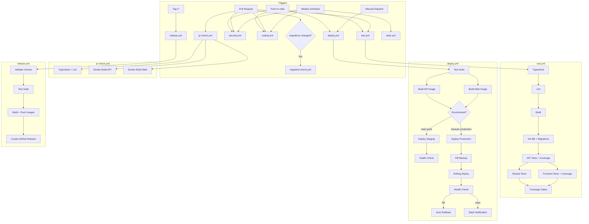
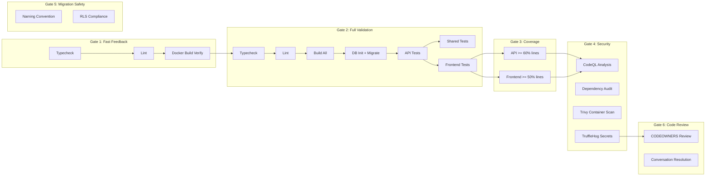
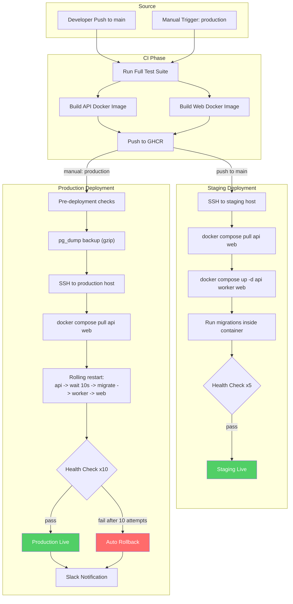
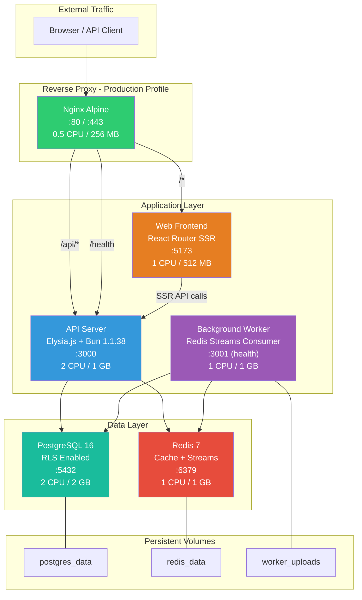
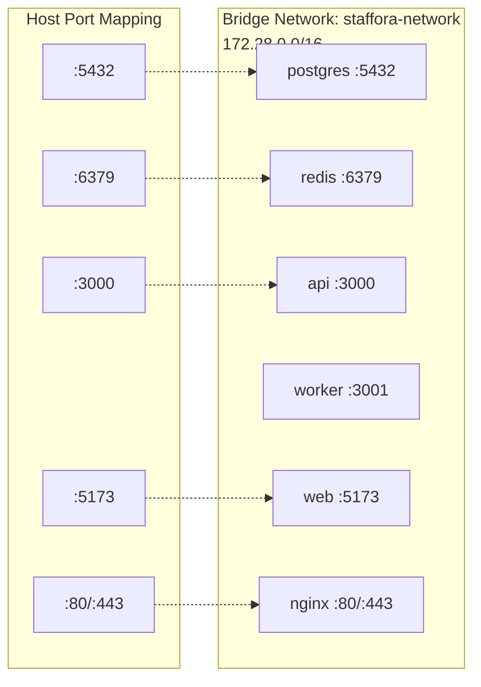
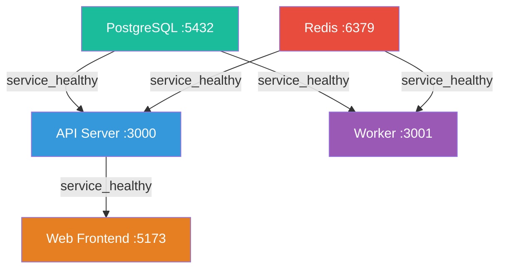

# Staffora Platform - DevOps Status Report

> Report date: 2026-03-16
> Platform: Staffora HRIS (UK-only enterprise multi-tenant HR system)
> Repository: HRISystem (monorepo, Bun workspaces)
> **Last updated:** 2026-03-17

---

## Table of Contents

1. [CI/CD Architecture](#1-cicd-architecture)
2. [Pipeline Health](#2-pipeline-health)
3. [Security Posture](#3-security-posture)
4. [Deployment Architecture](#4-deployment-architecture)
5. [Infrastructure](#5-infrastructure)
6. [Coverage & Testing](#6-coverage--testing)
7. [Technical Debt Score](#7-technical-debt-score)
8. [Recommendations](#8-recommendations)

---

## 1. CI/CD Architecture

### Workflow Inventory

| # | Workflow | File | Trigger | Purpose | Status |
|---|---------|------|---------|---------|--------|
| 1 | **Tests** | `test.yml` | push to main, PRs | Full test suite with DB/Redis services, typecheck, lint, build, API+shared+frontend tests, coverage enforcement | Active |
| 2 | **Deploy** | `deploy.yml` | push to main (staging), manual (production) | Build Docker images, push to GHCR, deploy to staging/production with health checks and rollback | Active |
| 3 | **PR Check** | `pr-check.yml` | PRs targeting main | Fast feedback: typecheck + lint + Docker build verification (no DB required) | Active |
| 4 | **Security Scan** | `security.yml` | push/PR/weekly (Mon 6am) | Dependency audit (bun), container scan (Trivy), secret detection (TruffleHog) | Active |
| 5 | **CodeQL Analysis** | `codeql.yml` | push/PR/weekly (Mon 4am) | Semantic static analysis for JS/TS (security-extended + security-and-quality) | Active |
| 6 | **Release** | `release.yml` | version tags (`v*`) | Validate -> test -> build release images -> create GitHub Release with notes | Active |
| 7 | **Migration Check** | `migration-check.yml` | PRs modifying `migrations/` | Validate naming convention (4-digit prefix) and RLS compliance | Active |
| 8 | **Stale Cleanup** | `stale.yml` | weekly (Mon 8am) | Auto-close stale issues (30+14 days) and PRs (30+7 days) | Active |

### Pipeline Flow



### Concurrency Controls

| Workflow | Concurrency Group | Cancel In-Progress |
|----------|------------------|--------------------|
| deploy.yml | `deploy-${{ github.ref }}` | Yes |
| pr-check.yml | `pr-check-${{ PR number }}` | Yes |
| codeql.yml | `codeql-${{ github.ref }}` | Yes |
| Others | None (run all) | No |

---

## 2. Pipeline Health

### Quality Gates

Every code change must pass through these gates before reaching production:



### Pipeline Coverage Summary

| Gate | What It Checks | Blocks Merge? |
|------|---------------|---------------|
| Typecheck | TypeScript compilation errors across all packages | Yes |
| Lint | Code style and quality rules | Yes |
| Build | All packages compile successfully | Yes |
| API Tests | Unit, integration, e2e, security tests with real DB/Redis | Yes |
| Shared Tests | Shared package utility and type tests | Yes |
| Frontend Tests | Component and hook tests via vitest | Yes |
| Coverage (API) | Line coverage >= 60% | Yes |
| Coverage (Frontend) | Line coverage >= 50% | Yes |
| CodeQL | Security vulnerabilities and code quality | Advisory |
| Dependency Audit | High/critical npm vulnerabilities | Yes |
| Container Scan | High/critical CVEs in Docker images | Advisory |
| Secret Detection | Verified leaked secrets in git history | Advisory |
| Migration Naming | 4-digit prefix convention | Yes (if migrations changed) |
| Migration RLS | tenant_id + RLS policy presence | Warning only |
| CODEOWNERS | Appropriate team review | Yes (when branch protection enabled) |

---

## 3. Security Posture

### Static Analysis

| Tool | Scope | Frequency | Severity Threshold | Output |
|------|-------|-----------|-------------------|--------|
| **CodeQL** | JS/TS semantic analysis | Every push, PR, weekly | All (security-extended + security-and-quality) | GitHub Security tab (SARIF) |
| **TruffleHog** | Secret detection in git history | Every push, PR | Verified secrets only | CI failure |
| **Bun Audit** | NPM dependency vulnerabilities | Every push, PR, weekly | High + Critical | CI failure + Step Summary |

### Container Security

| Tool | Scope | Frequency | Severity Threshold | Output |
|------|-------|-----------|-------------------|--------|
| **Trivy** | Docker image CVE scanning | Push to main, weekly | Critical + High | GitHub Security tab (SARIF) |
| **Dependabot** | Base image updates | Weekly | All | Auto-PRs |
| **Multi-stage builds** | Minimal attack surface | Every build | N/A | No devDeps in production, non-root user |

### Dependency Management

| Mechanism | Ecosystem | Schedule | Grouping |
|-----------|-----------|----------|----------|
| Dependabot | npm | Weekly (Monday) | Production deps (patch+minor), Dev deps (patch+minor) |
| Dependabot | Docker | Weekly | Per Dockerfile (api, web) |
| Dependabot | GitHub Actions | Weekly | Ungrouped |
| Bun Audit | npm | Every CI run | High/Critical fail gate |

### Runtime Security (Application Layer)

| Layer | Mechanism | Description |
|-------|-----------|-------------|
| **Authentication** | BetterAuth | Session-based auth with MFA support |
| **CSRF Protection** | BetterAuth + custom | CSRF tokens required on mutating requests |
| **Authorization** | RBAC plugin | Role-based access control with permission checks |
| **Data Isolation** | PostgreSQL RLS | Row-Level Security enforced at database level (tenant_id) |
| **Rate Limiting** | Elysia plugin + Nginx | Application-level + reverse proxy rate limiting |
| **Idempotency** | Elysia plugin | Idempotency-Key header prevents duplicate mutations |
| **Audit Trail** | Audit plugin | All mutations logged with actor, tenant, timestamp |
| **Input Validation** | TypeBox schemas | Request body/params/query validated against schemas |
| **Security Headers** | Elysia plugin + Nginx | X-Frame-Options, X-Content-Type-Options, HSTS, CSP |
| **TLS** | Nginx | TLSv1.2+ with modern cipher suite, HSTS preload |
| **Non-root containers** | Dockerfile | All production containers run as UID 1001 (staffora user) |

### Nginx Security Configuration

| Feature | Setting |
|---------|---------|
| TLS Protocols | TLSv1.2, TLSv1.3 |
| HSTS | max-age=63072000, includeSubDomains, preload |
| X-Frame-Options | DENY |
| X-Content-Type-Options | nosniff |
| X-XSS-Protection | 1; mode=block |
| Referrer-Policy | strict-origin-when-cross-origin |
| API rate limit | 100 req/s per IP, burst 50 |
| Auth rate limit | 10 req/s per IP, burst 5 |
| Connection limit | 50 concurrent per IP |
| Client body size | 50 MB max |
| HTTP-to-HTTPS | 301 redirect (except /health) |

### Security Gaps

| Gap | Risk Level | Mitigation Plan |
|-----|-----------|-----------------|
| Branch protection not enforced | **High** | P0: Enable in GitHub settings immediately |
| No WAF | Medium | P3: Deploy Cloudflare WAF or ModSecurity |
| No APM/tracing for anomaly detection | Medium | P1: OpenTelemetry integration |
| No secret rotation | Medium | P2: Automated credential rotation |
| No DAST scanning | Low | Consider OWASP ZAP integration |
| Redis security config labeled "dev only" | Medium | Harden for production (rename dangerous commands, enable TLS) |

---

## 4. Deployment Architecture

### Deploy Flow Diagram



### Environment Configuration

| Aspect | Staging | Production |
|--------|---------|------------|
| **URL (API)** | staging-api.staffora.co.uk | api.staffora.co.uk |
| **URL (Web)** | staging.staffora.co.uk | staffora.co.uk |
| **Deploy Trigger** | Automatic on push to main | Manual workflow_dispatch |
| **Approval Gate** | None | GitHub Environment protection rules |
| **Health Checks** | 5 attempts, 15s interval | 10 attempts, 15s interval |
| **Rollback** | Manual | Automatic on health failure |
| **DB Backup** | No | Yes (pre-deploy pg_dump + gzip) |
| **Notifications** | None | Slack webhook (success + failure) |
| **Image Tags** | `sha-XXXXXXX`, `main`, `latest`, `YYYYMMDD-HHmmss` | `sha-XXXXXXX` (pinned) |

### Docker Image Registry

- **Registry**: GitHub Container Registry (ghcr.io)
- **Images**: `ghcr.io/{repo}/api`, `ghcr.io/{repo}/web`
- **Tag Strategy (deploy)**: `sha-{short}`, `{branch}`, `latest`, `YYYYMMDD-HHmmss`
- **Tag Strategy (release)**: `{major}.{minor}.{patch}`, `{major}.{minor}`, `{major}`, `sha-{short}`
- **Build Cache**: GitHub Actions cache (GHA), max mode
- **Build Engine**: Docker Buildx

### Rolling Deploy Procedure (Production)

```
Step 1: docker compose pull api web             (download new images)
Step 2: docker compose up -d --no-deps api      (restart API only)
Step 3: sleep 10                                 (wait for API to initialize)
Step 4: docker compose exec api bun run migrate  (run database migrations)
Step 5: docker compose up -d --no-deps worker    (restart worker)
Step 6: docker compose up -d --no-deps web       (restart web frontend)
Step 7: Health check loop (10 attempts, 15s)     (verify deployment)
Step 8: On failure -> docker compose down + up   (rollback to previous images)
```

### Database Backup (Production Only)

| Attribute | Detail |
|-----------|--------|
| Method | `pg_dump` piped through `gzip` |
| Naming | `staffora_backup_YYYYMMDD_HHMMSS.sql.gz` |
| Storage | `backups/` directory on production host |
| Timing | Before every production deployment |
| Verification | File size logged after creation |

---

## 5. Infrastructure

### Docker Services Architecture



### Resource Allocation

| Service | CPU Limit | Memory Limit | CPU Reserved | Memory Reserved | Log Rotation |
|---------|-----------|-------------|--------------|-----------------|-------------|
| **PostgreSQL** | 2 cores | 2 GB | 0.5 cores | 512 MB | 50 MB x 5 files (250 MB) |
| **Redis** | 1 core | 1 GB | 0.25 cores | 256 MB | 20 MB x 3 files (60 MB) |
| **API** | 2 cores | 1 GB | 0.5 cores | 256 MB | 50 MB x 5 files (250 MB) |
| **Worker** | 1 core | 1 GB | 0.25 cores | 256 MB | 50 MB x 5 files (250 MB) |
| **Web** | 1 core | 512 MB | 0.25 cores | 128 MB | 20 MB x 3 files (60 MB) |
| **Nginx** | 0.5 cores | 256 MB | -- | -- | 50 MB x 5 files (250 MB) |
| **Total** | **7.5 cores** | **5.75 GB** | **1.75 cores** | **1.4 GB** | **1.12 GB max** |

### PostgreSQL Configuration (Tuned for 2 GB Container)

| Parameter | Value | Purpose |
|-----------|-------|---------|
| shared_buffers | 512 MB | Main buffer cache (25% of memory) |
| work_mem | 4 MB | Per-operation sort/hash memory |
| effective_cache_size | 1536 MB | Planner hint for OS cache (75% of memory) |
| maintenance_work_mem | 256 MB | VACUUM, CREATE INDEX operations |
| wal_buffers | 16 MB | WAL write buffer |
| max_connections | 100 | Connection limit (needs PgBouncer for scaling) |
| max_parallel_workers | 4 | Parallel query workers |
| random_page_cost | 1.1 | Tuned for SSD storage |
| effective_io_concurrency | 200 | SSD-optimized I/O |
| wal_level | replica | Enables streaming replication |
| min_wal_size / max_wal_size | 1 GB / 4 GB | WAL retention |
| log_min_duration_statement | 200 ms | Slow query logging threshold |
| log_lock_waits | on | Deadlock detection visibility |
| log_checkpoints | on | Checkpoint activity logging |
| autovacuum_max_workers | 3 | Concurrent autovacuum processes |

### Redis Configuration

| Parameter | Value | Purpose |
|-----------|-------|---------|
| maxmemory | 750 MB | Memory ceiling (within 1 GB container) |
| maxmemory-policy | allkeys-lru | LRU eviction for cache behavior |
| appendonly | yes | AOF persistence enabled |
| appendfsync | everysec | Balanced durability/performance |
| RDB saves | 900/1, 300/10, 60/10000 | Tiered snapshot intervals |
| maxclients | 1000 | Client connection limit |
| slowlog-log-slower-than | 10 ms | Slow command tracking |
| stream-node-max-bytes | 4096 | Tuned for job queue usage |
| lazyfree | Enabled (eviction, expire, delete) | Non-blocking memory reclaim |

### Network Topology



### Persistent Volumes

| Volume | Mount Point | Service | Purpose |
|--------|------------|---------|---------|
| `postgres_data` | `/var/lib/postgresql/data` | PostgreSQL | Database files, WAL |
| `redis_data` | `/data` | Redis | RDB snapshots + AOF logs |
| `worker_uploads` | `/app/uploads` | Worker | Export files, generated PDFs, certificates |

### Service Health Checks

| Service | Method | Interval | Timeout | Retries | Start Period |
|---------|--------|----------|---------|---------|-------------|
| **PostgreSQL** | `pg_isready -U hris -d hris` | 10s | 5s | 5 | 10s |
| **Redis** | `redis-cli -a <password> ping` | 10s | 5s | 5 | 5s |
| **API** | `bun fetch('localhost:3000/health')` | 30s | 10s | 3 | 30s |
| **Worker** | `bun fetch('localhost:3001/health')` | 30s | 10s | 3 | 30s |
| **Web** | `wget --spider localhost:5173/` | 30s | 10s | 3 | 10s |

### Service Dependency Chain



### Docker Image Design

**API Image** (`packages/api/Dockerfile`) -- 4-stage multi-stage build:

| Stage | Purpose | Details |
|-------|---------|---------|
| `deps` | Install all dependencies | Workspace-scoped (api + shared only, excludes web/website) |
| `builder` | Compile application | `bun build src/app.ts --outdir dist --target bun` |
| `prod-deps` | Production dependencies only | `bun install --production` (no devDependencies) |
| `runner` | Production runtime | Non-root user, built-in healthcheck, serves API (default) and worker (override) |

**Web Image** (`packages/web/Dockerfile`) -- 3-stage multi-stage build:

| Stage | Purpose | Details |
|-------|---------|---------|
| `deps` | Install all dependencies | Full workspace install (SSR needs shared package) |
| `builder` | Build SSR application | React Router v7 build producing `build/server/` + `build/client/` |
| `runner` | Production runtime | Non-root user, healthcheck via wget, SSR via `react-router-serve` |

---

## 6. Coverage & Testing

### Test Categories

| Category | Location | Runner | Services Required | CI Workflow |
|----------|----------|--------|-------------------|-------------|
| **Unit Tests** | `packages/api/src/test/unit/` | bun test | None (mocked) | test.yml |
| **Integration Tests** | `packages/api/src/test/integration/` | bun test | Postgres + Redis | test.yml |
| **E2E Tests** | `packages/api/src/test/e2e/` | bun test | Postgres + Redis | test.yml |
| **Security Tests** | `packages/api/src/test/security/` | bun test | Postgres + Redis | test.yml |
| **Performance Tests** | `packages/api/src/test/performance/` | bun test | Postgres + Redis | test.yml |
| **Chaos Tests** | `packages/api/src/test/chaos/` | bun test | Postgres + Redis | test.yml |
| **Shared Package** | `packages/shared/src/__tests__/` | bun test | None | test.yml |
| **Frontend Tests** | `packages/web/app/__tests__/` | vitest | None | test.yml |

### Test Infrastructure Details

| Aspect | Configuration |
|--------|--------------|
| **Database role** | Tests connect as `hris_app` (NOBYPASSRLS) -- RLS is enforced during testing |
| **Tenant isolation** | Each test uses `createTestContext()` with a unique tenant UUID |
| **Test factories** | `helpers/factories.ts` for generating employees, departments, leaves, etc. |
| **Custom assertions** | `expectRlsError()` for verifying cross-tenant access is blocked |
| **System bypass** | `withSystemContext()` for test setup/teardown that needs to bypass RLS |
| **CI services** | PostgreSQL 16 + Redis 7 as GitHub Actions service containers |

### Coverage Gates

| Package | Minimum Threshold | Format | Artifact Retention | Enforcement |
|---------|------------------|--------|-------------------|-------------|
| **API** (`packages/api`) | 60% line coverage | lcov | 14 days | Build fails if below threshold |
| **Frontend** (`packages/web`) | 50% line coverage | lcov | 14 days | Build fails if below threshold |

Coverage summaries are written to GitHub Step Summary with a table showing lines hit/total/percentage and functions hit/total. Thresholds are designed to increase over time.

### What Integration Tests Verify

| Area | What Is Tested | Why It Matters |
|------|---------------|----------------|
| **RLS Isolation** | Cross-tenant data access blocked | Multi-tenant data security |
| **Effective Dating** | Overlap prevention, concurrent write safety | HR data integrity |
| **Idempotency** | Duplicate writes prevented via Idempotency-Key | Financial/payroll correctness |
| **Outbox Atomicity** | Domain events written in same transaction | Event consistency |
| **State Machines** | Invalid state transitions rejected | Workflow enforcement |
| **Route Authorization** | RBAC enforced on all endpoints | Access control |
| **SQL Injection** | Parameterized queries prevent injection | Database security |
| **XSS Prevention** | Output encoding prevents script injection | Frontend security |
| **CSRF Protection** | Tokens required on mutating requests | Session hijacking prevention |

### Testing Gaps

| Gap | Impact | Priority | Recommendation |
|-----|--------|----------|---------------|
| No browser E2E tests | UI regressions undetected | P1 | Add Playwright tests for critical user journeys |
| No load testing in CI | Performance regressions undetected | P2 | Add k6 load tests post-staging-deploy |
| No API contract tests | Breaking API changes possible | P2 | Add TypeBox schema-based contract tests |
| Chaos tests not automated in CI | Resilience untested on schedule | P2 | Add chaos tests to weekly CI run |
| No visual regression | CSS/layout regressions undetected | P3 | Add Playwright visual snapshot comparisons |

---

## 7. Technical Debt Score

### Scoring Methodology

Each area is scored 1-10 based on implementation completeness, best practice adherence, and production readiness for a UK enterprise HRIS handling sensitive employee data.

### Area Scores

| Area | Score | Justification |
|------|-------|---------------|
| **CI/CD** | 9/10 | 8 workflows covering test, deploy, security, release, migration validation, stale cleanup. Build matrix, concurrency controls, coverage gates, SARIF integration. Missing: branch protection enforcement, test parallelization/sharding. |
| **Security** | 8/10 | CodeQL + Trivy + TruffleHog + Dependabot + bun audit. Runtime: RLS, CSRF, RBAC, MFA, rate limiting, idempotency, audit trail. Non-root containers, TLS, HSTS. Missing: WAF, secret rotation, DAST, runtime scanning. |
| **Testing** | 7/10 | Comprehensive test categories (unit, integration, e2e, security, performance, chaos). RLS-enforced test DB. Coverage gates with enforcement. Missing: browser E2E (Playwright), load tests in CI, API contract tests. |
| **Infrastructure** | 7/10 | Multi-stage Docker builds, tuned Postgres/Redis configs, resource limits, health checks, log rotation, nginx with TLS/HSTS/rate limiting. Missing: IaC (Terraform), PgBouncer, auto-scaling, CDN. |
| **Observability** | 4/10 | Health check endpoints on all services. Slow query logging (Postgres >200ms). Redis slow log. Nginx access logs with timing. Log rotation. Missing: error tracking (Sentry), APM/tracing, centralized logging, uptime monitoring, dashboards. **Biggest gap.** |
| **Deployment** | 8/10 | Auto-deploy staging, manual production with approval gates. Rolling deploys, automatic rollback on failure, pre-deploy DB backup, Slack notifications, release automation with semver. Missing: blue/green, canary, feature flags. |
| **Documentation** | 7/10 | Comprehensive Docs/ directory with architecture, API reference (200+ endpoints), patterns, guides. CLAUDE.md with detailed instructions. CODEOWNERS. Missing: incident runbooks, operational playbooks, SLA/SLO docs. |

### Visual Score Card

```
CI/CD:          9/10  ==================--  (90%)
Security:       8/10  ================----  (80%)
Testing:        7/10  ==============------  (70%)
Infrastructure: 7/10  ==============------  (70%)
Observability:  4/10  ========------------  (40%)
Deployment:     8/10  ================----  (80%)
Documentation:  7/10  ==============------  (70%)
-----------------------------------------------------
Overall:        7.1/10                      (71%)
```

### Score Trend Target

| Quarter | Target | Key Actions to Get There |
|---------|--------|------------------------|
| Q2 2026 | 78% | Sentry, uptime monitoring, incident runbooks, branch protection |
| Q3 2026 | 84% | APM/tracing, centralized logging, PgBouncer, Playwright E2E |
| Q4 2026 | 88% | IaC (Terraform), load testing, secret rotation, CDN |
| Q1 2027 | 92% | WAF, blue/green deploys, auto-scaling, SLA/SLO dashboards |

---

## 8. Recommendations

### Top 10 Priority Actions

| # | Priority | Action | Impact | Effort | Area |
|---|----------|--------|--------|--------|------|
| 1 | **P0** | **Enable branch protection rules on main** | Prevents bypassing all CI gates and CODEOWNERS review. Without this, any developer can push directly to main. | Low (1 hour) | Governance |
| 2 | **P0** | **Integrate Sentry error tracking** | Production errors are currently invisible. Sentry provides real-time alerts, stack traces with source maps, and release tracking. Essential for enterprise HRIS. | Medium (2-3 days) | Observability |
| 3 | **P0** | **Set up uptime monitoring with status page** | No external visibility into platform availability. Required for SLA commitments to enterprise customers. Use UptimeRobot, Better Uptime, or Checkly. | Low (1 day) | Observability |
| 4 | **P0** | **Create incident response runbooks** | No documented procedures for production incidents. Slows response time and increases risk of data-impacting errors during outages. | Medium (2-3 days) | Operations |
| 5 | **P1** | **Add centralized logging (Loki + Grafana)** | Container logs only accessible via `docker logs`. Need searchable, correlated, tenant-filterable log aggregation. Foundation for all observability. | High (1 week) | Observability |
| 6 | **P1** | **Add APM with OpenTelemetry** | No visibility into request latency, DB query performance, or worker job duration. Required for SLO tracking and performance optimization. | High (1 week) | Observability |
| 7 | **P1** | **Set up PgBouncer connection pooling** | max_connections=100 will be exhausted under production load. PgBouncer enables efficient connection sharing. Must verify RLS context propagation. | Medium (2-3 days) | Infrastructure |
| 8 | **P1** | **Add Playwright browser E2E tests** | No automated testing of actual user workflows in a real browser. Login, employee creation, leave submission could regress undetected. | Medium (3-5 days) | Testing |
| 9 | **P1** | **Add PR and issue templates** | No standardized format for contributions. Templates improve review quality, ensure security/migration flags are checked. | Low (1 day) | Governance |
| 10 | **P1** | **Set up Let's Encrypt certificate auto-renewal** | Static certificate files in nginx config. Manual renewal is error-prone; expiry causes immediate production outage. | Low (1 day) | Security |

### Quick Wins (Can Be Done This Week)

1. **Branch protection** -- 1 hour in GitHub repo settings, immediate security improvement
2. **PR/issue templates** -- 1 day, improves all future contributions
3. **Uptime monitoring** -- 1 day with a SaaS tool (Better Uptime, Checkly, UptimeRobot)

### Observability Roadmap (Biggest Gap)

```mermaid
graph LR
    subgraph "Phase 1: Weeks 1-2"
        A[Sentry Error Tracking] --> B[Uptime Monitoring]
    end

    subgraph "Phase 2: Weeks 3-4"
        C[Loki + Promtail] --> D[Grafana Dashboards]
    end

    subgraph "Phase 3: Weeks 5-6"
        E[OpenTelemetry SDK] --> F[Grafana Tempo]
        F --> G[Performance Dashboards]
    end

    subgraph "Phase 4: Weeks 7-8"
        H[SLO Definitions] --> I[Error Budget Tracking]
        I --> J[Automated Alerting]
    end

    B --> C
    D --> E
    G --> H

    style A fill:#ff6b6b,color:#fff
    style B fill:#ff6b6b,color:#fff
    style C fill:#ffa94d,color:#fff
    style D fill:#ffa94d,color:#fff
    style E fill:#ffd43b,color:#000
    style F fill:#ffd43b,color:#000
    style G fill:#ffd43b,color:#000
    style H fill:#69db7c,color:#000
    style I fill:#69db7c,color:#000
    style J fill:#69db7c,color:#000
```



Going from 4/10 to 8/10 in observability within 8 weeks would raise the overall score from 71% to approximately 80%.

---

## Appendix: File Reference

| File | Purpose |
|------|---------|
| `.github/workflows/test.yml` | CI test pipeline with coverage enforcement |
| `.github/workflows/deploy.yml` | CD pipeline (staging auto-deploy, production manual + rollback) |
| `.github/workflows/pr-check.yml` | PR fast-feedback checks (typecheck, lint, Docker build verify) |
| `.github/workflows/security.yml` | Security scanning (Trivy, TruffleHog, bun audit) |
| `.github/workflows/codeql.yml` | CodeQL static analysis (security-extended + quality) |
| `.github/workflows/release.yml` | Release automation (semver tag -> test -> build -> GitHub Release) |
| `.github/workflows/migration-check.yml` | Migration file validation (naming + RLS compliance) |
| `.github/workflows/stale.yml` | Stale issue/PR cleanup (weekly) |
| `.github/dependabot.yml` | Dependency auto-update (npm, Docker, GitHub Actions) |
| `.github/CODEOWNERS` | Code ownership rules (engineering, devops, security, frontend teams) |
| `docker/docker-compose.yml` | Full service orchestration (5 services + nginx production profile) |
| `docker/nginx/nginx.conf` | Reverse proxy, TLS termination, rate limiting, security headers |
| `docker/postgres/postgresql.conf` | PostgreSQL tuning (512 MB shared_buffers, parallel workers) |
| `docker/postgres/init.sql` | Schema + role initialization (app schema, hris_app role, RLS functions) |
| `docker/redis/redis.conf` | Redis configuration (750 MB, AOF, LRU eviction, stream tuning) |
| `packages/api/Dockerfile` | API + Worker multi-stage build (4 stages, non-root, healthcheck) |
| `packages/web/Dockerfile` | Web frontend multi-stage build (3 stages, SSR, non-root) |
| `.dockerignore` | Root Docker build context exclusions |
| `packages/api/.dockerignore` | API-specific build exclusions |
| `packages/web/.dockerignore` | Web-specific build exclusions |
| `docker/scripts/backup-db.sh` | Database backup script |
| `docker/scripts/restore-db.sh` | Database restore script |

---

## Related Documents

- [DevOps Tasks](devops-tasks.md) — Infrastructure task list and progress tracking
- [DevOps Dashboard](devops-dashboard.md) — Pipeline architecture and status overview
- [DevOps Master Checklist](../checklists/devops-master-checklist.md) — Comprehensive DevOps readiness checklist
- [Deployment Guide](../guides/DEPLOYMENT.md) — Docker Compose deployment instructions
- [Infrastructure Audit](../audit/infrastructure-audit.md) — Docker, CI/CD, and infrastructure findings
- [Production Checklist](../operations/production-checklist.md) — Pre-launch readiness checklist
