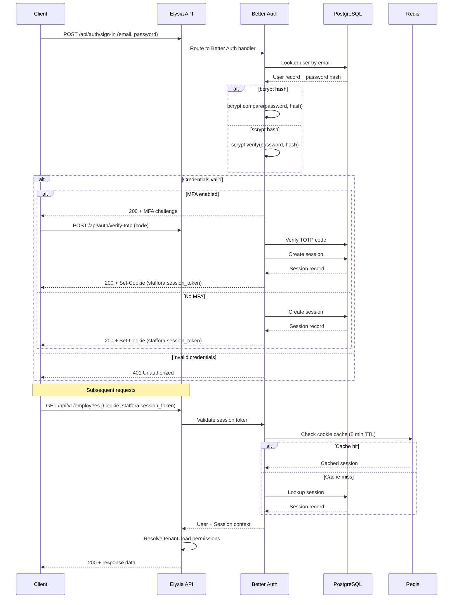
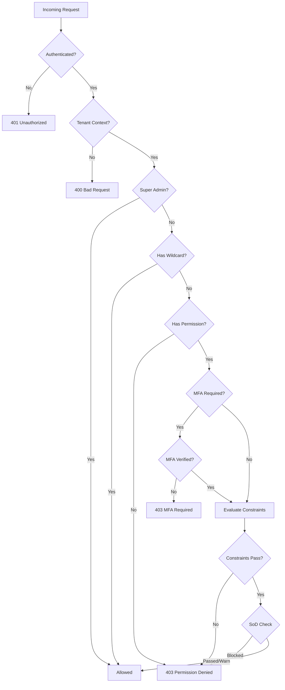
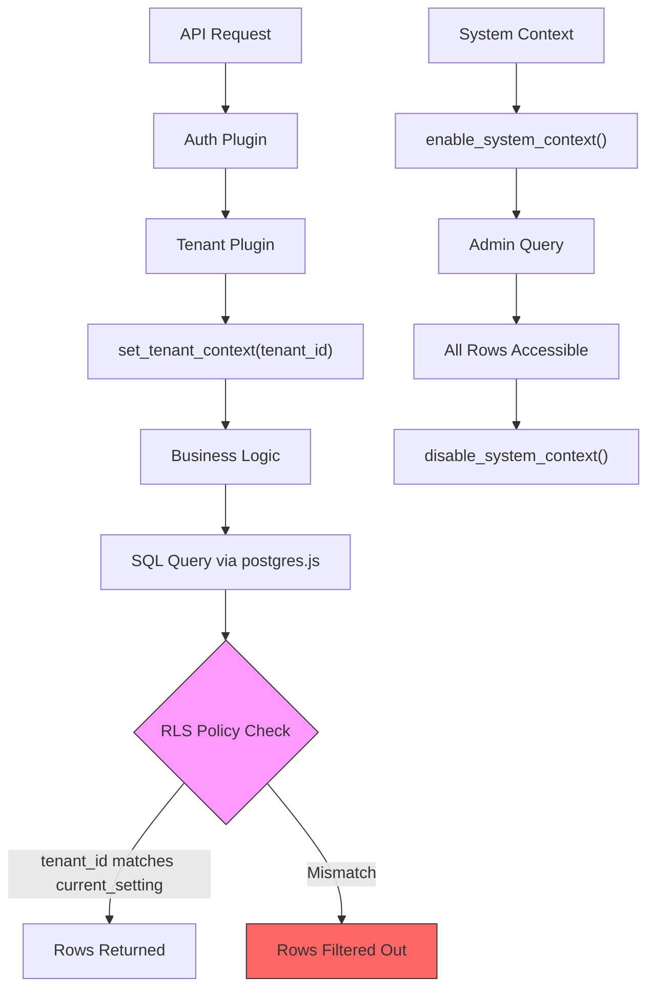

# Security Architecture

*Last updated: 2026-03-17*

This document describes the security architecture of the Staffora HRIS platform. Staffora handles sensitive employee data -- payroll, contracts, disciplinary records, medical information -- and operates under UK GDPR obligations. Security is enforced at every layer: network, application, database, and infrastructure.

## Table of Contents

- [1. Authentication (BetterAuth)](#1-authentication-betterauth)
- [2. Authorization (RBAC)](#2-authorization-rbac)
- [3. Multi-Tenant Isolation (RLS)](#3-multi-tenant-isolation-rls)
- [4. API Security](#4-api-security)
- [5. Security Headers](#5-security-headers)
- [6. Data Protection](#6-data-protection)
- [7. OWASP Top 10 Mitigations](#7-owasp-top-10-mitigations)
- [8. Security Testing](#8-security-testing)
- [Related Documents](#related-documents)

---

## 1. Authentication (BetterAuth)

All authentication is handled by [Better Auth](https://better-auth.com/) -- there is no custom auth system. The configuration lives in `packages/api/src/lib/better-auth.ts` and the Elysia plugin wrapper is at `packages/api/src/plugins/auth-better.ts`.

### Session-Based Auth with Secure Cookies

Staffora uses session-based authentication with HTTP-only cookies, not JWTs. Sessions are stored in the `app.session` table and managed entirely by Better Auth.

| Setting | Value |
|---|---|
| Session lifetime | 7 days (`expiresIn: 60 * 60 * 24 * 7`) |
| Session refresh interval | Every 24 hours (`updateAge: 60 * 60 * 24`) |
| Cookie cache | 5 minutes (`cookieCache.maxAge: 300`) |
| Cookie prefix | `staffora` |
| `httpOnly` | `true` (always) |
| `secure` | `true` in production |
| `sameSite` | `strict` in production, `lax` in development |
| `path` | `/` |

Sessions are persisted in PostgreSQL via the `app.session` table and include tenant context (`currentTenantId`), IP address, and user agent metadata.

### MFA Support (TOTP)

Multi-factor authentication uses the Better Auth `twoFactor` plugin with TOTP:

- **Issuer**: `Staffora`
- **Digits**: 6
- **Period**: 30 seconds
- TOTP secrets are stored in the `app."twoFactor"` table
- Certain permissions can require MFA verification (configured per permission via `requires_mfa` flag in the database)
- When a user attempts an MFA-gated action without verification, the system returns `MFA_REQUIRED_FOR_ACTION` (HTTP 403)

### CSRF Token Validation

Better Auth handles CSRF protection through its trusted origins mechanism. The `trustedOrigins` list is derived from the `CORS_ORIGIN` environment variable (comma-separated) or defaults to `http://localhost:5173` in development. Requests from untrusted origins are rejected.

The `CSRF_SECRET` environment variable (required, 32+ characters) is used for CSRF token generation and validation.

### Password Hashing

Staffora supports dual password hash formats for backwards compatibility:

| Format | Algorithm | Usage |
|---|---|---|
| bcrypt (`$2a$`, `$2b$`, `$2y$`) | bcrypt with 12 salt rounds | Legacy users and new registrations (via custom `hashPassword`) |
| scrypt (`salt:key` hex) | scrypt (N=16384, r=16, p=1, dkLen=64) | Better Auth default format |

The custom `verifyPassword` function in `better-auth.ts` detects the hash format and delegates to the appropriate verifier (bcryptjs or Better Auth built-in scrypt). This ensures users created before the Better Auth migration can still authenticate.

**Password policy**:
- Minimum length: 12 characters
- Maximum length: 128 characters
- Email verification: required in production (`requireEmailVerification: process.env["NODE_ENV"] === "production"`)

### Account Lockout

Locked accounts have `status = 'locked'` in both `app.users` and `app."user"` tables. The `adminUnlockAccount()` function in `better-auth.ts` resets the status to `'active'` across both tables.

### Session Management

Sessions track:
- `userId` -- the authenticated user
- `currentTenantId` -- the active tenant context (nullable, set on first resolution)
- `ipAddress` -- client IP at session creation
- `userAgent` -- browser/client identifier
- `expiresAt` -- absolute expiry timestamp

The `AuthService` in `auth-better.ts` resolves tenant context from the session, falling back to the user primary tenant if no explicit tenant is set. Resolved tenant IDs are cached in Redis for 5 minutes.

### Auth Flow



---

## 2. Authorization (RBAC)

Authorization is handled by the RBAC plugin (`packages/api/src/plugins/rbac.ts`) with an enhanced permission guard middleware (`packages/api/src/modules/security/permission-guard.middleware.ts`).

### Permission Model

Permissions follow the `resource:action` pattern:

```
employees:read        # Read employee records
employees:write       # Create/update employees
cases:write           # Create/update cases
payroll:approve       # Approve payroll runs
*:*                   # Superadmin wildcard
employees:*           # All actions on employees
*:read                # Read access to all resources
```

### Role Hierarchy

| Role | Scope | Description |
|---|---|---|
| `super_admin` | Global | Full access to all tenants and resources. Bypasses all permission checks. |
| `tenant_admin` | Tenant | Full access within a single tenant. |
| Custom roles | Tenant | Configured per tenant with specific `resource:action` permissions. |

Roles are assigned to users with effective dating (`effective_from` / `effective_to`), allowing time-bounded role assignments (e.g., temporary admin access during leave cover).

### Permission Resolution

Permissions are resolved through database functions and cached in Redis:

1. `app.get_user_roles(tenant_id, user_id)` -- returns all active roles for the user
2. `app.get_user_permissions(tenant_id, user_id)` -- returns all permissions from those roles
3. Results are cached with `CacheTTL.PERMISSIONS` (15 minutes)
4. Cache is invalidated on role assignment changes

### Permission Constraints

Permissions can be scoped with constraints that limit access to specific data:

```typescript
interface PermissionConstraints {
  orgUnits?: string[];       // Limit to specific org units
  costCenters?: string[];    // Limit to specific cost centers
  scope?: "self" | "direct_reports" | "org_unit" | "all";
  custom?: Record<string, unknown>;
}
```

**Scope evaluation rules**:
- `self` -- user can only access their own records
- `direct_reports` -- user can access their own records and those of direct reports
- `org_unit` -- user can access records within their organizational unit
- `all` -- no data scope restriction

### Field-Level Permissions

Sensitive fields (e.g., salary, NI number, disciplinary notes) are protected with field-level permissions:

```typescript
type FieldPermission = "edit" | "view" | "hidden";
```

The `RbacService.getFieldPermissions()` method resolves the effective permission level for each field based on the user roles and the `app.field_registry` / `app.role_field_permissions` tables. Fields marked `hidden` are stripped from API responses entirely.

### Data Scope Resolution

The `RbacService.resolveDataScope()` method calls `app.resolve_user_data_scope()` to determine which employee records a user can access. This enforces manager hierarchy-based access -- a line manager can see their direct reports, a department head can see the entire department, etc.

### Separation of Duties (SoD)

The system enforces separation of duties rules via `app.check_separation_of_duties()`. For example, the same user cannot both submit and approve a payroll run. SoD violations can be either `block` (hard deny) or `warn` (log and allow with audit trail).

### Route-Level Permission Guards

Every protected endpoint uses the `requirePermission()` guard:

```typescript
app.get('/api/v1/employees',
  ({ user }) => getEmployees(),
  { beforeHandle: [requirePermission('employees', 'read')] }
);
```

The guard:
1. Verifies authentication (returns 401 if unauthenticated)
2. Verifies tenant context (returns 400 if missing)
3. Calls `rbacService.checkPermission()` with the user context
4. Checks MFA requirement (returns 403 `MFA_REQUIRED_FOR_ACTION` if needed)
5. Returns 403 `PERMISSION_DENIED` if the user lacks the permission
6. Makes `permissionConstraints` available to downstream handlers

### Enhanced Permission Guard (v2)

The `permission-guard.middleware.ts` extends the base guard with:

- **Data scope enforcement** (Layer 2): verifies the target entity owner is within the user data scope
- **Workflow-based conditions** (Layer 3): evaluates permissions based on the entity current workflow state
- **SoD checks**: runs separation of duties validation before allowing the action
- **Sensitivity tier gating**: enforces additional checks for high-sensitivity operations
- **Audit logging**: logs permission check results to the audit trail

### Permission Evaluation Flow



---

## 3. Multi-Tenant Isolation (RLS)

Every tenant-owned table in the `app` schema is protected by PostgreSQL Row-Level Security. This is the most critical security boundary in the system -- even if application code has a bug, the database prevents cross-tenant data access.

### RLS Policy Pattern

Every tenant-owned table follows this exact pattern:

```sql
-- Enable RLS on the table
ALTER TABLE app.table_name ENABLE ROW LEVEL SECURITY;

-- Read/update/delete policy
CREATE POLICY tenant_isolation
  ON app.table_name
  USING (tenant_id = current_setting('app.current_tenant')::uuid);

-- Insert policy
CREATE POLICY tenant_isolation_insert
  ON app.table_name
  FOR INSERT
  WITH CHECK (tenant_id = current_setting('app.current_tenant')::uuid);
```

### Tenant Context

The tenant context is set per-transaction via PostgreSQL session variables:

```sql
SELECT app.set_tenant_context(tenant_id::uuid);
```

This is called automatically by `db.withTransaction(ctx, callback)` in the database plugin, using the tenant resolved from the authenticated user session.

### System Context Bypass

Administrative operations that need to read across tenants (e.g., permission resolution, system health checks) use system context:

```sql
SELECT app.enable_system_context();
-- Operations here bypass RLS
SELECT app.disable_system_context();
```

In TypeScript:

```typescript
await db.withSystemContext(async (tx) => {
  // RLS bypassed for this callback
});
```

### Database Roles

| Role | RLS Behaviour | Usage |
|---|---|---|
| `hris` | `BYPASSRLS` (superuser) | Migrations only |
| `hris_app` | `NOBYPASSRLS` | Application runtime and tests |

The application always connects as `hris_app`, ensuring RLS is enforced even if `set_tenant_context()` is never called (queries would return zero rows rather than leaking data).

### RLS Enforcement Diagram



---

## 4. API Security

### Rate Limiting

Rate limiting is implemented in `packages/api/src/plugins/rate-limit.ts` using Redis as the counter store.

**Default limits**:

| Scope | Max Requests | Window |
|---|---|---|
| General API | 100 requests | 60 seconds |
| `POST /api/auth/sign-in` | 5 requests | 60 seconds |
| `POST /api/auth/sign-up` | 3 requests | 60 seconds |
| `POST /api/auth/forgot-password` | 3 requests | 60 seconds |
| `POST /api/auth/verify-*` | 5 requests | 60 seconds |

Auth endpoints use IP-only rate limit keys to prevent brute-force attacks regardless of whether the attacker has valid credentials. General API endpoints use `{ip}:{method}:{path}` composite keys.

**Skipped routes**: `/`, `/health`, `/ready`, `/live`, `/docs`.

Rate limit headers are included in all responses:
- `X-RateLimit-Limit` -- maximum requests allowed
- `X-RateLimit-Remaining` -- requests remaining in the current window
- `X-RateLimit-Window` -- window duration in seconds

When exceeded, the API returns HTTP 429 with the standard error shape.

### Idempotency

All mutating endpoints (POST, PUT, PATCH, DELETE) require an `Idempotency-Key` header to prevent duplicate side effects during retries. Implementation is in `packages/api/src/plugins/idempotency.ts`.

**Key scoping**: `(tenant_id, user_id, route_key, idempotency_key)` -- the same key from different users or tenants is treated as distinct.

**Behaviour**:

| Scenario | Response |
|---|---|
| First request with key | Process normally, cache response |
| Duplicate key, same request body | Return cached response (replay) |
| Duplicate key, different request body | 400 `REQUEST_MISMATCH` |
| Key currently being processed | 409 `REQUEST_IN_PROGRESS` |
| Missing key on mutation | 400 `MISSING_IDEMPOTENCY_KEY` |

**TTL**: 48 hours (configurable). Lock timeout: 30 seconds.

### Input Validation

All request bodies, query parameters, and path parameters are validated using TypeBox schemas defined in each module `schemas.ts`. Invalid input is rejected with HTTP 400 before reaching business logic.

### SQL Injection Prevention

All database queries use postgres.js tagged templates, which parameterize values by design:

```typescript
// Safe -- value is parameterized, never interpolated
const rows = await tx`SELECT * FROM employees WHERE id = ${id}`;
```

There is no raw SQL string concatenation anywhere in the codebase.

### Request Body Size Limits

Request body size is constrained at the Elysia/Bun level to prevent denial-of-service via oversized payloads.

---

## 5. Security Headers

The security headers plugin (`packages/api/src/plugins/security-headers.ts`) adds comprehensive HTTP headers to every response. It is the first plugin registered after CORS.

### Headers Applied

| Header | Value | Purpose |
|---|---|---|
| `X-Content-Type-Options` | `nosniff` | Prevents MIME type sniffing |
| `X-Frame-Options` | `DENY` | Prevents clickjacking via iframes |
| `X-XSS-Protection` | `1; mode=block` | Legacy XSS protection (defence in depth) |
| `Referrer-Policy` | `strict-origin-when-cross-origin` | Controls referrer information leakage |
| `Content-Security-Policy` | See CSP details below | Prevents XSS, data injection |
| `Strict-Transport-Security` | `max-age=31536000; includeSubDomains` | Forces HTTPS (production only) |
| `Permissions-Policy` | Disables camera, mic, geolocation, etc. | Restricts browser feature access |

### Content Security Policy (CSP)

```
default-src 'self';
script-src 'self';
style-src 'self' 'unsafe-inline';
img-src 'self' data: blob:;
font-src 'self';
connect-src 'self';
frame-ancestors 'none';
object-src 'none';
base-uri 'self';
form-action 'self';
upgrade-insecure-requests
```

Key restrictions:
- No inline scripts allowed (XSS mitigation)
- No embedding in frames from any origin (`frame-ancestors 'none'`)
- No Flash/Java objects (`object-src 'none'`)
- All mixed content automatically upgraded to HTTPS

### Permissions Policy

Browser APIs are restricted by default -- the following are explicitly disabled:

```
accelerometer=(), camera=(), geolocation=(), gyroscope=(),
magnetometer=(), microphone=(), payment=(), usb=(),
interest-cohort=()
```

The `interest-cohort=()` directive opts out of Google FLoC/Topics tracking.

---

## 6. Data Protection

### Encryption in Transit

All production traffic is served over TLS/HTTPS. The `Strict-Transport-Security` header (HSTS) with a 1-year max-age ensures browsers never downgrade to HTTP. The `upgrade-insecure-requests` CSP directive provides an additional layer.

### Encryption at Rest

PostgreSQL supports Transparent Data Encryption (TDE) for data at rest. Database credentials are managed through environment variables, never hardcoded.

### GDPR Compliance Modules

Staffora includes dedicated modules for UK GDPR compliance:

| Module | Path | Purpose |
|---|---|---|
| DSAR (Data Subject Access Requests) | `packages/api/src/modules/dsar/` | Handles data subject access requests within the 30-day statutory deadline |
| Data Erasure | `packages/api/src/modules/data-erasure/` | Right to erasure (right to be forgotten) with cascading deletion |
| Data Breach | `packages/api/src/modules/data-breach/` | Breach notification tracking and 72-hour ICO reporting workflow |
| Consent Management | `packages/api/src/modules/consent/` | Records and manages employee consent for data processing |
| Privacy Notices | `packages/api/src/modules/privacy-notices/` | Manages privacy notice versions, distribution, and acknowledgment |
| Data Retention | `packages/api/src/modules/data-retention/` | Enforces retention schedules and automated data purging |

### Audit Logging

All mutations are logged via the audit plugin (`src/plugins/audit.ts`). Audit records capture:
- Who performed the action (user ID, IP address)
- What was changed (entity type, entity ID, old/new values)
- When it happened (timestamp)
- Which tenant context was active

Audit records are immutable and stored in the `app` schema with RLS protection.

### Sensitive Field Masking

Fields containing sensitive data (NI numbers, salary, bank details, medical information) are protected by the field-level permission system. Depending on a user role:

- `edit` -- full read/write access
- `view` -- read-only access (value visible but not editable)
- `hidden` -- field is stripped from API responses entirely

---

## 7. OWASP Top 10 Mitigations

| # | OWASP Vulnerability | Staffora Mitigation |
|---|---|---|
| A01 | **Broken Access Control** | RLS at the database level ensures tenant isolation. RBAC plugin enforces `resource:action` permissions on every route. Data scope resolution limits access by manager hierarchy. Field-level permissions hide sensitive data. |
| A02 | **Cryptographic Failures** | Passwords hashed with bcrypt (12 rounds) or scrypt. TLS enforced via HSTS. Session tokens are cryptographically random UUIDs. `BETTER_AUTH_SECRET` required in production (32+ chars). |
| A03 | **Injection** | postgres.js tagged templates parameterize all queries by design. TypeBox schema validation rejects malformed input before it reaches business logic. No raw SQL concatenation. |
| A04 | **Insecure Design** | Threat model includes multi-tenancy, UK GDPR, and HR data sensitivity. Separation of duties enforcement. Effective-dated role assignments. System context bypass is explicit and audited. |
| A05 | **Security Misconfiguration** | Security headers plugin applies CSP, HSTS, X-Frame-Options, and Permissions-Policy by default. Secure cookie attributes enforced in production. Development defaults are clearly marked as insecure. |
| A06 | **Vulnerable and Outdated Components** | Dependabot monitors dependencies (see recent dependency bump commits). Bun lockfile ensures reproducible builds. |
| A07 | **Identification and Authentication Failures** | Better Auth handles session management with secure defaults. Aggressive rate limiting on auth endpoints (5 sign-in attempts / 60s). MFA support via TOTP. Account lockout on excessive failures. |
| A08 | **Software and Data Integrity Failures** | Idempotency keys prevent duplicate mutations. Outbox pattern ensures domain events are written atomically with business data. State machines enforce valid transitions. |
| A09 | **Security Logging and Monitoring Failures** | Audit plugin logs all mutations with actor, timestamp, and diff. Request IDs trace requests across layers. Auth failures are rate-limited and logged. |
| A10 | **Server-Side Request Forgery (SSRF)** | CSP `connect-src 'self'` restricts outbound connections from the browser. Backend HTTP calls are limited to configured trusted origins. No user-controlled URL fetching in the API layer. |

---

## 8. Security Testing

### Test Categories

Security tests are located in `packages/api/src/test/security/` and cover:

| Test File | What It Validates |
|---|---|
| `authentication.test.ts` | Session validation, expired sessions, invalid tokens, account states |
| `authorization-bypass.test.ts` | Attempts to bypass RBAC guards, escalate privileges, access other tenants |
| `injection-attacks.test.ts` | SQL injection, NoSQL injection, command injection via various input vectors |
| `sql-injection.test.ts` | Dedicated SQL injection tests against tagged template parameterization |
| `csrf-protection.test.ts` | CSRF token validation, cross-origin request blocking |
| `xss-prevention.test.ts` | XSS payload filtering, CSP header verification, output encoding |
| `input-validation.test.ts` | TypeBox schema validation, boundary values, malformed payloads |
| `rate-limiting.test.ts` | Rate limit enforcement, window expiry, per-endpoint limits |

### Running Security Tests

```bash
# Run all security tests
bun test packages/api/src/test/security/

# Run a specific security test
bun test packages/api/src/test/security/injection-attacks.test.ts

# Run with verbose output
bun test --verbose packages/api/src/test/security/

# Run all tests including security, integration, and unit
bun test
```

**Prerequisites**: Docker containers must be running (`bun run docker:up && bun run migrate:up`). Tests connect as the `hris_app` database role so RLS policies are enforced during testing.

### Integration Tests with Security Implications

Beyond the dedicated security tests, integration tests in `packages/api/src/test/integration/` also verify security properties:

- **RLS isolation tests**: Verify that tenant A cannot see tenant B data
- **Idempotency tests**: Verify duplicate request handling
- **Outbox atomicity tests**: Verify domain events are written in the same transaction
- **Effective dating tests**: Verify role assignments respect time boundaries

---

## Related Documents

| Document | Path | Description |
|---|---|---|
| Security Patterns | [`Docs/patterns/SECURITY.md`](../02-architecture/security-patterns.md) | Reusable security patterns: RLS, auth, RBAC, audit, idempotency |
| Security Audit | [`Docs/audit/security-audit.md`](../15-archive/audit/security-audit.md) | Full security audit report |
| Security Review Checklist | [`Docs/audit/security-review-checklist.md`](../15-archive/audit/security-review-checklist.md) | Checklist for security reviews |
| CSRF Token Validation | [`14-troubleshooting/issues/security-001-csrf-token-validation.md`](../14-troubleshooting/issues/security-001-csrf-token-validation.md) | Known issue: CSRF token validation gaps |
| Frontend CSRF Tokens | [`14-troubleshooting/issues/security-002-frontend-csrf-tokens-not-sent.md`](../14-troubleshooting/issues/security-002-frontend-csrf-tokens-not-sent.md) | Known issue: frontend CSRF token transmission |
| Email Verification | [`14-troubleshooting/issues/security-003-email-verification-disabled.md`](../14-troubleshooting/issues/security-003-email-verification-disabled.md) | Known issue: email verification disabled in dev |
| Account Lockout | [`14-troubleshooting/issues/security-004-account-lockout-missing.md`](../14-troubleshooting/issues/security-004-account-lockout-missing.md) | Known issue: account lockout policy gaps |
| Password Policy | [`14-troubleshooting/issues/security-005-password-policy-weak.md`](../14-troubleshooting/issues/security-005-password-policy-weak.md) | Known issue: password policy improvements needed |
| GDPR DSAR Endpoint | [`14-troubleshooting/issues/security-006-gdpr-dsar-endpoint.md`](../14-troubleshooting/issues/security-006-gdpr-dsar-endpoint.md) | Known issue: DSAR endpoint implementation status |
| Data Erasure | [`14-troubleshooting/issues/security-007-data-erasure-missing.md`](../14-troubleshooting/issues/security-007-data-erasure-missing.md) | Known issue: data erasure implementation status |
| Request Body Size | [`14-troubleshooting/issues/security-008-request-body-size-limit.md`](../14-troubleshooting/issues/security-008-request-body-size-limit.md) | Known issue: request body size limits |
| Permissions System | [`Docs/architecture/PERMISSIONS_SYSTEM.md`](../02-architecture/PERMISSIONS_SYSTEM.md) | Detailed RBAC and permissions architecture |
| Permissions v2 Migration | [`Docs/architecture/permissions-v2-migration-guide.md`](../02-architecture/permissions-v2-migration-guide.md) | Guide for migrating to the enhanced permission guard |

### Key Source Files

| File | Purpose |
|---|---|
| `packages/api/src/lib/better-auth.ts` | Better Auth server configuration, password hashing, session settings |
| `packages/api/src/plugins/auth-better.ts` | Elysia auth plugin, session resolution, tenant context |
| `packages/api/src/plugins/rbac.ts` | RBAC service, permission checking, constraint evaluation, field permissions |
| `packages/api/src/plugins/security-headers.ts` | CSP, HSTS, X-Frame-Options, Permissions-Policy |
| `packages/api/src/plugins/rate-limit.ts` | Rate limiting with per-endpoint auth limits |
| `packages/api/src/plugins/idempotency.ts` | Idempotency key enforcement and response caching |
| `packages/api/src/modules/security/permission-guard.middleware.ts` | Enhanced permission guard (v2) with data scope and SoD |
| `packages/api/src/modules/security/permission-resolution.service.ts` | Permission resolution with contextual conditions |
