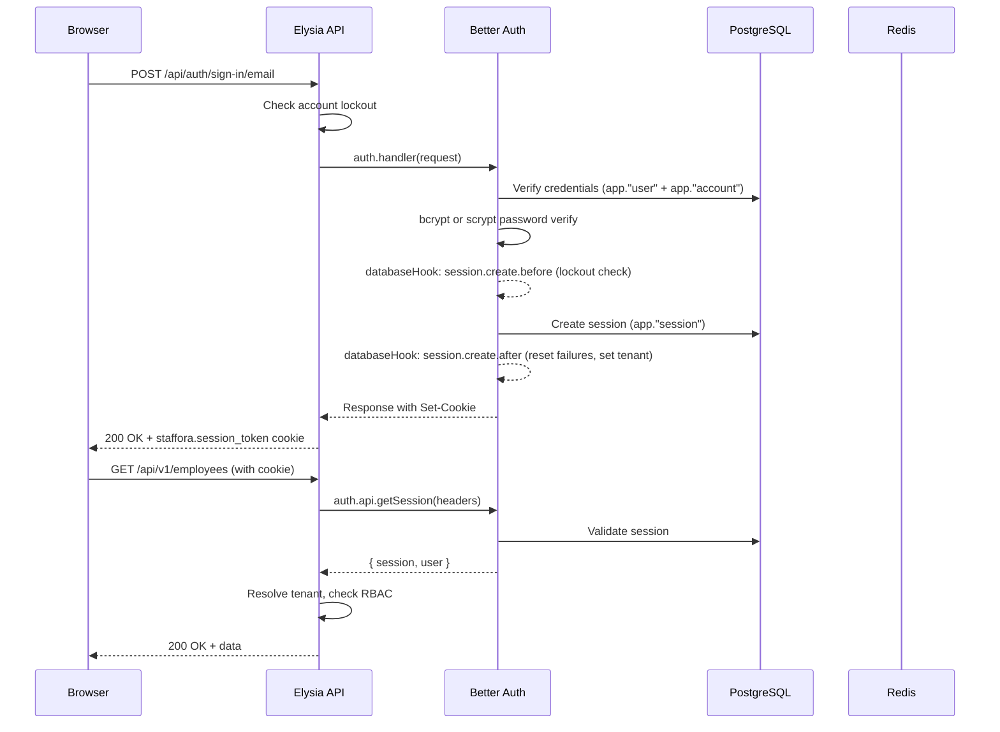
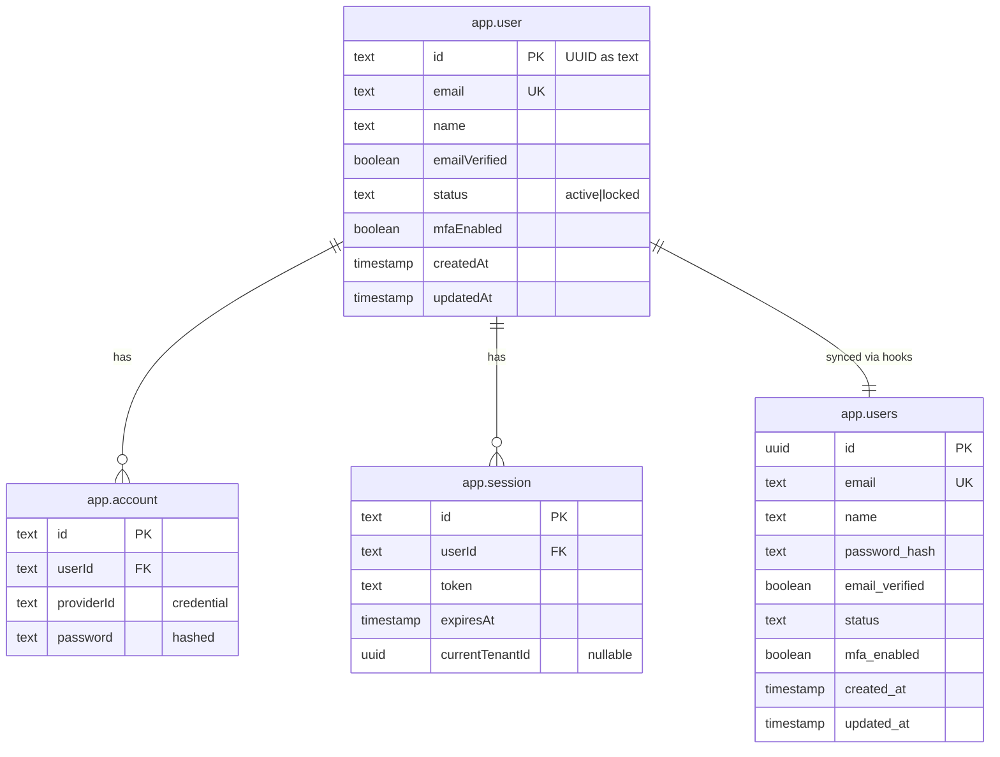
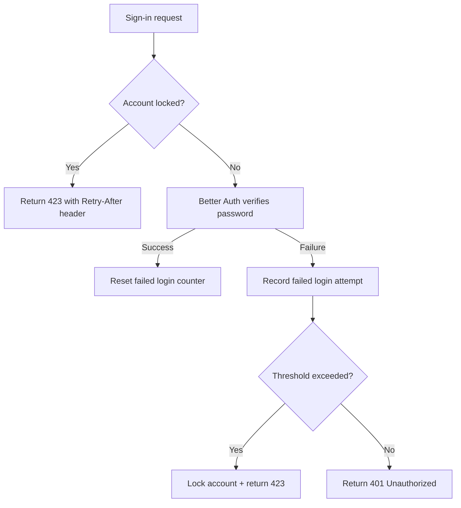

# Authentication

> Last updated: 2026-03-28

This document covers the Staffora HRIS authentication system, built on [Better Auth](https://better-auth.com/). All authentication flows -- sign-in, sign-up, session management, MFA, and CSRF protection -- are handled exclusively by Better Auth. No custom auth systems exist.

---

## Table of Contents

- [Architecture Overview](#architecture-overview)
- [Better Auth Integration](#better-auth-integration)
- [Dual-Table Architecture](#dual-table-architecture)
- [Password Configuration](#password-configuration)
- [Session Management](#session-management)
- [Multi-Factor Authentication (MFA)](#multi-factor-authentication-mfa)
- [CSRF Protection](#csrf-protection)
- [Account Lockout](#account-lockout)
- [Auth Guards](#auth-guards)
- [Staffora-Specific Auth Endpoints](#staffora-specific-auth-endpoints)
- [Cookie Configuration](#cookie-configuration)
- [Email Verification](#email-verification)
- [Key Files](#key-files)

---

## Architecture Overview



## Better Auth Integration

Better Auth is configured in `packages/api/src/lib/better-auth.ts` as a singleton instance. It connects to PostgreSQL via a dedicated `pg` Pool (max 5 connections) separate from the main `postgres.js` connection pool.

**Key configuration:**

| Setting | Value | Notes |
|---------|-------|-------|
| Secret | `BETTER_AUTH_SECRET` env var | Required in production (32+ chars) |
| Base URL | `BETTER_AUTH_URL` or `http://localhost:3000` | API base for auth endpoints |
| Trusted Origins | `CORS_ORIGIN` env var | Must match Elysia CORS config |
| ID Generation | `crypto.randomUUID()` | UUID v4 for all entities |
| Cookie Prefix | `staffora` | e.g., `staffora.session_token` |

**Plugins enabled:**

- `twoFactor` -- TOTP-based MFA (6-digit codes, 30-second period, issuer: "Staffora")
- `organization` -- Organization/tenant support
- `dash` -- Better Auth admin dashboard

**HTTP handler** (`packages/api/src/lib/better-auth-handler.ts`): Mounted as an Elysia plugin at `/api/auth/*` using `.all()` to handle all HTTP methods including OPTIONS for CORS preflight.

### Better Auth Endpoints

| Method | Path | Description |
|--------|------|-------------|
| POST | `/api/auth/sign-up/email` | Register new user |
| POST | `/api/auth/sign-in/email` | Email/password login |
| POST | `/api/auth/sign-out` | Logout (destroy session) |
| GET | `/api/auth/get-session` | Get current session |
| POST | `/api/auth/two-factor/*` | MFA endpoints (enable, verify, disable) |

## Dual-Table Architecture

Staffora maintains two user tables that must stay in sync:



### Why Two Tables?

- **`app."user"`** -- Better Auth's canonical user table (text IDs, camelCase columns). Better Auth reads/writes this table directly.
- **`app.users`** -- Legacy/application table (UUID IDs, snake_case columns). Used by RBAC, tenant resolution, and domain queries.

### Sync Mechanism

Sync is maintained through three layers:

1. **`databaseHooks` in `better-auth.ts`** -- Primary sync. Fires on Better Auth user create/update operations. The `create.before` hook ensures UUID consistency by reusing existing `app.users` IDs. The `create.after` hook upserts into `app.users`.

2. **`verifySyncOnLogin()` in `auth-better.ts`** -- Repair sync. Runs during session resolution to detect and fix drift between the two tables (email, name, status, MFA mismatches).

3. **Database trigger (`0192_user_table_sync_trigger.sql`)** -- Safety net. Catches changes that bypass both the hooks and the repair function.

### Creating Users Outside Better Auth

When creating users via raw SQL (e.g., bootstrap scripts), you MUST insert into all three tables atomically:

1. `app.users` -- Legacy table (UUID id, snake_case)
2. `app."user"` -- Better Auth canonical user (text id, camelCase)
3. `app."account"` -- Better Auth credential record (providerId='credential', password hash)

## Password Configuration

Staffora supports dual password hashing to allow seamless migration from legacy bcrypt passwords:

| Algorithm | Format | Usage |
|-----------|--------|-------|
| **bcrypt** (12 rounds) | `$2a$12$...` or `$2b$12$...` | New passwords (via `hashPassword`) and legacy passwords |
| **scrypt** | `salt:key` hex format | Better Auth default (N=16384, r=16, p=1, dkLen=64) |

**Verification flow** (custom `verifyPassword` function):

```
1. Check if hash starts with $2a$, $2b$, or $2y$ (bcrypt prefix)
2. If bcrypt: verify with bcryptjs
3. If not bcrypt: delegate to Better Auth's built-in scrypt verifier
```

**Important:** Better Auth does NOT fall back to its default scrypt verifier when a custom `verify` function is provided. The custom function must handle both formats explicitly.

**Password requirements:**
- Minimum length: 12 characters
- Maximum length: 128 characters

## Session Management

Sessions are stored in `app."session"` with cookie-based authentication.

| Setting | Value |
|---------|-------|
| Session lifetime | 7 days (`expiresIn: 60 * 60 * 24 * 7`) |
| Session update interval | Every 24 hours (`updateAge: 60 * 60 * 24`) |
| Cookie cache | 5 minutes (`cookieCache.maxAge: 300`) |
| Additional fields | `currentTenantId` (UUID, nullable) |

### Session Creation Flow

1. User submits credentials to `/api/auth/sign-in/email`
2. Better Auth verifies password
3. `session.create.before` hook checks account lockout status
4. Session is persisted to `app."session"`
5. `session.create.after` hook:
   - Resets failed login counter
   - Auto-sets `currentTenantId` from user's primary tenant

### Tenant Context on Session

Each session carries a `currentTenantId` field that determines the active tenant context. This is:
- Auto-set from the user's primary tenant on login
- Updated when the user switches tenants via `POST /auth/switch-tenant`
- Cached in Redis for 5 minutes (`session:tenant:{sessionId}`)

## Multi-Factor Authentication (MFA)

MFA uses TOTP (Time-based One-Time Password) via Better Auth's `twoFactor` plugin.

| Setting | Value |
|---------|-------|
| Issuer | `Staffora` |
| Digits | 6 |
| Period | 30 seconds |
| Backup codes | 10 codes (8-char hex each) |

### MFA Enforcement

Better Auth enforces MFA at sign-in time: when a user with `twoFactorEnabled=true` signs in, the plugin:
1. Deletes the initial session
2. Requires TOTP verification
3. Creates a new session only after successful verification

Therefore, any session created AFTER MFA was enabled is considered MFA-verified. Pre-MFA sessions (created before 2FA setup) are detected by comparing `session.createdAt` against the `twoFactor.createdAt` timestamp.

### Staffora MFA Endpoints

| Method | Path | Description |
|--------|------|-------------|
| GET | `/auth/mfa/backup-codes/status` | Get remaining backup code count |
| POST | `/auth/mfa/backup-codes/regenerate` | Generate new set of 10 backup codes |

## CSRF Protection

CSRF is enforced through:

1. **Cookie attributes**: `sameSite: "strict"` in production, `sameSite: "lax"` in development
2. **Better Auth's built-in CSRF**: Token validation on mutating requests
3. **`CSRF_SECRET` environment variable**: Required in production (32+ chars)

The `requireCsrf` guard in the auth plugin validates CSRF tokens on state-changing operations.

## Account Lockout

Account lockout is implemented through PostgreSQL functions and enforced at multiple layers:

### Lockout Flow



### Implementation Details

- **Pre-check**: Before forwarding to Better Auth, the handler checks `app.check_account_lockout(userId)`. If locked, returns HTTP 423 with `Retry-After` header.
- **Post-failure recording**: On 401 responses from Better Auth, `app.record_failed_login(userId)` is called.
- **Reset on success**: On successful session creation, `app.reset_failed_logins(userId)` is called via `session.create.after` hook.
- **Admin unlock**: `adminUnlockAccount(userId)` updates both `app.users` and `app."user"` to restore `active` status.

### Error Response

```json
{
  "error": {
    "code": "ACCOUNT_LOCKED",
    "message": "Account is locked until 2026-03-28T15:00:00.000Z. Too many failed login attempts."
  }
}
```

## Auth Guards

The auth plugin (`packages/api/src/plugins/auth-better.ts`) provides guard functions used in route `beforeHandle`:

| Guard | HTTP Status | Description |
|-------|-------------|-------------|
| `requireAuthContext` | 401 | Requires valid session and user |
| `requireMfa` | 403 | Requires MFA-verified session (checks `isSessionMfaVerified`) |
| `requireCsrf` | 403 | Validates CSRF token |

### API Key Authentication

In addition to session-based auth, the plugin supports API key authentication for service-to-service calls. API keys use the `sfra_` prefix and are validated via SHA-256 hash comparison.

## Staffora-Specific Auth Endpoints

These endpoints complement Better Auth's built-in routes:

| Method | Path | Guard | Description |
|--------|------|-------|-------------|
| GET | `/auth/me` | `requireAuthContext` | Get current user with session and tenant info |
| GET | `/auth/tenants` | `requireAuthContext` | List tenants the user can access |
| POST | `/auth/switch-tenant` | `requireAuthContext` | Switch session to a different tenant |
| GET | `/auth/mfa/backup-codes/status` | `requireAuthContext` | Get remaining MFA backup code count |
| POST | `/auth/mfa/backup-codes/regenerate` | `requireAuthContext` | Generate new backup codes |

## Cookie Configuration

| Attribute | Development | Production |
|-----------|------------|------------|
| Prefix | `staffora` | `staffora` |
| httpOnly | `true` | `true` |
| sameSite | `lax` | `strict` |
| secure | `false` | `true` |
| path | `/` | `/` |

## Email Verification

Email verification is **required in production** (`requireEmailVerification: true` when `NODE_ENV=production`) but disabled in development to simplify local workflows.

## Key Files

| File | Purpose |
|------|---------|
| `packages/api/src/lib/better-auth.ts` | Better Auth server config, password hashing, databaseHooks, pg Pool |
| `packages/api/src/lib/better-auth-handler.ts` | Elysia HTTP handler at `/api/auth/*`, account lockout integration |
| `packages/api/src/plugins/auth-better.ts` | Auth plugin: session resolution, guards, AuthService, tenant resolution |
| `packages/api/src/modules/auth/routes.ts` | Staffora-specific endpoints (`/auth/me`, `/auth/switch-tenant`, MFA backup codes) |
| `migrations/0192_user_table_sync_trigger.sql` | DB trigger safety net for dual-table sync |

---

## Related Documents

- [Architecture Overview](../02-architecture/ARCHITECTURE.md) — System architecture, plugin chain, and request flow
- [Authorization](./authorization.md) — RBAC permission model, role hierarchy, and permission guards
- [RLS and Multi-Tenancy](./rls-multi-tenancy.md) — Row-Level Security and tenant isolation enforcement
- [Security Patterns](../02-architecture/security-patterns.md) — Cross-cutting security patterns (RLS, auth, RBAC, audit)
- [API Reference](../04-api/api-reference.md) — Full endpoint specifications including auth routes
- [GDPR Compliance](../12-compliance/gdpr-compliance.md) — Data protection regulations affecting authentication data
- [Testing Guide](../08-testing/testing-guide.md) — Security test patterns for authentication and session validation
