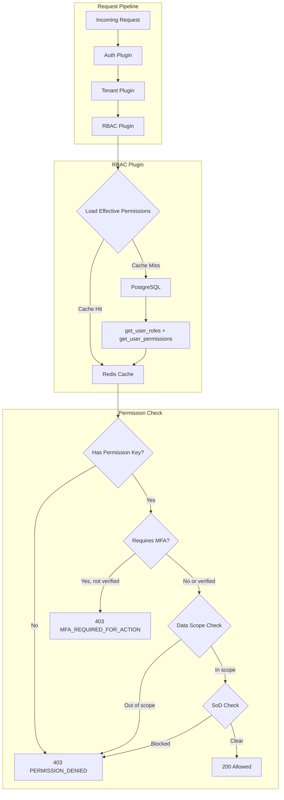
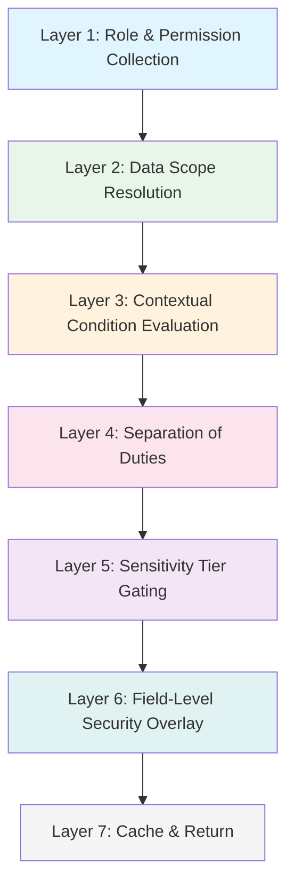

# Authorization

> Last updated: 2026-03-28

This document covers the Staffora HRIS authorization system: Role-Based Access Control (RBAC), field-level permissions, data scope resolution, separation of duties, manager hierarchy, and portal access control.

---

## Table of Contents

- [Authorization Architecture](#authorization-architecture)
- [Permission Model](#permission-model)
- [Role System](#role-system)
- [7-Layer Permission Resolution](#7-layer-permission-resolution)
- [Data Scope Resolution](#data-scope-resolution)
- [Separation of Duties (SoD)](#separation-of-duties-sod)
- [Field-Level Permissions](#field-level-permissions)
- [Manager Hierarchy](#manager-hierarchy)
- [Portal Access Control](#portal-access-control)
- [Permission Guards](#permission-guards)
- [Redis Caching Strategy](#redis-caching-strategy)
- [Key Files](#key-files)

---

## Authorization Architecture



## Permission Model

Permissions follow a `resource:action` convention:

```
employees:read
employees:write
employees:delete
dsar:read
dsar:write
pension:schemes:read
health_safety:incidents:write
```

### Wildcard Support

| Pattern | Meaning |
|---------|---------|
| `*:*` | Full access to everything |
| `employees:*` | All actions on employees |
| `*:read` | Read access to all resources |

### Permission Storage

Permissions are stored in the `app.permissions` table:

| Column | Type | Description |
|--------|------|-------------|
| `id` | UUID | Primary key |
| `resource` | text | Resource name (e.g., `employees`) |
| `action` | text | Action name (e.g., `read`, `write`, `delete`, `approve`) |
| `description` | text | Human-readable description |
| `module` | text | Owning module (e.g., `hr`, `absence`, `dsar`) |
| `requires_mfa` | boolean | Whether MFA verification is required |

## Role System

### Role Types

| Role Type | `is_system` | `tenant_id` | Description |
|-----------|-------------|-------------|-------------|
| System roles | `true` | `NULL` | Built-in, immutable (e.g., `super_admin`, `tenant_admin`) |
| Tenant roles | `false` | Set | Custom roles created by tenants |

### Special Roles

| Role | Behaviour |
|------|-----------|
| `super_admin` | Bypasses all permission checks (except SoD). Gets `*:*` wildcard. |
| `tenant_admin` | Full access within their tenant. Gets `*:*` wildcard. |

### Role Assignment

Roles are assigned to users with effective-dating and optional constraints:

```sql
-- app.role_assignments
role_id         UUID
user_id         UUID
tenant_id       UUID
constraints     JSONB   -- { scope, org_units, cost_centers, ... }
effective_from  TIMESTAMP
effective_to    TIMESTAMP (NULL = no expiry)
assigned_by     UUID
assigned_at     TIMESTAMP
```

Constraints narrow the scope of a role assignment. For example, an HR Manager role might be constrained to a specific department:

```json
{
  "scope": "department",
  "org_units": ["dept-uuid-1", "dept-uuid-2"],
  "cost_centers": ["cc-001"]
}
```

### Role-Permission Mapping

Permissions are linked to roles via `app.role_permissions`:

| Operation | DB Function |
|-----------|-------------|
| Grant permission to role | `app.grant_permission_to_role(tenant_id, role_id, resource, action, granted_by)` |
| Revoke permission from role | `app.revoke_permission_from_role(role_id, resource, action)` |
| Get role permissions | `app.get_role_permissions(role_id)` |
| Get user roles | `app.get_user_roles(tenant_id, user_id)` |
| Get user permissions | `app.get_user_permissions(tenant_id, user_id)` |

## 7-Layer Permission Resolution

The `PermissionResolutionService` implements a comprehensive 7-layer check:



### Layer 1: Role & Permission Collection

Union of all permissions from all active role assignments for the user. Loads from cache (`perm:v2:{tenantId}:{userId}`) or database. Includes:
- Direct permission grants via `role_permissions`
- Cached JSONB permission sets on `roles.permissions` column (for system roles)
- Wildcard grants for super_admin and tenant_admin

### Layer 2: Data Scope Resolution

Determines which data records the user can access. Scope types form a hierarchy:

```
self < direct_reports < indirect_reports < department < division < location < cost_centre < legal_entity < all
```

The broadest scope across all role assignments wins. Scopes are merged (union of org units, locations, etc.).

### Layer 3: Contextual Condition Evaluation

Rules stored in `app.permission_conditions` that can dynamically allow or deny access:

| Condition Type | Example |
|---------------|---------|
| `time_window` | Only allow payroll edits during business hours |
| `workflow_state` | Only allow edits when record is in `draft` state |
| `employment_status` | Only allow for `active` employees |
| `payroll_lock` | Deny changes when payroll period is locked |

Each condition has an `effect` of either `deny` (block when condition matches) or `require` (block when condition does NOT match).

### Layer 4: Separation of Duties

Calls `app.check_separation_of_duties(tenant_id, user_id, resource, action, context)`. Returns violations with enforcement levels:

| Enforcement | Behaviour |
|-------------|-----------|
| `block` | Hard deny -- action is rejected |
| `warn` | Soft warning -- action allowed but violation recorded |
| `audit` | Silent logging -- action allowed, logged for compliance review |

### Layer 5: Sensitivity Tier Gating

Each role has a `max_sensitivity_tier` (integer). Fields and records with a higher sensitivity tier than the user's maximum are hidden. Enforced at the field level by the FieldPermissionService.

### Layer 6: Field-Level Security Overlay

See [Field-Level Permissions](#field-level-permissions) below.

### Layer 7: Cache & Return

Results are cached in Redis for 15 minutes. See [Redis Caching Strategy](#redis-caching-strategy).

### Performance Targets

| Scenario | Target |
|----------|--------|
| Cached permission check | < 5ms |
| Uncached permission check | < 50ms |
| Bulk field permission check | < 10ms |

## Data Scope Resolution

The `resolveDataScope` method determines which employees a user can access for a given resource. It calls `app.resolve_user_data_scope(tenant_id, user_id, resource)` and returns a list of employee IDs.

```typescript
// Check if a specific employee is within scope
const inScope = await rbacService.isEmployeeInScope(
  tenantId, userId, targetEmployeeId, "employees"
);
```

Results are cached for 15 minutes at `scope:{tenantId}:{userId}:{resource}`.

## Separation of Duties (SoD)

SoD rules prevent conflicting permissions from being exercised by the same user. Example rules:

- User who creates a payroll run cannot approve it
- User who submits a leave request cannot approve their own request
- User who creates a purchase order cannot sign it off

The RBAC plugin checks SoD via `app.check_separation_of_duties()` and attaches violations to the request context:

```typescript
// Enhanced permission guard with SoD
requirePermissionWithScope('payroll', 'approve', {
  targetEmployeeIdParam: 'employeeId',
  checkSoD: true,
});
```

Non-blocking violations are available to downstream handlers via `ctx.sodViolations`.

## Field-Level Permissions

Field-level security controls visibility and editability of individual database fields per role.

### Permission Levels

| Level | Can View | Can Edit |
|-------|----------|----------|
| `edit` | Yes | Yes |
| `view` | Yes | No |
| `hidden` | No | No |

### Resolution Rule

When a user has multiple roles, the **most permissive** level wins: `edit > view > hidden`.

### Field Registry

Fields are registered in `app.field_registry`:

| Column | Description |
|--------|-------------|
| `entity_name` | e.g., `employee`, `leave_request` |
| `field_name` | e.g., `salary`, `ni_number` |
| `field_label` | Human-readable label |
| `field_group` | Grouping for UI (e.g., "Personal", "Financial") |
| `data_type` | Field type (text, number, date, etc.) |
| `is_sensitive` | Whether field contains PII |
| `is_system_field` | Whether field is system-managed |
| `default_permission` | Default level if no role override exists |

### Role Field Permissions

Per-role overrides stored in `app.role_field_permissions`:

```sql
INSERT INTO app.role_field_permissions (tenant_id, role_id, field_id, permission)
VALUES (:tenant_id, :role_id, :field_id, 'view');
```

### Service Methods

```typescript
// Get effective permissions for current user
const perms = await fieldPermissionService.getUserFieldPermissions(ctx);

// Check single field
const canEdit = await fieldPermissionService.canEditField(ctx, 'employee', 'salary');

// Filter response data (remove hidden fields)
const filtered = await fieldPermissionService.filterFields(ctx, 'employee', employeeData);

// Validate update payload (reject writes to non-editable fields)
await fieldPermissionService.validateEditableFields(ctx, 'employee', updates);

// Bulk set permissions for a role
await fieldPermissionService.bulkSetRoleFieldPermissions(ctx, roleId, [
  { fieldId: 'salary-field-id', permission: 'view' },
  { fieldId: 'name-field-id', permission: 'edit' },
]);
```

## Manager Hierarchy

The `ManagerHierarchyService` provides hierarchy-aware queries using a materialized `app.manager_subordinates` table (pre-computed from position assignments).

### Key Methods

| Method | Description |
|--------|-------------|
| `getCurrentEmployeeId(ctx)` | Get the authenticated user's employee ID |
| `isManager(ctx)` | Check if current user has any subordinates |
| `getDirectReports(ctx)` | Get direct reports only (depth=1) |
| `getAllSubordinates(ctx, maxDepth)` | Get all subordinates up to maxDepth (default 10) |
| `getTeamMember(ctx, employeeId)` | Get a specific subordinate's details |
| `isSubordinateOf(ctx, employeeId)` | Check if an employee reports to the current user |

### Subordinate Data

The `manager_subordinates` table stores:
- `manager_id` -- The manager's employee ID
- `subordinate_id` -- The subordinate's employee ID
- `tenant_id` -- Tenant isolation
- `depth` -- 1 = direct report, 2 = skip-level, etc.

This table is refreshed when position assignments change.

## Portal Access Control

Staffora supports three portals with different navigation and capabilities:

| Portal Code | Description | Typical Roles |
|-------------|-------------|---------------|
| `admin` | Full HR administration | HR Manager, HR Admin, super_admin |
| `manager` | Manager self-service (team view) | Line Manager, Department Head |
| `employee` | Employee self-service | All employees |

### Portal Assignment

Portal access is determined by:

1. **Role-based auto-assignment**: When a role with a `portal_type` is assigned, the user automatically gets access to that portal via `syncPortalAccessFromRoles`.
2. **Manual grant/revoke**: Admins can explicitly grant or revoke portal access.

### Portal Service Methods

```typescript
// Get user's available portals
const portals = await portalService.getUserPortals(ctx);

// Check portal access
const hasAdmin = await portalService.hasPortalAccess(ctx, 'admin');

// Set default portal
await portalService.setDefaultPortal(ctx, 'manager');

// Grant/revoke access
await portalService.grantPortalAccess(ctx, userId, 'admin', isDefault);
await portalService.revokePortalAccess(ctx, userId, 'manager');
```

### Portal Navigation

Each portal has a predefined navigation structure. The admin portal includes sections for People, Organisation, Time & Attendance, Talent, System, and Reports. The manager portal focuses on team management, approvals, and team reports. The employee portal provides self-service for profile, pay, time off, documents, learning, and performance.

## Permission Guards

### Basic Guards

```typescript
// Require a single permission
app.get('/employees', handler, {
  beforeHandle: [requirePermission('employees', 'read')]
});

// Require any one of several permissions
app.get('/reports', handler, {
  beforeHandle: [requireAnyPermission([
    { resource: 'analytics', action: 'read' },
    { resource: 'reports', action: 'read' },
  ])]
});

// Require all permissions
app.post('/payroll/run', handler, {
  beforeHandle: [requireAllPermissions([
    { resource: 'payroll', action: 'write' },
    { resource: 'payroll', action: 'approve' },
  ])]
});
```

### Enhanced Guard with Data Scope and SoD

```typescript
app.patch('/employees/:employeeId', handler, {
  beforeHandle: [requirePermissionWithScope('employees', 'write', {
    targetEmployeeIdParam: 'employeeId',  // Check data scope
    checkSoD: true,                        // Check separation of duties
  })]
});
```

### Non-Throwing Permission Check

```typescript
const allowed = await hasPermission(
  rbacService, tenantId, userId,
  'employees', 'delete', mfaVerified
);
```

## Redis Caching Strategy

| Cache Key Pattern | TTL | Content |
|-------------------|-----|---------|
| `permissions:{tenantId}:{userId}` | 15 min | Effective permissions (permission keys, constraints, roles) |
| `perm:v2:{tenantId}:{userId}` | 15 min | V2 permission resolution cache (PermissionResolutionService) |
| `scope:{tenantId}:{userId}:{resource}` | 15 min | Data scope (list of employee IDs) |
| `fperms:{tenantId}:{userId}:{entityName}` | 15 min | Field permissions per entity |
| `roles:{tenantId}:{userId}` | 15 min | User's role assignments |

### Cache Invalidation

| Event | Invalidation |
|-------|-------------|
| Role assignment changed | `invalidateCache(tenantId, userId)` + `invalidateScopeCache(tenantId, userId)` |
| Role permissions changed | `invalidateTenantCache(tenantId)` (all users in tenant) |
| Position/org change | `invalidateScopeCache(tenantId, userId)` |

The `invalidateScopeCache` method uses Redis SCAN to find and delete all scope and field permission keys for a user, plus known common resource keys.

## Key Files

| File | Purpose |
|------|---------|
| `packages/api/src/plugins/rbac.ts` | RBAC Elysia plugin, RbacService, permission guards |
| `packages/api/src/modules/security/permission-resolution.service.ts` | 7-layer permission resolution engine |
| `packages/api/src/modules/security/rbac.service.ts` | RBAC module service (role/permission CRUD) |
| `packages/api/src/modules/security/rbac.repository.ts` | RBAC database queries |
| `packages/api/src/modules/security/rbac.routes.ts` | RBAC admin API endpoints |
| `packages/api/src/modules/security/field-permission.service.ts` | Field-level permission service |
| `packages/api/src/modules/security/field-permission.routes.ts` | Field permission API endpoints |
| `packages/api/src/modules/security/portal.service.ts` | Portal access control service |
| `packages/api/src/modules/security/portal.routes.ts` | Portal API endpoints |
| `packages/api/src/modules/security/manager.hierarchy.service.ts` | Manager hierarchy traversal |
| `packages/api/src/modules/security/manager.routes.ts` | Manager self-service API endpoints |
| `packages/api/src/modules/security/permission-guard.middleware.ts` | Permission guard middleware |
| `packages/api/src/modules/security/inspection.routes.ts` | Permission inspection/debugging endpoints |

---

## Related Documents

- [Architecture Overview](../02-architecture/ARCHITECTURE.md) — System architecture, plugin chain, and request flow
- [Permissions System](../02-architecture/PERMISSIONS_SYSTEM.md) — Detailed permission model and RBAC design
- [Authentication](./authentication.md) — Better Auth session resolution and MFA verification
- [RLS and Multi-Tenancy](./rls-multi-tenancy.md) — Row-Level Security and tenant isolation at the database layer
- [Security Patterns](../02-architecture/security-patterns.md) — Cross-cutting security patterns (RLS, auth, RBAC, audit)
- [API Reference](../04-api/api-reference.md) — Full endpoint specifications including RBAC admin routes
- [Testing Guide](../08-testing/testing-guide.md) — Integration test patterns for permission checks and RLS
