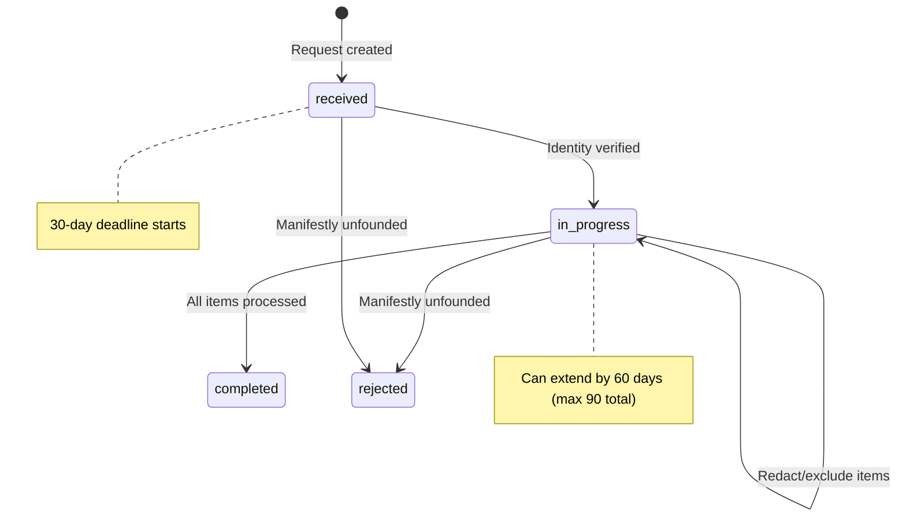
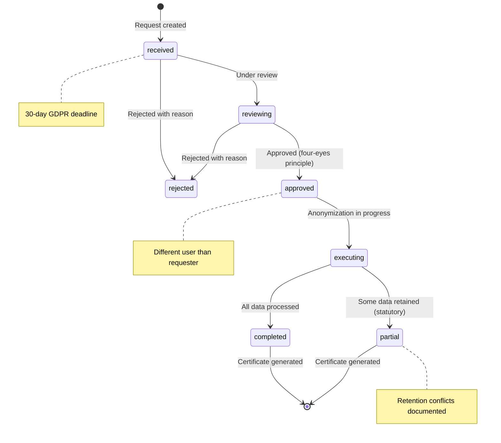
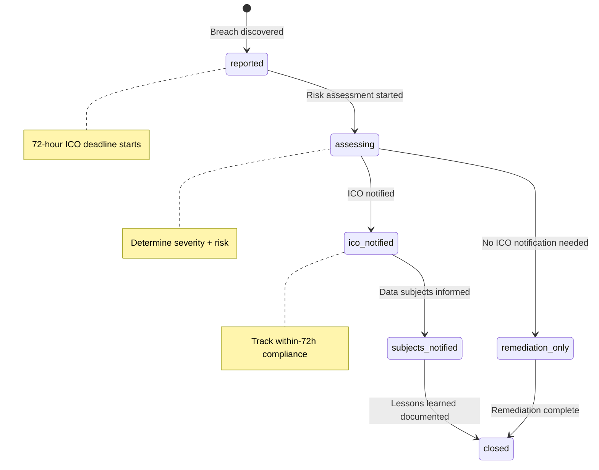
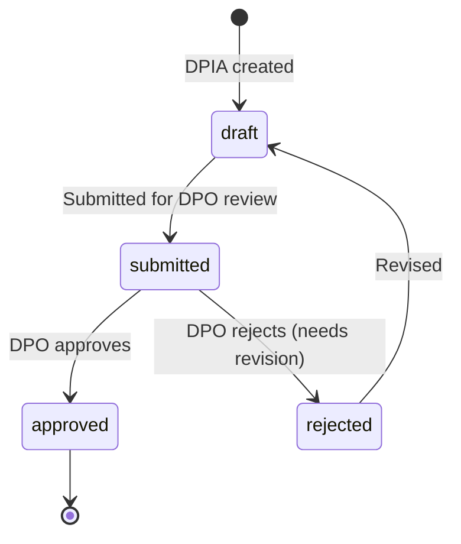

# Data Protection (GDPR)

> Last updated: 2026-03-28

This document covers the Staffora HRIS data protection capabilities for UK GDPR compliance. It details the DSAR workflow, data erasure (right to be forgotten), breach notification, consent management, privacy notices, data retention, ROPA, and DPIA modules.

For the broader GDPR compliance overview, see [GDPR Compliance](../12-compliance/gdpr-compliance.md).

---

## Table of Contents

- [GDPR Module Overview](#gdpr-module-overview)
- [DSAR (Data Subject Access Requests)](#dsar-data-subject-access-requests)
- [Data Erasure (Right to Erasure)](#data-erasure-right-to-erasure)
- [Data Breach Notification](#data-breach-notification)
- [Consent Management](#consent-management)
- [Privacy Notices](#privacy-notices)
- [Data Retention](#data-retention)
- [ROPA (Records of Processing Activities)](#ropa-records-of-processing-activities)
- [DPIA (Data Protection Impact Assessments)](#dpia-data-protection-impact-assessments)
- [Data Archival](#data-archival)
- [Audit Trail](#audit-trail)
- [Key Files](#key-files)

---

## GDPR Module Overview

Staffora implements UK GDPR compliance through nine dedicated modules:

| Module | GDPR Article | Purpose | API Prefix |
|--------|-------------|---------|------------|
| DSAR | Articles 15-20 | Subject access requests | `/api/v1/dsar` |
| Data Erasure | Article 17 | Right to be forgotten | `/api/v1/data-erasure` |
| Data Breach | Articles 33-34 | Breach notification | `/api/v1/data-breach` |
| Consent | Article 6-7 | Consent records | `/api/v1/consent` |
| Privacy Notices | Articles 13-14 | Notice management | `/api/v1/privacy-notices` |
| Data Retention | Article 5(1)(e) | Storage limitation | `/api/v1/data-retention` |
| ROPA | Article 30 | Processing register | `/api/v1/ropa` |
| DPIA | Article 35 | Impact assessments | `/api/v1/dpia` |
| Data Archival | Article 5(1)(e) | Archive and purge | `/api/v1/data-archival` |

All modules follow the standard Staffora module structure: `schemas.ts`, `repository.ts`, `service.ts`, `routes.ts`, `index.ts`. All routes require authentication and RBAC permissions.

## DSAR (Data Subject Access Requests)

**UK GDPR Articles 15-20**: Right of access, rectification, erasure, restriction, data portability.

### DSAR Workflow

### Key Features

- **30-day deadline**: Auto-calculated from received date
- **Deadline extension**: Up to 60 additional days (UK GDPR Article 12(3)), requiring documented reason. Total response period cannot exceed 90 days.
- **Identity verification**: Required before data gathering begins. Transitions status from `received` to `in_progress`.
- **Module-based data gathering**: Triggers data collection from specific HRIS modules (hr, absence, time, etc.), creating data items per category.
- **Redaction**: GDPR allows redaction of third-party personal data. Each redaction requires a documented reason.
- **Rejection**: For manifestly unfounded or excessive requests (UK GDPR Article 12(5)).
- **Immutable audit trail**: Every action on a DSAR is logged chronologically.

### Endpoints

| Method | Path | Permission | Description |
|--------|------|------------|-------------|
| GET | `/dsar/requests/dashboard` | `dsar:read` | Aggregate statistics (open, completed, overdue, avg response time) |
| GET | `/dsar/requests/overdue` | `dsar:read` | List overdue requests |
| GET | `/dsar/requests` | `dsar:read` | List with filters (status, employee, type, overdue) |
| POST | `/dsar/requests` | `dsar:write` | Create new DSAR request |
| GET | `/dsar/requests/:id` | `dsar:read` | Full detail with data items and audit log |
| POST | `/dsar/requests/:id/verify-identity` | `dsar:write` | Verify data subject identity |
| POST | `/dsar/requests/:id/gather/:moduleName` | `dsar:write` | Gather data from a module |
| PATCH | `/dsar/requests/:id/data-items/:itemId` | `dsar:write` | Redact or exclude a data item |
| POST | `/dsar/requests/:id/extend` | `dsar:write` | Extend deadline |
| POST | `/dsar/requests/:id/complete` | `dsar:write` | Complete the DSAR |
| POST | `/dsar/requests/:id/reject` | `dsar:write` | Reject with reason |
| GET | `/dsar/requests/:id/audit-log` | `dsar:read` | Immutable audit trail |

## Data Erasure (Right to Erasure)

**UK GDPR Article 17**: Right to erasure ("right to be forgotten").

### Erasure Workflow

### Key Features

- **Four-eyes principle**: Approval requires a different user than the requester (`data_erasure:approve` permission).
- **Retention conflict checking**: Before creating a request, check which data cannot be erased due to statutory retention requirements (e.g., tax records must be kept for 6 years).
- **Per-table anonymization**: Processes each table individually, recording action taken and record count.
- **Erasure certificate**: Generated as proof of Article 17 compliance, documenting tables processed, actions taken, records affected, and any retention exceptions.
- **Overdue tracking**: Dashboard shows requests past their 30-day deadline.

### Endpoints

| Method | Path | Permission | Description |
|--------|------|------------|-------------|
| GET | `/data-erasure/requests` | `data_erasure:read` | List erasure requests |
| GET | `/data-erasure/requests/overdue` | `data_erasure:read` | Overdue requests |
| POST | `/data-erasure/requests` | `data_erasure:write` | Create request |
| GET | `/data-erasure/requests/:id` | `data_erasure:read` | Detail with items and audit |
| POST | `/data-erasure/requests/:id/approve` | `data_erasure:approve` | Approve (four-eyes) |
| POST | `/data-erasure/requests/:id/execute` | `data_erasure:write` | Execute anonymization |
| POST | `/data-erasure/requests/:id/complete` | `data_erasure:write` | Complete with certificate |
| POST | `/data-erasure/requests/:id/reject` | `data_erasure:write` | Reject with reason |
| GET | `/data-erasure/requests/:id/audit-log` | `data_erasure:read` | Audit trail |
| GET | `/data-erasure/employees/:employeeId/retention-conflicts` | `data_erasure:read` | Check retention conflicts |
| GET | `/data-erasure/requests/:id/certificate` | `data_erasure:read` | Generate erasure certificate |

## Data Breach Notification

**UK GDPR Articles 33-34**: Report personal data breaches to the ICO within 72 hours; notify affected individuals when high risk.

### Breach Workflow

### Key Features

- **72-hour ICO deadline**: Auto-calculated from discovery date. Dashboard highlights overdue notifications.
- **Risk assessment**: Determines severity, risk to individuals, whether ICO notification is required (likely risk), and whether subject notification is required (likely HIGH risk).
- **ICO notification tracking**: Records DPO details, ICO reference number, notification date, and calculates whether notification was within the 72-hour deadline.
- **Subject notification tracking**: Records notification method, count of subjects notified, and notification content.
- **Investigation timeline**: Immutable timeline of all actions taken during investigation and remediation.
- **Closure with lessons learned**: Requires documented remediation plan and lessons learned.

### Endpoints

| Method | Path | Permission | Description |
|--------|------|------------|-------------|
| POST | `/data-breach/incidents` | `data_breaches:write` | Report new breach |
| GET | `/data-breach/incidents` | `data_breaches:read` | List breaches |
| GET | `/data-breach/dashboard` | `data_breaches:read` | Dashboard with overdue alerts |
| GET | `/data-breach/incidents/:id` | `data_breaches:read` | Breach detail |
| PATCH | `/data-breach/incidents/:id/assess` | `data_breaches:write` | Risk assessment |
| POST | `/data-breach/incidents/:id/notify-ico` | `data_breaches:write` | Record ICO notification |
| POST | `/data-breach/incidents/:id/notify-subjects` | `data_breaches:write` | Record subject notification |
| POST | `/data-breach/incidents/:id/timeline` | `data_breaches:write` | Add timeline entry |
| GET | `/data-breach/incidents/:id/timeline` | `data_breaches:read` | Get timeline |
| PATCH | `/data-breach/incidents/:id/close` | `data_breaches:write` | Close with lessons learned |

## Consent Management

**UK GDPR Articles 6-7**: Lawful basis for processing, conditions for consent.

### Features

- **Consent purposes**: Define processing purposes with legal basis, description, and whether consent is required.
- **Consent records**: Track individual consent grants and withdrawals per employee per purpose.
- **Consent checking**: Verify whether an employee has active consent for a specific purpose.
- **Consent withdrawal**: Employees can withdraw consent at any time (Article 7(3)), with full audit trail.
- **Dashboard**: Compliance overview showing consent rates, pending consents, and purposes with low coverage.

### Permission Model

| Permission | Actions |
|------------|---------|
| `consent:purposes` | `read`, `write` |
| `consent:records` | `read`, `write` |
| `consent:dashboard` | `read` |

## Privacy Notices

**UK GDPR Articles 13-14**: Information to be provided when personal data is collected.

### Features

- **Notice lifecycle**: Create, update, publish, and archive privacy notices.
- **Employee acknowledgement**: Track which employees have acknowledged each notice.
- **Outstanding acknowledgements**: Identify employees who have not yet acknowledged active notices.
- **Compliance summary**: Dashboard showing acknowledgement rates across all active notices.
- **Version tracking**: Each notice update creates a new version for audit purposes.

### Permission Model

| Permission | Actions |
|------------|---------|
| `privacy_notices` | `read`, `write` |

## Data Retention

**UK GDPR Article 5(1)(e)**: Storage limitation principle -- personal data must not be kept longer than necessary.

### Features

- **Retention policies**: Define per-data-category retention periods with legal basis (e.g., "Employment records: 6 years after termination per Limitation Act 1980").
- **Retention reviews**: Automated identification of records that have exceeded their retention period.
- **Review execution**: Process expired records (archive, anonymize, or delete) with documented actions.
- **Retention exceptions**: Document exceptions where data must be retained beyond policy (e.g., ongoing litigation hold).
- **Default policy seeding**: Pre-load UK statutory retention periods for common HR data categories.
- **Expired records dashboard**: Overview of records past their retention date.

### Permission Model

| Permission | Actions |
|------------|---------|
| `data_retention` | `read`, `write`, `delete` |

## ROPA (Records of Processing Activities)

**UK GDPR Article 30**: Every controller must maintain a register of processing activities. The ICO can request this register at any time.

### Article 30(1) Fields Captured

Each processing activity record includes:
- Controller/processor details
- Purposes of processing
- Categories of data subjects and personal data
- Categories of recipients
- International transfers (with safeguards)
- Retention periods
- Technical and organisational security measures
- **Lawful basis**: consent, contract, legal obligation, vital interest, public task, or legitimate interest (Article 6(1))

### Status

Processing activities can be `active` or `archived`.

## DPIA (Data Protection Impact Assessments)

**UK GDPR Article 35**: Required when processing is likely to result in a high risk to the rights and freedoms of individuals.

### DPIA Workflow

### Features

- **Risk register**: Each DPIA can have multiple identified risks, each with likelihood, severity, mitigation measures, and residual risk assessment.
- **DPO review workflow**: DPIAs must be submitted to the Data Protection Officer for approval before processing can begin.
- **Filtering and pagination**: List DPIAs with status and date filters.

### Endpoints

| Method | Path | Permission | Description |
|--------|------|------------|-------------|
| POST | `/dpia` | `dpia:write` | Create new DPIA |
| GET | `/dpia` | `dpia:read` | List DPIAs |
| GET | `/dpia/:id` | `dpia:read` | Detail with risks |
| PATCH | `/dpia/:id` | `dpia:write` | Update (draft only) |
| POST | `/dpia/:id/risks` | `dpia:write` | Add risk |
| GET | `/dpia/:id/risks` | `dpia:read` | List risks |
| POST | `/dpia/:id/submit` | `dpia:write` | Submit for DPO review |
| POST | `/dpia/:id/approve` | `dpia:write` | DPO approve/reject |

## Data Archival

**UK GDPR Article 5(1)(e)**: Implements the operational side of data retention by archiving and purging data that has exceeded its retention period.

Works in conjunction with the Data Retention module: retention policies define the rules, and the archival module executes them.

## Audit Trail

All GDPR modules produce immutable audit logs. Every action is recorded with:

- **Actor**: Who performed the action (user ID)
- **Action**: What was done (e.g., `gdpr.dsar.created`, `gdpr.erasure.approved`)
- **Resource**: What was affected (resource type + ID)
- **Timestamp**: When it happened
- **Details**: Before/after values, request context, idempotency keys

Audit actions follow the naming convention: `gdpr.{module}.{action}` (e.g., `gdpr.dsar.identity_verified`, `gdpr.erasure.executed`, `compliance.data_breach.ico_notified`).

## Key Files

| Module | Path |
|--------|------|
| DSAR | `packages/api/src/modules/dsar/` |
| Data Erasure | `packages/api/src/modules/data-erasure/` |
| Data Breach | `packages/api/src/modules/data-breach/` |
| Consent | `packages/api/src/modules/consent/` |
| Privacy Notices | `packages/api/src/modules/privacy-notices/` |
| Data Retention | `packages/api/src/modules/data-retention/` |
| ROPA | `packages/api/src/modules/ropa/` |
| DPIA | `packages/api/src/modules/dpia/` |
| Data Archival | `packages/api/src/modules/data-archival/` |

Each module contains: `schemas.ts` (TypeBox validation), `repository.ts` (database queries), `service.ts` (business logic), `routes.ts` (API endpoints), `index.ts` (module export).

---

## Related Documents

- [Architecture Overview](../02-architecture/ARCHITECTURE.md) — System architecture, plugin chain, and request flow
- [GDPR Compliance](../12-compliance/gdpr-compliance.md) — Regulatory requirements and implementation status
- [UK Compliance](../03-features/uk-compliance.md) — UK-specific compliance modules overview
- [RLS and Multi-Tenancy](./rls-multi-tenancy.md) — Row-Level Security ensuring tenant data isolation
- [Authentication](./authentication.md) — Session management and user identity for audit attribution
- [Security Patterns](../02-architecture/security-patterns.md) — Cross-cutting security patterns (RLS, auth, RBAC, audit)
- [Worker System](../02-architecture/WORKER_SYSTEM.md) — Background jobs for data retention purge and breach notification
- [Testing Guide](../08-testing/testing-guide.md) — Integration test patterns for GDPR module verification
