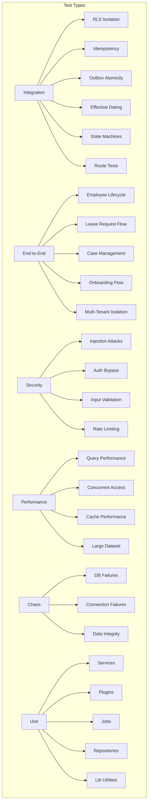

# Testing Guide

> Comprehensive testing documentation for the Staffora HRIS platform.
> API tests use **Bun's built-in test runner**; frontend tests use **Vitest**.
> **Last updated:** 2026-03-17

---

## Contents

| File | Description |
|------|-------------|
| [README.md](README.md) | This file -- test infrastructure, categories, helpers, and writing guides |
| [test-matrix.md](test-matrix.md) | Coverage matrix: every module vs every test type |

Related documentation:

- [Security Architecture](../07-security/README.md) -- authentication, authorization, RLS, headers
- [Patterns: Security](../02-architecture/security-patterns.md) -- RLS, auth, RBAC, audit, idempotency patterns
- [Patterns: State Machines](../02-architecture/state-machines.md) -- lifecycle transitions tested in integration tests
- [API Reference](../04-api/API_REFERENCE.md) -- endpoint contracts validated by route tests
- [Database](../02-architecture/DATABASE.md) -- schema, migrations, RLS policies

---

## Test Infrastructure

### Prerequisites

All integration, e2e, security, performance, and chaos tests require running Docker containers for **PostgreSQL 16** and **Redis 7**.

```bash
# Start infrastructure (postgres + redis containers)
bun run docker:up

# Run pending database migrations
bun run migrate:up
```

The test setup in `packages/api/src/test/setup.ts` will attempt to auto-start Docker services if they are not running, but pre-starting them is recommended to avoid timeout issues.

### Database Roles

Tests connect using two PostgreSQL roles:

| Role | Purpose | RLS Behavior |
|------|---------|-------------|
| `hris` | Superuser. Used during test bootstrap to create/grant the `hris_app` role and run migrations. | Bypasses RLS |
| `hris_app` | Application role (`NOBYPASSRLS`). Used for **all test queries**. | RLS enforced |

This is intentional: tests run under the same constraints as production, so RLS policies are genuinely tested rather than being bypassed.

### Configuration

Test configuration is resolved from environment variables with sensible defaults that match `docker/.env`:

| Variable | Default | Description |
|----------|---------|-------------|
| `TEST_DB_HOST` / `DB_HOST` | `localhost` | PostgreSQL host |
| `TEST_DB_PORT` / `DB_PORT` | `5432` | PostgreSQL port |
| `TEST_DB_NAME` / `DB_NAME` | `hris` | Database name |
| `TEST_DB_USER` / `DB_USER` | `hris_app` | Application role (non-superuser) |
| `TEST_DB_PASSWORD` / `DB_PASSWORD` | `hris_dev_password` | Application role password |
| `TEST_DB_ADMIN_USER` | `hris` | Admin role for bootstrap |
| `TEST_DB_ADMIN_PASSWORD` | `hris_dev_password` | Admin role password |
| `TEST_REDIS_HOST` / `REDIS_HOST` | `localhost` | Redis host |
| `TEST_REDIS_PORT` / `REDIS_PORT` | `6379` | Redis port |
| `TEST_REDIS_PASSWORD` / `REDIS_PASSWORD` | _(empty)_ | Redis password |

### Preflight Process

When `ensureTestInfra()` is called (typically in `beforeAll`), the setup module:

1. Loads environment variables from `docker/.env` (if present)
2. Connects to PostgreSQL as the admin role (`hris`)
3. Verifies the `app` schema exists (`app.tenants` table check)
4. Ensures the `hris_app` role exists with `NOBYPASSRLS`
5. Grants required permissions on the `app` schema to `hris_app`
6. Creates helper functions (`app.prevent_update`, `app.prevent_delete`)
7. Verifies Redis connectivity
8. If either service is unreachable, attempts to start Docker Compose services automatically

---

## Test Architecture



---

## Test Categories

All test files live under `packages/api/src/test/`.

### Integration Tests (19+ files)

**Location:** `packages/api/src/test/integration/`

Test cross-cutting concerns that span multiple layers:

| File | What It Tests |
|------|--------------|
| `rls.test.ts` | Cross-tenant data isolation via RLS policies |
| `rls-comprehensive.test.ts` | Extended RLS coverage across additional tables |
| `rls-coverage.test.ts` | RLS policy coverage for all tenant-owned tables |
| `outbox.test.ts` | Atomic domain event writes with business transactions |
| `idempotency.test.ts` | Duplicate request prevention via Idempotency-Key |
| `idempotency-replay.test.ts` | Idempotent response replay behavior |
| `state-machine.test.ts` | State transition enforcement and validation |
| `effective-dating-enhanced.test.ts` | Temporal record overlap prevention |
| `constraint-validation.test.ts` | Database constraint enforcement |
| `database-connection.test.ts` | Connection pool behavior |
| `migration-validation.test.ts` | Migration integrity checks |
| `transaction-rollback.test.ts` | Transaction rollback guarantees |
| `rate-limiting.test.ts` | Rate limit enforcement at integration level |
| `bootstrap-root.test.ts` | Root tenant bootstrap process |
| `tenant-context-500-fix.test.ts` | Tenant context edge cases |
| `tenant-resolution-fallback.test.ts` | Tenant resolution fallback behavior |
| `tenant-security.endpoints.test.ts` | Tenant security endpoint coverage |
| `test-api-client.test.ts` | Test API client itself |

**Route Tests** (`integration/routes/`, 25 files):

| File | Module Covered |
|------|---------------|
| `hr.routes.enhanced.test.ts` | Core HR (employees, org units, positions) |
| `hr-modules.routes.test.ts` | HR sub-modules |
| `time.routes.test.ts` | Time & Attendance |
| `talent.routes.test.ts` | Talent management |
| `lms.routes.test.ts` | Learning Management |
| `onboarding.routes.test.ts` | Onboarding |
| `benefits.routes.test.ts` | Benefits |
| `documents.routes.test.ts` | Documents |
| `competencies.routes.test.ts` | Competencies |
| `succession.routes.test.ts` | Succession planning |
| `analytics.routes.test.ts` | Analytics |
| `recruitment.routes.test.ts` | Recruitment |
| `compliance.routes.test.ts` | Compliance |
| `portal.routes.test.ts` | Client portal |
| `privacy.routes.test.ts` | Privacy / GDPR |
| `security.routes.test.ts` | Security module |
| `leave-payroll.routes.test.ts` | Leave & Payroll |
| `payroll.routes.test.ts` | Payroll |
| `uk-compliance.routes.test.ts` | UK-specific compliance |
| `gdpr.routes.test.ts` | GDPR module routes |
| `specialist-talent.routes.test.ts` | Specialist talent features |
| `specialist-ops.routes.test.ts` | Specialist operations |

### Unit Tests (19+ files)

**Location:** `packages/api/src/test/unit/`

Test individual components in isolation:

**Services** (`unit/services/`, 19 files): `hr`, `absence`, `time`, `talent`, `lms`, `onboarding`, `cases`, `benefits`, `documents`, `recruitment`, `workflows`, `dashboard`, `notifications`, `payroll`, and enhanced variants.

**Plugins** (`unit/plugins/`, 11 files): `db`, `cache`, `errors`, `rbac`, `rate-limit`, `idempotency`, `tenant`, `auth-better`, `security-headers`, `audit-read-access`.

**Jobs** (`unit/jobs/`, 7 files): `outbox-processor`, `notification-worker`, `analytics-worker`, `pdf-worker`, `domain-event-handlers`, `base`.

**Repositories** (`unit/repositories/`, 3 files): `hr`, `absence`, `time`.

**Libraries** (`unit/lib/`, 2 files): `distributed-lock`, `pagination`.

### End-to-End Tests (6 files)

**Location:** `packages/api/src/test/e2e/`

Full workflow tests that exercise the complete stack:

| File | Workflow |
|------|---------|
| `employee-lifecycle.test.ts` | Pending -> active -> on_leave -> active -> terminated |
| `leave-request-flow.test.ts` | Draft -> pending -> approved/rejected/cancelled |
| `case-management-flow.test.ts` | Open -> in_progress -> resolved -> closed |
| `onboarding-flow.test.ts` | Template creation -> checklist assignment -> completion |
| `multi-tenant-isolation.test.ts` | Cross-tenant data isolation end-to-end |

### Security Tests (8 files)

**Location:** `packages/api/src/test/security/`

| File | Attack Vector |
|------|--------------|
| `injection-attacks.test.ts` | SQL injection, XSS prevention |
| `authentication.test.ts` | Auth bypass, session manipulation |
| `authorization-bypass.test.ts` | RBAC bypass attempts |
| `input-validation.test.ts` | Malformed input handling |
| `rate-limiting.test.ts` | Rate limit enforcement |

### Performance Tests (5 files)

**Location:** `packages/api/src/test/performance/`

| File | What It Measures |
|------|-----------------|
| `query-performance.test.ts` | Query execution times |
| `query-performance.enhanced.test.ts` | Extended query benchmarks |
| `concurrent-access.test.ts` | Concurrent request handling |
| `cache-performance.test.ts` | Cache hit/miss performance |
| `large-dataset.test.ts` | Behavior with large data volumes |

### Chaos Tests (3 files)

**Location:** `packages/api/src/test/chaos/`

| File | Failure Scenario |
|------|-----------------|
| `database-failures.test.ts` | Database outage handling |
| `connection-failures.test.ts` | Connection pool exhaustion |
| `data-integrity.test.ts` | Data consistency under failure |

---

## Test Helpers

### setup.ts Exports

The primary test setup module (`packages/api/src/test/setup.ts`) exports:

#### Infrastructure Management

| Export | Signature | Description |
|--------|-----------|-------------|
| `ensureTestInfra` | `() => Promise<void>` | Runs preflight checks; auto-starts Docker if needed. Call in `beforeAll`. |
| `isInfraAvailable` | `() => boolean` | Returns whether infrastructure is ready. Check after `ensureTestInfra`. |
| `skipIfNoInfra` | `() => boolean` | Logs skip message and returns `true` if infra unavailable. |
| `getInfraError` | `() => string \| null` | Returns the error message if infra is not available. |

#### Database and Redis Clients

| Export | Signature | Description |
|--------|-----------|-------------|
| `getTestDb` | `() => postgres.Sql` | Returns a postgres.js client connected as `hris_app`. Single-connection pool for session variable stability. |
| `getTestRedis` | `() => Redis` | Returns an ioredis client. |
| `closeTestConnections` | `(db?, redis?) => Promise<void>` | Closes database and/or Redis connections. |

#### Tenant and User Fixtures

| Export | Signature | Description |
|--------|-----------|-------------|
| `createTestTenant` | `(db, overrides?) => Promise<TestTenant>` | Creates a tenant via system context. Returns `{ id, name, slug, status }`. |
| `createTestUser` | `(db, tenantId, overrides?) => Promise<TestUser>` | Creates a user with `super_admin` role. Returns `{ id, email, tenantId, roleId }`. |
| `createTestContext` | `() => Promise<TestContext \| null>` | Creates a full context (db, redis, tenant, user, cleanup). Returns `null` if infra unavailable. |

#### RLS Context Management

| Export | Signature | Description |
|--------|-----------|-------------|
| `setTenantContext` | `(db, tenantId, userId?) => Promise<void>` | Sets `app.current_tenant` and `app.current_user` at session level. |
| `clearTenantContext` | `(db) => Promise<void>` | Resets tenant context to nil UUID. |
| `withSystemContext` | `(db, fn) => Promise<T>` | Executes callback with RLS bypassed via `app.enable_system_context()`. Wraps in a transaction. |

#### Transaction Helpers

| Export | Signature | Description |
|--------|-----------|-------------|
| `withTestTransaction` | `(db, fn) => Promise<T>` | Runs callback in a transaction that is always rolled back. Useful for read-only test assertions. |

#### Assertion Helpers

| Export | Signature | Description |
|--------|-----------|-------------|
| `expectRlsError` | `(fn) => Promise<void>` | Asserts the callback throws an RLS-related error (permission denied, violates row-level security). |
| `assertRlsViolation` | _(alias for `expectRlsError`)_ | Same as above. |
| `assertDefined` | `(value, message?) => asserts value is T` | Asserts a value is not null or undefined. |

#### Cleanup

| Export | Signature | Description |
|--------|-----------|-------------|
| `cleanupTestTenant` | `(db, tenantId) => Promise<void>` | Removes tenant and related records. Uses system context. |
| `cleanupTestUser` | `(db, userId) => Promise<void>` | Removes user, role assignments, sessions, and related records. |

#### Types

| Type | Fields |
|------|--------|
| `TestTenant` | `id`, `name`, `slug`, `status` |
| `TestUser` | `id`, `email`, `tenantId`, `roleId` |
| `TestContext` | `db`, `redis`, `tenant`, `user`, `cleanup()` |

### Test API Client

**File:** `packages/api/src/test/helpers/api-client.ts`

The `TestApiClient` class wraps Elysia's `app.handle()` for HTTP-level testing without a running server:

```typescript
const client = new TestApiClient(app);
client.setAuthCookie("better-auth.session_token=...");

const response = await client.get<Employee[]>("/api/v1/hr/employees");
assertSuccess(response);
```

Key features:
- Automatically adds `Idempotency-Key` header to POST, PUT, PATCH, DELETE requests
- Cookie-based session authentication via `setAuthCookie()`
- Query parameter builder
- Typed response parsing

**Response assertion helpers:**
- `assertSuccess(response)` -- asserts 2xx status
- `assertError(response, status, code?)` -- asserts specific error status and code
- `assertPaginated(response)` -- asserts paginated response shape
- `expectSuccess(response)` -- asserts 2xx (alternative API)
- `expectError(response, code, status?)` -- asserts error code
- `expectPaginated(response)` -- asserts pagination fields
- `expectStatus(response, status)` -- asserts exact status code
- `expectBodyContains(response, expected)` -- asserts body key-value pairs

**Authentication helpers:**
- `authenticateTestUser(app, email, password?)` -- performs sign-in and returns session cookie
- `createAuthenticatedClient(app, ctx)` -- creates a pre-authenticated client from test context
- `buildAuthenticatedRequest(url, method, cookie, body?, headers?)` -- builds a raw Request
- `buildTenantRequest(url, method, tenantId, cookie, body?)` -- builds a request with `X-Tenant-ID` header

### Test Factories

**File:** `packages/api/src/test/helpers/factories.ts`

Factory functions for generating realistic test data using `@faker-js/faker`:

| Factory | Signature | Notable Defaults |
|---------|-----------|-----------------|
| `factories.tenant` | `(overrides?) => TenantData` | Status: `active`, random company name |
| `factories.user` | `(tenantId, overrides?) => UserData` | Status: `active`, email verified |
| `factories.employee` | `(tenantId, overrides?) => EmployeeData` | Status: `active`, `EMP-NNNNNN` number |
| `factories.employeePersonal` | `(tenantId, employeeId, overrides?) => EmployeePersonalData` | Realistic name, DOB, gender |
| `factories.orgUnit` | `(tenantId, overrides?) => OrgUnitData` | Level 1, `ORG-XXXX` code |
| `factories.position` | `(tenantId, orgUnitId?, overrides?) => PositionData` | Currency: `GBP`, salary range |
| `factories.leaveType` | `(tenantId, overrides?) => LeaveTypeData` | Requires approval, paid |
| `factories.leaveRequest` | `(tenantId, employeeId, leaveTypeId, overrides?) => LeaveRequestData` | Status: `pending` |
| `factories.leaveBalance` | `(tenantId, employeeId, leaveTypeId, overrides?) => LeaveBalanceData` | Current year |
| `factories.timeEvent` | `(tenantId, employeeId, overrides?) => TimeEventData` | Recent 7 days, optional GPS |
| `factories.timesheet` | `(tenantId, employeeId, overrides?) => TimesheetData` | Status: `draft`, hours calculated |
| `factories.role` | `(tenantId, overrides?) => RoleData` | Non-system role |
| `factories.permission` | `(overrides?) => PermissionData` | `resource:action` format |
| `factories.session` | `(userId, overrides?) => SessionData` | 24-hour expiry |

**Bulk generation:**
- `generateMany(factory, count)` -- creates an array of N items
- `generateSeedData(config)` -- creates tenants, employees, leave requests, and time events for performance testing

---

## Running Tests

### API Tests (Bun test runner)

```bash
# Run all API tests
bun test

# Run all tests with watch mode
bun test --watch

# Run a single test file
bun test packages/api/src/test/integration/rls.test.ts

# Filter by test name pattern
bun test --test-name-pattern "should isolate tenant data"

# Run tests in a specific directory
bun test packages/api/src/test/integration/
bun test packages/api/src/test/security/
bun test packages/api/src/test/e2e/

# Test coverage
bun run --filter @staffora/api test:coverage
```

### Frontend Tests (Vitest)

```bash
# Run all frontend tests
bun run test:web

# Frontend test coverage
bun run --filter @staffora/web test:coverage
```

**Important:** The frontend (`packages/web`) uses **Vitest**, not Bun's test runner. This matters for configuration, mocking APIs, and coverage tooling.

### All Packages

```bash
# Run tests across all packages
bun run test

# Type checking (catches type errors without running tests)
bun run typecheck

# Lint all packages
bun run lint
```

---

## What Tests Must Verify

Every test suite touching tenant data or state changes must verify these five properties. Pull requests that modify these areas without corresponding test updates should be flagged.

### 1. RLS Isolation

Tenant A's data must never be visible to Tenant B.

```typescript
// Create data under Tenant A
await setTenantContext(db, tenantA.id, userA.id);
await db`INSERT INTO app.org_units (...) VALUES (...)`;

// Switch to Tenant B -- data must be invisible
await setTenantContext(db, tenantB.id, userB.id);
const rows = await db`SELECT * FROM app.org_units WHERE id = ${orgUnitId}`;
expect(rows.length).toBe(0);

// Cross-tenant insert must fail
await expectRlsError(async () => {
  await db`INSERT INTO app.org_units (...) VALUES (..., ${tenantA.id})`;
});
```

### 2. Effective-Date Overlap Prevention

Overlapping temporal records for the same employee/dimension must be rejected.

```typescript
// Insert a record effective 2024-01-01 to NULL (current)
await db`INSERT INTO app.employee_personal (...) VALUES (..., '2024-01-01', NULL)`;

// Attempting an overlapping record must fail
await expect(
  db`INSERT INTO app.employee_personal (...) VALUES (..., '2024-06-01', NULL)`
).rejects.toThrow();
```

### 3. Idempotency

Replaying a request with the same `Idempotency-Key` must return the original response without creating duplicates.

```typescript
const key = crypto.randomUUID();

const first = await client.post("/api/v1/hr/employees", body, {
  "Idempotency-Key": key,
});
const second = await client.post("/api/v1/hr/employees", body, {
  "Idempotency-Key": key,
});

expect(first.data.id).toBe(second.data.id); // Same resource
```

### 4. Outbox Atomicity

Domain events in `domain_outbox` must be written in the **same transaction** as the business write. If the business write fails, no outbox row should exist.

```typescript
await setTenantContext(db, tenant.id, user.id);

// Create employee -- outbox entry should exist
await db`INSERT INTO app.employees (...) VALUES (...)`;
await db`INSERT INTO app.domain_outbox (...) VALUES (...)`;

const outboxRows = await db`
  SELECT * FROM app.domain_outbox
  WHERE aggregate_id = ${employeeId} AND event_type = 'hr.employee.created'
`;
expect(outboxRows.length).toBe(1);
```

### 5. State Machine Transitions

Only valid transitions should be allowed. Invalid transitions must be rejected.

```typescript
// pending -> active: valid
employee.status = "active";

// active -> terminated: valid
employee.status = "terminated";

// terminated -> active: INVALID -- must throw
expect(() => transitionState(employee, "active")).toThrow();
```

---

## Writing New Tests

### Step-by-Step Guide

#### 1. Choose the right test type

| If you are testing... | Use this type | Location |
|----------------------|--------------|---------|
| A single function or class | Unit | `test/unit/services/` or `test/unit/plugins/` |
| Database behavior (RLS, constraints) | Integration | `test/integration/` |
| An API endpoint | Route integration | `test/integration/routes/` |
| A complete workflow | E2E | `test/e2e/` |
| Attack resistance | Security | `test/security/` |
| Query speed or concurrency | Performance | `test/performance/` |
| Failure recovery | Chaos | `test/chaos/` |

#### 2. Set up the test file

```typescript
import { describe, it, expect, beforeAll, afterAll } from "bun:test";
import {
  ensureTestInfra,
  isInfraAvailable,
  createTestContext,
  type TestContext,
} from "../setup";

describe("My Feature", () => {
  let ctx: TestContext | null = null;

  beforeAll(async () => {
    await ensureTestInfra();
    if (!isInfraAvailable()) return;
    ctx = await createTestContext();
  });

  afterAll(async () => {
    if (ctx) await ctx.cleanup();
  });

  it("should do something", async () => {
    if (!ctx) return; // Skip if infra not available
    // ... test logic ...
  });
});
```

#### 3. For RLS tests, create multiple tenants

```typescript
import {
  getTestDb,
  ensureTestInfra,
  isInfraAvailable,
  closeTestConnections,
  createTestTenant,
  createTestUser,
  setTenantContext,
  clearTenantContext,
  cleanupTestTenant,
  cleanupTestUser,
  expectRlsError,
} from "../setup";

describe("RLS for MyTable", () => {
  let db: ReturnType<typeof getTestDb>;
  let tenantA, tenantB, userA, userB;

  beforeAll(async () => {
    await ensureTestInfra();
    if (!isInfraAvailable()) return;
    db = getTestDb();

    tenantA = await createTestTenant(db, { name: "Tenant A" });
    tenantB = await createTestTenant(db, { name: "Tenant B" });
    userA = await createTestUser(db, tenantA.id);
    userB = await createTestUser(db, tenantB.id);
  });

  afterAll(async () => {
    // Always clean up in reverse order
    await cleanupTestUser(db, userA.id);
    await cleanupTestUser(db, userB.id);
    await cleanupTestTenant(db, tenantA.id);
    await cleanupTestTenant(db, tenantB.id);
    await closeTestConnections(db);
  });

  it("should isolate data between tenants", async () => {
    await setTenantContext(db, tenantA.id, userA.id);
    // Insert data as Tenant A...

    await setTenantContext(db, tenantB.id, userB.id);
    // Assert Tenant A's data is not visible...
  });
});
```

#### 4. For route tests, use the TestApiClient

```typescript
import { TestApiClient } from "../../helpers/api-client";

// In beforeAll:
const client = new TestApiClient(app);
client.setAuthCookie(sessionCookie);

// In test:
const response = await client.get("/api/v1/hr/employees");
expect(response.status).toBe(200);
expect(response.data.items).toBeDefined();
```

#### 5. Clean up after yourself

- Always implement `afterAll` cleanup
- Use `cleanupTestTenant` and `cleanupTestUser` helpers
- For data created during tests, delete in `afterEach` using `withSystemContext`
- Never leave test data behind -- it can break other tests

---

## Frontend Tests (packages/web)

The frontend uses a separate test runner and configuration:

| Aspect | API Tests | Frontend Tests |
|--------|-----------|---------------|
| Runner | `bun test` | `vitest` |
| Command | `bun run test:api` | `bun run test:web` |
| Coverage | `bun run --filter @staffora/api test:coverage` | `bun run --filter @staffora/web test:coverage` |
| Config | Built-in Bun | `vitest.config.ts` |
| Mocking | Manual / Bun mocks | Vitest mocks (`vi.fn()`, `vi.mock()`) |
| DOM | Not applicable | jsdom / happy-dom |

Frontend tests typically cover:
- Component rendering and interactions
- React Query hook behavior
- Permission-based UI visibility (`useHasPermission`)
- Form validation
- Route guards and navigation

---

## Test File Counts by Category

| Category | File Count | Location |
|----------|-----------|---------|
| Integration (core) | 19 | `test/integration/` |
| Integration (routes) | 25 | `test/integration/routes/` |
| Unit (services) | 19 | `test/unit/services/` |
| Unit (plugins) | 11 | `test/unit/plugins/` |
| Unit (jobs) | 7 | `test/unit/jobs/` |
| Unit (repositories) | 3 | `test/unit/repositories/` |
| Unit (lib) | 2 | `test/unit/lib/` |
| Security | 8 | `test/security/` |
| E2E | 6 | `test/e2e/` |
| Performance | 5 | `test/performance/` |
| Chaos | 3 | `test/chaos/` |
| Other (auth, misc) | 2 | `test/` |
| **Total** | **~110** | |

---

## Troubleshooting

### "Test infra not initialized"

You forgot to call `ensureTestInfra()` in `beforeAll`. Every test file that uses database or Redis must call this first.

### "Infrastructure not available"

Docker containers are not running. Run:
```bash
bun run docker:up && bun run migrate:up
```

### "Database schema not found"

Migrations have not been applied. Run:
```bash
bun run migrate:up
```

### RLS test passes unexpectedly (no error thrown)

Ensure you are connected as `hris_app` (not `hris`). The admin role bypasses RLS. Check `TEST_DB_USER` is set to `hris_app`.

### Test data leaking between test files

Use unique identifiers (timestamps, UUIDs) for tenant names and slugs to avoid collisions. Always clean up in `afterAll`.
