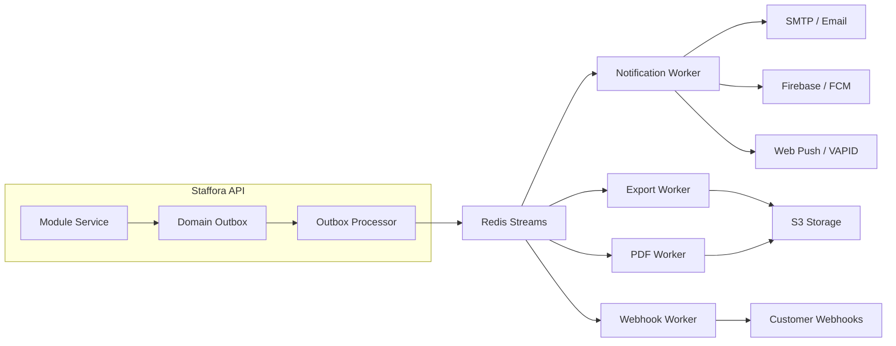
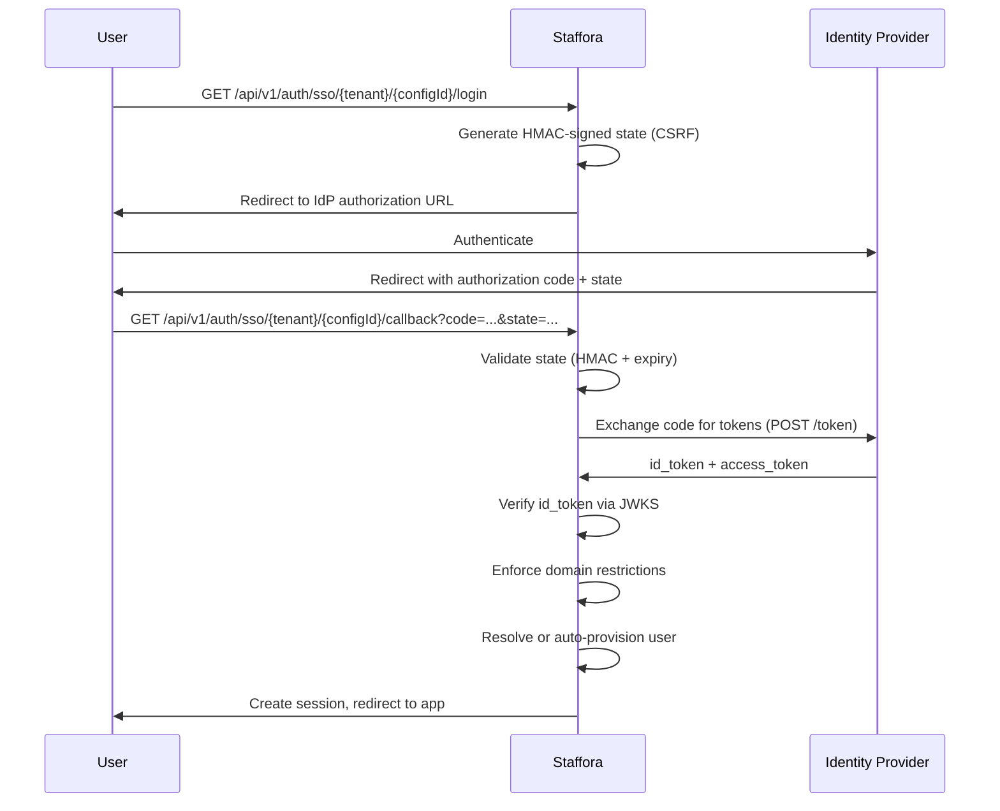
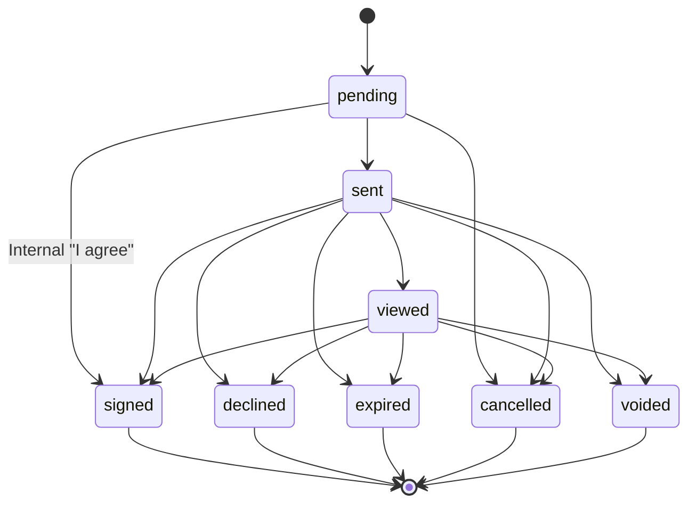

# External Service Integrations

> Last updated: 2026-03-28

This document describes every external service that Staffora integrates with, including configuration, usage patterns, and error handling.

---

## Table of Contents

1. [Integration Architecture](#integration-architecture)
2. [Amazon S3 -- Document Storage & Exports](#amazon-s3----document-storage--exports)
3. [SMTP / Email -- Nodemailer](#smtp--email----nodemailer)
4. [Firebase Cloud Messaging -- Push Notifications](#firebase-cloud-messaging----push-notifications)
5. [Web Push -- VAPID Notifications](#web-push----vapid-notifications)
6. [Redis -- Caching, Sessions, Job Queues](#redis----caching-sessions-job-queues)
7. [SSO / OIDC -- Single Sign-On](#sso--oidc----single-sign-on)
8. [Calendar Sync -- iCal Feeds](#calendar-sync----ical-feeds)
9. [E-Signatures](#e-signatures)
10. [Webhook Delivery](#webhook-delivery)
11. [Integration Management Module](#integration-management-module)
12. [Configuration Reference](#configuration-reference)

---

## Integration Architecture

All external integrations follow a consistent architectural pattern within Staffora:



Key principles:

- **Outbox pattern**: All domain events are written to the `domain_outbox` table inside the same database transaction as the business write, then published to Redis Streams asynchronously.
- **At-least-once delivery**: Workers use Redis consumer groups; failed messages are retried with exponential backoff and eventually moved to a dead-letter queue.
- **Tenant isolation**: Every integration record is scoped to a `tenant_id` and protected by PostgreSQL RLS.

---

## Amazon S3 -- Document Storage & Exports

### Purpose

S3 is used for:
- Storing generated export files (CSV, XLSX, JSON)
- Storing generated PDF documents (certificates, letters, case bundles)
- Offsite database backups (daily, weekly, monthly tiers)

### Configuration

| Environment Variable | Description | Default |
|---------------------|-------------|---------|
| `S3_BACKUP_BUCKET` | S3 bucket name for database backups | -- (required for offsite backup) |
| `S3_BACKUP_PREFIX` | Key prefix within the bucket | `backups/staffora/` |
| `S3_BACKUP_STORAGE_CLASS` | S3 storage class | `STANDARD_IA` |
| `AWS_DEFAULT_REGION` | AWS region | `eu-west-2` |
| `AWS_ACCESS_KEY_ID` | AWS access key | -- |
| `AWS_SECRET_ACCESS_KEY` | AWS secret key | -- |

### Usage Pattern

The **export worker** (`packages/api/src/jobs/export-worker.ts`) generates files and uploads them to S3:

1. A module service creates an export job by writing to the `domain_outbox`.
2. The outbox processor publishes the job to the `staffora:exports` Redis Stream.
3. The export worker reads from the stream, queries the database, generates the file, and uploads to S3.
4. A notification is sent to the requesting user with a presigned download URL.

For large datasets (1,000+ rows), the export worker uses **cursor-based streaming** with batched reads of 500 rows at a time, writing to temporary files to avoid loading the entire result set into memory. The maximum export size is capped at 100,000 rows.

### Error Handling

- Upload failures are retried by the worker (up to `WORKER_MAX_RETRIES`, default 10).
- Failed jobs are moved to a dead-letter queue after exhausting retries.
- The DLQ is monitored hourly by the scheduler.

---

## SMTP / Email -- Nodemailer

### Purpose

Email is the primary notification channel for transactional messages: welcome emails, password resets, leave approvals, review deadlines, and more.

### Configuration

| Environment Variable | Description | Default |
|---------------------|-------------|---------|
| `SMTP_HOST` | SMTP server hostname | `localhost` |
| `SMTP_PORT` | SMTP server port | `587` |
| `SMTP_SECURE` | Use TLS | `false` |
| `SMTP_USER` | SMTP authentication username | -- |
| `SMTP_PASS` | SMTP authentication password | -- |
| `SMTP_FROM` | Sender address | `noreply@staffora.co.uk` |

### Implementation

The notification worker (`packages/api/src/jobs/notification-worker.ts`) provides two mailer implementations:

| Mailer | Environment | Behaviour |
|--------|-------------|-----------|
| `ConsoleMailer` | Development (`NODE_ENV !== production`) | Logs emails to stdout instead of sending |
| `SmtpMailer` | Production (`NODE_ENV === production`) | Sends via nodemailer over SMTP |

### Template Engine

Email templates are defined inline in the notification worker with `{{variable}}` placeholders. Available templates:

| Template | Trigger | Variables |
|----------|---------|-----------|
| `welcome` | Employee created | `companyName`, `firstName`, `loginUrl` |
| `password_reset` | Password reset requested | `firstName`, `resetUrl`, `expiresIn` |
| `leave_approved` | Leave request approved | `firstName`, `leaveType`, `startDate`, `endDate` |
| `leave_rejected` | Leave request rejected | `firstName`, `leaveType`, `reason` |
| `review_reminder` | Performance review deadline | `firstName`, `revieweeName`, `deadline` |
| `case_assigned` | Case assigned to agent | `firstName`, `caseRef`, `subject` |

### Multi-Channel Delivery

Each notification specifies one or more channels:

```typescript
interface NotificationPayload {
  channels: ("email" | "in_app" | "push")[];
  priority?: "low" | "normal" | "high" | "urgent";
  email?: EmailNotificationPayload;
  inApp?: InAppNotificationPayload;
  push?: PushNotificationPayload;
  deduplicationKey?: string;
  scheduledAt?: string;
}
```

The worker processes each channel independently and tracks per-channel delivery results.

---

## Firebase Cloud Messaging -- Push Notifications

### Purpose

Firebase Cloud Messaging (FCM) delivers push notifications to mobile devices (iOS, Android) and web browsers via registered push tokens.

### Configuration

| Environment Variable | Description |
|---------------------|-------------|
| `FIREBASE_SERVICE_ACCOUNT_PATH` | Path to Firebase service account JSON file |
| `FIREBASE_SERVICE_ACCOUNT_JSON` | Firebase service account JSON as a string (alternative) |

### Usage Pattern

1. Client apps register their FCM token via `POST /api/v1/notifications/push-tokens`.
2. Tokens are stored in the `push_tokens` table with platform metadata (ios, android, web).
3. When a push notification is triggered, the notification worker looks up all active tokens for the target user and sends via the Firebase Admin SDK.
4. Invalid or expired tokens are automatically cleaned up.

---

## Web Push -- VAPID Notifications

### Purpose

Web Push (RFC 8292 VAPID) delivers push notifications to browser service workers without requiring Firebase.

### Configuration

| Environment Variable | Description |
|---------------------|-------------|
| `VAPID_PUBLIC_KEY` | VAPID public key (base64url-encoded) |
| `VAPID_PRIVATE_KEY` | VAPID private key (base64url-encoded) |
| `VAPID_SUBJECT` | `mailto:` or URL identifying the application server |

### Usage Pattern

1. Client subscribes via the Push API and sends the subscription object to `POST /api/v1/notifications/push/subscribe`.
2. Subscriptions are stored in the `push_subscriptions` table.
3. The notification worker uses the `web-push` library to send encrypted payloads to each subscription endpoint.
4. Expired or invalid subscriptions (HTTP 410 Gone) are automatically removed.

---

## Redis -- Caching, Sessions, Job Queues

### Purpose

Redis 7 serves multiple roles within Staffora:

| Role | Description | Key Pattern |
|------|-------------|-------------|
| **Session storage** | BetterAuth session data | `staffora:session:{sessionId}` |
| **Permission caching** | RBAC permission sets per user/tenant | `staffora:perms:{tenantId}:{userId}` |
| **Rate limiting** | Request rate counters | `staffora:rate:{tenantId}:{userId}:{endpoint}` |
| **Reference data cache** | Leave types, positions, course catalogs | `staffora:tenant:{tenantId}:leave-types` |
| **Job queues** | Redis Streams for background workers | `staffora:domain-events`, `staffora:notifications`, etc. |
| **Distributed locking** | Preventing concurrent mutations | `staffora:lock:{resource}` |

### Configuration

| Environment Variable | Description | Default |
|---------------------|-------------|---------|
| `REDIS_URL` | Full Redis connection URL | `redis://localhost:6379` |
| `REDIS_HOST` | Redis hostname (if not using URL) | `localhost` |
| `REDIS_PORT` | Redis port | `6379` |
| `REDIS_PASSWORD` | Redis authentication password | -- |
| `REDIS_DB` | Redis database number | `0` |
| `REDIS_KEY_PREFIX` | Global key prefix | `staffora:` |
| `REDIS_MAX_RETRIES` | Command retry count | `3` |
| `REDIS_CONNECT_TIMEOUT` | Connection timeout (ms) | `10000` |
| `REDIS_COMMAND_TIMEOUT` | Command timeout (ms) | `5000` |

### Cache TTL Strategy

| TTL Constant | Duration | Use Case |
|-------------|----------|----------|
| `SHORT` | 1 minute | Volatile data |
| `SESSION` | 5 minutes | Session lookups |
| `EMPLOYEE` | 10 minutes | Employee basic info |
| `MEDIUM` | 15 minutes | Frequently accessed data |
| `PERMISSIONS` | 15 minutes | RBAC permission sets |
| `LONG` | 1 hour | Rarely changing data |
| `REFERENCE` | 24 hours | Reference/lookup data |

### Local LRU Cache

The `CacheClient` includes an in-process LRU cache (max 500 entries, capped at 60-second local TTL) to avoid JSON parse/stringify round-trips to Redis for hot data like sessions and permissions.

### Persistence

Redis is configured with both AOF (`appendfsync everysec`) and RDB snapshots for durability. However, Redis data is not authoritative -- all business data lives in PostgreSQL. After a Redis data loss, caches are rebuilt on demand and sessions require re-authentication.

---

## SSO / OIDC -- Single Sign-On

### Purpose

The SSO module (`packages/api/src/modules/sso/`) enables enterprise tenants to authenticate users through their corporate identity provider using the OpenID Connect (OIDC) protocol. SAML configuration storage is supported but the SAML protocol flow is not yet implemented.

### Configuration

SSO configurations are stored per-tenant in the `sso_configurations` table. Each configuration includes:

| Field | Description |
|-------|-------------|
| `provider_type` | `oidc` or `saml` |
| `provider_name` | Display name (e.g., "Okta", "Azure AD") |
| `client_id` | OIDC client ID |
| `client_secret` (encrypted) | OIDC client secret |
| `issuer_url` | OIDC issuer URL (e.g., `https://login.microsoftonline.com/{tenant}/v2.0`) |
| `allowed_domains` | Email domain whitelist |
| `auto_provision` | Enable JIT user provisioning |
| `default_role_id` | Role assigned to auto-provisioned users |
| `attribute_mapping` | Map IdP claims to Staffora fields |

### OIDC Login Flow



### Security Measures

- **State parameter**: HMAC-SHA256 signed with `SSO_ENCRYPTION_KEY` (falls back to `BETTER_AUTH_SECRET`), includes a nonce and timestamp. States expire after 10 minutes.
- **JWKS verification**: id_tokens are cryptographically verified against the IdP's published JWKS endpoint. JWKS resolvers are cached per issuer.
- **Domain restrictions**: If `allowed_domains` is configured, users with email addresses outside those domains are rejected.
- **JIT provisioning**: When `auto_provision` is enabled, new users are created in `app."user"`, `app.users`, `app."account"`, and `app.user_tenants` atomically.
- **Audit trail**: Every SSO login attempt (success or failure) is recorded in the `sso_login_attempts` table.

### API Endpoints

| Method | Path | Auth | Description |
|--------|------|------|-------------|
| GET | `/api/v1/auth/sso/{tenant}/discover` | Public | List enabled SSO providers for a tenant |
| GET | `/api/v1/auth/sso/{tenant}/{configId}/login` | Public | Initiate OIDC login (redirect) |
| GET | `/api/v1/auth/sso/{tenant}/{configId}/callback` | Public | Handle IdP callback |
| GET | `/api/v1/sso/configs` | Admin | List SSO configurations |
| POST | `/api/v1/sso/configs` | Admin | Create SSO configuration |
| PATCH | `/api/v1/sso/configs/:id` | Admin | Update SSO configuration |
| DELETE | `/api/v1/sso/configs/:id` | Admin | Delete SSO configuration |
| GET | `/api/v1/sso/configs/:id/attempts` | Admin | List login attempts |

---

## Calendar Sync -- iCal Feeds

### Purpose

The calendar sync module (`packages/api/src/modules/calendar-sync/`) generates RFC 5545 compliant iCal feeds containing a user's approved and pending leave requests. This allows employees to subscribe to their leave calendar in Google Calendar, Outlook, Apple Calendar, or any iCal-compatible client.

### How It Works

1. User enables the iCal feed via `POST /api/v1/calendar/ical/enable`.
2. The system generates a 64-character cryptographic token and returns a feed URL.
3. The user subscribes to `GET /api/v1/calendar/ical/{token}` in their calendar app.
4. The feed endpoint requires **no authentication** -- the token itself acts as the credential.
5. Calendar apps poll the feed periodically (Staffora suggests 1-hour refresh via `X-PUBLISHED-TTL`).

### iCal Feed Content

- Product identifier: `-//Staffora//HRIS Calendar//EN`
- Calendar name: `Staffora Leave Calendar`
- Events include approved and pending leave requests
- Pending requests are prefixed with `[Pending]` in the summary
- Half-day information is included in the event description
- Each event uses the leave request UUID as a stable UID

### API Endpoints

| Method | Path | Auth | Description |
|--------|------|------|-------------|
| GET | `/api/v1/calendar/connections` | User | List calendar connections |
| POST | `/api/v1/calendar/ical/enable` | User | Enable iCal feed |
| POST | `/api/v1/calendar/ical/regenerate` | User | Regenerate feed token (invalidates old URL) |
| DELETE | `/api/v1/calendar/ical/disable` | User | Disable iCal feed |
| GET | `/api/v1/calendar/ical/{token}` | Public (token) | Serve iCal feed |

### Security

- Feed tokens are 32 random bytes (64 hex characters), generated via `crypto.getRandomValues`.
- Tokens can be regenerated at any time, which immediately invalidates the previous URL.
- The feed endpoint does not expose sensitive data beyond leave type names and dates.

---

## E-Signatures

### Purpose

The e-signatures module (`packages/api/src/modules/e-signatures/`) manages electronic signature requests for HR documents. It supports:

- **Internal signatures**: "I agree" click-to-sign with timestamp and IP logging.
- **External providers**: Placeholder infrastructure for DocuSign and HelloSign (future integration).

### Signature Request Lifecycle



### API Endpoints

| Method | Path | Auth | Description |
|--------|------|------|-------------|
| GET | `/api/v1/e-signatures` | User | List signature requests |
| GET | `/api/v1/e-signatures/:id` | User | Get signature request details |
| POST | `/api/v1/e-signatures` | User | Create signature request |
| POST | `/api/v1/e-signatures/:id/send` | User | Mark as sent |
| POST | `/api/v1/e-signatures/:id/sign` | User | Sign internally |
| POST | `/api/v1/e-signatures/:id/decline` | User | Decline with reason |
| POST | `/api/v1/e-signatures/:id/cancel` | User | Cancel request |
| POST | `/api/v1/e-signatures/:id/void` | Admin | Void after signing |
| POST | `/api/v1/e-signatures/:id/remind` | User | Send reminder |
| GET | `/api/v1/e-signatures/:id/events` | User | Get audit trail |

### Internal Signing

For the internal provider, signing captures:
- Timestamp of signature
- IP address of the signer
- User agent string
- The signature statement text

All state transitions and signature events are recorded in the `signature_events` table for a complete audit trail.

---

## Webhook Delivery

See the dedicated [Webhook System](webhook-system.md) document for full details on webhook configuration, delivery, retry logic, payload formats, and security.

---

## Integration Management Module

The integrations module (`packages/api/src/modules/integrations/`) provides a generic framework for managing third-party service connections per tenant. It serves as the configuration layer for all external integrations.

### Integration Categories

| Category | Examples |
|----------|---------|
| Identity & SSO | Okta, Azure AD, OneLogin |
| Payroll | ADP, Sage, HMRC RTI |
| Communication | Slack, Microsoft Teams |
| E-Signature | DocuSign, HelloSign |
| Recruiting | LinkedIn, Indeed |
| Calendar | Google Calendar, Outlook |

### Integration Lifecycle

Each integration has one of three statuses:

| Status | Description |
|--------|-------------|
| `connected` | Active and configured |
| `disconnected` | Credentials cleared, integration inactive |
| `error` | Connection test failed or credentials expired |

### API Endpoints

| Method | Path | Auth | Description |
|--------|------|------|-------------|
| GET | `/api/v1/integrations` | Admin | List integrations (filterable by category, status, search) |
| GET | `/api/v1/integrations/:id` | Admin | Get integration details |
| POST | `/api/v1/integrations/connect` | Admin | Connect or update an integration |
| PATCH | `/api/v1/integrations/:id/config` | Admin | Update configuration |
| POST | `/api/v1/integrations/:id/disconnect` | Admin | Disconnect (clears credentials) |
| POST | `/api/v1/integrations/:id/test` | Admin | Test connection health |
| DELETE | `/api/v1/integrations/:id` | Admin | Permanently delete |

### Domain Events

All mutations emit domain events via the outbox pattern:

- `integration.connected`
- `integration.config_updated`
- `integration.disconnected`
- `integration.deleted`
- `integration.test_passed`
- `integration.test_failed`

---

## Configuration Reference

### All Environment Variables for External Services

| Variable | Service | Required | Default |
|----------|---------|----------|---------|
| `REDIS_URL` | Redis | Yes | `redis://localhost:6379` |
| `SMTP_HOST` | Email | Production | `localhost` |
| `SMTP_PORT` | Email | No | `587` |
| `SMTP_SECURE` | Email | No | `false` |
| `SMTP_USER` | Email | Production | -- |
| `SMTP_PASS` | Email | Production | -- |
| `SMTP_FROM` | Email | No | `noreply@staffora.co.uk` |
| `FIREBASE_SERVICE_ACCOUNT_PATH` | FCM | No | -- |
| `FIREBASE_SERVICE_ACCOUNT_JSON` | FCM | No | -- |
| `VAPID_PUBLIC_KEY` | Web Push | No | -- |
| `VAPID_PRIVATE_KEY` | Web Push | No | -- |
| `VAPID_SUBJECT` | Web Push | No | -- |
| `S3_BACKUP_BUCKET` | S3 | Production | -- |
| `AWS_DEFAULT_REGION` | S3 | Production | `eu-west-2` |
| `AWS_ACCESS_KEY_ID` | S3 | Production | -- |
| `AWS_SECRET_ACCESS_KEY` | S3 | Production | -- |
| `SSO_ENCRYPTION_KEY` | SSO | No | Falls back to `BETTER_AUTH_SECRET` |
| `OTEL_ENABLED` | OpenTelemetry | No | `false` |
| `OTEL_EXPORTER_OTLP_ENDPOINT` | OpenTelemetry | No | -- |

---

## Related Documents

- [Webhook System](webhook-system.md) -- Webhook configuration, delivery, and retry logic
- [Worker System](../11-operations/worker-system.md) -- Background job processing architecture
- [Monitoring & Observability](../11-operations/monitoring-observability.md) -- Metrics and tracing
- [Disaster Recovery](../11-operations/disaster-recovery.md) -- Backup and restore procedures
