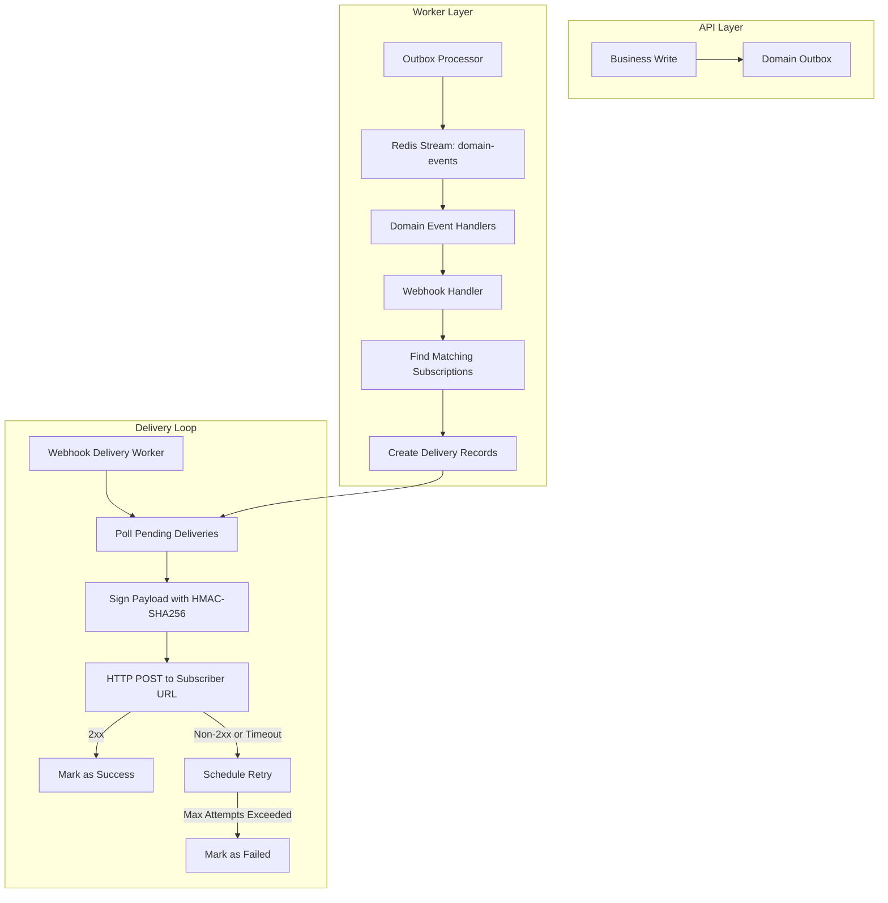
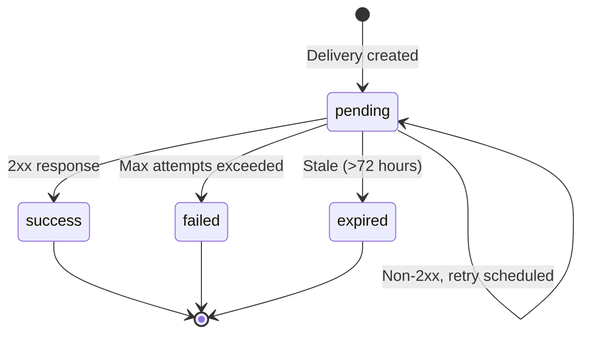

# Webhook System

> Last updated: 2026-03-28

This document describes Staffora's outbound webhook system for delivering domain events to external systems in real time.

---

## Table of Contents

1. [Overview](#overview)
2. [Architecture](#architecture)
3. [Webhook Subscriptions](#webhook-subscriptions)
4. [Event Type Matching](#event-type-matching)
5. [Payload Format](#payload-format)
6. [Security -- HMAC Signing](#security----hmac-signing)
7. [Delivery & Retry Logic](#delivery--retry-logic)
8. [Delivery Lifecycle](#delivery-lifecycle)
9. [API Endpoints](#api-endpoints)
10. [Configuration Limits](#configuration-limits)
11. [Monitoring & Cleanup](#monitoring--cleanup)
12. [Verifying Webhook Signatures](#verifying-webhook-signatures)

---

## Overview

Staffora's webhook system allows tenants to subscribe to domain events and receive real-time HTTP POST notifications at their specified URLs. This enables integrations with external systems without polling.

Key capabilities:

- **Event-driven**: Webhooks fire on any domain event emitted via the outbox pattern.
- **Pattern matching**: Subscribe to specific events (`hr.employee.created`), prefix wildcards (`hr.employee.*`), or all events (`*`).
- **HMAC-SHA256 signed**: Every delivery includes a cryptographic signature for verification.
- **Automatic retries**: Failed deliveries are retried with exponential backoff up to 5 attempts.
- **Delivery audit trail**: Every delivery attempt is recorded with response codes, timing, and error details.
- **Tenant-scoped**: Each tenant manages their own subscriptions, isolated by RLS.

---

## Architecture



The webhook system operates in two phases:

1. **Enqueue phase**: When a domain event is processed, the webhook handler finds all matching subscriptions for the tenant and creates a delivery record for each.
2. **Delivery phase**: A separate polling loop picks up pending deliveries, signs the payload, and executes the HTTP POST. Results are recorded regardless of success or failure.

---

## Webhook Subscriptions

### Creating a Subscription

```json
POST /api/v1/webhooks/subscriptions
{
  "name": "Employee Events",
  "url": "https://example.com/webhooks/staffora",
  "secret": "whsec_a1b2c3d4e5f6g7h8i9j0...",
  "eventTypes": ["hr.employee.*", "absence.leave_request.*"],
  "enabled": true,
  "description": "Sync employee changes to external HRIS"
}
```

### Subscription Fields

| Field | Type | Required | Description |
|-------|------|----------|-------------|
| `name` | string | Yes | Display name (max 255 chars) |
| `url` | string | Yes | Delivery URL (HTTPS required in production; HTTP localhost allowed in development) |
| `secret` | string | Yes | HMAC signing secret (min 32 chars, max 512 chars) |
| `eventTypes` | string[] | Yes | Event type patterns to match (1-100 patterns) |
| `enabled` | boolean | No | Whether the subscription is active (default: true) |
| `description` | string | No | Optional description (max 1000 chars) |

### URL Validation

- **Production**: Only HTTPS URLs are accepted.
- **Development**: HTTP is allowed for `localhost` and `127.0.0.1`.
- URLs must be parseable as valid URLs.

---

## Event Type Matching

Subscriptions specify event type patterns that are matched against incoming domain events:

| Pattern | Example Match | Description |
|---------|---------------|-------------|
| `*` | Any event | Global wildcard -- receives everything |
| `hr.employee.created` | `hr.employee.created` only | Exact match |
| `hr.employee.*` | `hr.employee.created`, `hr.employee.updated`, `hr.employee.terminated` | Prefix wildcard |
| `absence.*` | `absence.leave_request.created`, `absence.balance.updated` | Module-level wildcard |

### Pattern Validation

Event type patterns must match: `^[a-z][a-z0-9_]*(\.[a-z][a-z0-9_]*)*(\.\*)?$`

Valid examples: `hr.employee.created`, `lms.enrollment.*`, `*`

Invalid examples: `HR.Employee`, `hr employee`, `*.created`

---

## Payload Format

Every webhook delivery sends a JSON payload as an HTTP POST:

```json
{
  "eventId": "a1b2c3d4-e5f6-7890-abcd-ef1234567890",
  "tenantId": "f1e2d3c4-b5a6-7890-abcd-ef1234567890",
  "aggregateType": "employee",
  "aggregateId": "11223344-5566-7788-99aa-bbccddeeff00",
  "eventType": "hr.employee.created",
  "payload": {
    "employee": {
      "id": "11223344-5566-7788-99aa-bbccddeeff00",
      "firstName": "Jane",
      "lastName": "Smith",
      "email": "jane.smith@example.com"
    },
    "actor": "00112233-4455-6677-8899-aabbccddeeff"
  },
  "metadata": {
    "createdAt": "2026-03-28T14:30:00.000Z",
    "publishedAt": "2026-03-28T14:30:01.234Z"
  }
}
```

### HTTP Headers

Every delivery includes the following headers:

| Header | Description | Example |
|--------|-------------|---------|
| `Content-Type` | Always `application/json` | `application/json` |
| `X-Webhook-Signature` | HMAC-SHA256 signature | `sha256=a1b2c3d4...` |
| `X-Webhook-Timestamp` | Unix timestamp (seconds) | `1711626600` |
| `X-Webhook-Event` | Event type | `hr.employee.created` |
| `X-Webhook-Delivery-Id` | Unique delivery ID | `uuid` |
| `User-Agent` | Client identifier | `Staffora-Webhooks/1.0` |

---

## Security -- HMAC Signing

Every webhook delivery is signed using HMAC-SHA256 with the subscription's secret key.

### Signature Generation

```
signature = HMAC-SHA256(secret, JSON.stringify(payload))
header    = "sha256=" + hex(signature)
```

The signature is sent in the `X-Webhook-Signature` header.

### Implementation Details

- Uses the Web Crypto API (`crypto.subtle.importKey` + `crypto.subtle.sign`) for HMAC computation.
- The signing secret is stored in the database but **never exposed in API responses**.
- Minimum secret length is 32 characters to ensure adequate entropy.

---

## Delivery & Retry Logic

### Retry Schedule

Failed deliveries are retried with exponential backoff and jitter:

| Attempt | Base Delay | With Jitter Range | Maximum |
|---------|-----------|-------------------|---------|
| 1 | 60s | 48s - 72s | -- |
| 2 | 120s | 96s - 144s | -- |
| 3 | 240s | 192s - 288s | -- |
| 4 | 480s | 384s - 576s | -- |
| 5 | 960s | 768s - 1152s | 3600s (1 hour) |

Formula: `delay = min(30 * 2^attempt, 3600) +/- 20% jitter`

Minimum delay between any two attempts: 10 seconds.

### Success Criteria

A delivery is considered successful when the receiver responds with an HTTP status code in the `2xx` range (200-299). Any other status code or network error triggers a retry.

### Timeout

Each delivery attempt has a 30-second timeout. If the receiver does not respond within 30 seconds, the request is aborted and treated as a failure.

### Maximum Attempts

The default maximum is **5 attempts** per delivery. After all attempts are exhausted, the delivery status is set to `failed`.

---

## Delivery Lifecycle



| Status | Description |
|--------|-------------|
| `pending` | Awaiting delivery or retry |
| `success` | Delivered successfully (2xx response) |
| `failed` | All retry attempts exhausted |
| `expired` | Stale delivery older than 72 hours, cleaned up by scheduler |

---

## API Endpoints

### Subscription Management

| Method | Path | Description |
|--------|------|-------------|
| GET | `/api/v1/webhooks/subscriptions` | List subscriptions (cursor-paginated) |
| GET | `/api/v1/webhooks/subscriptions/:id` | Get subscription details |
| POST | `/api/v1/webhooks/subscriptions` | Create subscription |
| PATCH | `/api/v1/webhooks/subscriptions/:id` | Update subscription |
| DELETE | `/api/v1/webhooks/subscriptions/:id` | Delete subscription |

### Delivery Inspection

| Method | Path | Description |
|--------|------|-------------|
| GET | `/api/v1/webhooks/subscriptions/:id/deliveries` | List deliveries for a subscription |
| GET | `/api/v1/webhooks/deliveries/:id` | Get delivery details |

### Delivery List Filters

| Parameter | Type | Description |
|-----------|------|-------------|
| `cursor` | string | Pagination cursor |
| `limit` | number | Page size (1-100, default 20) |
| `status` | string | Filter by status: `pending`, `success`, `failed`, `expired` |
| `eventType` | string | Filter by event type |

---

## Configuration Limits

| Limit | Value |
|-------|-------|
| Maximum subscriptions per tenant | 50 |
| Maximum event type patterns per subscription | 100 |
| Maximum delivery attempts | 5 |
| Delivery timeout | 30 seconds |
| Response body storage limit | 4,096 characters |
| Stale delivery expiry | 72 hours |
| Secret minimum length | 32 characters |
| Secret maximum length | 512 characters |

---

## Monitoring & Cleanup

### Stale Delivery Cleanup

The scheduler runs `expireStaleDeliveries()` to mark pending deliveries older than 72 hours as `expired`. This prevents unbounded growth of the deliveries table.

### Delivery Polling

The webhook delivery worker polls for pending deliveries every 5 seconds in batches of 50. It uses `FOR UPDATE SKIP LOCKED` to ensure safe concurrent processing when multiple worker instances are running.

### Domain Events

Webhook subscription lifecycle events are emitted to the outbox:

- `webhooks.subscription.created`
- `webhooks.subscription.updated`
- `webhooks.subscription.deleted`

---

## Verifying Webhook Signatures

Receivers should verify the `X-Webhook-Signature` header to ensure the payload was sent by Staffora and has not been tampered with.

### Node.js Example

```javascript
const crypto = require('crypto');

function verifyWebhookSignature(payload, signature, secret) {
  const expected = 'sha256=' + crypto
    .createHmac('sha256', secret)
    .update(payload)
    .digest('hex');

  // Use timing-safe comparison to prevent timing attacks
  if (signature.length !== expected.length) return false;
  return crypto.timingSafeEqual(
    Buffer.from(signature),
    Buffer.from(expected)
  );
}

// In your webhook handler:
app.post('/webhooks/staffora', (req, res) => {
  const signature = req.headers['x-webhook-signature'];
  const rawBody = JSON.stringify(req.body);

  if (!verifyWebhookSignature(rawBody, signature, process.env.WEBHOOK_SECRET)) {
    return res.status(401).json({ error: 'Invalid signature' });
  }

  // Process the event
  const event = req.body;
  console.log(`Received event: ${event.eventType}`);

  res.status(200).json({ received: true });
});
```

### Python Example

```python
import hmac
import hashlib

def verify_webhook_signature(payload: bytes, signature: str, secret: str) -> bool:
    expected = 'sha256=' + hmac.new(
        secret.encode(),
        payload,
        hashlib.sha256
    ).hexdigest()
    return hmac.compare_digest(signature, expected)
```

### Best Practices for Receivers

1. **Always verify signatures** before processing the payload.
2. **Respond quickly** with a 2xx status code. Process the event asynchronously if needed.
3. **Handle duplicates** -- the same event may be delivered more than once (at-least-once semantics). Use the `X-Webhook-Delivery-Id` header for deduplication.
4. **Return 200-299** for successful receipt, even if downstream processing will happen later.
5. **Log delivery IDs** for troubleshooting.

---

## Related Documents

- [External Service Integrations](external-services.md) -- All integration points
- [Worker System](../11-operations/worker-system.md) -- Background job processing
- [Production Checklist](../11-operations/production-checklist.md) -- Operational readiness
