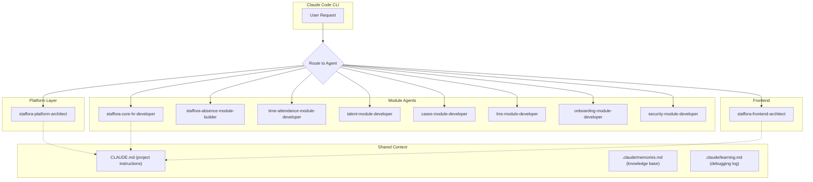

# AI Agent System

> Last updated: 2026-03-28

This document describes the AI development agent system used in the Staffora HRIS platform for accelerated, domain-aware development assistance.

---

## Table of Contents

1. [Overview](#overview)
2. [Agent Architecture](#agent-architecture)
3. [Available Agents](#available-agents)
4. [How to Use Agents](#how-to-use-agents)
5. [Skill System](#skill-system)
6. [Memory System](#memory-system)
7. [Agent Operating Instructions](#agent-operating-instructions)

---

## Overview

Staffora uses a system of specialised AI development agents defined in `.claude/agents/`. Each agent is a Claude Code agent with deep knowledge of a specific module or architectural layer of the platform. Agents are configured for **swarm mode**, meaning they can delegate subtasks to each other when a task crosses domain boundaries.

The agent system enables:

- **Domain expertise**: Each agent knows the patterns, schemas, and conventions for its module.
- **Consistency**: Agents enforce project patterns (RLS, outbox, effective dating, state machines) automatically.
- **Velocity**: Agents generate production-grade code following established module structure (schemas, repository, service, routes, index).
- **Quality**: Agents verify that new code includes proper RLS policies, outbox events, idempotency, and test coverage.

---

## Agent Architecture



All agents share access to the same project context files (`CLAUDE.md`, `.claude/memories.md`, `.claude/learning.md`) and operate under the same operating instructions defined in `.claude/CLAUDE.md`.

---

## Available Agents

### Platform Infrastructure

| Agent | File | Model | Description |
|-------|------|-------|-------------|
| **staffora-platform-architect** | `.claude/agents/hris-platform-architect.md` | Opus | Docker, PostgreSQL migrations with RLS, Redis, Elysia.js plugins, BetterAuth, RBAC, audit logging, worker processes |

**Invoke when**: Setting up infrastructure, creating database schemas, implementing RLS policies, building plugins, configuring authentication, establishing RBAC.

### Core HR

| Agent | File | Model | Description |
|-------|------|-------|-------------|
| **staffora-core-hr-developer** | `.claude/agents/hris-core-hr-developer.md` | Opus | Employee data, org structure, positions, contracts, compensation, effective dating, state machines |

**Invoke when**: Working on employee management, organisational hierarchy, position assignments, salary history, or any effective-dated HR record.

### Absence Management

| Agent | File | Model | Description |
|-------|------|-------|-------------|
| **staffora-absence-module-builder** | `.claude/agents/hris-absence-module-builder.md` | Opus | Leave types, policies, balances, requests, accruals, carryover, public holidays, ledger-based tracking |

**Invoke when**: Building leave request workflows, balance calculations, accrual rules, carryover processing, or UK statutory leave compliance.

### Time & Attendance

| Agent | File | Model | Description |
|-------|------|-------|-------------|
| **time-attendance-module-developer** | `.claude/agents/time-attendance-module-developer.md` | Opus | Time devices, clock events, schedules, shifts, timesheets, geo-fence validation (Haversine) |

**Invoke when**: Implementing time clock functionality, schedule management, timesheet approval workflows, or geo-fence validation.

### Talent Management

| Agent | File | Model | Description |
|-------|------|-------|-------------|
| **talent-module-developer** | `.claude/agents/talent-module-developer.md` | Opus | Performance review cycles, goals/OKRs, competency assessments, 360 feedback, calibration, succession planning |

**Invoke when**: Building performance review workflows, goal tracking, competency frameworks, or calibration sessions.

### Cases

| Agent | File | Model | Description |
|-------|------|-------|-------------|
| **cases-module-developer** | `.claude/agents/cases-module-developer.md` | Opus | Case management, SLA tracking, escalation logic, case comments, knowledge base, PDF bundle generation |

**Invoke when**: Implementing case workflows, SLA timers, escalation rules, or case documentation features.

### LMS (Learning Management)

| Agent | File | Model | Description |
|-------|------|-------|-------------|
| **lms-module-developer** | `.claude/agents/lms-module-developer.md` | Opus | Courses, enrollments, learning paths, completions, certificates, compliance training, skill assessments |

**Invoke when**: Building course management, enrollment workflows, certificate generation, or training compliance tracking.

### Onboarding

| Agent | File | Model | Description |
|-------|------|-------|-------------|
| **onboarding-module-developer** | `.claude/agents/onboarding-module-developer.md` | Opus | Onboarding templates, task checklists, document collection, welcome workflows, buddy assignment, progress tracking |

**Invoke when**: Implementing onboarding or offboarding templates, task management, or document collection flows.

### Security

| Agent | File | Model | Description |
|-------|------|-------|-------------|
| **security-module-developer** | `.claude/agents/security-module-developer.md` | Opus | Field-level permissions, portal access control, manager hierarchy, security audit logging, IP allowlisting, session management |

**Invoke when**: Implementing fine-grained access controls, field-level security, portal restrictions, or security auditing.

### Frontend

| Agent | File | Model | Description |
|-------|------|-------|-------------|
| **staffora-frontend-architect** | `.claude/agents/hris-frontend-architect.md` | Opus | React 18, React Router v7, React Query, Tailwind CSS, permission-based routing, form handling, data tables |

**Invoke when**: Building React components, pages, hooks, API integrations, permission guards, or any frontend feature.

---

## How to Use Agents

### In Claude Code CLI

Agents are invoked automatically by Claude Code when a task matches an agent's description. You can also explicitly request an agent:

```
"Use the staffora-core-hr-developer agent to implement the employee promotion workflow"
```

### Swarm Mode

All agents are configured with `swarm: true`, which means:

1. An agent working on a task can delegate subtasks to other agents.
2. For example, the `talent-module-developer` working on performance reviews might invoke the `staffora-platform-architect` to create the database migration, then the `staffora-frontend-architect` to build the review form UI.
3. Delegation happens transparently -- the primary agent coordinates the work.

### One Agent Per TODO

Per project conventions, when working through a backlog of TODO items, **launch one dedicated agent per item**. Never batch multiple unrelated items into a single agent invocation.

---

## Skill System

Skills provide domain-specific guidance that can be invoked with `/` commands in Claude Code. Unlike agents, skills are lightweight prompts that provide patterns and conventions without taking over the conversation.

### Available Skills

| Skill | Command | Description |
|-------|---------|-------------|
| API Conventions | `/api-conventions` | API design, pagination, error handling, TypeBox schemas |
| Backend Module Dev | `/backend-module-development` | Creating Elysia.js modules with the 5-file pattern |
| Database Migrations | `/database-migrations-rls` | PostgreSQL migrations with RLS policies |
| postgres.js Patterns | `/postgres-js-patterns` | Tagged template SQL queries, transactions |
| Effective Dating | `/effective-dating-patterns` | Time-versioned records, overlap prevention |
| Outbox Pattern | `/outbox-pattern` | Transactional outbox for domain events |
| State Machines | `/state-machine-patterns` | Status workflows, transition enforcement |
| Testing | `/testing-patterns` | Integration tests for RLS, idempotency, outbox |
| Frontend Components | `/frontend-react-components` | React components, React Query hooks |
| Better Auth | `/better-auth-integration` | Authentication flows, sessions, MFA |
| Docker Development | `/docker-development` | Container management, local dev |

### When to Use Skills vs Agents

| Use Case | Approach |
|----------|----------|
| Building a complete new module | Agent (e.g., `staffora-core-hr-developer`) |
| Quick reference on a pattern | Skill (e.g., `/outbox-pattern`) |
| Complex cross-cutting feature | Agent with swarm delegation |
| Code review or convention check | Skill (e.g., `/api-conventions`) |

---

## Memory System

The project maintains two shared memory files that all agents read and write:

### `.claude/memories.md` -- Long-Term Knowledge

Updated when discovering:
- Architecture insights
- Important workflows
- Project conventions
- Infrastructure details
- Permanent design decisions
- Repository structure explanations

### `.claude/learning.md` -- Debugging Discoveries

Updated when encountering:
- Bugs or unexpected behaviour
- Failed fix attempts (critical for preventing repeated mistakes)
- Build errors or dependency conflicts
- Performance bottlenecks
- Hidden dependencies
- Complex debugging sessions
- Environment or tooling issues

### Memory Entry Standards

All entries must be:
- **Clear**: Understandable without additional context
- **Concise**: No unnecessary detail
- **Root-cause focused**: Explain WHY the issue happened
- **Actionable**: Useful for future agents encountering similar situations

### Failed Attempt Tracking

If an attempted fix fails, agents are required to record it in the Failed Attempts section of `.claude/learning.md`. This prevents future agents from repeating the same mistake and significantly reduces debugging cycles.

---

## Agent Operating Instructions

All agents operate under the rules defined in `.claude/CLAUDE.md`:

1. **Consult context files**: Agents check `memories.md` and `learning.md` when they contain relevant entries.
2. **Log discoveries**: Debugging findings go to `learning.md`; architecture insights go to `memories.md`.
3. **Never silently fix**: Complex issues must be documented in the learning log.
4. **Score-driven perfection**: If a task has a score (e.g., "85/100"), agents must take action to reach 100/100.
5. **Zero manual maintenance**: The memory system is maintained automatically by agents as part of their normal workflow.

---

## Related Documents

- [CLAUDE.md](../../CLAUDE.md) -- Primary project instructions and architecture guide
- [.claude/CLAUDE.md](../../.claude/CLAUDE.md) -- Agent operating instructions
- [Development Guide](../05-development/) -- Development workflow and conventions
- [Testing Patterns](../08-testing/) -- Integration test patterns
- [Backend Module Development](../04-api/) -- API module architecture
