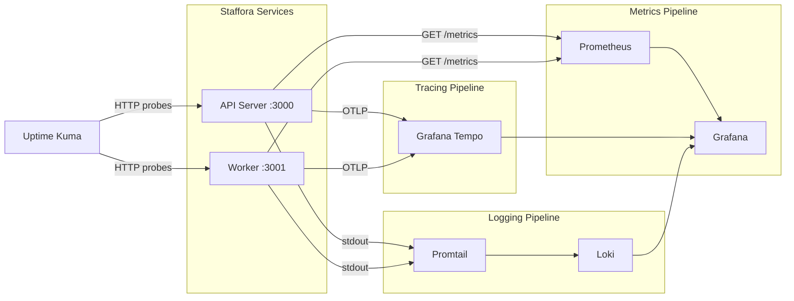

# Monitoring & Observability

> Last updated: 2026-03-28

This document describes Staffora's monitoring, metrics, tracing, health checks, and logging infrastructure.

---

## Table of Contents

1. [Observability Stack](#observability-stack)
2. [Prometheus Metrics](#prometheus-metrics)
3. [OpenTelemetry Distributed Tracing](#opentelemetry-distributed-tracing)
4. [Health Check Endpoints](#health-check-endpoints)
5. [Structured Logging](#structured-logging)
6. [Grafana Dashboards](#grafana-dashboards)
7. [Alerting Recommendations](#alerting-recommendations)
8. [Uptime Monitoring](#uptime-monitoring)

---

## Observability Stack



| Component | Purpose | Configuration |
|-----------|---------|--------------|
| Prometheus | Metrics scraping and storage | Scrape `/metrics` endpoints |
| Grafana Tempo | Distributed trace storage | Receives OTLP from API and worker |
| Loki + Promtail | Log aggregation | Collects container stdout/stderr |
| Grafana | Dashboards and alerting | Provisioned dashboards and alert rules |
| Uptime Kuma | External uptime monitoring | HTTP probes to health endpoints |

---

## Prometheus Metrics

### API Server Metrics (`GET /metrics` on port 3000)

The metrics plugin (`packages/api/src/plugins/metrics.ts`) exposes Prometheus-compatible metrics in plain text exposition format. No external dependencies are required.

#### Request Metrics

| Metric | Type | Labels | Description |
|--------|------|--------|-------------|
| `http_requests_total` | counter | `method`, `route`, `status` | Total HTTP requests |
| `http_request_duration_seconds` | histogram | `method`, `route` | Request latency distribution |
| `http_active_requests` | gauge | -- | Currently in-flight requests |

**Histogram buckets**: 5ms, 10ms, 25ms, 50ms, 100ms, 250ms, 500ms, 1s, 2.5s, 5s, 10s

#### Infrastructure Metrics

| Metric | Type | Description |
|--------|------|-------------|
| `db_pool_active_connections` | gauge | Active PostgreSQL connections |
| `db_pool_idle_connections` | gauge | Idle PostgreSQL connections |
| `redis_connected` | gauge | Redis connectivity (0 or 1) |
| `process_memory_bytes` | gauge | Process memory usage (rss, heapUsed, heapTotal, external) |
| `process_uptime_seconds` | gauge | Process uptime |

#### Route Normalization

Request paths are normalised before being used as metric labels to prevent high-cardinality explosions:

- UUIDs are collapsed to `:id` (e.g., `/api/v1/hr/employees/abc-123` becomes `/api/v1/hr/employees/:id`)
- Numeric IDs are collapsed to `:id` (e.g., `/api/v1/items/42` becomes `/api/v1/items/:id`)

#### Metric Eviction

To prevent unbounded memory growth on long-running servers, request counters and histograms are automatically cleared every hour. This means the `_total` counters represent activity within the current hour, not all time. For long-term trending, configure Prometheus to scrape frequently (15-30 second intervals).

### Worker Metrics (`GET /metrics` on port 3001)

| Metric | Type | Description |
|--------|------|-------------|
| `staffora_worker_active_jobs` | gauge | Currently processing jobs |
| `staffora_worker_processed_jobs_total` | counter | Total successfully processed jobs |
| `staffora_worker_failed_jobs_total` | counter | Total failed jobs |
| `staffora_worker_uptime_seconds` | gauge | Worker uptime in seconds |
| `staffora_worker_redis_up` | gauge | Redis connection status (0/1) |
| `staffora_worker_database_up` | gauge | Database connection status (0/1) |

### Prometheus Configuration

Example `prometheus.yml` scrape configuration:

```yaml
scrape_configs:
  - job_name: 'staffora-api'
    scrape_interval: 15s
    static_configs:
      - targets: ['staffora-api:3000']

  - job_name: 'staffora-worker'
    scrape_interval: 15s
    static_configs:
      - targets: ['staffora-worker:3001']
```

---

## OpenTelemetry Distributed Tracing

### Overview

The tracing plugin (`packages/api/src/plugins/tracing.ts`) creates an OpenTelemetry span for each incoming HTTP request. When `OTEL_ENABLED` is not `"true"`, the plugin is a lightweight no-op that still derives `traceId`/`spanId` fields as `undefined` so downstream code compiles without conditional checks.

### Span Attributes

Each request span includes attributes following OpenTelemetry semantic conventions:

| Attribute | Description |
|-----------|-------------|
| `http.request.method` | HTTP method (GET, POST, etc.) |
| `url.full` | Full request URL |
| `url.path` | URL path |
| `http.response.status_code` | Response status code |
| `url.scheme` | http or https |
| `user_agent.original` | Client User-Agent header |
| `client.address` | Client IP address |
| `staffora.tenant_id` | Resolved tenant ID (custom) |
| `staffora.user_id` | Authenticated user ID (custom) |
| `staffora.request_id` | Request correlation ID (custom) |

### W3C Trace Context Propagation

The plugin parses incoming `traceparent` headers and propagates trace context through the request lifecycle. Outgoing responses include the `traceparent` header for distributed tracing across service boundaries.

### Excluded Paths

The following paths are excluded from tracing to reduce noise:

- `/health`
- `/ready`
- `/live`
- `/`
- `/docs`
- `/docs/json`

### Bun Compatibility

The tracing implementation uses manual instrumentation rather than Node.js auto-instrumentation hooks. All span creation and context propagation is explicit -- it does not rely on `AsyncLocalStorage` (which has known issues in Bun).

### Configuration

| Variable | Description | Default |
|----------|-------------|---------|
| `OTEL_ENABLED` | Enable OpenTelemetry tracing | `false` |
| `OTEL_EXPORTER_OTLP_ENDPOINT` | OTLP collector endpoint | -- |
| `OTEL_SERVICE_NAME` | Service name in traces | `staffora-api` / `staffora-worker` |

### Grafana Tempo Integration

When tracing is enabled, spans are exported via OTLP to Grafana Tempo for storage and querying. Traces can be correlated with logs using the `traceId` field.

---

## Health Check Endpoints

### API Server (port 3000)

| Endpoint | Purpose | Auth | Response |
|----------|---------|------|----------|
| `GET /health` | Full health status | None | `{ status, database, redis, uptime }` |
| `GET /metrics` | Prometheus metrics | None | Plain text metrics |

The `/health` endpoint checks:
- PostgreSQL connectivity (via `pg_isready` equivalent query)
- Redis connectivity (via `PING` command)
- Returns HTTP 200 if all dependencies are healthy, 503 otherwise

### Worker (port 3001)

| Endpoint | Purpose | Auth | Response |
|----------|---------|------|----------|
| `GET /health` | Full health status | None | `{ status, uptime, activeJobs, processedJobs, failedJobs, connections }` |
| `GET /ready` | Kubernetes readiness probe | None | `{ ready: true }` or HTTP 500 |
| `GET /live` | Kubernetes liveness probe | None | `{ alive: true }` |
| `GET /metrics` | Prometheus metrics | None | Plain text metrics |

### Docker Health Checks

Health checks are configured in `docker-compose.yml`:

| Service | Command | Interval | Start Period | Retries |
|---------|---------|----------|-------------|---------|
| postgres | `pg_isready -U hris -d hris` | 10s | 30s | 5 |
| redis | `redis-cli ping` | 10s | 10s | 5 |
| api | `GET /health` | 30s | 30s | 3 |
| worker | `GET /health` (port 3001) | 30s | 30s | 3 |

---

## Structured Logging

### Log Format

All services output structured JSON logs to stdout/stderr, collected by Promtail and forwarded to Loki.

### Log Levels

| Level | Use Case |
|-------|----------|
| `error` | Unrecoverable errors, failed operations |
| `warn` | Degraded functionality, non-critical failures |
| `info` | Request lifecycle, business events, startup/shutdown |
| `debug` | Detailed diagnostic information (disabled in production) |

### Request Logging

Every HTTP request is logged with:

- Request ID (correlates across services)
- HTTP method and path
- Response status code
- Response time in milliseconds
- Tenant ID (after resolution)
- User ID (after authentication)
- Client IP address

### Pino Logger

The API uses Pino for structured logging (`packages/api/src/lib/logger.ts`). In production, Pino outputs JSON. In development, it uses `pino-pretty` for human-readable output.

### Log Retention

Loki is configured with a default retention period of 30 days, configurable via `LOKI_RETENTION_PERIOD`.

---

## Grafana Dashboards

Two provisioned dashboards are included:

### staffora-overview.json

- Request rate and error rate over time
- Response time percentiles (p50, p95, p99)
- Active database connections
- Redis connectivity status
- Worker job throughput
- Active/failed job counts

### staffora-logs.json

- Log volume by service and level
- Error log stream with full text search
- Request ID correlation links to traces

---

## Alerting Recommendations

### Critical Alerts (Page)

| Alert | Condition | Severity |
|-------|-----------|----------|
| API Down | `/health` returns non-200 for > 2 minutes | SEV-1 |
| Worker Down | Worker `/health` returns non-200 for > 5 minutes | SEV-2 |
| Database Down | `db_pool_active_connections` = 0 for > 1 minute | SEV-1 |
| Redis Down | `redis_connected` = 0 for > 2 minutes | SEV-2 |
| High Error Rate | `http_requests_total{status=~"5.."}` > 5% of total for > 5 minutes | SEV-2 |
| High Latency | p95 `http_request_duration_seconds` > 5s for > 5 minutes | SEV-2 |

### Warning Alerts (Notify)

| Alert | Condition | Severity |
|-------|-----------|----------|
| Elevated Error Rate | `http_requests_total{status=~"5.."}` > 1% for > 10 minutes | SEV-3 |
| Worker Job Failures | `staffora_worker_failed_jobs_total` increases by > 10 in 15 minutes | SEV-3 |
| Connection Pool Near Limit | `db_pool_active_connections` > 15 (max is 20) for > 5 minutes | SEV-3 |
| High Memory Usage | `process_memory_bytes{type="rss"}` > 800MB (limit is 1GB) | SEV-3 |
| DLQ Growing | Dead-letter queue length > 0 for > 1 hour | SEV-3 |
| Outbox Backlog | `domain_outbox` unprocessed count > 1000 | SEV-3 |

### Grafana Alert Configuration

Alert rules are provisioned via `docker/grafana/provisioning/alerting/loki-alerts.yml`. Notification channels should be configured to send to:

- **SEV-1/SEV-2**: PagerDuty or on-call notification system
- **SEV-3**: Slack channel (`#staffora-alerts`)
- **SEV-4**: Email digest (weekly summary)

---

## Uptime Monitoring

Uptime Kuma is configured as a self-hosted uptime monitoring solution. It performs external HTTP probes against:

| Target | URL | Check Interval | Expected |
|--------|-----|----------------|----------|
| API Health | `https://api.staffora.co.uk/health` | 60s | HTTP 200 |
| Worker Health | Internal: `http://staffora-worker:3001/health` | 60s | HTTP 200 |
| Web Frontend | `https://staffora.co.uk/` | 60s | HTTP 200 |
| SSL Certificate | `https://api.staffora.co.uk` | 24h | Valid, > 14 days remaining |

For detailed configuration, see `docs/11-operations/uptime-monitoring.md`.

---

## Related Documents

- [Worker System](worker-system.md) -- Background job processing and metrics
- [Production Checklist](production-checklist.md) -- Monitoring requirements
- [Disaster Recovery](disaster-recovery.md) -- Failure detection and recovery
- [APM Tracing](apm-tracing.md) -- Detailed tracing setup guide
- [Log Aggregation](log-aggregation.md) -- Loki and Promtail configuration
- [Uptime Monitoring](uptime-monitoring.md) -- Uptime Kuma setup
