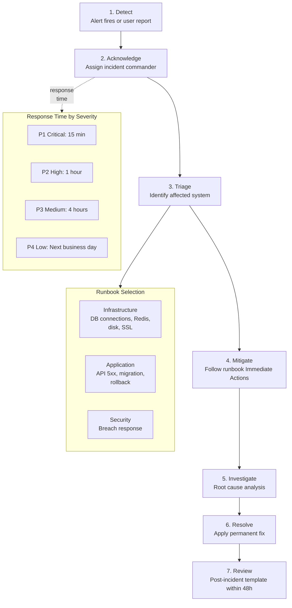

# Incident Response Runbooks

*Last updated: 2026-03-28*

Operational runbooks for the Staffora HRIS platform. Each runbook provides step-by-step instructions for diagnosing, mitigating, and resolving production incidents.

## Stack Reference

| Component       | Technology             | Container Name        | Default Port |
|-----------------|------------------------|-----------------------|--------------|
| Database        | PostgreSQL 16          | staffora-postgres     | 5432         |
| Connection Pool | PgBouncer 1.23         | staffora-pgbouncer    | 6432         |
| Cache / Queue   | Redis 7                | staffora-redis        | 6379         |
| API Server      | Elysia.js (Bun)        | docker-api-N          | 3000         |
| Background Jobs | Bun worker             | staffora-worker       | --           |
| Frontend        | React 18 (nginx)       | staffora-web          | 5173 / 80    |
| Reverse Proxy   | nginx                  | staffora-nginx        | 80 / 443     |
| Monitoring      | Grafana + Prometheus   | staffora-grafana      | 3100         |
| Log Aggregation | Loki + Promtail        | staffora-loki         | 3101         |

## Runbook Index

### Infrastructure

| Runbook | Severity | Description |
|---------|----------|-------------|
| [Database Connection Exhaustion](database-connection-exhaustion.md) | **P1 - Critical** | PostgreSQL or PgBouncer connections saturated |
| [Redis Memory Full](redis-memory-full.md) | **P1 - Critical** | Redis approaching or exceeding maxmemory limit |
| [Disk Space Full](disk-space-full.md) | **P2 - High** | Host or container volume running out of disk |
| [SSL Certificate Expiry](ssl-certificate-expiry.md) | **P2 - High** | TLS certificates nearing expiration |

### Application

| Runbook | Severity | Description |
|---------|----------|-------------|
| [API 5xx Spike](api-5xx-spike.md) | **P1 - Critical** | Elevated server error rate on API endpoints |
| [Database Migration Failure](database-migration-failure.md) | **P2 - High** | Migration fails during deployment |
| [Failed Deployment Rollback](failed-deployment-rollback.md) | **P1 - Critical** | Deployment caused regression, needs rollback |

### Security

| Runbook | Severity | Description |
|---------|----------|-------------|
| [Security Incident](security-incident.md) | **P1 - Critical** | Suspected or confirmed security breach |

### Process

| Runbook | Description |
|---------|-------------|
| [Escalation Matrix](escalation-matrix.md) | Who to contact at each severity level |
| [Post-Incident Template](post-incident-template.md) | Template for post-incident reviews |

## Severity Definitions

| Level | Label | Response Time | Description |
|-------|-------|---------------|-------------|
| P1 | Critical | 15 minutes | Service is down or data integrity is at risk |
| P2 | High | 1 hour | Major feature degraded, workaround may exist |
| P3 | Medium | 4 hours | Minor feature impacted, no data loss risk |
| P4 | Low | Next business day | Cosmetic or minor issue with no user impact |

## General Incident Workflow



1. **Detect** -- Alert fires or user reports an issue.
2. **Acknowledge** -- Assign an incident commander within the response time for the severity level.
3. **Triage** -- Identify the affected system and open the matching runbook.
4. **Mitigate** -- Follow the runbook's Immediate Actions to restore service.
5. **Investigate** -- Follow Root Cause Investigation to identify the underlying problem.
6. **Resolve** -- Apply the permanent fix.
7. **Review** -- Complete the [Post-Incident Template](post-incident-template.md) within 48 hours.

## Key Commands Cheat Sheet

```bash
# View all container statuses
docker compose -f docker/docker-compose.yml ps

# View container logs (last 100 lines, follow)
docker compose -f docker/docker-compose.yml logs --tail=100 -f <service>

# Restart a single service
docker compose -f docker/docker-compose.yml restart <service>

# Connect to PostgreSQL directly
docker exec -it staffora-postgres psql -U hris -d hris

# Connect to Redis CLI
docker exec -it staffora-redis redis-cli -a "$REDIS_PASSWORD" --no-auth-warning

# Run pending database migrations
bun run migrate:up

# Rollback last migration
bun run migrate:down

# Check API health
curl -s http://localhost:3000/health | jq .

# Check PgBouncer stats
docker exec -it staffora-pgbouncer psql -h 127.0.0.1 -p 6432 -U hris pgbouncer -c "SHOW POOLS;"
```
