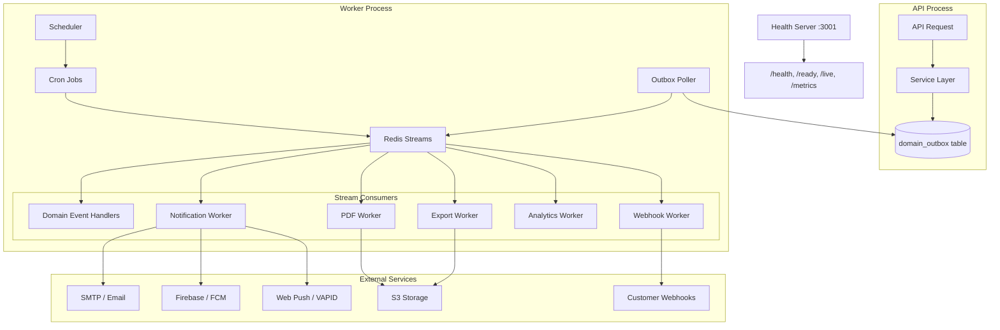

# Worker System

> Last updated: 2026-03-28

This document describes Staffora's background job processing architecture, including the worker runtime, Redis Streams integration, all job processors, and the scheduled task system.

---

## Table of Contents

1. [Architecture Overview](#architecture-overview)
2. [Worker Entry Point](#worker-entry-point)
3. [Redis Streams Infrastructure](#redis-streams-infrastructure)
4. [Outbox Processor](#outbox-processor)
5. [Domain Event Handlers](#domain-event-handlers)
6. [Notification Worker](#notification-worker)
7. [Export Worker](#export-worker)
8. [PDF Worker](#pdf-worker)
9. [Analytics Worker](#analytics-worker)
10. [Webhook Worker](#webhook-worker)
11. [Scheduler (Cron Jobs)](#scheduler-cron-jobs)
12. [Error Handling & Dead Letter Queue](#error-handling--dead-letter-queue)
13. [Health Checks & Monitoring](#health-checks--monitoring)
14. [Scaling Workers](#scaling-workers)
15. [Configuration Reference](#configuration-reference)

---

## Architecture Overview

The worker process runs independently from the API server. It:

1. **Polls** the `domain_outbox` table for new events and publishes them to Redis Streams.
2. **Consumes** messages from Redis Streams using consumer groups, routing each message to the appropriate processor.
3. **Runs scheduled jobs** via a built-in cron scheduler for periodic tasks like balance accruals and data cleanup.
4. **Exposes health endpoints** on port 3001 for container orchestration.

---

## Worker Entry Point

**File**: `packages/api/src/worker.ts`

The worker main function:

1. Initialises OpenTelemetry tracing (no-op when `OTEL_ENABLED !== "true"`).
2. Creates a `BaseWorker` instance and registers all job processors.
3. Starts the health check server on `WORKER_HEALTH_PORT` (default: 3001).
4. Starts the outbox poller (unless `ENABLE_OUTBOX_POLLING=false`).
5. Begins consuming from all Redis Streams.
6. Registers `SIGTERM` and `SIGINT` handlers for graceful shutdown.

### Graceful Shutdown

On receiving a termination signal, the worker:

1. Stops the outbox poller (no new events published).
2. Stops accepting new jobs from Redis Streams.
3. Waits for active jobs to complete (drains the in-flight queue).
4. Flushes pending telemetry spans.
5. Exits with code 0.

---

## Redis Streams Infrastructure

### Stream Keys

| Stream Key | Purpose | Consumers |
|-----------|---------|-----------|
| `staffora:domain-events` | Domain events from outbox | Domain Event Handlers |
| `staffora:notifications` | Email, in-app, and push notifications | Notification Worker |
| `staffora:exports` | CSV, Excel, JSON export generation | Export Worker |
| `staffora:pdf-generation` | PDF document generation | PDF Worker |
| `staffora:analytics` | Analytics aggregation tasks | Analytics Worker |
| `staffora:background` | Generic background tasks | Various processors |

### Consumer Groups

Workers use Redis consumer groups for reliable message delivery:

- **Group name**: Configurable via `WORKER_GROUP` (default: `staffora-workers`).
- **Consumer ID**: Unique per worker instance (default: `worker-{pid}`).
- **Acknowledgment**: Messages are acknowledged (`XACK`) only after successful processing.
- **Pending messages**: On startup, workers can reclaim pending messages from crashed consumers (configurable via `WORKER_PROCESS_PENDING`).
- **Claim timeout**: Messages pending longer than `WORKER_CLAIM_TIMEOUT` (default: 60s) can be claimed by other consumers.

### Message Format

Each Redis Stream message contains:

| Field | Description |
|-------|-------------|
| `payload` | JSON-serialized `JobPayload` |
| `attempt` | Current attempt number (1-based) |

---

## Outbox Processor

**File**: `packages/api/src/jobs/outbox-processor.ts`

The outbox processor bridges the `domain_outbox` database table and Redis Streams.

### How It Works

1. **Poll**: Queries `domain_outbox` for unprocessed events (in batches, default: 100).
2. **Route**: Determines the target Redis Stream based on event type prefix.
3. **Publish**: Adds the event to the appropriate Redis Stream via `XADD`.
4. **Mark processed**: Updates the outbox row with `processed_at = now()`.
5. **Retry**: Failed publications are retried with exponential backoff.

### Event Routing

| Event Type Prefix | Target Stream |
|-------------------|---------------|
| `hr.employee.*`, `hr.org.*`, `hr.position.*` | `staffora:domain-events` |
| `time.*` | `staffora:domain-events` |
| `absence.*` | `staffora:domain-events` |
| `notification.*` | `staffora:notifications` |
| `export.*` | `staffora:exports` |
| `pdf.*` | `staffora:pdf-generation` |
| `analytics.*` | `staffora:analytics` |
| All others | `staffora:domain-events` |

### Cleanup

The scheduler runs `outbox-cleanup` daily at 3 AM to delete processed events older than 7 days.

---

## Domain Event Handlers

**File**: `packages/api/src/jobs/domain-event-handlers.ts`

Domain event handlers react to business events by triggering side effects:

### Handler Registry

Handlers are registered for specific event types (supports exact match, prefix wildcards, and global `*`):

| Event Pattern | Handler | Side Effects |
|---------------|---------|-------------|
| `hr.employee.created` | `handleEmployeeCreated` | Queue welcome email, auto-start onboarding workflow |
| `hr.employee.status_changed` | `handleEmployeeStatusChanged` | Trigger offboarding on termination, invalidate permission cache, notify HR |
| `absence.leave_request.*` | Leave handlers | Notify approvers, update calendar |
| `cases.*` | Case handlers | SLA timer, escalation checks |
| `*` (global) | `handleWebhookDelivery` | Enqueue webhook deliveries for matching subscriptions |

### Cache Invalidation

Several event handlers invalidate Redis caches to ensure consistency:

- Employee status changes invalidate permission caches (`perms:{tenantId}:{userId}`).
- Org structure changes invalidate the org tree cache (`org:{tenantId}:tree`).
- Role changes invalidate role caches (`roles:{tenantId}:{userId}`).

---

## Notification Worker

**File**: `packages/api/src/jobs/notification-worker.ts`

### Channels

| Channel | Implementation | Storage |
|---------|---------------|---------|
| Email | `SmtpMailer` (nodemailer) in production, `ConsoleMailer` in dev | -- |
| In-app | Direct database insert into `notifications` table | `notifications` table |
| Push (FCM) | Firebase Admin SDK | `push_tokens` table |
| Push (Web) | `web-push` library (VAPID) | `push_subscriptions` table |

### Features

- **Template engine**: Mustache-style `{{variable}}` substitution with built-in templates (welcome, password reset, leave approval/rejection, review reminders, case assignment).
- **Priority levels**: `low`, `normal`, `high`, `urgent` -- affects delivery ordering.
- **Deduplication**: Optional `deduplicationKey` to prevent sending the same notification twice.
- **Scheduled delivery**: Optional `scheduledAt` for future delivery.
- **Bulk support**: `sendBulk()` method for batch email delivery.
- **Automatic cleanup**: Expired/invalid push tokens and subscriptions are pruned.

---

## Export Worker

**File**: `packages/api/src/jobs/export-worker.ts`

### Supported Formats

| Format | Library | Use Case |
|--------|---------|----------|
| CSV | Built-in | Simple tabular exports |
| XLSX | ExcelJS | Rich Excel exports with formatting |
| JSON | Built-in | Machine-readable exports |

### Processing Strategy

| Dataset Size | Strategy | Description |
|-------------|----------|-------------|
| < 1,000 rows | In-memory | Generate the file entirely in memory |
| >= 1,000 rows | Cursor-based streaming | Use postgres.js `cursor()` with batches of 500 rows, write incrementally to temp files |

### Security

- **Table allowlist**: The export system validates table names against an allowlist to prevent SQL injection.
- **Column validation**: Field names are checked against a safe identifier regex.
- **Row limit**: Maximum export size is capped at 100,000 rows (configurable down from there per request).
- **No raw SQL**: Job payloads never carry arbitrary SQL strings.

### Workflow

1. Module service writes an export request to the outbox.
2. Export worker picks up the job and validates the query against the allowlist.
3. Worker generates the file (in-memory or streaming depending on size).
4. Worker uploads the file to S3 (or local storage in development).
5. Worker sends a notification to the requesting user with a download link.

---

## PDF Worker

**File**: `packages/api/src/jobs/pdf-worker.ts`

### Document Types

| Type | Use Case |
|------|----------|
| `certificate` | LMS course completion certificates |
| `employment_letter` | Verification, reference, promotion, transfer letters |
| `case_bundle` | Case documentation bundles |
| `offer_letter` | Job offer letters |
| `termination_letter` | Employment termination letters |
| `salary_slip` | Payslip generation |
| `tax_form` | Tax document generation |
| `custom` | Free-form PDF generation |

### Template System

PDF generation uses `pdf-lib` for programmatic document creation. Each document type has a template with configurable:

- Employee information fields
- Company branding (name, logo)
- Dynamic content sections
- Signatures and dates

### Workflow

1. A service writes a PDF generation request to the outbox.
2. The PDF worker picks up the job and generates the document using `pdf-lib`.
3. The generated PDF is uploaded to storage.
4. An optional notification is sent to the requesting user.

---

## Analytics Worker

**File**: `packages/api/src/jobs/analytics-worker.ts`

### Metric Types

| Metric | Description |
|--------|-------------|
| `headcount` | Active employee count by dimension |
| `turnover` | Employee turnover rate calculations |
| `time_attendance` | Clock-in/out data aggregation |
| `leave_utilization` | Leave balance usage percentages |
| `overtime` | Overtime hours tracking |
| `absence_rate` | Absence frequency calculations |
| `tenure` | Employee tenure distribution |
| `compensation` | Salary and compensation analytics |
| `custom` | User-defined metric formulas |

### Aggregation Dimensions

Metrics can be grouped by: `tenant`, `org_unit`, `department`, `cost_center`, `location`, `employment_type`, `job_level`, `gender`, `age_band`, `tenure_band`.

### Time Granularity

Aggregations support: `hour`, `day`, `week`, `month`, `quarter`, `year`.

### Processing Modes

- **Incremental**: Only process data since the last aggregation run.
- **Full recalculate**: Recompute from scratch (`forceRecalculate: true`).

---

## Webhook Worker

**File**: `packages/api/src/jobs/webhook-worker.ts`

The webhook worker operates in two modes:

1. **Event handler**: Registered as a global (`*`) domain event handler. When any domain event is processed, it finds matching webhook subscriptions and creates delivery records.

2. **Delivery executor**: Polls the `webhook_deliveries` table for pending deliveries every 5 seconds (batch size: 50). For each delivery, it signs the payload with HMAC-SHA256, executes an HTTP POST, and records the result.

See [Webhook System](../09-integrations/webhook-system.md) for full details on the delivery protocol and retry logic.

---

## Scheduler (Cron Jobs)

**File**: `packages/api/src/worker/scheduler.ts`

The scheduler runs periodic tasks on configurable cron expressions. It checks every 60 seconds for jobs that are due.

### Registered Jobs

| Job | Schedule | Description |
|-----|----------|-------------|
| `leave-balance-accrual` | Daily at 1:00 AM | Accrue leave balances for all active employees |
| `timesheet-reminder` | Fridays at 9:00 AM | Send timesheet submission reminders |
| `session-cleanup` | Daily at 2:00 AM | Delete expired BetterAuth sessions |
| `outbox-cleanup` | Daily at 3:00 AM | Delete processed outbox events older than 7 days |
| `review-cycle-check` | Mondays at 8:00 AM | Check for overdue performance review deadlines |
| `wtr-compliance-check` | Mondays at 6:00 AM | Check Working Time Regulations compliance |
| `mandatory-training-reminders` | Mondays at 9:00 AM | Remind employees about overdue mandatory training |
| `birthday-notifications` | 1st of month at 8:00 AM | Generate upcoming birthday notifications |
| `dlq-monitoring` | Top of every hour | Monitor dead-letter queue sizes and alert |
| `user-table-drift-detection` | 30 min past every hour | Detect drift between `app."user"` and `app.users` tables |
| `workflow-auto-escalation` | Every 10 minutes | Escalate overdue workflow steps |
| `case-sla-breach-check` | Every 10 minutes | Check for SLA breaches on open cases |
| `scheduled-report-runner` | Every 15 minutes | Execute scheduled report generation |
| `tenant-usage-stats` | Daily at 2:30 AM | Calculate per-tenant usage metrics |
| `data-archival` | Sundays at 4:00 AM | Archive old completed records |
| `dashboard-stats-refresh` | Every 5 minutes | Refresh materialized views for dashboard counters |

### Connection Pooling

When the scheduler is launched via the worker entry point, it reuses the shared postgres.js singleton pool and Redis instance (no extra connections created). When run standalone, it creates its own pool with `max=5` connections.

---

## Error Handling & Dead Letter Queue

### Retry Behaviour

| Parameter | Default | Description |
|-----------|---------|-------------|
| `WORKER_MAX_RETRIES` | 10 | Maximum retry attempts before DLQ |
| Backoff | Exponential | `min(attempts * 200, 2000)` ms |

### Dead Letter Queue

After exhausting all retry attempts, a failed message is moved to the dead-letter queue (a separate Redis Stream with a `:dlq` suffix). The `dlq-monitoring` scheduler job checks DLQ sizes hourly and logs warnings when messages accumulate.

### Error Isolation

Each job processor runs in an isolated try/catch. A failure in one job does not affect other jobs being processed concurrently.

---

## Health Checks & Monitoring

The worker exposes four HTTP endpoints on `WORKER_HEALTH_PORT` (default: 3001):

| Endpoint | Purpose | Response |
|----------|---------|----------|
| `GET /health` | Full health status | `{ status, uptime, activeJobs, processedJobs, failedJobs, connections }` |
| `GET /ready` | Readiness probe | `{ ready: true }` or 500 |
| `GET /live` | Liveness probe | `{ alive: true }` |
| `GET /metrics` | Prometheus metrics | Plain text Prometheus format |

### Worker Prometheus Metrics

| Metric | Type | Description |
|--------|------|-------------|
| `staffora_worker_active_jobs` | gauge | Currently processing jobs |
| `staffora_worker_processed_jobs_total` | counter | Total processed jobs |
| `staffora_worker_failed_jobs_total` | counter | Total failed jobs |
| `staffora_worker_uptime_seconds` | gauge | Worker uptime |
| `staffora_worker_redis_up` | gauge | Redis connectivity (0/1) |
| `staffora_worker_database_up` | gauge | Database connectivity (0/1) |

---

## Scaling Workers

Workers scale horizontally using Redis consumer groups:

1. **Add more worker instances**: Each instance registers as a unique consumer in the same consumer group.
2. **Redis distributes messages**: Messages are automatically load-balanced across consumers using `XREADGROUP`.
3. **No coordination needed**: Workers are stateless and can be added/removed at any time.
4. **Pending reclamation**: If a consumer crashes, its pending messages are automatically reclaimed by other consumers after the claim timeout.

### Scaling Recommendations

| Load | Workers | Concurrency per Worker |
|------|---------|----------------------|
| Low (< 100 events/min) | 1 | 5 |
| Medium (100-1000 events/min) | 2-3 | 10 |
| High (1000+ events/min) | 5+ | 20 |

---

## Configuration Reference

| Variable | Description | Default |
|----------|-------------|---------|
| `REDIS_URL` | Redis connection URL | `redis://localhost:6379` |
| `WORKER_ID` | Unique consumer ID | `worker-{pid}` |
| `WORKER_GROUP` | Consumer group name | `staffora-workers` |
| `WORKER_CONCURRENCY` | Max concurrent jobs | `5` |
| `WORKER_POLL_INTERVAL` | Stream poll interval (ms) | `1000` |
| `WORKER_BLOCK_TIMEOUT` | XREADGROUP block timeout (ms) | `5000` |
| `WORKER_MAX_RETRIES` | Max retries before DLQ | `10` |
| `WORKER_PROCESS_PENDING` | Reclaim pending on startup | `true` |
| `WORKER_CLAIM_TIMEOUT` | Pending claim timeout (ms) | `60000` |
| `WORKER_HEALTH_PORT` | Health server port | `3001` |
| `ENABLE_OUTBOX_POLLING` | Enable outbox processor | `true` |
| `OUTBOX_POLL_INTERVAL` | Outbox poll interval (ms) | `1000` |
| `OUTBOX_BATCH_SIZE` | Outbox batch size | `100` |

---

## Related Documents

- [External Service Integrations](../09-integrations/external-services.md) -- S3, SMTP, Firebase, Redis details
- [Webhook System](../09-integrations/webhook-system.md) -- Webhook delivery protocol
- [Monitoring & Observability](monitoring-observability.md) -- Metrics and tracing
- [Disaster Recovery](disaster-recovery.md) -- Worker failure recovery procedures
- [Production Checklist](production-checklist.md) -- Operational readiness items
