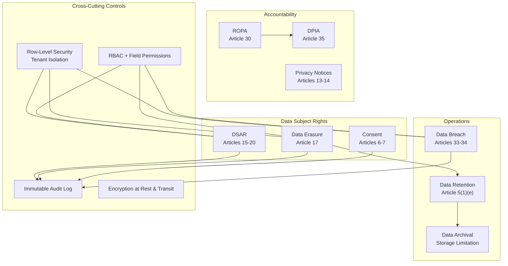
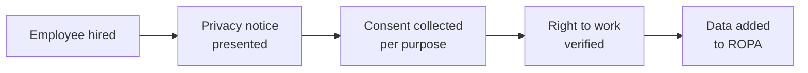
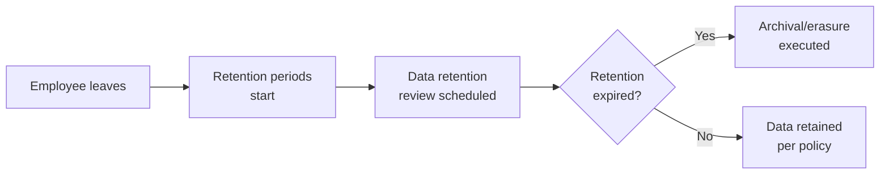
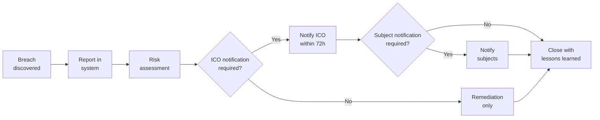

# GDPR Compliance

> Last updated: 2026-03-28

This document provides a comprehensive overview of UK GDPR compliance capabilities in the Staffora HRIS platform. It covers the regulatory framework, the nine data protection modules, and how they work together to ensure compliance.

For detailed technical documentation on each module's API, see [Data Protection (Security)](../07-security/data-protection.md).

---

## Table of Contents

- [Regulatory Context](#regulatory-context)
- [GDPR Compliance Architecture](#gdpr-compliance-architecture)
- [Module Summary](#module-summary)
- [DSAR (Articles 15-20)](#dsar-articles-15-20)
- [Data Erasure (Article 17)](#data-erasure-article-17)
- [Data Breach Notification (Articles 33-34)](#data-breach-notification-articles-33-34)
- [Consent Management (Articles 6-7)](#consent-management-articles-6-7)
- [Privacy Notices (Articles 13-14)](#privacy-notices-articles-13-14)
- [Data Retention (Article 5(1)(e))](#data-retention-article-51e)
- [ROPA (Article 30)](#ropa-article-30)
- [DPIA (Article 35)](#dpia-article-35)
- [Data Archival](#data-archival)
- [Cross-Cutting GDPR Controls](#cross-cutting-gdpr-controls)
- [Compliance Workflows](#compliance-workflows)
- [ICO Accountability Requirements](#ico-accountability-requirements)

---

## Regulatory Context

Staffora operates under the **UK GDPR** (the EU GDPR as retained in UK law by the European Union (Withdrawal) Act 2018) and the **Data Protection Act 2018**. The supervisory authority is the **Information Commissioner's Office (ICO)**.

Key obligations for an HRIS platform:

| Obligation | GDPR Article | Staffora Module |
|-----------|-------------|-----------------|
| Lawfulness, fairness, transparency | Art. 5(1)(a) | Consent, Privacy Notices |
| Purpose limitation | Art. 5(1)(b) | ROPA, Consent |
| Data minimisation | Art. 5(1)(c) | Field-level permissions, Data Erasure |
| Accuracy | Art. 5(1)(d) | DSAR (rectification), Employee self-service |
| Storage limitation | Art. 5(1)(e) | Data Retention, Data Archival |
| Integrity and confidentiality | Art. 5(2)(f) | RLS, encryption, access control |
| Accountability | Art. 5(2) | ROPA, DPIA, Audit logs |
| Right of access | Art. 15 | DSAR |
| Right to rectification | Art. 16 | DSAR |
| Right to erasure | Art. 17 | Data Erasure |
| Right to restriction | Art. 18 | DSAR |
| Data portability | Art. 20 | DSAR |
| Breach notification | Art. 33-34 | Data Breach |
| DPIA | Art. 35 | DPIA |
| Records of processing | Art. 30 | ROPA |

## GDPR Compliance Architecture

## Module Summary

| Module | API Prefix | GDPR Article | Key Deadlines |
|--------|-----------|-------------|---------------|
| **DSAR** | `/api/v1/dsar` | Art. 15-20 | 30 days (extendable to 90) |
| **Data Erasure** | `/api/v1/data-erasure` | Art. 17 | 30 days |
| **Data Breach** | `/api/v1/data-breach` | Art. 33-34 | 72 hours (ICO), without undue delay (subjects) |
| **Consent** | `/api/v1/consent` | Art. 6-7 | No deadline (ongoing) |
| **Privacy Notices** | `/api/v1/privacy-notices` | Art. 13-14 | At point of data collection |
| **Data Retention** | `/api/v1/data-retention` | Art. 5(1)(e) | Per-category policy |
| **ROPA** | `/api/v1/ropa` | Art. 30 | Must be current (ICO can request anytime) |
| **DPIA** | `/api/v1/dpia` | Art. 35 | Before processing begins |
| **Data Archival** | `/api/v1/data-archival` | Art. 5(1)(e) | Per retention policy |

## DSAR (Articles 15-20)

**Data Subject Access Requests** allow employees (data subjects) to exercise their rights to access, rectify, erase, restrict processing, and port their personal data.

### Compliance Requirements Met

- **30-day response deadline** with automatic calculation from received date
- **Identity verification** before data disclosure (prevents unauthorized access)
- **Module-based data gathering** across all HRIS modules (HR, absence, time, payroll, etc.)
- **Third-party redaction** for data items containing other people's personal data
- **Extension mechanism** for complex requests (up to 60 additional days with documented reason)
- **Rejection with reason** for manifestly unfounded or excessive requests
- **Immutable audit trail** for every action taken on every DSAR

### Workflow States

`received` -> `in_progress` (after identity verification) -> `completed` or `rejected`

### Dashboard Metrics

- Total open requests
- Completed requests
- Overdue requests
- Average response time

## Data Erasure (Article 17)

Implements the **right to be forgotten** with safeguards for statutory retention obligations.

### Compliance Requirements Met

- **30-day response deadline** with automatic calculation
- **Four-eyes principle**: Approval requires a different user than the requester
- **Retention conflict detection**: Identifies data that must be retained for legal reasons
- **Per-table anonymization**: Processes each database table individually
- **Erasure certificate**: Formal proof of compliance documenting what was processed
- **Partial completion**: Handles cases where some data must be retained (e.g., tax records)

### Retention Conflicts

Before erasure, the system checks for statutory retention requirements. Common UK retention periods that may conflict with erasure requests:

| Data Category | Retention Period | Legal Basis |
|--------------|-----------------|-------------|
| Payroll records | 6 years + current | Taxes Management Act 1970 |
| Working time records | 2 years | Working Time Regulations 1998 |
| Maternity/paternity records | 3 years after tax year | Statutory Maternity Pay Regulations |
| Accident records | 3 years from date | Limitation Act 1980 |
| Pension records | 6 years after leaving | Finance Act 2004 |

## Data Breach Notification (Articles 33-34)

Manages the entire breach lifecycle from discovery through ICO notification, subject notification, and closure.

### Compliance Requirements Met

- **72-hour ICO notification deadline** with automatic tracking
- **Risk assessment** determining notification requirements
- **ICO notification recording** with DPO details and reference number
- **Within-72h compliance calculation** (auto-calculates whether notification was timely)
- **Data subject notification** for high-risk breaches (Article 34)
- **Investigation timeline** documenting all actions taken
- **Closure with lessons learned** for continuous improvement

### Breach Categories

- Confidentiality breach (unauthorized disclosure)
- Integrity breach (unauthorized alteration)
- Availability breach (unauthorized destruction/loss)

### Severity Levels

Risk assessment determines severity and drives notification requirements:
- ICO notification required when there is a **likely risk** to individuals' rights and freedoms
- Subject notification required when there is a **likely HIGH risk** to individuals' rights and freedoms

## Consent Management (Articles 6-7)

Manages the full consent lifecycle for processing activities that rely on consent as their lawful basis.

### Compliance Requirements Met

- **Purpose-specific consent**: Each consent is tied to a defined processing purpose
- **Freely given, specific, informed, unambiguous**: Consent purposes document what data subjects are agreeing to
- **Easy withdrawal**: Employees can withdraw consent at any time (Article 7(3))
- **Granular purposes**: Separate consent for each distinct processing purpose
- **Audit trail**: Every grant and withdrawal is recorded with timestamp
- **Consent checking**: API to verify active consent before processing
- **Dashboard**: Overview of consent coverage across the organisation

### Consent Purpose Management

Consent purposes define:
- What processing activity the consent covers
- Legal basis documentation
- Whether consent is mandatory or optional
- Description visible to data subjects

## Privacy Notices (Articles 13-14)

Manages privacy notices that must be provided to data subjects at the point of data collection.

### Compliance Requirements Met

- **Notice management**: Create, update, publish, and archive notices
- **Employee acknowledgement tracking**: Record which employees have read each notice
- **Outstanding acknowledgement alerts**: Identify employees who need to acknowledge notices
- **Version control**: Each update creates a new version for audit purposes
- **Compliance summary**: Dashboard showing acknowledgement rates

## Data Retention (Article 5(1)(e))

Implements the storage limitation principle -- personal data must not be kept longer than necessary for its purpose.

### Compliance Requirements Met

- **Policy-based retention**: Define retention periods per data category with legal basis
- **Automated review**: Identify records that have exceeded their retention period
- **Review execution**: Process expired records (archive, anonymize, or delete)
- **Retention exceptions**: Document exceptions for ongoing litigation or regulatory holds
- **UK statutory defaults**: Pre-loaded retention periods for common HR data categories
- **Dashboard**: Overview of expired records requiring action

### Default UK Retention Policies

The module can be seeded with UK statutory retention periods:

| Category | Retention | Legal Basis |
|----------|-----------|-------------|
| General employment records | 6 years after leaving | Limitation Act 1980 |
| Payroll and tax records | 6 years + current year | Taxes Management Act 1970 |
| Health and safety records | 40 years (exposure) | COSHH Regulations 2002 |
| Pension records | 6 years after leaving | Finance Act 2004 |
| Right to work documents | 2 years after leaving | Immigration Act 2014 |
| DBS checks | As soon as practicable | DBS Code of Practice |
| Recruitment records (unsuccessful) | 6 months | Equality Act 2010 |

## ROPA (Article 30)

Maintains the **Records of Processing Activities** that every controller must keep. The ICO can request this register at any time.

### Article 30(1) Fields Captured

Each processing activity record includes all required Article 30(1) information:

1. Controller/processor name and contact details
2. DPO contact details
3. Purposes of processing
4. Categories of data subjects
5. Categories of personal data
6. Categories of recipients
7. International transfers (with safeguards)
8. Retention periods
9. Technical and organisational security measures
10. **Lawful basis** (Article 6(1)): consent, contract, legal_obligation, vital_interest, public_task, or legitimate_interest

## DPIA (Article 35)

**Data Protection Impact Assessments** are required before any processing that is likely to result in a high risk to individuals' rights and freedoms.

### Compliance Requirements Met

- **Risk register**: Each DPIA contains identified risks with likelihood, severity, and mitigation measures
- **DPO review workflow**: DPIAs must be submitted to and approved by the DPO before processing begins
- **Residual risk tracking**: After mitigation measures, residual risk is documented
- **Draft/review/approval lifecycle**: Ensures proper governance

### DPIA Workflow

`draft` -> `submitted` (for DPO review) -> `approved` or `rejected` (needs revision)

## Data Archival

Implements the operational execution of the data retention policies. Works in conjunction with the Data Retention module:

- **Data Retention** defines the rules (what to keep, how long, legal basis)
- **Data Archival** executes the rules (archive, anonymize, purge)

## Cross-Cutting GDPR Controls

Beyond the dedicated GDPR modules, Staffora implements several platform-level controls:

### Row-Level Security (Multi-Tenancy)

All personal data is isolated per tenant at the database level via PostgreSQL RLS. See [RLS & Multi-Tenancy](../07-security/rls-multi-tenancy.md).

### Immutable Audit Trail

Every data access and modification is logged with actor, action, timestamp, and before/after values. Audit log entries follow the pattern `gdpr.{module}.{action}`.

### RBAC and Field-Level Permissions

Access to personal data is controlled through:
- **RBAC**: Role-based permission checks on every API endpoint
- **Field-level security**: Sensitive fields (NI number, salary, medical records) can be hidden from roles that don't need access
- **Data scope**: Users can only see employees within their organisational scope

See [Authorization](../07-security/authorization.md).

### Encryption

- **In transit**: TLS/HTTPS for all API communication
- **At rest**: PostgreSQL data-at-rest encryption
- **Passwords**: bcrypt (12 rounds) or scrypt hashing

### Data Minimisation

- Field-level permissions hide unnecessary data from users
- API responses filter out hidden fields automatically
- Export operations respect field-level permissions

## Compliance Workflows

### New Employee Onboarding

### Employee Departure

### Data Breach Response

## ICO Accountability Requirements

Staffora provides tooling to meet the ICO's accountability principle requirements:

| ICO Requirement | Staffora Feature |
|----------------|-----------------|
| Implement appropriate technical and organisational measures | RLS, RBAC, encryption, audit logs |
| Maintain records of processing activities | ROPA module |
| Carry out DPIAs for high-risk processing | DPIA module |
| Appoint a DPO (where required) | DPO fields in ROPA, breach notification, DPIA |
| Implement data protection by design and default | Field-level permissions, data minimisation |
| Manage data breaches | Data Breach module with 72h tracking |
| Facilitate data subject rights | DSAR, Data Erasure, Consent modules |
| Manage international transfers | ROPA transfer tracking with safeguards |
| Cooperate with ICO | Audit logs, ROPA, breach records all exportable |
