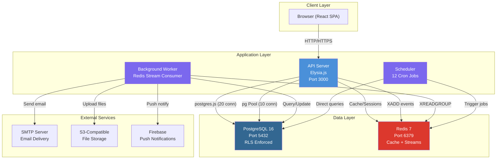
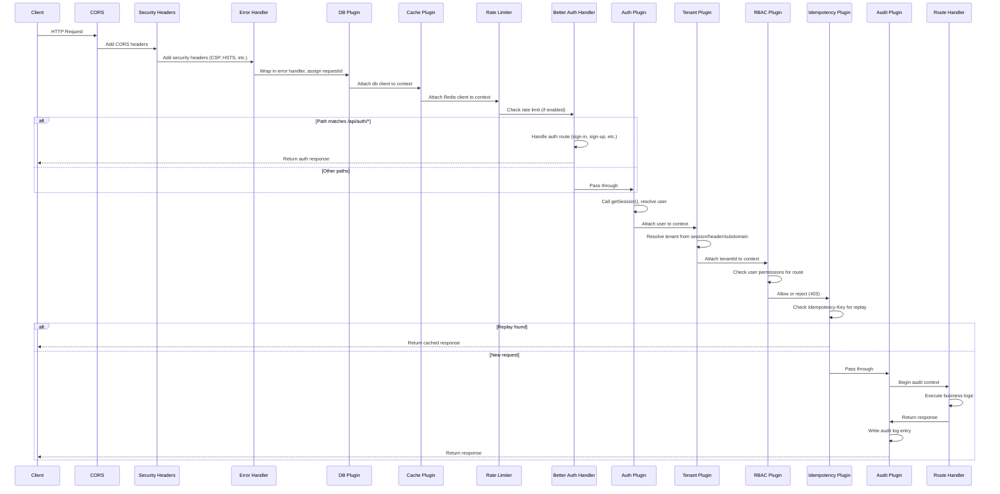
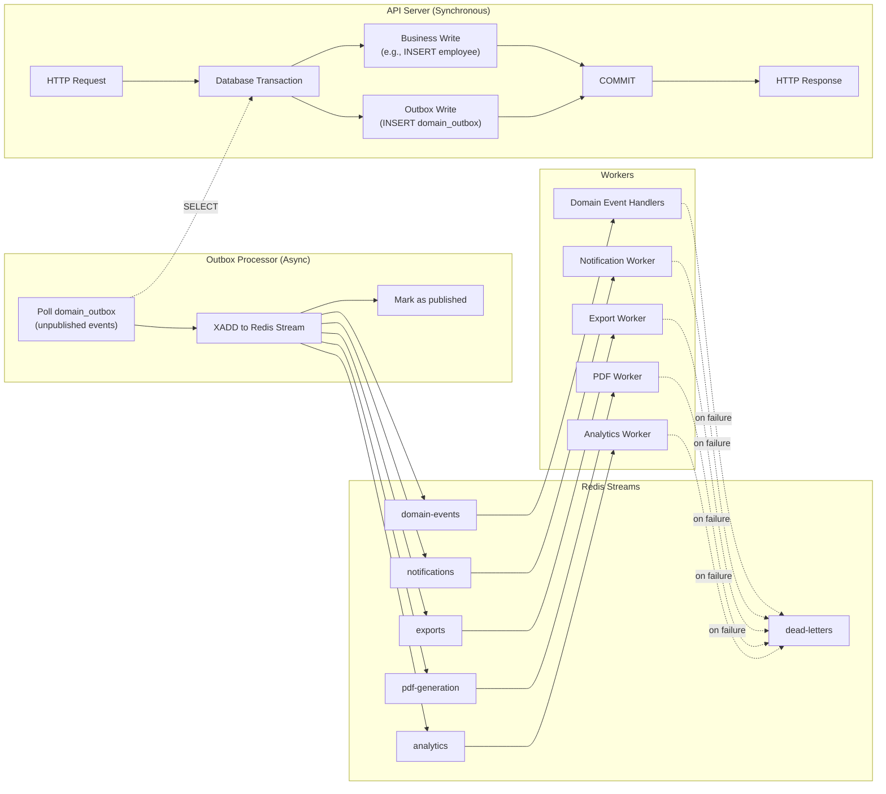
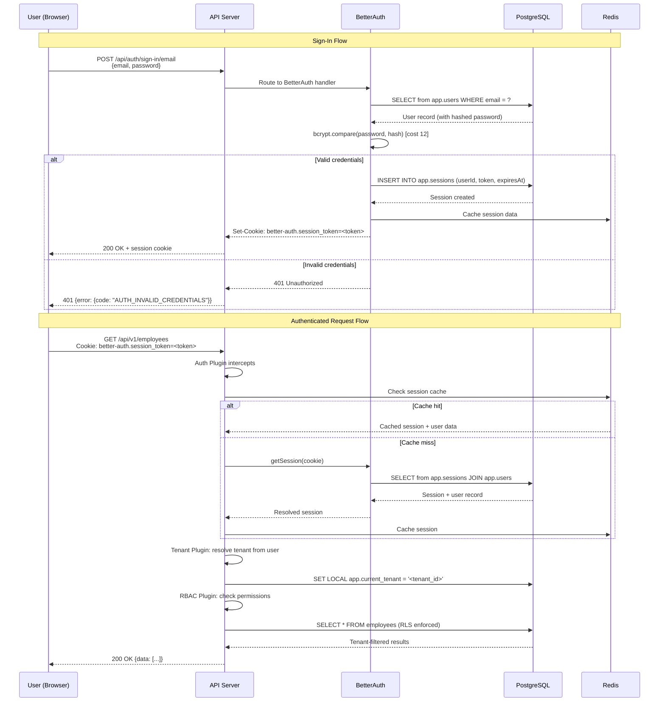
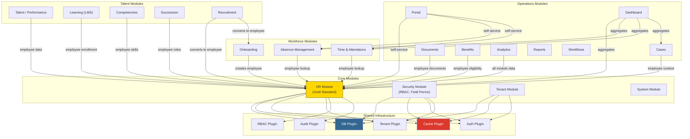

# Architecture Diagrams -- Wave 1 Audit

*Last updated: 2026-03-28*

**Project:** Staffora HRIS Platform
**Audit Date:** 2026-03-12
**Format:** Mermaid diagrams (render with any Mermaid-compatible viewer)

---

## Diagram 1: System Architecture Overview

---

## Diagram 2: HTTP Request Flow (13-Step Plugin Chain)

---

## Diagram 3: Data Flow -- Transactional Outbox Pattern

---

## Diagram 4: Authentication Flow

---

## Diagram 5: Worker and Job Processing Architecture

```mermaid
flowchart TB
    subgraph "Job Sources"
        OUTBOX["Outbox Processor<br/>(polls domain_outbox)"]
        SCHED["Scheduler<br/>(12 cron jobs)"]
        API_DIRECT["API Direct<br/>(XADD from routes)"]
    end

    subgraph "Redis Streams"
        S1["Stream: domain-events<br/>Group: event-handlers"]
        S2["Stream: notifications<br/>Group: notification-workers"]
        S3["Stream: exports<br/>Group: export-workers"]
        S4["Stream: pdf-generation<br/>Group: pdf-workers"]
        S5["Stream: analytics<br/>Group: analytics-workers"]
        DLQ["Stream: dead-letters<br/>Group: dlq-handlers"]
    end

    subgraph "Consumers (6 streams, 11 processors)"
        P1["Domain Event Handlers<br/>- Employee events<br/>- Leave events<br/>- Case events<br/>- Training events"]
        P2["Notification Worker<br/>- Email (SMTP)<br/>- Push (Firebase)"]
        P3["Export Worker<br/>- Excel generation<br/>- CSV generation<br/>- S3 upload"]
        P4["PDF Worker<br/>- Certificates<br/>- Letters<br/>- Case bundles"]
        P5["Analytics Worker<br/>- Aggregation<br/>- Report generation"]
    end

    subgraph "Scheduled Jobs (12)"
        J1["Daily: Leave accrual"]
        J2["Hourly: Session cleanup"]
        J3["15min: Outbox cleanup"]
        J4["Daily: Probation reminders"]
        J5["Daily: Document expiry"]
        J6["Daily: Training deadlines"]
        J7["Daily: Time entry reminders"]
        J8["Daily: Benefits enrollment"]
        J9["Hourly: Analytics aggregation"]
        J10["Weekly: Audit archival"]
        J11["Daily: Certificate expiry"]
        J12["5min: Health check"]
    end

    OUTBOX --> S1
    OUTBOX --> S2
    API_DIRECT --> S3
    API_DIRECT --> S4

    SCHED --> J1 & J2 & J3 & J4 & J5 & J6 & J7 & J8 & J9 & J10 & J11 & J12

    S1 -->|"XREADGROUP"| P1
    S2 -->|"XREADGROUP"| P2
    S3 -->|"XREADGROUP"| P3
    S4 -->|"XREADGROUP"| P4
    S5 -->|"XREADGROUP"| P5

    P1 -.->|"Retry exceeded"| DLQ
    P2 -.->|"Retry exceeded"| DLQ
    P3 -.->|"Retry exceeded"| DLQ
    P4 -.->|"Retry exceeded"| DLQ
    P5 -.->|"Retry exceeded"| DLQ

    P1 -->|"XACK on success"| S1
    P2 -->|"XACK on success"| S2
    P3 -->|"XACK on success"| S3
    P4 -->|"XACK on success"| S4
    P5 -->|"XACK on success"| S5
```

---

## Diagram 6: Module Dependency Graph

---

## Rendering Notes

These diagrams are written in Mermaid syntax. To render them:

1. **GitHub:** Paste into any `.md` file -- GitHub renders Mermaid natively
2. **VS Code:** Install the "Mermaid Preview" extension
3. **Online:** Use [mermaid.live](https://mermaid.live) to paste and render
4. **Documentation:** Use `mmdc` CLI to export as SVG/PNG
