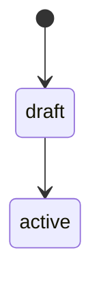

# Contributing to Documentation

> Guidelines for maintaining and extending Staffora documentation
> *Last updated: 2026-03-28*

---

## Directory Structure

Documentation is organised into 15 numbered directories. Each directory groups files by topic, and most include a `README.md` that serves as a section index.

| Directory | Purpose | Files |
|-----------|---------|:-----:|
| `01-overview/` | System overview, module catalog | 2 |
| `02-architecture/` | System design, database, workers, permissions, ADRs | 22 |
| `03-features/` | Feature guides for each module group (Core HR, Absence, Talent, etc.) | 13 |
| `04-api/` | API reference, error codes | 4 |
| `05-development/` | Developer setup, backend/frontend/database guides, coding patterns | 15 |
| `06-devops/` | Docker, CI/CD, DevOps checklists | 8 |
| `07-security/` | Authentication, authorisation, data protection, RLS | 7 |
| `08-testing/` | Testing guide, coverage matrix | 4 |
| `09-integrations/` | External services (S3, SMTP, Firebase), webhooks | 3 |
| `10-ai-agents/` | AI development agents and skills | 1 |
| `11-operations/` | Monitoring, production checklist, disaster recovery, runbooks | 34 |
| `12-compliance/` | UK employment law, GDPR compliance, compliance issues | 16 |
| `13-roadmap/` | Roadmaps, sprint plans, kanban, risk register | 12 |
| `14-troubleshooting/` | Troubleshooting guide, known issues | 29 |
| `15-archive/` | Superseded documentation, historical audit reports | 27 |

Meta-files live at the `Docs/` root:

| File | Purpose |
|------|---------|
| `README.md` | Documentation portal -- main entry point with quick links and full section map |
| `DOC_MAP.md` | Visual navigation with Mermaid hierarchy and cross-reference matrix |
| `DOC_HEALTH_REPORT.md` | Per-section health scoring (target: 100/100) |
| `DOC_TODO.md` | Gap analysis and improvement backlog |
| `CONTRIBUTING.md` | This file -- how to contribute to documentation |

---

## Adding New Documentation

### For a New Backend Module

1. **Module catalog** -- Add the module to `01-overview/module-catalog.md` in the appropriate category table. Include the module path, endpoint count, and a one-line description.
2. **API reference** -- Add all endpoints to `04-api/api-reference.md` under the relevant section. Follow the existing format: method, path, description, auth requirement.
3. **Error codes** -- If the module defines custom error codes in `packages/shared/src/errors/`, add them to `04-api/ERROR_CODES.md`.
4. **Feature guide** -- If the module belongs to an existing feature group, add it to the relevant guide in `03-features/`. If it represents a new feature group, create a new guide (see "Creating a feature guide" below).
5. **Health report** -- Update the file count and section score in `DOC_HEALTH_REPORT.md`.

### For a New Feature Guide

Create a new file in `03-features/` following this structure:

```markdown
# Feature Name

> One-line summary of the feature
> *Last updated: YYYY-MM-DD*

## Overview

[2-3 paragraphs explaining what the feature does, why it exists, and how it fits
into the broader HRIS platform.]

## Key Workflows

### Workflow Name

[Description of the workflow, followed by a Mermaid diagram.]



## User Stories

- As an HR administrator, I want to [action] so that [outcome].
- As an employee, I want to [action] so that [outcome].

## API Endpoints

| Method | Path | Description |
|--------|------|-------------|
| GET | `/api/v1/resource` | List resources |
| POST | `/api/v1/resource` | Create a resource |

## Database Tables

| Table | Purpose |
|-------|---------|
| `app.table_name` | Description |

## Related Documents

- [Related Doc](../section/file.md) -- Brief description
```

After creating the file, add it to the `03-features/README.md` contents table.

### For an Architecture Decision Record (ADR)

ADRs live in `02-architecture/adr/` and follow a strict template. See `02-architecture/adr/README.md` for the full template and conventions. Key rules:

- Number sequentially (e.g., `009-short-kebab-title.md`). Never reuse a number.
- Set status to `Proposed` initially, then `Accepted` after review.
- ADRs are immutable after acceptance. To change a decision, create a new ADR that supersedes the old one.
- Add the new ADR to the index table in `02-architecture/adr/README.md`.

### For an Operational Runbook

Runbooks live in `11-operations/runbooks/` and follow this structure:

```markdown
# Incident Title

*Last updated: YYYY-MM-DD*

**Severity: P1 - Critical | P2 - High | P3 - Medium | P4 - Low**
**Affected Components:** [List of affected components]

## Symptoms / Detection

[How to recognise this incident. Include monitoring alerts and quick-check commands.]

## Impact Assessment

[User impact, data impact, downstream effects.]

## Immediate Actions

### Step 1: [Action Name]

[Commands and procedures.]

## Root Cause Analysis

[Common root causes for this type of incident.]

## Prevention

[How to prevent recurrence.]
```

After creating the runbook, add it to `11-operations/runbooks/README.md`.

### For a Troubleshooting Issue

Known issues live in `14-troubleshooting/issues/` and follow the naming convention `{category}-{number}-{short-description}.md` where category is one of `architecture`, `security`, or `tech-debt`. Use the next available number within the category.

---

## Formatting Standards

### File Naming

- Use `kebab-case` for all filenames (e.g., `time-attendance.md`, `api-5xx-spike.md`).
- Legacy files that use `UPPER_CASE.md` (e.g., `ARCHITECTURE.md`, `DATABASE.md`) are kept for backwards compatibility but new files must use kebab-case.
- ADR files use the pattern `NNN-short-kebab-title.md` (three-digit zero-padded number).

### File Header

Every documentation file must start with:

1. **H1 title** -- A clear, descriptive title.
2. **Subtitle** (optional) -- A blockquote with a one-line summary, used in section READMEs and feature guides.
3. **Last updated date** -- Either `*Last updated: YYYY-MM-DD*` on its own line or within the subtitle blockquote.

Example with subtitle:

```markdown
# Feature Guides

> Comprehensive feature documentation for all Staffora HRIS module groups
> Last updated: 2026-03-28
```

Example without subtitle:

```markdown
# Coding Patterns

Last updated: 2026-03-28
```

### Body Content

- Use `##` for major sections and `###` for subsections. Do not skip heading levels.
- Use tables for structured data (endpoint lists, configuration values, file inventories).
- Use Mermaid diagrams for architecture, workflows, state machines, and data flows. Prefer `stateDiagram-v2` for state machines, `flowchart TD` for decision flows, and `sequenceDiagram` for interaction sequences.
- Use fenced code blocks with language identifiers (`sql`, `typescript`, `bash`, `mermaid`).
- Write in British English (organisation, authorisation, colour, behaviour).
- Keep paragraphs concise. Lead with the most important information.

### Related Documents Section

End every documentation file with a "Related Documents" section that links to related content in other directories. Use relative paths.

```markdown
## Related Documents

- [Architecture Overview](../02-architecture/ARCHITECTURE.md) -- System design and plugin chain
- [API Reference](../04-api/api-reference.md) -- All REST endpoints
- [Testing Guide](../08-testing/testing-guide.md) -- Test infrastructure and patterns
```

For longer lists of related documents, use a table:

```markdown
## Related Documents

| Document | Path | Description |
|----------|------|-------------|
| Architecture | [ARCHITECTURE.md](../02-architecture/ARCHITECTURE.md) | System overview |
| Database | [DATABASE.md](../02-architecture/DATABASE.md) | Schema reference |
```

### Section README Files

Each numbered directory should have a `README.md` that serves as a section index. Follow the existing pattern:

```markdown
# Section Title

> One-line description of the section
> *Last updated: YYYY-MM-DD*

## Contents

| File | When to Read |
|------|-------------|
| [file-name.md](file-name.md) | Brief description of when this file is useful |

## Related Documents

- [Cross-link](../other-section/file.md) -- Description
```

---

## Cross-Linking Rules

### Link Format

Always use relative paths from the current file's location. Never use absolute paths or repository URLs.

```markdown
<!-- Correct: relative path -->
[Database Guide](../02-architecture/DATABASE.md)

<!-- Incorrect: absolute path -->
[Database Guide](/Docs/02-architecture/DATABASE.md)
```

### When to Cross-Link

Add cross-links when:

- A concept is explained in detail in another document (link to the authoritative source rather than duplicating content).
- A feature guide references an architectural pattern (e.g., RLS, effective dating, outbox).
- An API endpoint is documented in both the feature guide and the API reference.
- A security concern is relevant to both the security section and the feature implementation.

### Cross-Reference Matrix

The `DOC_MAP.md` file contains a cross-reference matrix that maps topics to documents across sections. When adding a new document that covers a topic already in the matrix, update the matrix to include the new document.

### Avoiding Broken Links

Before merging documentation changes, verify that all relative links resolve correctly. If a file is moved or renamed, update all documents that link to it. Search for the old filename across the `Docs/` directory to find references.

---

## Updating Existing Documentation

### When to Update

Update documentation when:

- A new backend module is added or an existing one is significantly changed.
- API endpoints are added, removed, or modified.
- Architecture decisions change (create a new ADR, do not modify old ones).
- Configuration options are added or defaults change.
- A bug fix reveals incorrect documentation.

### How to Update

1. **Read the existing document** before editing to understand its scope and conventions.
2. **Update the "Last updated" date** to the current date.
3. **Preserve the existing structure** -- do not reorganise sections unless there is a clear improvement.
4. **Update related meta-files** if the change affects file counts, section scores, or the document map:
   - `DOC_HEALTH_REPORT.md` -- Update section scores and file counts.
   - `DOC_MAP.md` -- Update the directory tree if files were added or removed.
   - `DOC_TODO.md` -- Mark completed items or add new gaps discovered.
   - `README.md` -- Update section tables if files were added or removed.

### Source of Truth

Documentation should be generated from or verified against the actual source code. When documenting:

- **API endpoints** -- Read the `routes.ts` files in `packages/api/src/modules/`.
- **Database tables** -- Read the migration files in `migrations/`.
- **Configuration** -- Read `docker/.env.example` and `packages/api/src/config/`.
- **State machines** -- Read `packages/shared/src/state-machines/`.
- **Error codes** -- Read `packages/shared/src/errors/`.

Never document from memory or assumption. If the source code contradicts existing documentation, update the documentation to match the code.

---

## Review Process

### Self-Review Checklist

Before considering documentation complete, verify:

- [ ] File uses `kebab-case` naming.
- [ ] File starts with an H1 title and "Last updated" date.
- [ ] British English is used throughout (organisation, not organization).
- [ ] All relative links resolve to existing files.
- [ ] Tables are properly formatted with header rows.
- [ ] Code blocks have language identifiers.
- [ ] Mermaid diagrams render correctly (test in a Markdown previewer).
- [ ] A "Related Documents" section is included at the end.
- [ ] Content is verified against source code, not assumed.
- [ ] Section README is updated if a file was added or removed.
- [ ] `DOC_HEALTH_REPORT.md` is updated if scores or file counts changed.
- [ ] `DOC_MAP.md` directory tree is updated if the file structure changed.

### Commit Convention

Documentation changes follow the same [Conventional Commits](https://www.conventionalcommits.org/) format as code changes. Use the `docs:` prefix:

```
docs: add recruitment feature guide
docs: update API reference for payroll module
docs: fix broken links in security section
```

---

## Archiving Documentation

When a document is superseded by a newer version:

1. Move the old file to `15-archive/` (or a subdirectory such as `15-archive/audit/`).
2. Add a note at the top of the archived file indicating what superseded it:
   ```markdown
   > **Archived:** Superseded by [new-file.md](../section/new-file.md) on YYYY-MM-DD.
   ```
3. Update the `15-archive/README.md` index.
4. Update any documents that linked to the old file to point to the new location.

Do not delete documentation. Historical context is valuable for understanding how the system evolved.

---

## Documentation Health Targets

The `DOC_HEALTH_REPORT.md` tracks health scores across seven dimensions. The target is **100/100** for the overall score. Current areas for improvement are tracked in `DOC_TODO.md`.

| Dimension | Description | Target |
|-----------|-------------|:------:|
| Completeness | All modules, features, and APIs documented | 100 |
| Structure | Consistent directory layout, proper naming | 100 |
| Formatting | Clean Markdown, consistent headers, code blocks | 100 |
| Cross-Linking | Related Documents sections, DOC_MAP matrix | 100 |
| Accuracy | Content verified against source code | 100 |
| Diagrams | Mermaid diagrams for architecture, workflows, state machines | 100 |
| Navigation | README per section, audience paths, topic navigation | 100 |

When adding new documentation, aim to maintain or improve these scores. When you notice a gap (missing cross-links, outdated content, missing diagrams), fix it or add it to `DOC_TODO.md`.

---

## Quick Reference

| Task | Files to Update |
|------|----------------|
| Add a new backend module | `01-overview/module-catalog.md`, `04-api/api-reference.md`, `04-api/ERROR_CODES.md` |
| Add a new feature guide | `03-features/{name}.md`, `03-features/README.md`, `DOC_HEALTH_REPORT.md` |
| Add a new ADR | `02-architecture/adr/NNN-title.md`, `02-architecture/adr/README.md` |
| Add a new runbook | `11-operations/runbooks/{name}.md`, `11-operations/runbooks/README.md` |
| Add a known issue | `14-troubleshooting/issues/{category}-{N}-{desc}.md`, `14-troubleshooting/README.md` |
| Add a compliance issue | `12-compliance/issues/{name}.md`, `12-compliance/README.md` |
| Restructure a section | Section `README.md`, `DOC_MAP.md`, `DOC_HEALTH_REPORT.md`, `README.md` (portal) |

---

## Related Documents

- [Documentation Portal](README.md) -- Main entry point with quick links and full section map
- [Documentation Map](DOC_MAP.md) -- Visual navigation and cross-reference matrix
- [Documentation Health Report](DOC_HEALTH_REPORT.md) -- Per-section scoring and statistics
- [Documentation TODO](DOC_TODO.md) -- Gap analysis and improvement backlog
- [Contributing to Code](../CONTRIBUTING.md) -- Code contribution guidelines (setup, standards, git workflow)
