# Documentation Map

> Visual navigation system for all Staffora documentation
> **219 files** across **15 numbered directories** | **120 backend modules** | **160+ frontend routes**
> Last updated: 2026-03-30

---

## Documentation Hierarchy

```mermaid
graph TD
    Portal["docs/README.md<br/>Documentation Portal"]

    Portal --> Overview["01-overview/<br/>4 files"]
    Portal --> Arch["02-architecture/<br/>22 files"]
    Portal --> Features["03-features/<br/>13 files"]
    Portal --> API["04-api/<br/>4 files"]
    Portal --> Dev["05-development/<br/>16 files"]
    Portal --> DevOps["06-devops/<br/>10 files"]
    Portal --> Security["07-security/<br/>7 files"]
    Portal --> Testing["08-testing/<br/>4 files"]
    Portal --> Integrations["09-integrations/<br/>3 files"]
    Portal --> AI["10-ai-agents/<br/>5 files"]
    Portal --> Ops["11-operations/<br/>36 files"]
    Portal --> Compliance["12-compliance/<br/>17 files"]
    Portal --> Roadmap["13-roadmap/<br/>13 files"]
    Portal --> Troubleshoot["14-troubleshooting/<br/>29 files"]
    Portal --> Archive["15-archive/<br/>29 files"]

    subgraph Core["Core Documentation"]
        Overview
        Arch
        Features
        API
    end

    subgraph DeveloperDocs["Developer Documentation"]
        Dev
        DevOps
        Testing
    end

    subgraph SecurityCompliance["Security & Compliance"]
        Security
        Compliance
    end

    subgraph OperationalDocs["Operational"]
        Ops
        Integrations
        AI
    end

    subgraph ProjectDocs["Project"]
        Roadmap
        Troubleshoot
        Archive
    end
```



---

## Directory Tree

```
docs/
├── README.md                              # Documentation portal (main entry point)
├── DOC_MAP.md                             # This file - visual navigation
├── DOC_HEALTH_REPORT.md                   # Health scoring for all docs
├── DOC_TODO.md                            # Gap analysis and improvement backlog
├── CONTRIBUTING.md                        # How to contribute to documentation
├── CHANGELOG.md                           # Documentation update history
│
├── 01-overview/                           # System overview (2 files)
│   ├── module-catalog.md                  #   Complete catalog of all 120 modules
│   └── system-documentation.md            #   Consolidated system reference
│
├── 02-architecture/                       # Architecture & design (22 files)
│   ├── ARCHITECTURE.md                    #   System architecture overview
│   ├── system-diagrams.md                 #   10 Mermaid architecture diagrams (NEW)
│   ├── DATABASE.md                        #   Database schema reference
│   ├── database-guide.md                  #   Database deep-dive
│   ├── WORKER_SYSTEM.md                   #   Worker system reference
│   ├── worker-system.md                   #   Worker system deep-dive
│   ├── PERMISSIONS_SYSTEM.md              #   Permission model
│   ├── permissions-v2-migration-guide.md  #   Permissions v2 migration
│   ├── architecture-map.md                #   Architecture map
│   ├── architecture-redesign.md           #   Architecture redesign plan
│   ├── diagrams.md                        #   Legacy Mermaid diagrams
│   ├── repository-map.md                  #   Repository structure map
│   ├── security-patterns.md               #   Security patterns (RLS, auth, etc.)
│   ├── state-machines.md                  #   State machine definitions
│   ├── README.md                          #   Section index
│   └── adr/                               #   Architecture Decision Records
│       ├── 001-better-auth-for-authentication.md
│       ├── 002-redis-streams-for-async-processing.md
│       ├── 003-transactional-outbox-pattern.md
│       ├── 004-row-level-security-multi-tenant.md
│       └── README.md
│
├── 03-features/                           # Feature guides (12 files) - ALL NEW
│   ├── core-hr.md                         #   Employee management, org structure
│   ├── time-attendance.md                 #   Clock events, schedules, timesheets
│   ├── absence-management.md              #   Leave types, balances, requests
│   ├── talent-management.md               #   Performance, goals, 360 feedback
│   ├── recruitment.md                     #   Requisitions, candidates, offers
│   ├── payroll-finance.md                 #   Payroll runs, tax, deductions
│   ├── benefits-administration.md         #   Plans, carriers, enrollments
│   ├── document-management.md             #   S3 storage, templates, e-signatures
│   ├── case-management.md                 #   Cases, disciplinary, tribunal
│   ├── onboarding.md                      #   Templates, checklists, tasks
│   ├── employee-self-service.md           #   Portal, change requests, equipment
│   └── uk-compliance.md                   #   UK legislation module index
│
├── 04-api/                                # API reference (4 files)
│   ├── api-reference.md                   #   Complete API reference (120 modules) - NEW
│   ├── API_REFERENCE.md                   #   Full API reference (105 registered modules)
│   ├── ERROR_CODES.md                     #   Error codes by module
│   └── README.md                          #   Section index
│
├── 05-development/                        # Developer guides (15 files)
│   ├── getting-started.md                 #   First-time setup guide (NEW)
│   ├── backend-development.md             #   Backend module patterns (NEW)
│   ├── frontend-development.md            #   React/Router/Query patterns (NEW)
│   ├── database-guide.md                  #   postgres.js, RLS, migrations (NEW)
│   ├── coding-patterns.md                 #   Critical patterns with examples (NEW)
│   ├── frontend-overview.md               #   Frontend architecture overview
│   ├── frontend-routes.md                 #   All 160+ frontend routes
│   ├── frontend-components.md             #   Component library
│   ├── frontend-data-fetching.md          #   React Query patterns
│   ├── frontend-accessibility-audit.md    #   Accessibility audit
│   ├── DEPLOYMENT.md                      #   Production deployment
│   ├── FRONTEND.md                        #   Legacy frontend guide
│   ├── GETTING_STARTED.md                 #   Legacy getting started
│   ├── patterns-index.md                  #   Patterns section index
│   └── README.md                          #   Section index
│
├── 06-devops/                             # DevOps & CI/CD (8 files)
│   ├── docker-guide.md                    #   Docker container architecture
│   ├── ci-cd-pipeline.md                  #   CI/CD pipeline stages (NEW)
│   ├── ci-cd.md                           #   Legacy CI/CD docs
│   ├── devops-dashboard.md                #   DevOps metrics dashboard
│   ├── devops-master-checklist.md         #   Master DevOps checklist
│   ├── devops-status-report.md            #   DevOps status report
│   ├── devops-tasks.md                    #   DevOps task backlog
│   └── README.md                          #   Section index
│
├── 07-security/                           # Security (7 files) - MOSTLY NEW
│   ├── authentication.md                  #   BetterAuth, sessions, MFA, CSRF (NEW)
│   ├── authorization.md                   #   RBAC, permissions, field security (NEW)
│   ├── data-protection.md                 #   GDPR modules, DSAR, erasure (NEW)
│   ├── rls-multi-tenancy.md               #   Row-Level Security, tenant isolation (NEW)
│   ├── security-audit.md                  #   Security audit findings
│   ├── security-review-checklist.md       #   Security review checklist
│   └── README.md                          #   Section index
│
├── 08-testing/                            # Testing (4 files)
│   ├── testing-guide.md                   #   Test infrastructure and patterns (NEW)
│   ├── test-coverage-matrix.md            #   Coverage by module (NEW)
│   ├── test-matrix.md                     #   Legacy test matrix
│   └── README.md                          #   Section index
│
├── 09-integrations/                       # External integrations (3 files)
│   ├── external-services.md               #   S3, SMTP, Firebase, Redis (NEW)
│   ├── webhook-system.md                  #   Webhook delivery system (NEW)
│   └── README.md                          #   Section index
│
├── 10-ai-agents/                          # AI development agents (1 file)
│   └── README.md                          #   Agent system, skills, memory
│
├── 11-operations/                         # Operations (34 files)
│   ├── monitoring-observability.md        #   Prometheus, OpenTelemetry (NEW)
│   ├── worker-system.md                   #   Worker architecture deep-dive (NEW)
│   ├── production-checklist.md            #   Pre-launch verification (NEW)
│   ├── disaster-recovery.md               #   DR procedures (NEW)
│   ├── production-readiness-report.md     #   Readiness assessment
│   ├── backup-verification.md             #   Backup testing
│   ├── point-in-time-recovery.md          #   PITR procedures
│   ├── pgbouncer-guide.md                 #   PgBouncer configuration
│   ├── secret-rotation.md                 #   Secret rotation procedures
│   ├── sla-slo-definitions.md             #   SLA/SLO definitions
│   ├── ssl-certificates.md                #   SSL certificate management
│   ├── uptime-monitoring.md               #   Uptime monitoring
│   ├── virus-scanning.md                  #   ClamAV integration
│   ├── waf-protection.md                  #   WAF configuration
│   ├── ... (more operational docs)
│   ├── enterprise-engineering-checklist.md #   Engineering quality checklist
│   ├── README.md                          #   Section index
│   └── runbooks/                          #   Incident response runbooks (10)
│       ├── api-5xx-spike.md
│       ├── database-connection-exhaustion.md
│       ├── database-migration-failure.md
│       ├── disk-space-full.md
│       ├── escalation-matrix.md
│       ├── failed-deployment-rollback.md
│       ├── post-incident-template.md
│       ├── redis-memory-full.md
│       ├── security-incident.md
│       ├── ssl-certificate-expiry.md
│       └── README.md
│
├── 12-compliance/                         # UK compliance & GDPR (16 files)
│   ├── uk-employment-law.md               #   26 UK compliance modules (NEW)
│   ├── gdpr-compliance.md                 #   9 GDPR modules (NEW)
│   ├── uk-compliance-audit.md             #   Compliance audit findings
│   ├── uk-hr-compliance-report.md         #   UK HR compliance report
│   ├── README.md                          #   Section index
│   └── issues/                            #   Open compliance issues (12)
│
├── 13-roadmap/                            # Project management (12 files)
│   ├── roadmap.md                         #   Feature delivery roadmap
│   ├── sprint-plan-phase1/2/3.md          #   Sprint plans
│   ├── kanban-board.md                    #   Kanban board
│   ├── risk-register.md                   #   Risk register
│   ├── engineering-todo.md                #   Engineering TODO
│   └── analysis/                          #   Requirements analysis
│
├── 14-troubleshooting/                    # Troubleshooting (29 files)
│   ├── README.md                          #   Troubleshooting guide
│   └── issues/                            #   Known issues (28 files)
│       ├── architecture-001 through 008
│       ├── security-001 through 008
│       └── tech-debt-001 through 010
│
└── 15-archive/                            # Archived documentation (27 files)
    ├── README.md                          #   Archive index
    └── audit/                             #   Historical audit reports (19)
```

---

## Navigation by Topic

### Architecture & Design
- [System Architecture](02-architecture/ARCHITECTURE.md) | [Visual Diagrams](02-architecture/system-diagrams.md)
- [Database Schema](02-architecture/DATABASE.md) | [Database Deep-Dive](02-architecture/database-guide.md)
- [Worker System](02-architecture/WORKER_SYSTEM.md) | [Permissions](02-architecture/PERMISSIONS_SYSTEM.md)
- [State Machines](02-architecture/state-machines.md) | [Security Patterns](02-architecture/security-patterns.md)
- [ADRs](02-architecture/adr/README.md) -- BetterAuth, Redis Streams, Outbox, RLS

### Features
- [Core HR](03-features/core-hr.md) | [Time & Attendance](03-features/time-attendance.md) | [Absence](03-features/absence-management.md)
- [Talent](03-features/talent-management.md) | [Recruitment](03-features/recruitment.md) | [Payroll](03-features/payroll-finance.md)
- [Benefits](03-features/benefits-administration.md) | [Documents](03-features/document-management.md) | [Cases](03-features/case-management.md)
- [Onboarding](03-features/onboarding.md) | [Self-Service](03-features/employee-self-service.md) | [UK Compliance](03-features/uk-compliance.md)

### API & Development
- [API Reference (120 modules)](04-api/api-reference.md) | [Error Codes](04-api/ERROR_CODES.md)
- [Getting Started](05-development/getting-started.md) | [Backend Guide](05-development/backend-development.md)
- [Frontend Guide](05-development/frontend-development.md) | [Database Guide](05-development/database-guide.md)
- [Coding Patterns](05-development/coding-patterns.md) | [Deployment](05-development/DEPLOYMENT.md)

### Security & Compliance
- [Authentication](07-security/authentication.md) | [Authorization](07-security/authorization.md)
- [Data Protection](07-security/data-protection.md) | [RLS & Multi-Tenancy](07-security/rls-multi-tenancy.md)
- [UK Employment Law](12-compliance/uk-employment-law.md) | [GDPR](12-compliance/gdpr-compliance.md)

### Operations
- [Docker Guide](06-devops/docker-guide.md) | [CI/CD](06-devops/ci-cd-pipeline.md)
- [Monitoring](11-operations/monitoring-observability.md) | [Worker System](11-operations/worker-system.md)
- [Production Checklist](11-operations/production-checklist.md) | [Disaster Recovery](11-operations/disaster-recovery.md)
- [Runbooks](11-operations/runbooks/README.md) -- 10 incident response procedures

---

## Cross-Reference Matrix

| Topic | Architecture | Features | API | Development | Security | Operations |
|-------|:-----------:|:--------:|:---:|:-----------:|:--------:|:----------:|
| Authentication | [ADR-001](02-architecture/adr/001-better-auth-for-authentication.md) | -- | [Auth API](04-api/api-reference.md) | [Patterns](05-development/coding-patterns.md) | [Auth](07-security/authentication.md) | -- |
| RLS / Multi-tenant | [ADR-004](02-architecture/adr/004-row-level-security-multi-tenant.md) | -- | -- | [DB Guide](05-development/database-guide.md) | [RLS](07-security/rls-multi-tenancy.md) | -- |
| Worker System | [Worker](02-architecture/WORKER_SYSTEM.md) | -- | -- | [Backend](05-development/backend-development.md) | -- | [Worker](11-operations/worker-system.md) |
| State Machines | [States](02-architecture/state-machines.md) | [Core HR](03-features/core-hr.md) | -- | [Patterns](05-development/coding-patterns.md) | -- | -- |
| GDPR | -- | [Compliance](03-features/uk-compliance.md) | [API](04-api/api-reference.md) | -- | [Data Protection](07-security/data-protection.md) | [GDPR](12-compliance/gdpr-compliance.md) |
| Docker | [Diagrams](02-architecture/system-diagrams.md) | -- | -- | [Getting Started](05-development/getting-started.md) | -- | [Docker](06-devops/docker-guide.md) |

---

*Generated by Staffora Documentation OS | Last updated: 2026-03-28*
