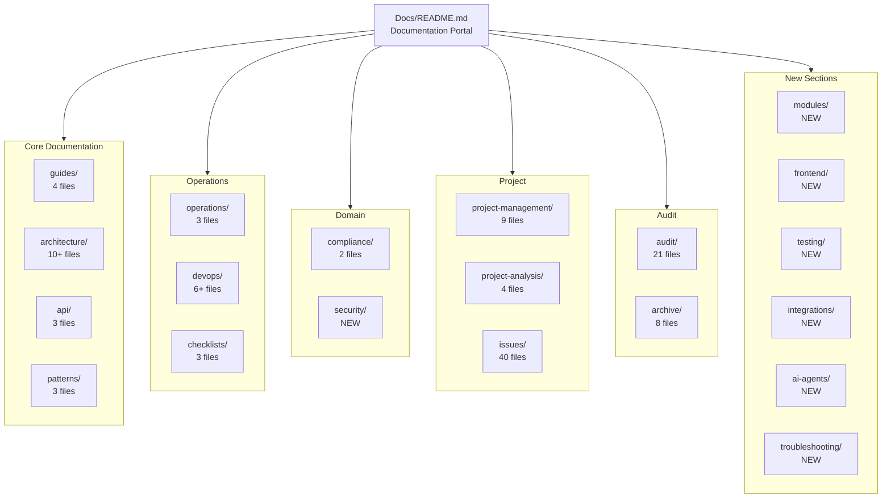
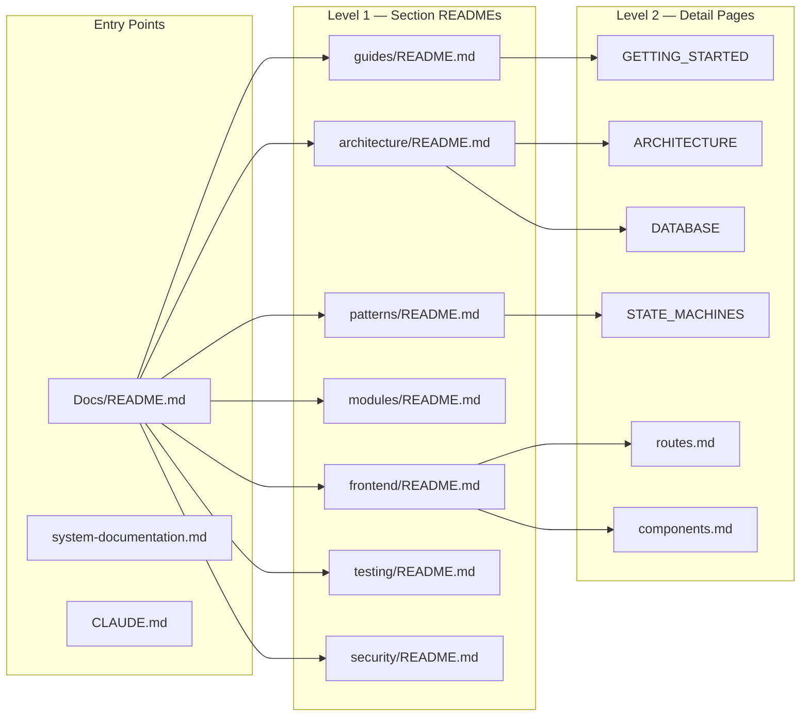

# Documentation Map

> Visual navigation system for all Staffora documentation
> Total: 190+ files across 17 directories
> **Last updated:** 2026-03-17

---

## System Architecture



---

## Full Directory Tree

```
Docs/
│
├── README.md                          ← ENTRY POINT: Documentation portal
├── system-documentation.md            ← Complete system reference (47KB)
├── DOC_HEALTH_REPORT.md               ← Documentation health scoring
├── DOC_MAP.md                         ← This file (navigation map)
├── DOC_TODO.md                        ← Gap detection and TODO backlog
├── DOCUMENTATION_AUDIT_REPORT.md      ← Audit history
├── DOCUMENTATION_TODO.md              ← Original TODO (pre-audit)
│
├── guides/                            ← Developer onboarding
│   ├── README.md                      Navigation index
│   ├── GETTING_STARTED.md             First-time setup (prerequisites, Docker, migrations)
│   ├── DEPLOYMENT.md                  Production deployment guide
│   └── FRONTEND.md                    Frontend patterns overview
│
├── architecture/                      ← System design
│   ├── README.md                      Section index
│   ├── ARCHITECTURE.md                System overview, plugin chain, request flow
│   ├── DATABASE.md                    Schema conventions, RLS template, table catalog
│   ├── WORKER_SYSTEM.md               Redis Streams, outbox, job processors
│   ├── PERMISSIONS_SYSTEM.md          Full RBAC architecture (119KB)
│   ├── architecture-map.md            High-level architecture mapping (30KB)
│   ├── architecture-redesign.md       Proposed improvements
│   ├── permissions-v2-migration-guide.md  Migration guide
│   ├── repository-map.md              Codebase structure reference
│   ├── diagrams.md                    ← NEW: Comprehensive Mermaid diagrams
│   ├── worker-system.md               ← NEW: Worker deep-dive
│   └── database-guide.md             ← NEW: Database deep-dive
│
├── api/                               ← API surface
│   ├── README.md                      Section index
│   ├── API_REFERENCE.md               190+ endpoints by module
│   └── ERROR_CODES.md                 Error codes with messages
│
├── patterns/                          ← Design patterns
│   ├── README.md                      Pattern summary
│   ├── STATE_MACHINES.md              5 state machines with Mermaid diagrams
│   └── SECURITY.md                    RLS, auth, RBAC, audit, idempotency
│
├── modules/                           ← NEW: Module catalog
│   └── README.md                      All 72 backend modules documented
│
├── frontend/                          ← NEW: Frontend documentation
│   ├── README.md                      Frontend architecture overview
│   ├── routes.md                      Complete route map (160 routes)
│   ├── components.md                  Component library documentation
│   └── data-fetching.md              React Query and API patterns
│
├── testing/                           ← NEW: Testing documentation
│   ├── README.md                      Testing guide (infrastructure, helpers, writing tests)
│   └── test-matrix.md                Test coverage matrix
│
├── security/                          ← NEW: Security documentation
│   └── README.md                      Security architecture (auth, RBAC, RLS, OWASP)
│
├── integrations/                      ← NEW: Integration documentation
│   └── README.md                      External service integrations (S3, email, Redis, etc.)
│
├── ai-agents/                         ← NEW: AI development documentation
│   └── README.md                      Agent system, skills, memory
│
├── troubleshooting/                   ← NEW: Troubleshooting guide
│   └── README.md                      Common issues, debug procedures, error reference
│
├── operations/                        ← Production readiness
│   ├── README.md                      Section index
│   ├── production-checklist.md        Pre-launch checklist
│   └── production-readiness-report.md Readiness assessment
│
├── devops/                            ← Infrastructure & CI/CD
│   ├── README.md                      Section index
│   ├── devops-status-report.md        Infrastructure status
│   ├── devops-tasks.md                Ongoing DevOps tasks
│   ├── devops-dashboard.md            Metrics dashboard
│   ├── docker-guide.md               ← NEW: Docker development guide
│   └── ci-cd.md                      ← NEW: CI/CD pipeline documentation
│
├── compliance/                        ← UK regulations
│   ├── README.md                      Section index
│   └── uk-hr-compliance-report.md     Statutory requirements, GDPR
│
├── checklists/                        ← Quality standards
│   ├── README.md                      Section index
│   ├── enterprise-engineering-checklist.md  Code quality, security, testing
│   └── devops-master-checklist.md     DevOps verification
│
├── audit/                             ← System audits (21 files)
│   ├── README.md                      Audit index
│   ├── FINAL_SYSTEM_REPORT.md         Final system assessment
│   ├── MASTER_TODO.md                 Master task list (60KB)
│   ├── PERFORMANCE_AUDIT.md           Query performance
│   ├── architecture-diagrams.md       Architecture visuals
│   ├── architecture-risk-report.md    Risk analysis
│   ├── code-scan-findings.md          Static analysis
│   ├── feature-validation-report.md   Feature completeness (91KB)
│   ├── hr-enterprise-checklist.md     Enterprise HR capabilities (136KB)
│   ├── implementation-plans.md        Implementation roadmap
│   ├── infrastructure-audit.md        Infrastructure review
│   ├── missing-features.md            Feature gaps
│   ├── refactoring-plan.md            Refactoring priorities
│   ├── repository-map.md              Codebase structure
│   ├── security-audit.md              Security assessment
│   ├── security-review-checklist.md   Security checklist
│   ├── system-architecture.md         System overview
│   ├── technical-debt-report.md       Tech debt analysis
│   ├── technical-debt-report-latest.md Latest tech debt
│   ├── testing-audit.md               Test coverage gaps
│   └── uk-compliance-audit.md         Compliance assessment
│
├── issues/                            ← Known issues (40 files)
│   ├── README.md                      Issue index
│   ├── REPORTING_SYSTEM_PROMPT.md     Issue reporting system
│   ├── architecture-001 through 008   Architecture issues
│   ├── compliance-001 through 012     Compliance issues
│   ├── security-001 through 008       Security issues
│   └── tech-debt-001 through 010      Technical debt issues
│
├── project-management/                ← Roadmaps & sprints
│   ├── roadmap.md                     Feature roadmap
│   ├── risk-register.md               Risk tracking
│   ├── kanban-board.md                Work item status
│   ├── engineering-todo.md            Engineering tasks
│   ├── master-engineering-todo.md     Condensed todo
│   ├── sprint-plan-phase1.md          Phase 1 sprints
│   ├── sprint-plan-phase2.md          Phase 2 sprints
│   └── sprint-plan-phase3.md          Phase 3 sprints
│
├── project-analysis/                  ← Requirements
│   ├── README.md                      Section index
│   ├── master_requirements.md         Functional requirements
│   ├── implementation_status.md       Progress tracking
│   └── tickets.md                     Issue tickets
│
└── archive/                           ← Superseded docs
    ├── README.md                      Archive index
    ├── enterprise-hr-capability-checklist-old.md
    ├── feature-validation-report-old.md
    ├── permissions-system-design-old.md
    ├── tickets-pm-old.md
    ├── todo-master-analysis.md
    ├── todo-master-pm-old.md
    └── HRISystem.txt
```

---

## Navigation by Topic

### "I want to understand the system"
1. [README.md](README.md) → Overview and quick links
2. [architecture/ARCHITECTURE.md](architecture/ARCHITECTURE.md) → System design
3. [architecture/diagrams.md](architecture/diagrams.md) → Visual diagrams
4. [modules/README.md](modules/README.md) → All 72 modules

### "I want to build a feature"
1. [guides/GETTING_STARTED.md](guides/GETTING_STARTED.md) → Dev setup
2. [api/API_REFERENCE.md](api/API_REFERENCE.md) → Existing endpoints
3. [patterns/](patterns/) → RLS, outbox, state machines
4. [testing/README.md](testing/README.md) → Writing tests

### "I want to understand the frontend"
1. [frontend/README.md](frontend/README.md) → Architecture
2. [frontend/routes.md](frontend/routes.md) → Route map
3. [frontend/components.md](frontend/components.md) → Component library
4. [frontend/data-fetching.md](frontend/data-fetching.md) → React Query patterns

### "I want to deploy"
1. [guides/DEPLOYMENT.md](guides/DEPLOYMENT.md) → Deployment guide
2. [devops/docker-guide.md](devops/docker-guide.md) → Docker details
3. [devops/ci-cd.md](devops/ci-cd.md) → CI/CD pipeline
4. [operations/production-checklist.md](operations/production-checklist.md) → Pre-launch

### "I want to fix a problem"
1. [troubleshooting/README.md](troubleshooting/README.md) → Common issues
2. [issues/](issues/) → Known issues by category
3. [api/ERROR_CODES.md](api/ERROR_CODES.md) → Error reference

### "I need compliance information"
1. [compliance/uk-hr-compliance-report.md](compliance/uk-hr-compliance-report.md) → UK HR law
2. [security/README.md](security/README.md) → Security architecture
3. [audit/uk-compliance-audit.md](audit/uk-compliance-audit.md) → Compliance audit

### "I want to understand the AI development system"
1. [ai-agents/README.md](ai-agents/README.md) → Agent system overview
2. [CLAUDE.md](../CLAUDE.md) → Project instructions
3. [.claude/agents/](../.claude/agents/) → Agent definitions

---

## Cross-Reference Matrix

| From ↓ / To → | Architecture | API | Patterns | Testing | Security | Modules | Frontend |
|----------------|:---:|:---:|:---:|:---:|:---:|:---:|:---:|
| **Guides** | [link](architecture/ARCHITECTURE.md) | [link](api/API_REFERENCE.md) | [link](patterns/) | [link](testing/README.md) | — | — | [link](frontend/README.md) |
| **Architecture** | — | [link](api/API_REFERENCE.md) | [link](patterns/SECURITY.md) | — | [link](security/README.md) | [link](modules/README.md) | — |
| **API** | [link](architecture/ARCHITECTURE.md) | — | — | [link](testing/README.md) | — | [link](modules/README.md) | — |
| **Patterns** | [link](architecture/DATABASE.md) | [link](api/ERROR_CODES.md) | — | [link](testing/README.md) | [link](security/README.md) | — | — |
| **Modules** | [link](architecture/ARCHITECTURE.md) | [link](api/API_REFERENCE.md) | [link](patterns/) | [link](testing/README.md) | — | — | [link](frontend/routes.md) |
| **Frontend** | — | [link](api/API_REFERENCE.md) | — | [link](testing/README.md) | [link](security/README.md) | [link](modules/README.md) | — |

---

## Document Hierarchy



---

*Navigate to [README.md](README.md) for the main documentation portal.*
