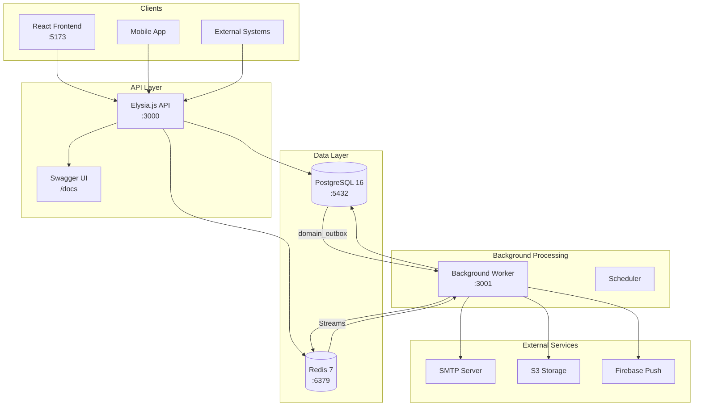
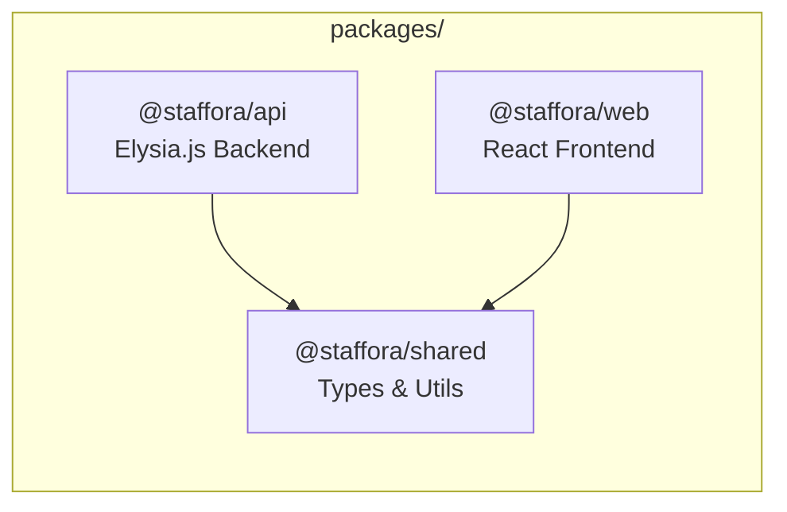
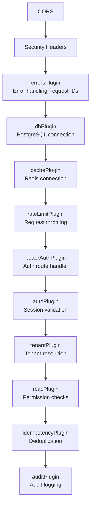
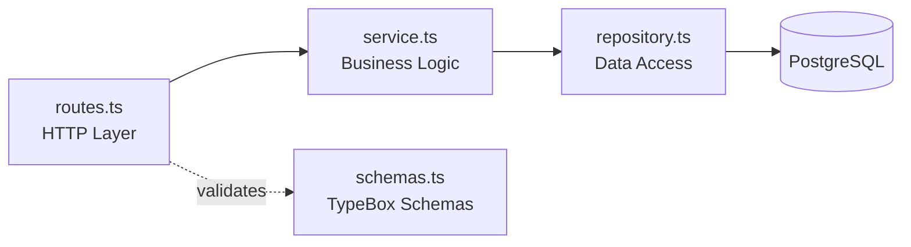
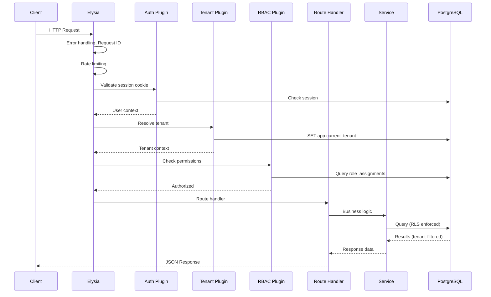
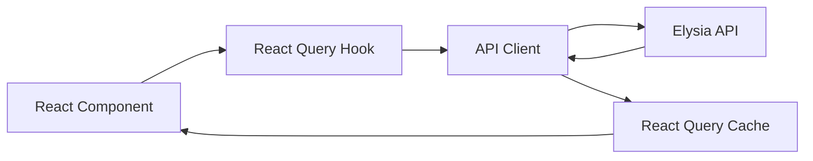
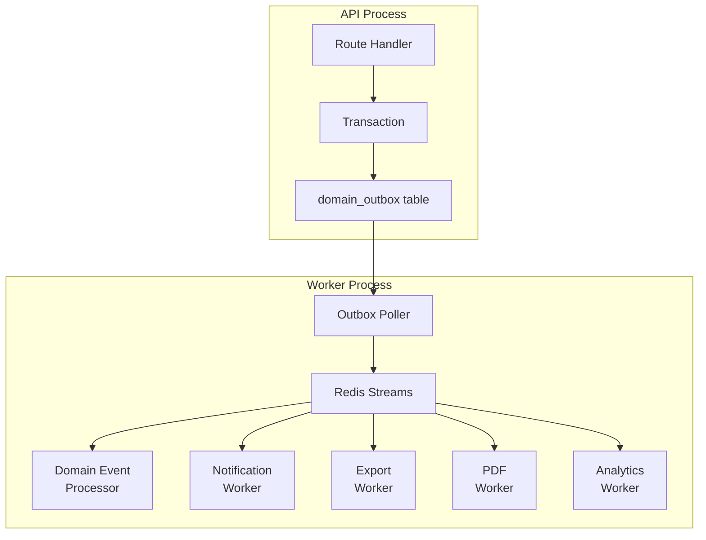
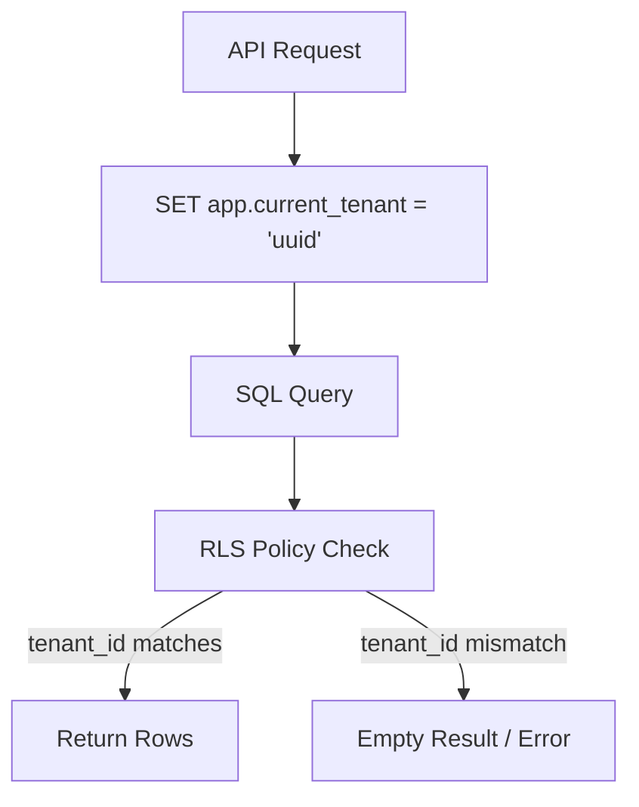

# Architecture

*Last updated: 2026-03-17*

## System Overview



## Monorepo Structure

The project uses **Bun workspaces** to manage three packages:



| Package | Name | Description |
|---------|------|-------------|
| `packages/api` | `@staffora/api` | Elysia.js backend with plugin architecture |
| `packages/web` | `@staffora/web` | React Router v7 framework mode frontend |
| `packages/shared` | `@staffora/shared` | Shared types, schemas, error codes, state machines, utilities |

## Backend Architecture

### Plugin System

The API uses Elysia's plugin system. Plugins **must** be registered in order due to dependencies:



### Module Structure

Each feature module follows a consistent layered pattern:

```
modules/<name>/
├── routes.ts        # HTTP endpoint definitions
├── service.ts       # Business logic
├── repository.ts    # Database queries
├── schemas.ts       # TypeBox request/response schemas
└── index.ts         # Module exports
```



### Request Flow



## Frontend Architecture

### Route Structure

React Router v7 file-based routing with route groups:

```
app/routes/
├── (auth)/              # Public auth pages
│   ├── login.tsx
│   └── forgot-password.tsx
├── (app)/               # Authenticated app pages
│   ├── dashboard.tsx
│   ├── employees/
│   ├── time/
│   ├── leave/
│   └── ...
└── (admin)/             # Admin-only pages
    ├── settings/
    ├── roles/
    └── audit-log/
```

### Frontend Data Flow



## Worker Architecture



### Redis Stream Keys

| Stream | Purpose |
|--------|---------|
| `hris:events:domain` | Domain events from outbox |
| `hris:events:notifications` | Email and push notifications |
| `hris:events:exports` | CSV/Excel report generation |
| `hris:events:pdf` | PDF document generation |
| `hris:events:analytics` | Analytics aggregation |
| `hris:events:background` | General background tasks |

## Database Architecture

### Schema Design

All tables live in the `app` schema (not `public`). Two database roles:

| Role | Purpose | RLS |
|------|---------|-----|
| `hris` | Superuser for migrations | Bypasses RLS |
| `hris_app` | Application runtime and tests | `NOBYPASSRLS` - RLS enforced |

### Multi-Tenant Isolation



Every tenant-owned table has:
1. `tenant_id uuid NOT NULL` column
2. RLS enabled
3. `tenant_isolation` policy (SELECT/UPDATE/DELETE)
4. `tenant_isolation_insert` policy (INSERT)

### Key Cross-Cutting Patterns

| Pattern | Implementation |
|---------|---------------|
| **Effective Dating** | `effective_from`/`effective_to` columns, overlap validation |
| **Outbox Pattern** | `domain_outbox` table, same-transaction writes |
| **Idempotency** | `idempotency_keys` table, `Idempotency-Key` header |
| **Audit Trail** | `audit_log` table, partitioned by month |
| **Soft Delete** | `deleted_at` column where applicable |

---

## Related Documents

- [Database Guide](DATABASE.md) — PostgreSQL schema, migrations, and RLS conventions
- [Worker System](WORKER_SYSTEM.md) — Background job processing with Redis Streams
- [Permissions System](PERMISSIONS_SYSTEM.md) — 7-layer access control architecture
- [Architecture Map](architecture-map.md) — Detailed architecture map with diagrams
- [Repository Map](repository-map.md) — Monorepo structure and module inventory
- [Security Patterns](../patterns/SECURITY.md) — RLS, authentication, and security enforcement
- [API Reference](../api/API_REFERENCE.md) — Complete endpoint documentation
- [Deployment Guide](../guides/DEPLOYMENT.md) — Production deployment with Docker Compose
