# Staffora HRIS -- Architecture Diagrams

Comprehensive Mermaid architecture diagrams for the Staffora enterprise multi-tenant HRIS platform. All diagrams reflect the actual codebase structure as of the latest implementation.

*Last updated: 2026-03-17*

---

## Table of Contents

1. [System Architecture Overview](#1-system-architecture-overview)
2. [Request Flow](#2-request-flow)
3. [Plugin Dependency Graph](#3-plugin-dependency-graph)
4. [Module Architecture](#4-module-architecture)
5. [Authentication Flow](#5-authentication-flow)
6. [Multi-Tenant Data Flow](#6-multi-tenant-data-flow)
7. [Outbox Pattern Flow](#7-outbox-pattern-flow)
8. [Worker Architecture](#8-worker-architecture)
9. [Frontend Architecture](#9-frontend-architecture)
10. [Database Schema Overview](#10-database-schema-overview)
11. [State Machine Diagrams](#11-state-machine-diagrams)
12. [Deployment Architecture](#12-deployment-architecture)

---

## 1. System Architecture Overview

High-level view of the Staffora platform showing all major components and their interactions.

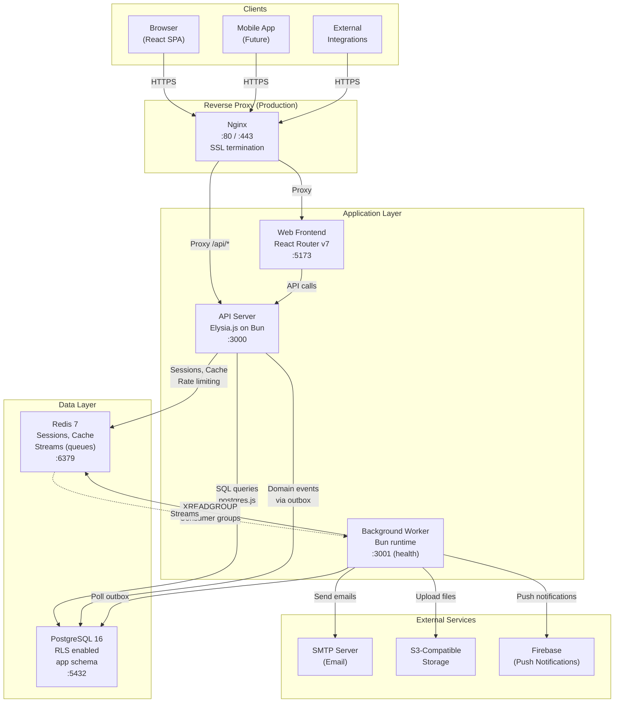
```mermaid
graph TB
    subgraph Clients
        Browser["Browser<br/>(React SPA)"]
        MobileApp["Mobile App<br/>(Future)"]
        ExternalAPI["External<br/>Integrations"]
    end

    subgraph "Reverse Proxy (Production)"
        Nginx["Nginx<br/>:80 / :443<br/>SSL termination"]
    end

    subgraph "Application Layer"
        Web["Web Frontend<br/>React Router v7<br/>:5173"]
        API["API Server<br/>Elysia.js on Bun<br/>:3000"]
        Worker["Background Worker<br/>Bun runtime<br/>:3001 (health)"]
    end

    subgraph "Data Layer"
        Postgres["PostgreSQL 16<br/>RLS enabled<br/>app schema<br/>:5432"]
        Redis["Redis 7<br/>Sessions, Cache<br/>Streams (queues)<br/>:6379"]
    end

    subgraph "External Services"
        SMTP["SMTP Server<br/>(Email)"]
        S3["S3-Compatible<br/>Storage"]
        Firebase["Firebase<br/>(Push Notifications)"]
    end

    Browser -->|HTTPS| Nginx
    MobileApp -->|HTTPS| Nginx
    ExternalAPI -->|HTTPS| Nginx

    Nginx -->|Proxy| Web
    Nginx -->|Proxy /api/*| API

    Web -->|API calls| API

    API -->|SQL queries<br/>postgres.js| Postgres
    API -->|Sessions, Cache<br/>Rate limiting| Redis
    API -->|Domain events<br/>via outbox| Postgres

    Worker -->|Poll outbox| Postgres
    Worker -->|XREADGROUP<br/>Consumer groups| Redis
    Worker -->|Send emails| SMTP
    Worker -->|Upload files| S3
    Worker -->|Push notifications| Firebase

    Redis -.->|Streams| Worker
```

---

## 2. Request Flow

Detailed lifecycle of an API request through all Elysia plugins, in exact registration order from `app.ts`.

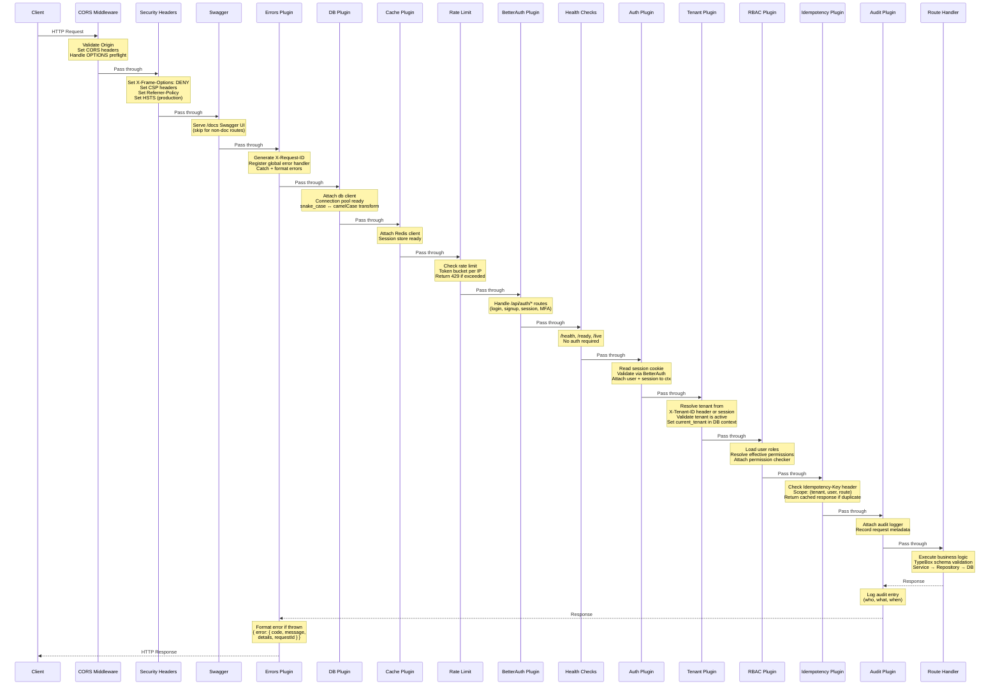
```mermaid
sequenceDiagram
    participant C as Client
    participant CORS as CORS Middleware
    participant SH as Security Headers
    participant SW as Swagger
    participant ERR as Errors Plugin
    participant DB as DB Plugin
    participant CACHE as Cache Plugin
    participant RL as Rate Limit
    participant BA as BetterAuth Plugin
    participant HEALTH as Health Checks
    participant AUTH as Auth Plugin
    participant TEN as Tenant Plugin
    participant RBAC as RBAC Plugin
    participant IDEMP as Idempotency Plugin
    participant AUDIT as Audit Plugin
    participant HANDLER as Route Handler

    C->>CORS: HTTP Request
    Note over CORS: Validate Origin<br/>Set CORS headers<br/>Handle OPTIONS preflight

    CORS->>SH: Pass through
    Note over SH: Set X-Frame-Options: DENY<br/>Set CSP headers<br/>Set Referrer-Policy<br/>Set HSTS (production)

    SH->>SW: Pass through
    Note over SW: Serve /docs Swagger UI<br/>(skip for non-doc routes)

    SW->>ERR: Pass through
    Note over ERR: Generate X-Request-ID<br/>Register global error handler<br/>Catch + format errors

    ERR->>DB: Pass through
    Note over DB: Attach db client<br/>Connection pool ready<br/>snake_case ↔ camelCase transform

    DB->>CACHE: Pass through
    Note over CACHE: Attach Redis client<br/>Session store ready

    CACHE->>RL: Pass through
    Note over RL: Check rate limit<br/>Token bucket per IP<br/>Return 429 if exceeded

    RL->>BA: Pass through
    Note over BA: Handle /api/auth/* routes<br/>(login, signup, session, MFA)

    BA->>HEALTH: Pass through
    Note over HEALTH: /health, /ready, /live<br/>No auth required

    HEALTH->>AUTH: Pass through
    Note over AUTH: Read session cookie<br/>Validate via BetterAuth<br/>Attach user + session to ctx

    AUTH->>TEN: Pass through
    Note over TEN: Resolve tenant from<br/>X-Tenant-ID header or session<br/>Validate tenant is active<br/>Set current_tenant in DB context

    TEN->>RBAC: Pass through
    Note over RBAC: Load user roles<br/>Resolve effective permissions<br/>Attach permission checker

    RBAC->>IDEMP: Pass through
    Note over IDEMP: Check Idempotency-Key header<br/>Scope: (tenant, user, route)<br/>Return cached response if duplicate

    IDEMP->>AUDIT: Pass through
    Note over AUDIT: Attach audit logger<br/>Record request metadata

    AUDIT->>HANDLER: Pass through
    Note over HANDLER: Execute business logic<br/>TypeBox schema validation<br/>Service → Repository → DB

    HANDLER-->>AUDIT: Response
    Note over AUDIT: Log audit entry<br/>(who, what, when)

    AUDIT-->>ERR: Response
    Note over ERR: Format error if thrown<br/>{ error: { code, message,<br/>details, requestId } }

    ERR-->>C: HTTP Response
```

---

## 3. Plugin Dependency Graph

Shows which plugins depend on which others. Plugins must be registered in topological order.

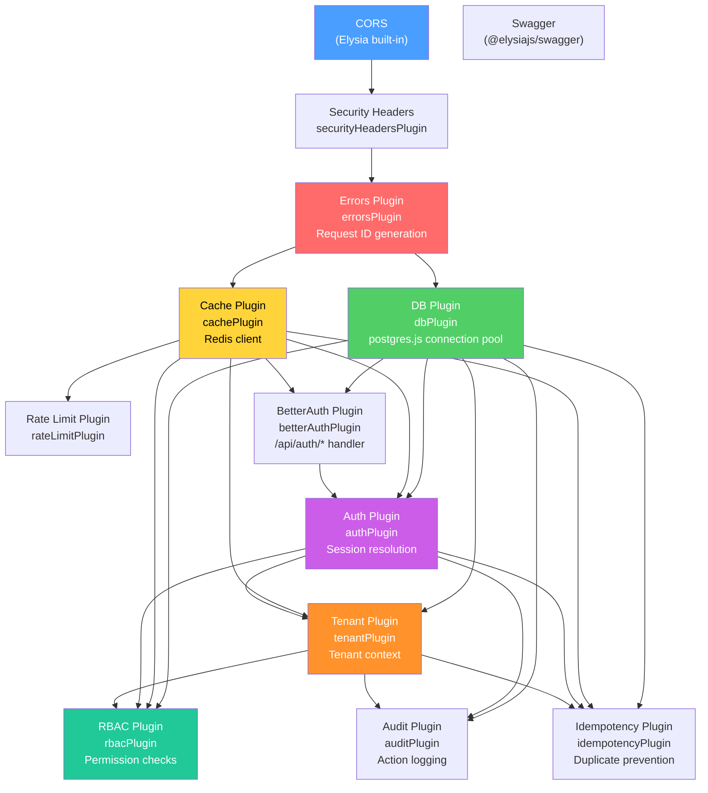
```mermaid
graph TD
    CORS["CORS<br/>(Elysia built-in)"]
    SH["Security Headers<br/>securityHeadersPlugin"]
    SWAGGER["Swagger<br/>(@elysiajs/swagger)"]
    ERR["Errors Plugin<br/>errorsPlugin<br/>Request ID generation"]
    DB["DB Plugin<br/>dbPlugin<br/>postgres.js connection pool"]
    CACHE["Cache Plugin<br/>cachePlugin<br/>Redis client"]
    RL["Rate Limit Plugin<br/>rateLimitPlugin"]
    BA["BetterAuth Plugin<br/>betterAuthPlugin<br/>/api/auth/* handler"]
    AUTH["Auth Plugin<br/>authPlugin<br/>Session resolution"]
    TEN["Tenant Plugin<br/>tenantPlugin<br/>Tenant context"]
    RBAC["RBAC Plugin<br/>rbacPlugin<br/>Permission checks"]
    IDEMP["Idempotency Plugin<br/>idempotencyPlugin<br/>Duplicate prevention"]
    AUDIT["Audit Plugin<br/>auditPlugin<br/>Action logging"]

    CORS --> SH
    SH --> ERR
    ERR --> DB
    ERR --> CACHE
    DB --> BA
    CACHE --> BA
    CACHE --> RL
    DB --> AUTH
    CACHE --> AUTH
    BA --> AUTH
    DB --> TEN
    CACHE --> TEN
    AUTH --> TEN
    DB --> RBAC
    CACHE --> RBAC
    AUTH --> RBAC
    TEN --> RBAC
    DB --> IDEMP
    CACHE --> IDEMP
    AUTH --> IDEMP
    TEN --> IDEMP
    DB --> AUDIT
    AUTH --> AUDIT
    TEN --> AUDIT

    style CORS fill:#4a9eff,color:#fff
    style ERR fill:#ff6b6b,color:#fff
    style DB fill:#51cf66,color:#fff
    style CACHE fill:#ffd43b,color:#000
    style AUTH fill:#cc5de8,color:#fff
    style TEN fill:#ff922b,color:#fff
    style RBAC fill:#20c997,color:#fff
```

---

## 4. Module Architecture

The standard 5-file pattern used by all 120 backend modules (shown using the `hr` module as an example).

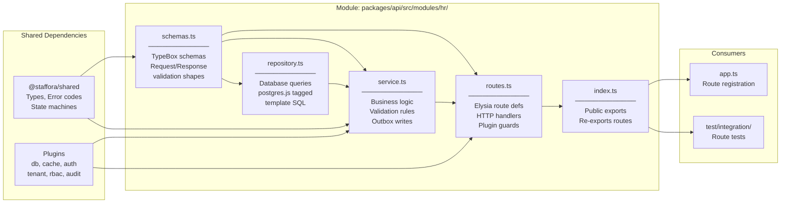
```mermaid
graph LR
    subgraph "Module: packages/api/src/modules/hr/"
        SCHEMAS["schemas.ts<br/>─────────────<br/>TypeBox schemas<br/>Request/Response<br/>validation shapes"]
        REPO["repository.ts<br/>─────────────<br/>Database queries<br/>postgres.js tagged<br/>template SQL"]
        SERVICE["service.ts<br/>─────────────<br/>Business logic<br/>Validation rules<br/>Outbox writes"]
        ROUTES["routes.ts<br/>─────────────<br/>Elysia route defs<br/>HTTP handlers<br/>Plugin guards"]
        INDEX["index.ts<br/>─────────────<br/>Public exports<br/>Re-exports routes"]
    end

    SCHEMAS --> REPO
    SCHEMAS --> SERVICE
    SCHEMAS --> ROUTES
    REPO --> SERVICE
    SERVICE --> ROUTES
    ROUTES --> INDEX

    subgraph "Consumers"
        APP["app.ts<br/>Route registration"]
        TESTS["test/integration/<br/>Route tests"]
    end

    INDEX --> APP
    INDEX --> TESTS

    subgraph "Shared Dependencies"
        SHARED["@staffora/shared<br/>Types, Error codes<br/>State machines"]
        PLUGINS["Plugins<br/>db, cache, auth<br/>tenant, rbac, audit"]
    end

    SHARED --> SCHEMAS
    SHARED --> SERVICE
    PLUGINS --> ROUTES
    PLUGINS --> SERVICE
```

### Module Count by Category

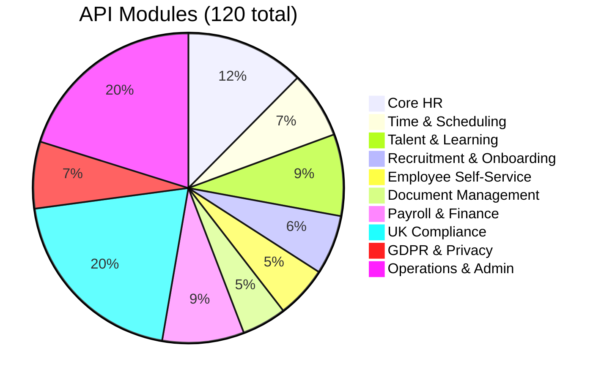
```mermaid
pie title API Modules (120 total)
    "Core HR" : 16
    "Time & Scheduling" : 9
    "Talent & Learning" : 11
    "Recruitment & Onboarding" : 8
    "Employee Self-Service" : 7
    "Document Management" : 6
    "Payroll & Finance" : 11
    "UK Compliance" : 26
    "GDPR & Privacy" : 9
    "Operations & Admin" : 26
```

---

## 5. Authentication Flow

BetterAuth-powered login, session management, and MFA verification.

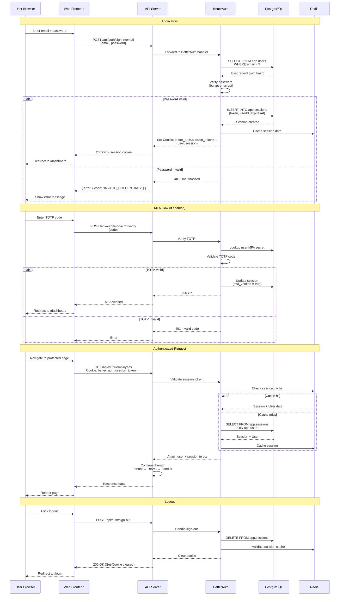
```mermaid
sequenceDiagram
    participant U as User Browser
    participant WEB as Web Frontend
    participant API as API Server
    participant BA as BetterAuth
    participant PG as PostgreSQL
    participant REDIS as Redis

    Note over U,REDIS: Login Flow

    U->>WEB: Enter email + password
    WEB->>API: POST /api/auth/sign-in/email<br/>{email, password}
    API->>BA: Forward to BetterAuth handler
    BA->>PG: SELECT FROM app.users<br/>WHERE email = ?
    PG-->>BA: User record (with hash)
    BA->>BA: Verify password<br/>(bcrypt or scrypt)

    alt Password Valid
        BA->>PG: INSERT INTO app.sessions<br/>(token, userId, expiresAt)
        PG-->>BA: Session created
        BA->>REDIS: Cache session data
        BA-->>API: Set-Cookie: better_auth.session_token=...<br/>{user, session}
        API-->>WEB: 200 OK + session cookie
        WEB-->>U: Redirect to /dashboard
    else Password Invalid
        BA-->>API: 401 Unauthorized
        API-->>WEB: { error: { code: "INVALID_CREDENTIALS" } }
        WEB-->>U: Show error message
    end

    Note over U,REDIS: MFA Flow (if enabled)

    U->>WEB: Enter TOTP code
    WEB->>API: POST /api/auth/two-factor/verify<br/>{code}
    API->>BA: Verify TOTP
    BA->>PG: Lookup user MFA secret
    BA->>BA: Validate TOTP code
    alt TOTP Valid
        BA->>PG: Update session<br/>(mfa_verified = true)
        BA-->>API: 200 OK
        API-->>WEB: MFA verified
        WEB-->>U: Redirect to /dashboard
    else TOTP Invalid
        BA-->>API: 401 Invalid code
        API-->>WEB: Error
    end

    Note over U,REDIS: Authenticated Request

    U->>WEB: Navigate to protected page
    WEB->>API: GET /api/v1/hr/employees<br/>Cookie: better_auth.session_token=...
    API->>BA: Validate session token
    BA->>REDIS: Check session cache
    alt Cache hit
        REDIS-->>BA: Session + User data
    else Cache miss
        BA->>PG: SELECT FROM app.sessions<br/>JOIN app.users
        PG-->>BA: Session + User
        BA->>REDIS: Cache session
    end
    BA-->>API: Attach user + session to ctx
    API->>API: Continue through<br/>tenant → RBAC → handler
    API-->>WEB: Response data
    WEB-->>U: Render page

    Note over U,REDIS: Logout

    U->>WEB: Click logout
    WEB->>API: POST /api/auth/sign-out
    API->>BA: Handle sign-out
    BA->>PG: DELETE FROM app.sessions
    BA->>REDIS: Invalidate session cache
    BA-->>API: Clear cookie
    API-->>WEB: 200 OK (Set-Cookie cleared)
    WEB-->>U: Redirect to /login
```

---

## 6. Multi-Tenant Data Flow

How tenant context is resolved, propagated, and enforced via PostgreSQL Row-Level Security.

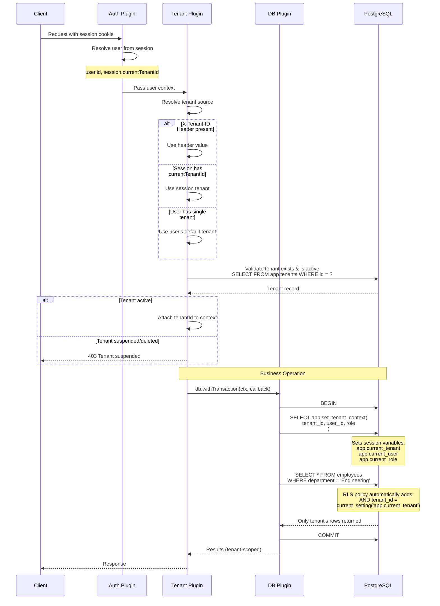
```mermaid
sequenceDiagram
    participant C as Client
    participant AUTH as Auth Plugin
    participant TEN as Tenant Plugin
    participant DB as DB Plugin
    participant PG as PostgreSQL

    C->>AUTH: Request with session cookie
    AUTH->>AUTH: Resolve user from session
    Note over AUTH: user.id, session.currentTenantId

    AUTH->>TEN: Pass user context
    TEN->>TEN: Resolve tenant source

    alt X-Tenant-ID Header present
        TEN->>TEN: Use header value
    else Session has currentTenantId
        TEN->>TEN: Use session tenant
    else User has single tenant
        TEN->>TEN: Use user's default tenant
    end

    TEN->>PG: Validate tenant exists & is active<br/>SELECT FROM app.tenants WHERE id = ?
    PG-->>TEN: Tenant record

    alt Tenant active
        TEN->>TEN: Attach tenantId to context
    else Tenant suspended/deleted
        TEN-->>C: 403 Tenant suspended
    end

    Note over TEN,PG: Business Operation

    TEN->>DB: db.withTransaction(ctx, callback)
    DB->>PG: BEGIN
    DB->>PG: SELECT app.set_tenant_context(<br/>  tenant_id, user_id, role<br/>)
    Note over PG: Sets session variables:<br/>app.current_tenant<br/>app.current_user<br/>app.current_role

    DB->>PG: SELECT * FROM employees<br/>WHERE department = 'Engineering'
    Note over PG: RLS policy automatically adds:<br/>AND tenant_id = <br/>current_setting('app.current_tenant')

    PG-->>DB: Only tenant's rows returned
    DB->>PG: COMMIT
    DB-->>TEN: Results (tenant-scoped)
    TEN-->>C: Response
```

### RLS Policy Structure

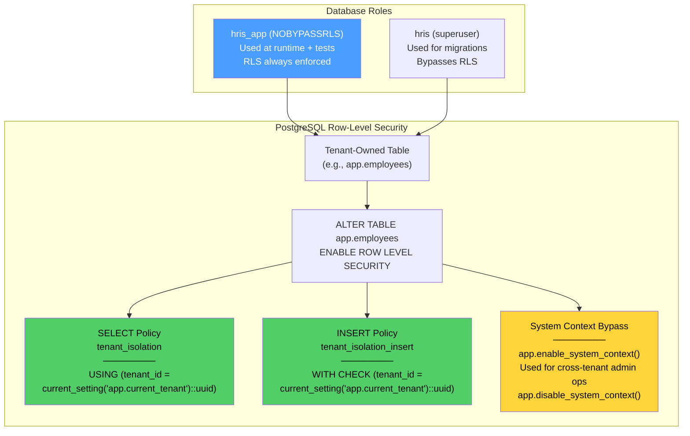
```mermaid
graph TD
    subgraph "PostgreSQL Row-Level Security"
        TABLE["Tenant-Owned Table<br/>(e.g., app.employees)"]
        RLS_ON["ALTER TABLE app.employees<br/>ENABLE ROW LEVEL SECURITY"]
        SELECT_POLICY["SELECT Policy<br/>tenant_isolation<br/>────────<br/>USING (tenant_id =<br/>current_setting('app.current_tenant')::uuid)"]
        INSERT_POLICY["INSERT Policy<br/>tenant_isolation_insert<br/>────────<br/>WITH CHECK (tenant_id =<br/>current_setting('app.current_tenant')::uuid)"]
        SYSTEM_BYPASS["System Context Bypass<br/>────────<br/>app.enable_system_context()<br/>Used for cross-tenant admin ops<br/>app.disable_system_context()"]
    end

    subgraph "Database Roles"
        HRIS["hris (superuser)<br/>Used for migrations<br/>Bypasses RLS"]
        HRIS_APP["hris_app (NOBYPASSRLS)<br/>Used at runtime + tests<br/>RLS always enforced"]
    end

    TABLE --> RLS_ON
    RLS_ON --> SELECT_POLICY
    RLS_ON --> INSERT_POLICY
    RLS_ON --> SYSTEM_BYPASS
    HRIS_APP --> TABLE
    HRIS --> TABLE

    style SELECT_POLICY fill:#51cf66,color:#000
    style INSERT_POLICY fill:#51cf66,color:#000
    style SYSTEM_BYPASS fill:#ffd43b,color:#000
    style HRIS_APP fill:#4a9eff,color:#fff
```

---

## 7. Outbox Pattern Flow

Transactional outbox ensuring domain events are reliably published after business writes.

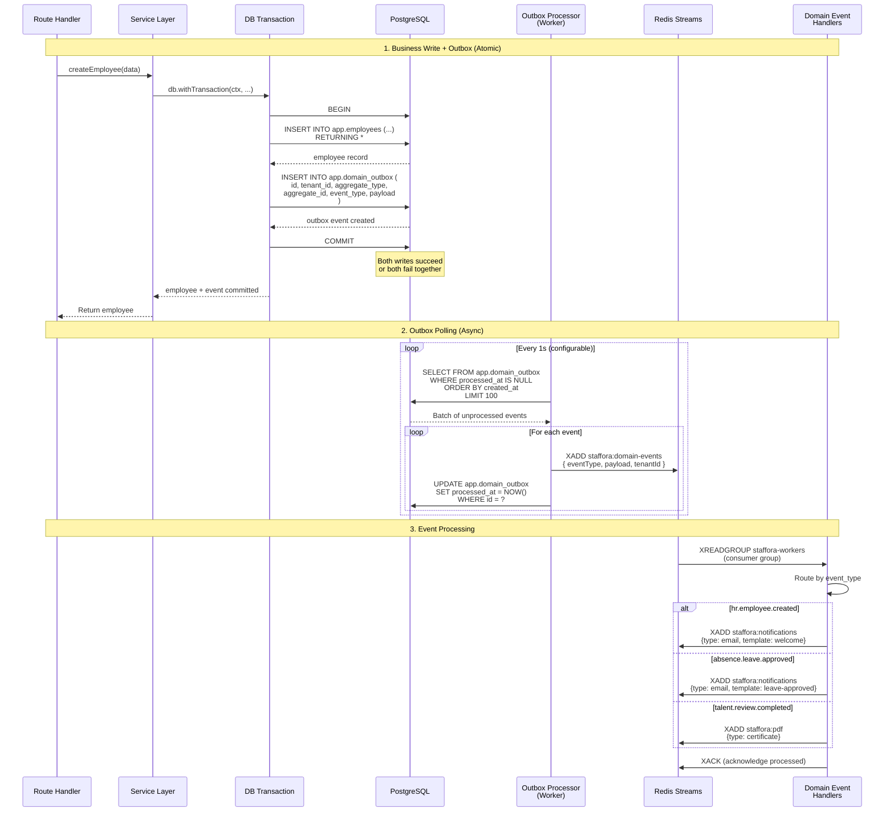
```mermaid
sequenceDiagram
    participant H as Route Handler
    participant SVC as Service Layer
    participant TX as DB Transaction
    participant PG as PostgreSQL
    participant OP as Outbox Processor<br/>(Worker)
    participant REDIS as Redis Streams
    participant DH as Domain Event<br/>Handlers

    Note over H,DH: 1. Business Write + Outbox (Atomic)

    H->>SVC: createEmployee(data)
    SVC->>TX: db.withTransaction(ctx, ...)
    TX->>PG: BEGIN
    TX->>PG: INSERT INTO app.employees (...)<br/>RETURNING *
    PG-->>TX: employee record
    TX->>PG: INSERT INTO app.domain_outbox (<br/>  id, tenant_id, aggregate_type,<br/>  aggregate_id, event_type, payload<br/>)
    PG-->>TX: outbox event created
    TX->>PG: COMMIT
    Note over PG: Both writes succeed<br/>or both fail together
    TX-->>SVC: employee + event committed
    SVC-->>H: Return employee

    Note over H,DH: 2. Outbox Polling (Async)

    loop Every 1s (configurable)
        OP->>PG: SELECT FROM app.domain_outbox<br/>WHERE processed_at IS NULL<br/>ORDER BY created_at<br/>LIMIT 100
        PG-->>OP: Batch of unprocessed events

        loop For each event
            OP->>REDIS: XADD staffora:domain-events<br/>{ eventType, payload, tenantId }
            OP->>PG: UPDATE app.domain_outbox<br/>SET processed_at = NOW()<br/>WHERE id = ?
        end
    end

    Note over H,DH: 3. Event Processing

    REDIS->>DH: XREADGROUP staffora-workers<br/>(consumer group)
    DH->>DH: Route by event_type

    alt hr.employee.created
        DH->>REDIS: XADD staffora:notifications<br/>{type: email, template: welcome}
    else absence.leave.approved
        DH->>REDIS: XADD staffora:notifications<br/>{type: email, template: leave-approved}
    else talent.review.completed
        DH->>REDIS: XADD staffora:pdf<br/>{type: certificate}
    end

    DH->>REDIS: XACK (acknowledge processed)
```

### Outbox Table Lifecycle

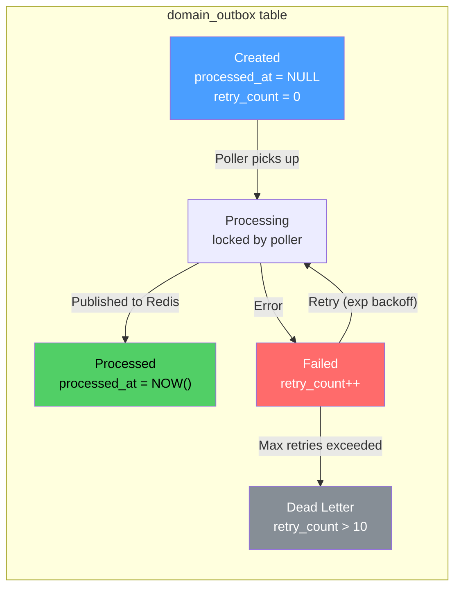
```mermaid
graph LR
    subgraph "domain_outbox table"
        CREATED["Created<br/>processed_at = NULL<br/>retry_count = 0"]
        PROCESSING["Processing<br/>locked by poller"]
        PROCESSED["Processed<br/>processed_at = NOW()"]
        FAILED["Failed<br/>retry_count++"]
        DLQ["Dead Letter<br/>retry_count > 10"]
    end

    CREATED -->|"Poller picks up"| PROCESSING
    PROCESSING -->|"Published to Redis"| PROCESSED
    PROCESSING -->|"Error"| FAILED
    FAILED -->|"Retry (exp backoff)"| PROCESSING
    FAILED -->|"Max retries exceeded"| DLQ

    style CREATED fill:#4a9eff,color:#fff
    style PROCESSED fill:#51cf66,color:#000
    style FAILED fill:#ff6b6b,color:#fff
    style DLQ fill:#868e96,color:#fff
```

---

## 8. Worker Architecture

Background job processing system using Redis Streams with consumer groups.

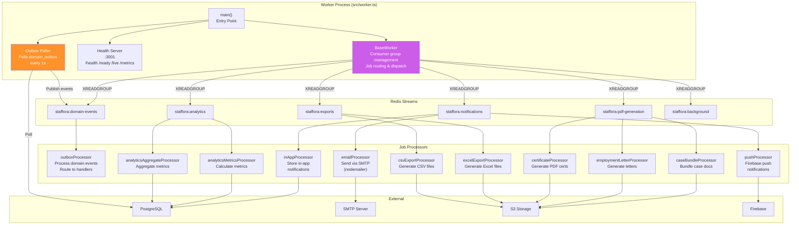
```mermaid
graph TB
    subgraph "Worker Process (src/worker.ts)"
        MAIN["main()<br/>Entry Point"]
        BW["BaseWorker<br/>Consumer group management<br/>Job routing & dispatch"]
        HEALTH_SRV["Health Server<br/>:3001<br/>/health /ready /live /metrics"]
        OP["Outbox Poller<br/>Polls domain_outbox<br/>every 1s"]
    end

    subgraph "Redis Streams"
        S_DOMAIN["staffora:domain-events"]
        S_NOTIFY["staffora:notifications"]
        S_EXPORT["staffora:exports"]
        S_PDF["staffora:pdf-generation"]
        S_ANALYTICS["staffora:analytics"]
        S_BACKGROUND["staffora:background"]
    end

    subgraph "Job Processors"
        P_OUTBOX["outboxProcessor<br/>Process domain events<br/>Route to handlers"]
        P_EMAIL["emailProcessor<br/>Send via SMTP<br/>(nodemailer)"]
        P_INAPP["inAppProcessor<br/>Store in-app<br/>notifications"]
        P_PUSH["pushProcessor<br/>Firebase push<br/>notifications"]
        P_CSV["csvExportProcessor<br/>Generate CSV files"]
        P_EXCEL["excelExportProcessor<br/>Generate Excel files"]
        P_CERT["certificateProcessor<br/>Generate PDF certs"]
        P_LETTER["employmentLetterProcessor<br/>Generate letters"]
        P_BUNDLE["caseBundleProcessor<br/>Bundle case docs"]
        P_AGG["analyticsAggregateProcessor<br/>Aggregate metrics"]
        P_METRIC["analyticsMetricsProcessor<br/>Calculate metrics"]
    end

    subgraph "External"
        PG["PostgreSQL"]
        SMTP["SMTP Server"]
        S3["S3 Storage"]
        FB["Firebase"]
    end

    MAIN --> BW
    MAIN --> HEALTH_SRV
    MAIN --> OP

    OP -->|Poll| PG
    OP -->|Publish events| S_DOMAIN

    BW -->|XREADGROUP| S_DOMAIN
    BW -->|XREADGROUP| S_NOTIFY
    BW -->|XREADGROUP| S_EXPORT
    BW -->|XREADGROUP| S_PDF
    BW -->|XREADGROUP| S_ANALYTICS
    BW -->|XREADGROUP| S_BACKGROUND

    S_DOMAIN --> P_OUTBOX
    S_NOTIFY --> P_EMAIL
    S_NOTIFY --> P_INAPP
    S_NOTIFY --> P_PUSH
    S_EXPORT --> P_CSV
    S_EXPORT --> P_EXCEL
    S_PDF --> P_CERT
    S_PDF --> P_LETTER
    S_PDF --> P_BUNDLE
    S_ANALYTICS --> P_AGG
    S_ANALYTICS --> P_METRIC

    P_EMAIL --> SMTP
    P_CSV --> S3
    P_EXCEL --> S3
    P_CERT --> S3
    P_LETTER --> S3
    P_BUNDLE --> S3
    P_PUSH --> FB
    P_AGG --> PG
    P_METRIC --> PG
    P_INAPP --> PG

    style BW fill:#cc5de8,color:#fff
    style OP fill:#ff922b,color:#fff
```

### Worker Scaling Model

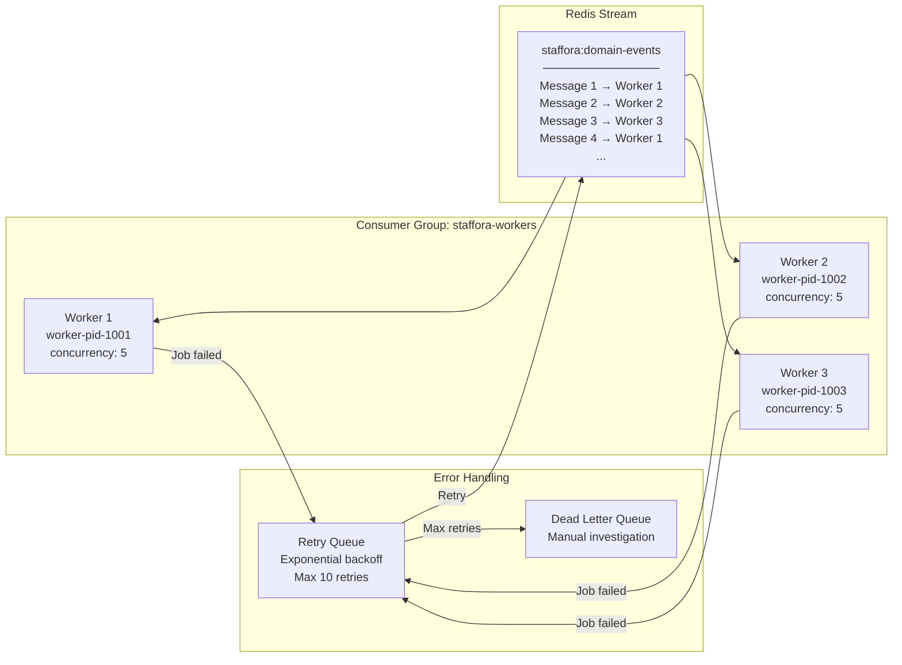
```mermaid
graph LR
    subgraph "Consumer Group: staffora-workers"
        W1["Worker 1<br/>worker-pid-1001<br/>concurrency: 5"]
        W2["Worker 2<br/>worker-pid-1002<br/>concurrency: 5"]
        W3["Worker 3<br/>worker-pid-1003<br/>concurrency: 5"]
    end

    subgraph "Redis Stream"
        STREAM["staffora:domain-events<br/>──────────────<br/>Message 1 → Worker 1<br/>Message 2 → Worker 2<br/>Message 3 → Worker 3<br/>Message 4 → Worker 1<br/>..."]
    end

    subgraph "Error Handling"
        RETRY["Retry Queue<br/>Exponential backoff<br/>Max 10 retries"]
        DLQ["Dead Letter Queue<br/>Manual investigation"]
    end

    STREAM --> W1
    STREAM --> W2
    STREAM --> W3

    W1 -->|"Job failed"| RETRY
    W2 -->|"Job failed"| RETRY
    W3 -->|"Job failed"| RETRY
    RETRY -->|"Max retries"| DLQ
    RETRY -->|"Retry"| STREAM
```

---

## 9. Frontend Architecture

React Router v7 framework mode with route groups, layouts, and React Query data flow.

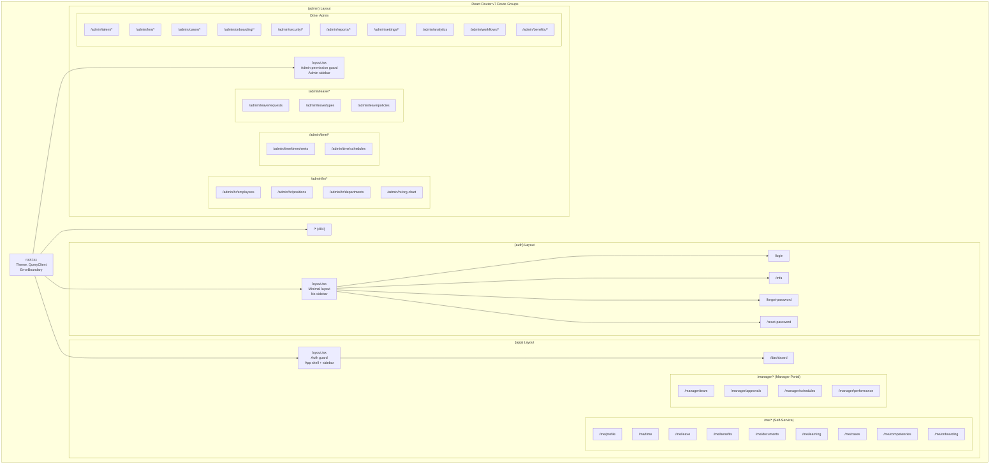
```mermaid
graph TB
    subgraph "React Router v7 Route Groups"
        ROOT["root.tsx<br/>Theme, QueryClient<br/>ErrorBoundary"]

        subgraph "(auth) Layout"
            AUTH_LAYOUT["layout.tsx<br/>Minimal layout<br/>No sidebar"]
            LOGIN["/login"]
            MFA["/mfa"]
            FORGOT["/forgot-password"]
            RESET["/reset-password"]
        end

        subgraph "(app) Layout"
            APP_LAYOUT["layout.tsx<br/>Auth guard<br/>App shell + sidebar"]
            DASHBOARD["/dashboard"]

            subgraph "/me/* (Self-Service)"
                ME_PROFILE["/me/profile"]
                ME_TIME["/me/time"]
                ME_LEAVE["/me/leave"]
                ME_BENEFITS["/me/benefits"]
                ME_DOCS["/me/documents"]
                ME_LEARNING["/me/learning"]
                ME_CASES["/me/cases"]
                ME_COMP["/me/competencies"]
                ME_ONBOARD["/me/onboarding"]
            end

            subgraph "/manager/* (Manager Portal)"
                MGR_TEAM["/manager/team"]
                MGR_APPROVALS["/manager/approvals"]
                MGR_SCHEDULES["/manager/schedules"]
                MGR_PERF["/manager/performance"]
            end
        end

        subgraph "(admin) Layout"
            ADMIN_LAYOUT["layout.tsx<br/>Admin permission guard<br/>Admin sidebar"]

            subgraph "/admin/hr/*"
                HR_EMP["/admin/hr/employees"]
                HR_POS["/admin/hr/positions"]
                HR_DEPT["/admin/hr/departments"]
                HR_ORG["/admin/hr/org-chart"]
            end

            subgraph "/admin/time/*"
                TIME_TS["/admin/time/timesheets"]
                TIME_SCHED["/admin/time/schedules"]
            end

            subgraph "/admin/leave/*"
                LEAVE_REQ["/admin/leave/requests"]
                LEAVE_TYPE["/admin/leave/types"]
                LEAVE_POL["/admin/leave/policies"]
            end

            subgraph "Other Admin"
                TALENT["/admin/talent/*"]
                LMS["/admin/lms/*"]
                CASES_ADMIN["/admin/cases/*"]
                ONBOARD_ADMIN["/admin/onboarding/*"]
                SECURITY["/admin/security/*"]
                REPORTS["/admin/reports/*"]
                SETTINGS["/admin/settings/*"]
                ANALYTICS["/admin/analytics"]
                WORKFLOWS["/admin/workflows/*"]
                BENEFITS_ADMIN["/admin/benefits/*"]
            end
        end

        NOTFOUND["/* (404)"]
    end

    ROOT --> AUTH_LAYOUT
    ROOT --> APP_LAYOUT
    ROOT --> ADMIN_LAYOUT
    ROOT --> NOTFOUND

    AUTH_LAYOUT --> LOGIN
    AUTH_LAYOUT --> MFA
    AUTH_LAYOUT --> FORGOT
    AUTH_LAYOUT --> RESET

    APP_LAYOUT --> DASHBOARD
```

### Frontend Data Flow

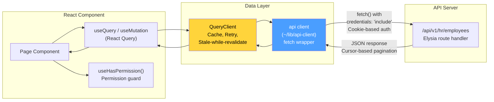
```mermaid
graph LR
    subgraph "React Component"
        COMP["Page Component"]
        HOOK["useQuery / useMutation<br/>(React Query)"]
        PERM["useHasPermission()<br/>Permission guard"]
    end

    subgraph "Data Layer"
        QC["QueryClient<br/>Cache, Retry,<br/>Stale-while-revalidate"]
        API_CLIENT["api client<br/>(~/lib/api-client)<br/>fetch wrapper"]
    end

    subgraph "API Server"
        ENDPOINT["/api/v1/hr/employees<br/>Elysia route handler"]
    end

    COMP --> HOOK
    COMP --> PERM
    HOOK --> QC
    QC --> API_CLIENT
    API_CLIENT -->|"fetch() with<br/>credentials: 'include'<br/>Cookie-based auth"| ENDPOINT
    ENDPOINT -->|"JSON response<br/>Cursor-based pagination"| API_CLIENT
    API_CLIENT --> QC
    QC --> HOOK
    HOOK --> COMP

    style QC fill:#ffd43b,color:#000
    style API_CLIENT fill:#4a9eff,color:#fff
```

---

## 10. Database Schema Overview

Key tables and their relationships in the `app` schema. All tenant-owned tables have `tenant_id` and RLS policies.

```mermaid
erDiagram
    tenants ||--o{ tenant_members : "has"
    tenants ||--o{ employees : "owns"
    tenants ||--o{ org_units : "owns"
    tenants ||--o{ positions : "owns"
    tenants ||--o{ leave_types : "owns"
    tenants ||--o{ cases : "owns"
    tenants ||--o{ roles : "owns"

    users ||--o{ tenant_members : "belongs to"
    users ||--o{ sessions : "has"
    users ||--o{ employees : "linked as"

    employees ||--o{ contracts : "has"
    employees ||--o{ leave_requests : "submits"
    employees ||--o{ time_events : "clocks"
    employees ||--o{ timesheets : "has"
    employees ||--o{ leave_balances : "has"
    employees ||--o{ competency_ratings : "rated on"
    employees ||--o{ performance_reviews : "reviewed in"
    employees ||--o{ training_enrollments : "enrolled in"
    employees ||--o{ employee_benefits : "enrolled in"
    employees ||--o{ employee_documents : "has"
    employees }o--|| org_units : "belongs to"
    employees }o--|| positions : "holds"

    org_units ||--o{ org_units : "parent of"
    org_units ||--o{ positions : "contains"

    positions }o--|| org_units : "in"

    contracts }o--|| employees : "for"
    contracts }o--|| positions : "for position"

    leave_requests }o--|| leave_types : "of type"
    leave_requests }o--|| employees : "requested by"

    cases ||--o{ case_notes : "has"
    cases ||--o{ case_documents : "has"

    courses ||--o{ training_enrollments : "has"
    courses ||--o{ course_modules : "contains"

    performance_cycles ||--o{ performance_reviews : "contains"

    roles ||--o{ role_permissions : "has"
    users ||--o{ user_roles : "has"
    roles ||--o{ user_roles : "assigned to"

    domain_outbox ||--o{ domain_outbox : "events"

    tenants {
        uuid id PK
        varchar name
        varchar slug UK
        varchar status
        jsonb settings
    }

    users {
        uuid id PK
        varchar email UK
        varchar name
        varchar password_hash
        boolean mfa_enabled
        varchar status
    }

    sessions {
        uuid id PK
        uuid user_id FK
        varchar token UK
        timestamp expires_at
        uuid current_tenant_id
    }

    tenant_members {
        uuid id PK
        uuid tenant_id FK
        uuid user_id FK
        boolean is_primary
    }

    employees {
        uuid id PK
        uuid tenant_id FK
        uuid user_id FK
        varchar employee_number UK
        varchar first_name
        varchar last_name
        varchar status
        uuid org_unit_id FK
        uuid position_id FK
        date hire_date
    }

    org_units {
        uuid id PK
        uuid tenant_id FK
        varchar name
        uuid parent_id FK
        varchar status
    }

    positions {
        uuid id PK
        uuid tenant_id FK
        varchar title
        uuid org_unit_id FK
        varchar grade
    }

    contracts {
        uuid id PK
        uuid tenant_id FK
        uuid employee_id FK
        varchar contract_type
        date effective_from
        date effective_to
        decimal salary
    }

    leave_requests {
        uuid id PK
        uuid tenant_id FK
        uuid employee_id FK
        uuid leave_type_id FK
        varchar status
        date start_date
        date end_date
        decimal days
    }

    cases {
        uuid id PK
        uuid tenant_id FK
        varchar case_number
        varchar status
        varchar priority
        varchar category
    }

    domain_outbox {
        uuid id PK
        uuid tenant_id
        varchar aggregate_type
        uuid aggregate_id
        varchar event_type
        jsonb payload
        timestamp processed_at
        int retry_count
    }

    roles {
        uuid id PK
        uuid tenant_id FK
        varchar name
        varchar description
    }

    audit_log {
        uuid id PK
        uuid tenant_id FK
        uuid user_id FK
        varchar action
        varchar resource_type
        uuid resource_id
        jsonb old_values
        jsonb new_values
        inet ip_address
        timestamp created_at
    }
```

---

## 11. State Machine Diagrams

### Employee Lifecycle

States and transitions for employee status management. Terminal state: `terminated`.

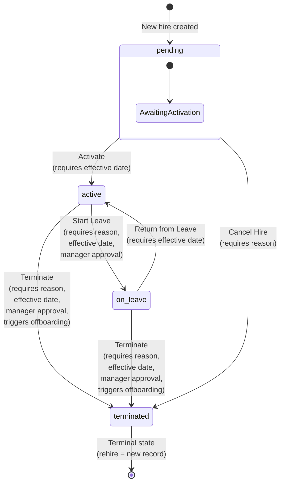
```mermaid
stateDiagram-v2
    [*] --> pending : New hire created

    pending --> active : Activate<br/>(requires effective date)
    pending --> terminated : Cancel Hire<br/>(requires reason)

    active --> on_leave : Start Leave<br/>(requires reason,<br/>effective date,<br/>manager approval)
    active --> terminated : Terminate<br/>(requires reason,<br/>effective date,<br/>manager approval,<br/>triggers offboarding)

    on_leave --> active : Return from Leave<br/>(requires effective date)
    on_leave --> terminated : Terminate<br/>(requires reason,<br/>effective date,<br/>manager approval,<br/>triggers offboarding)

    terminated --> [*] : Terminal state<br/>(rehire = new record)

    state pending {
        [*] --> AwaitingActivation
    }
```

### Leave Request Lifecycle

Full leave request workflow from submission to completion.

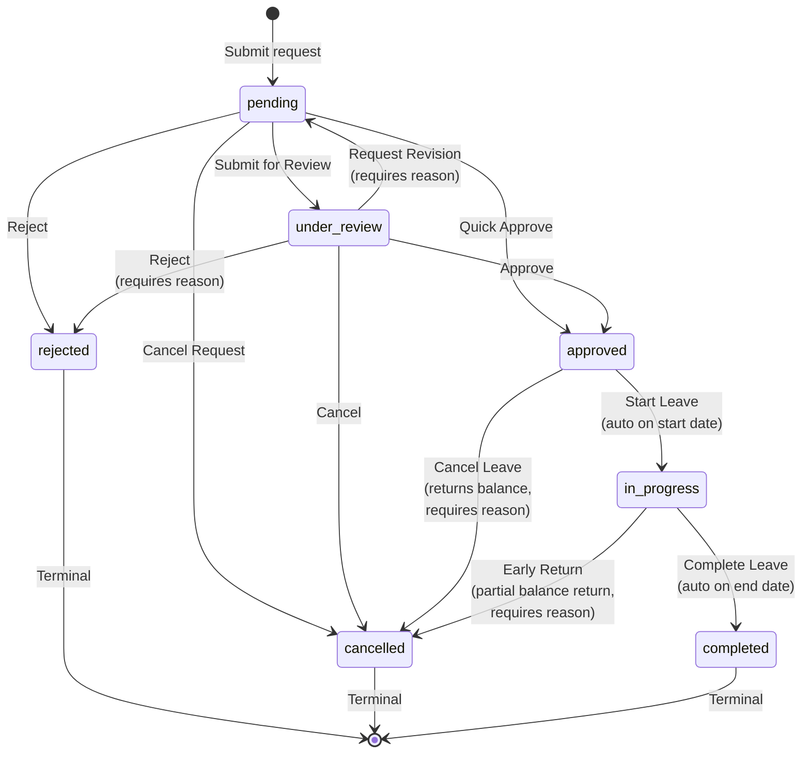
```mermaid
stateDiagram-v2
    [*] --> pending : Submit request

    pending --> under_review : Submit for Review
    pending --> approved : Quick Approve
    pending --> rejected : Reject
    pending --> cancelled : Cancel Request

    under_review --> approved : Approve
    under_review --> rejected : Reject<br/>(requires reason)
    under_review --> cancelled : Cancel
    under_review --> pending : Request Revision<br/>(requires reason)

    approved --> in_progress : Start Leave<br/>(auto on start date)
    approved --> cancelled : Cancel Leave<br/>(returns balance,<br/>requires reason)

    in_progress --> completed : Complete Leave<br/>(auto on end date)
    in_progress --> cancelled : Early Return<br/>(partial balance return,<br/>requires reason)

    rejected --> [*] : Terminal
    cancelled --> [*] : Terminal
    completed --> [*] : Terminal
```

### Case Management Lifecycle

HR case workflow with escalation and reopening support.

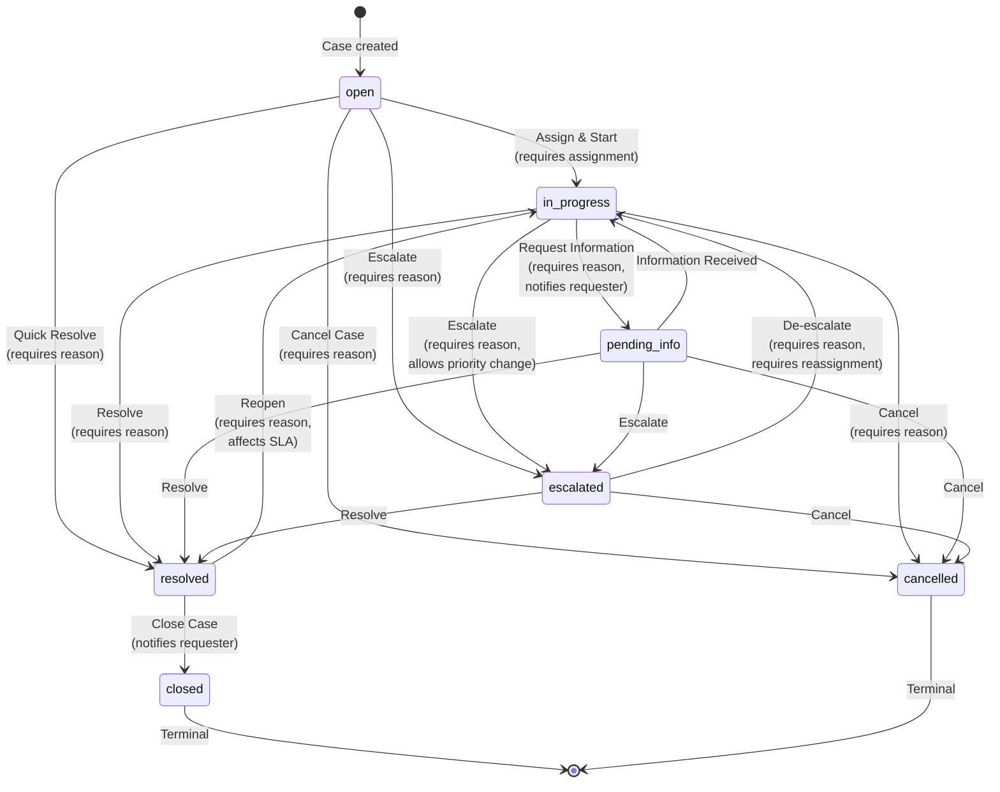
```mermaid
stateDiagram-v2
    [*] --> open : Case created

    open --> in_progress : Assign & Start<br/>(requires assignment)
    open --> escalated : Escalate<br/>(requires reason)
    open --> cancelled : Cancel Case<br/>(requires reason)
    open --> resolved : Quick Resolve<br/>(requires reason)

    in_progress --> pending_info : Request Information<br/>(requires reason,<br/>notifies requester)
    in_progress --> escalated : Escalate<br/>(requires reason,<br/>allows priority change)
    in_progress --> resolved : Resolve<br/>(requires reason)
    in_progress --> cancelled : Cancel<br/>(requires reason)

    pending_info --> in_progress : Information Received
    pending_info --> escalated : Escalate
    pending_info --> resolved : Resolve
    pending_info --> cancelled : Cancel

    escalated --> in_progress : De-escalate<br/>(requires reason,<br/>requires reassignment)
    escalated --> resolved : Resolve
    escalated --> cancelled : Cancel

    resolved --> closed : Close Case<br/>(notifies requester)
    resolved --> in_progress : Reopen<br/>(requires reason,<br/>affects SLA)

    closed --> [*] : Terminal
    cancelled --> [*] : Terminal
```

---

## 12. Deployment Architecture

Docker Compose deployment topology with networking, health checks, and resource limits.

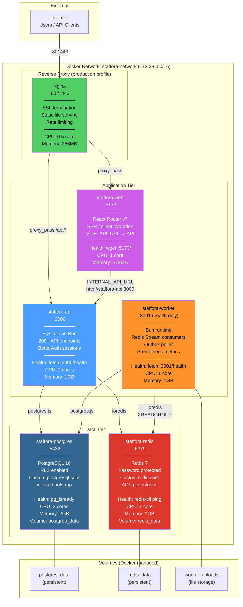
```mermaid
graph TB
    subgraph "External"
        INTERNET["Internet<br/>Users / API Clients"]
    end

    subgraph "Docker Network: staffora-network (172.28.0.0/16)"
        subgraph "Reverse Proxy (production profile)"
            NGINX["Nginx<br/>:80 / :443<br/>─────────<br/>SSL termination<br/>Static file serving<br/>Rate limiting<br/>─────────<br/>CPU: 0.5 core<br/>Memory: 256MB"]
        end

        subgraph "Application Tier"
            WEB["staffora-web<br/>:5173<br/>─────────<br/>React Router v7<br/>SSR / client hydration<br/>VITE_API_URL → API<br/>─────────<br/>Health: wget :5173/<br/>CPU: 1 core<br/>Memory: 512MB"]

            API["staffora-api<br/>:3000<br/>─────────<br/>Elysia.js on Bun<br/>200+ API endpoints<br/>BetterAuth sessions<br/>─────────<br/>Health: fetch :3000/health<br/>CPU: 2 cores<br/>Memory: 1GB"]

            WORKER["staffora-worker<br/>:3001 (health only)<br/>─────────<br/>Bun runtime<br/>Redis Stream consumers<br/>Outbox poller<br/>Prometheus metrics<br/>─────────<br/>Health: fetch :3001/health<br/>CPU: 1 core<br/>Memory: 1GB"]
        end

        subgraph "Data Tier"
            PG["staffora-postgres<br/>:5432<br/>─────────<br/>PostgreSQL 16<br/>RLS enabled<br/>Custom postgresql.conf<br/>init.sql bootstrap<br/>─────────<br/>Health: pg_isready<br/>CPU: 2 cores<br/>Memory: 2GB<br/>Volume: postgres_data"]

            REDIS["staffora-redis<br/>:6379<br/>─────────<br/>Redis 7<br/>Password protected<br/>Custom redis.conf<br/>AOF persistence<br/>─────────<br/>Health: redis-cli ping<br/>CPU: 1 core<br/>Memory: 1GB<br/>Volume: redis_data"]
        end
    end

    subgraph "Volumes (Docker managed)"
        V_PG["postgres_data<br/>(persistent)"]
        V_REDIS["redis_data<br/>(persistent)"]
        V_UPLOADS["worker_uploads<br/>(file storage)"]
    end

    INTERNET -->|":80/:443"| NGINX
    NGINX -->|"proxy_pass"| WEB
    NGINX -->|"proxy_pass /api/*"| API

    WEB -->|"INTERNAL_API_URL<br/>http://staffora-api:3000"| API
    API -->|"postgres.js"| PG
    API -->|"ioredis"| REDIS
    WORKER -->|"postgres.js"| PG
    WORKER -->|"ioredis<br/>XREADGROUP"| REDIS

    PG --- V_PG
    REDIS --- V_REDIS
    WORKER --- V_UPLOADS

    style NGINX fill:#51cf66,color:#000
    style API fill:#4a9eff,color:#fff
    style WEB fill:#cc5de8,color:#fff
    style WORKER fill:#ff922b,color:#000
    style PG fill:#336791,color:#fff
    style REDIS fill:#dc382d,color:#fff
```

### Container Startup Order

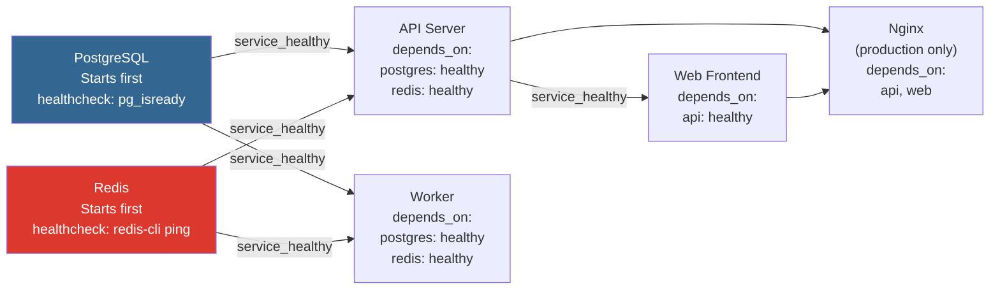
```mermaid
graph LR
    PG["PostgreSQL<br/>Starts first<br/>healthcheck: pg_isready"]
    REDIS["Redis<br/>Starts first<br/>healthcheck: redis-cli ping"]
    API["API Server<br/>depends_on:<br/>  postgres: healthy<br/>  redis: healthy"]
    WORKER["Worker<br/>depends_on:<br/>  postgres: healthy<br/>  redis: healthy"]
    WEB["Web Frontend<br/>depends_on:<br/>  api: healthy"]
    NGINX["Nginx<br/>(production only)<br/>depends_on:<br/>  api, web"]

    PG -->|"service_healthy"| API
    REDIS -->|"service_healthy"| API
    PG -->|"service_healthy"| WORKER
    REDIS -->|"service_healthy"| WORKER
    API -->|"service_healthy"| WEB
    API --> NGINX
    WEB --> NGINX

    style PG fill:#336791,color:#fff
    style REDIS fill:#dc382d,color:#fff
```

### Health Check Endpoints

| Container | Endpoint | Method | Interval | Timeout | Retries | Start Period |
|-----------|----------|--------|----------|---------|---------|--------------|
| postgres | `pg_isready -U hris` | CLI | 10s | 5s | 5 | 10s |
| redis | `redis-cli ping` | CLI | 10s | 5s | 5 | 5s |
| api | `GET /health` | HTTP | 30s | 10s | 3 | 30s |
| worker | `GET /health` (port 3001) | HTTP | 30s | 10s | 3 | 30s |
| web | `GET /` (wget) | HTTP | 30s | 10s | 3 | 10s |

---

## Appendix: Key File Paths

| Component | Path |
|-----------|------|
| API entry point | `packages/api/src/app.ts` |
| Worker entry point | `packages/api/src/worker.ts` |
| Plugin definitions | `packages/api/src/plugins/*.ts` |
| Plugin index | `packages/api/src/plugins/index.ts` |
| BetterAuth config | `packages/api/src/lib/better-auth.ts` |
| Module template | `packages/api/src/modules/{module}/{schemas,repository,service,routes,index}.ts` |
| Job processors | `packages/api/src/jobs/*.ts` |
| Frontend routes | `packages/web/app/routes.ts` |
| State machines | `packages/shared/src/state-machines/*.ts` |
| Docker Compose | `docker/docker-compose.yml` |
| Migrations | `migrations/NNNN_*.sql` |
