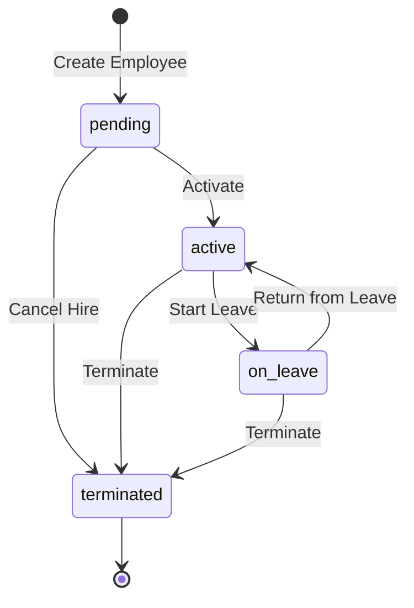
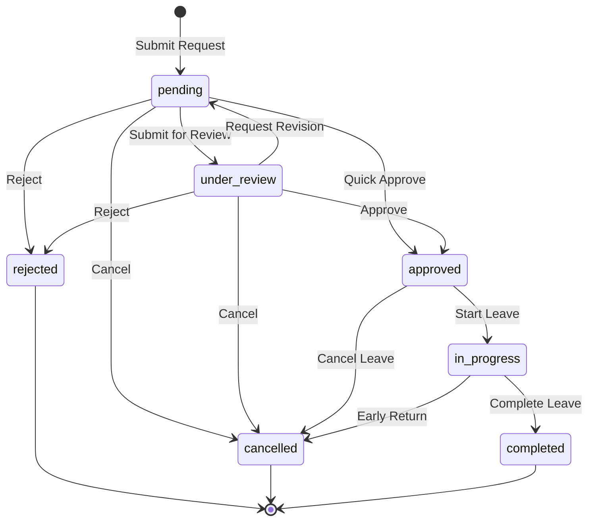
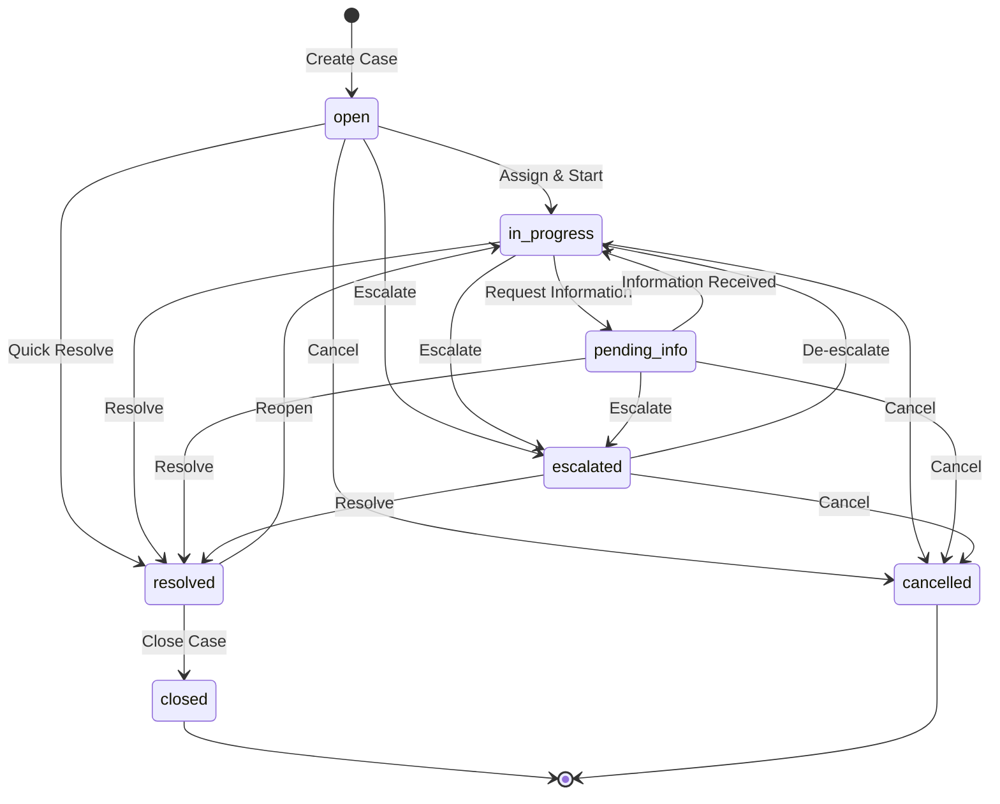
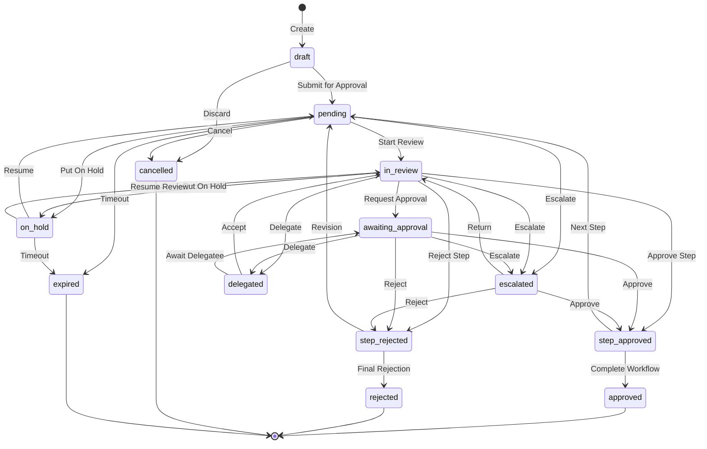
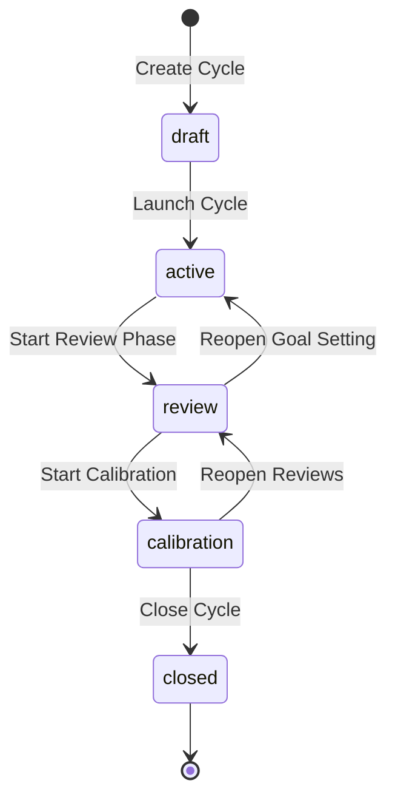

# State Machines

*Last updated: 2026-03-17*

All state machines are defined in `packages/shared/src/state-machines/` and enforce business rules around entity lifecycle transitions. Transitions are stored immutably for audit.

## Employee Lifecycle

**File:** `packages/shared/src/state-machines/employee.ts`



### States

| State | Description |
|-------|-------------|
| `pending` | Employee record created, not yet started |
| `active` | Employee is actively working |
| `on_leave` | Employee is on approved leave (maternity, medical, sabbatical, etc.) |
| `terminated` | Employee has been terminated (terminal state). Rehires create a new record |

### Transition Requirements

| From → To | Requires Reason | Requires Effective Date | Requires Approval | Triggers Offboarding |
|-----------|:---:|:---:|:---:|:---:|
| pending → active | No | Yes | No | No |
| pending → terminated | Yes | No | No | No |
| active → on_leave | Yes | Yes | Yes | No |
| active → terminated | Yes | Yes | Yes | Yes |
| on_leave → active | No | Yes | No | No |
| on_leave → terminated | Yes | Yes | Yes | Yes |

### Usage

```typescript
import { canTransition, validateTransition, getValidTransitions } from '@staffora/shared/state-machines';

// Check if transition is valid
if (canTransition('active', 'on_leave')) {
  // Process leave
}

// Get error message for invalid transition
const error = validateTransition('terminated', 'active');
// "Cannot transition from terminated state. This is a terminal state."

// Get valid next states
const validMoves = getValidTransitions('active');
// ["on_leave", "terminated"]
```

---

## Leave Request

**File:** `packages/shared/src/state-machines/leave-request.ts`



### States

| State | Description |
|-------|-------------|
| `pending` | Request submitted, awaiting review |
| `under_review` | Being reviewed by approver(s) |
| `approved` | Request approved |
| `rejected` | Request rejected (terminal) |
| `cancelled` | Cancelled by requester (terminal) |
| `in_progress` | Leave currently in progress |
| `completed` | Leave completed (terminal) |

### Key Transition Metadata

| Transition | Affects Balance | Notifies Employee | Requires Approval Chain |
|-----------|:---:|:---:|:---:|
| pending → approved | Yes | Yes | No |
| under_review → approved | Yes | Yes | No |
| approved → cancelled | Yes (refund) | Yes | No |
| in_progress → cancelled | Yes (partial refund) | Yes | No |

---

## Case Management

**File:** `packages/shared/src/state-machines/case.ts`



### States

| State | Description | Active? |
|-------|-------------|:---:|
| `open` | Awaiting assignment | Yes |
| `in_progress` | Being worked on | Yes |
| `pending_info` | Waiting for additional information | Yes |
| `escalated` | Escalated to higher authority | Yes |
| `resolved` | Resolved, awaiting confirmation | No |
| `closed` | Closed after confirmed resolution (terminal) | No |
| `cancelled` | Cancelled (terminal) | No |

### Transition Metadata

Each case transition includes:
- `requiresReason` - Whether a comment is required
- `requiresAssignment` - Whether a user must be assigned
- `notifiesRequester` - Whether the case creator is notified
- `affectsSLA` - Whether the transition affects SLA metrics
- `auditAction` - Audit log action type (e.g., `case.assigned`, `case.escalated`)

---

## Workflow / Approval

**File:** `packages/shared/src/state-machines/workflow.ts`



### States

| State | Description |
|-------|-------------|
| `draft` | Created but not submitted |
| `pending` | Submitted, awaiting action |
| `in_review` | Being reviewed |
| `awaiting_approval` | Waiting for approval decision |
| `step_approved` | Current step approved |
| `step_rejected` | Current step rejected |
| `escalated` | Escalated to higher authority |
| `delegated` | Delegated to another approver |
| `on_hold` | Paused, requires information |
| `approved` | All steps completed (terminal) |
| `rejected` | Finally rejected (terminal) |
| `cancelled` | Cancelled before completion (terminal) |
| `expired` | Timed out (terminal) |

---

## Performance Cycle

**File:** `packages/shared/src/state-machines/performance-cycle.ts`



### States & Phases

| State | Phase Name | Active Participants | Typical Duration |
|-------|-----------|-------------------|-----------------|
| `draft` | Configuration | HR | 14 days |
| `active` | Goal Setting & Self-Assessment | Employees, Managers | 30 days |
| `review` | Manager Review | Managers, HR | 21 days |
| `calibration` | Calibration | Managers, HR, Leadership | 14 days |
| `closed` | Results Released | Employees, Managers | Terminal |

### Phase Lock Rules

| State | Goals Locked | Ratings Locked |
|-------|:---:|:---:|
| `draft` | No | No |
| `active` | No | No |
| `review` | **Yes** | No |
| `calibration` | **Yes** | **Yes** |
| `closed` | **Yes** | **Yes** |

### Transition Requirements

| Transition | Confirmation | Notifications | Locks Previous | Min Completion |
|-----------|:---:|:---:|:---:|:---:|
| draft → active | Yes | Yes | No | - |
| active → review | Yes | Yes | Yes | 80% goals set |
| review → calibration | Yes | Yes | Yes | 90% reviews done |
| calibration → closed | Yes | Yes | Yes | - |
| review → active | Yes | No | No | - |
| calibration → review | Yes | No | No | - |

## Related Documentation

- [Security Patterns](SECURITY.md) — RLS, RBAC, audit logging
- [Database Guide](../architecture/DATABASE.md) — Effective dating and schema design
- [API Reference](../api/API_REFERENCE.md) — Endpoint documentation

---

## Related Documents

- [Security Patterns](SECURITY.md) — Authorization enforcement for state transitions
- [Architecture Overview](../architecture/ARCHITECTURE.md) — System architecture and data flow
- [Database Guide](../architecture/DATABASE.md) — Transition audit tables and effective dating
- [API Reference](../api/API_REFERENCE.md) — Endpoints that trigger state transitions
- [Implementation Status](../project-analysis/implementation_status.md) — Feature completion by module
- [UK Compliance Report](../compliance/uk-hr-compliance-report.md) — UK-specific lifecycle requirements
